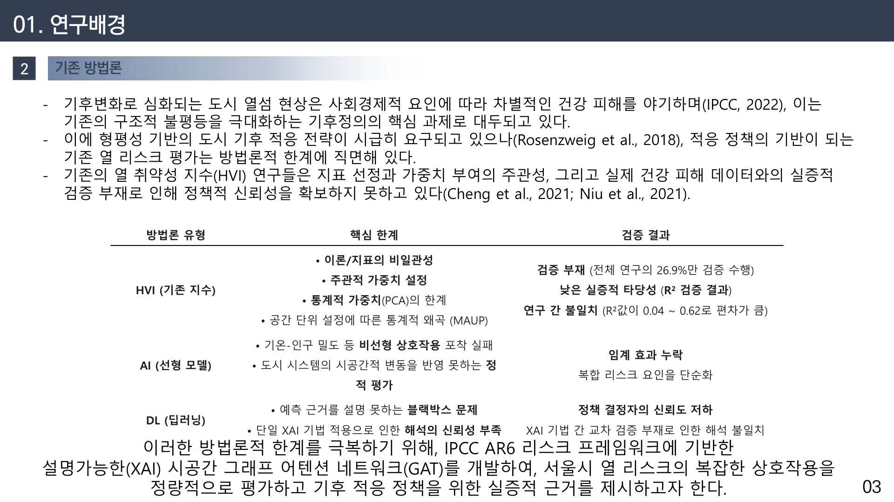
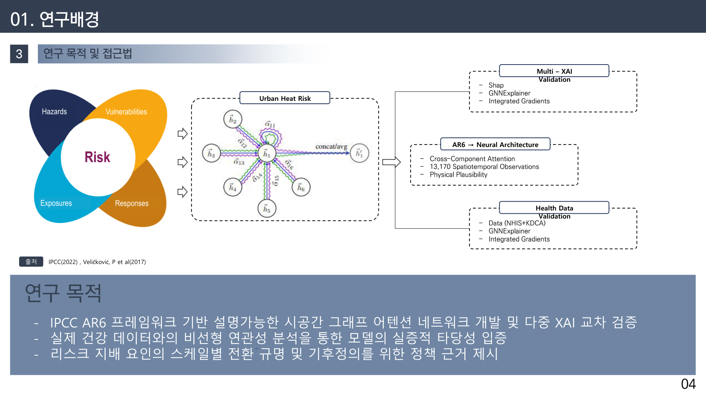
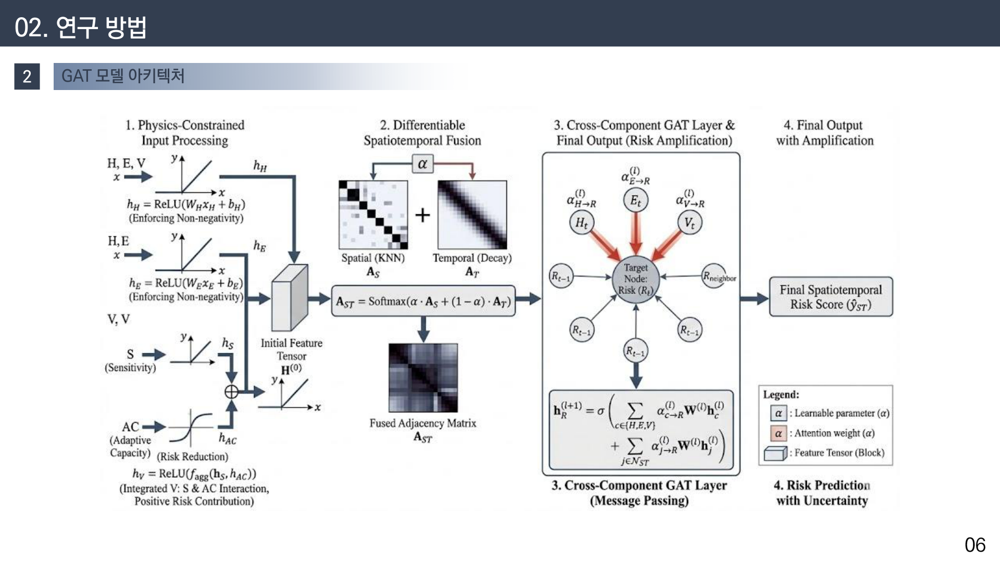
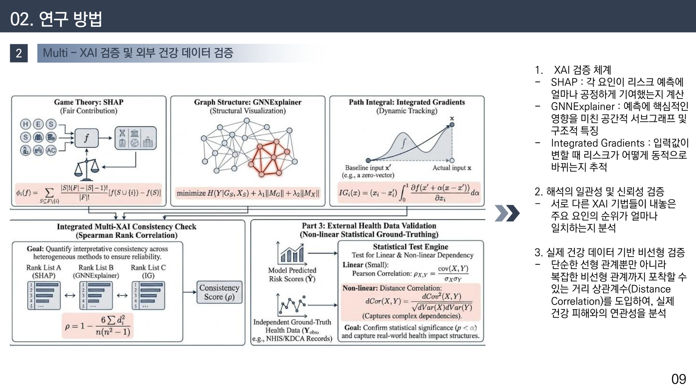
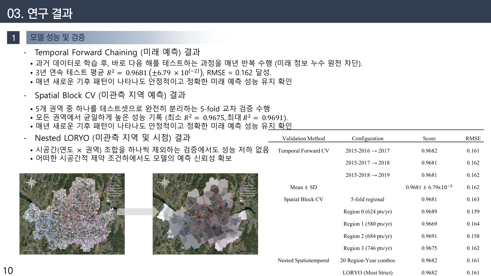
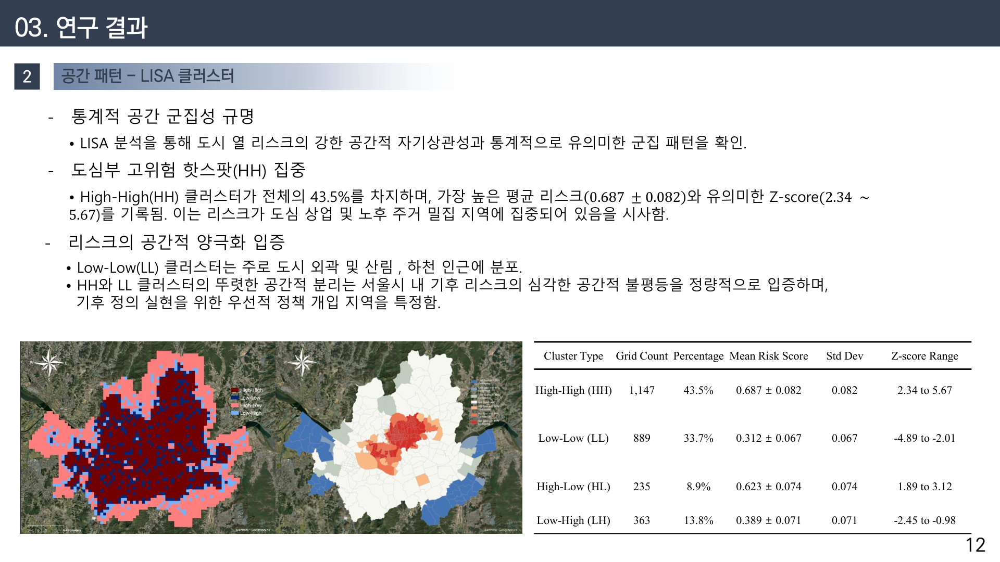
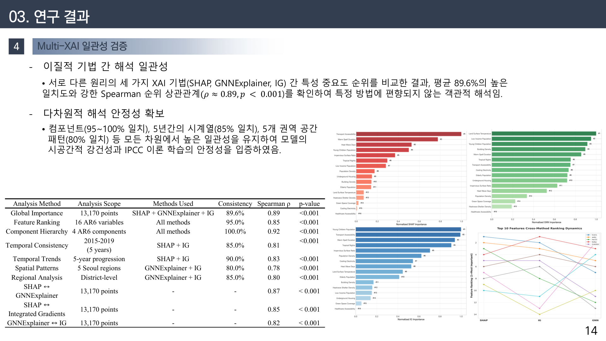
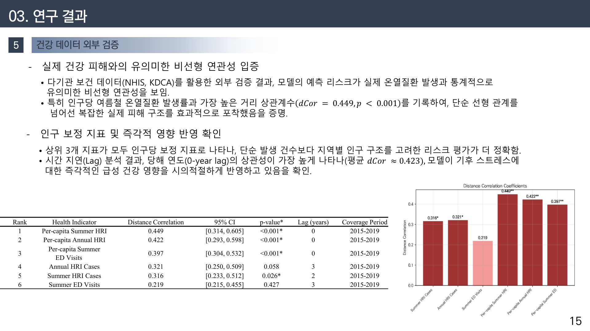
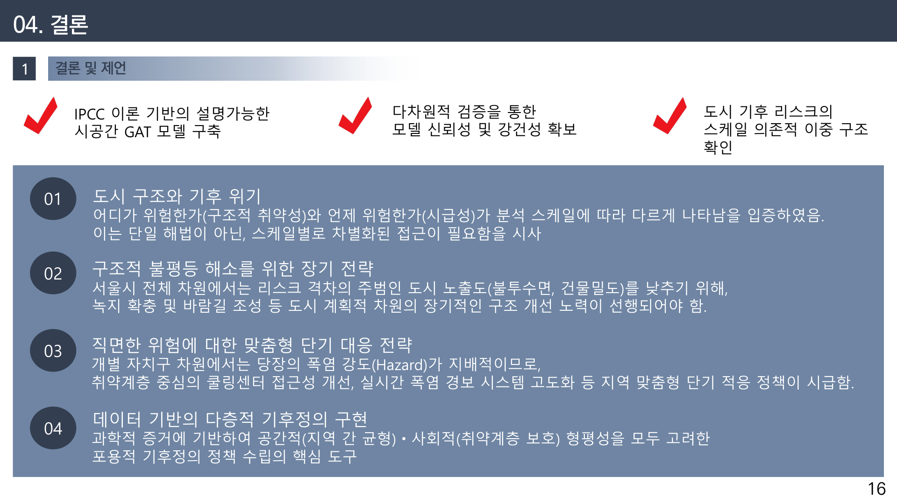

# 설명가능 AI는 ‘폭염이 누구에게 더 잔인한지’를 어떻게 증명했나
### — IPCC AR6 위험 프레임워크를 그래프 신경망(GAT)에 심은 도시 열 리스크 평가

> 이 연구는 SCIE 국제학술지 **Urban Climate(IF 6.9, 분야 상위 6%)**에 제1저자로 게재되었습니다.
> Choi, H., Park, J. S., & Lim, C.-H. (2026), *Urban Climate*, Article 102981.

## 1. 여는 글 — 폭염은 공평하지 않습니다
같은 폭염이라도 그 피해는 사람마다, 동네마다 다릅니다. 노후주택이 밀집하고 고령 인구가 많은 지역은 같은 기온에서도 더 큰 건강 피해를 입습니다. 문제는 “**어느 지역이, 왜 더 위험한가**”를 객관적이고 설명 가능하게 보여주는 방법이 마땅치 않았다는 점입니다. 이 글은 그 질문에 답하기 위해 IPCC AR6의 위험 개념을 인공지능에 직접 구현한 연구를 정리한 것입니다.

## 2. 기존 방법의 한계
폭염 취약성 연구는 대개 **열 취약성 지수(HVI)**를 씁니다. 그러나 HVI는 ⑴ 변수 가중치를 연구자가 주관적으로 정하고, ⑵ 왜 그 지역이 위험한지 설명하기 어려우며, ⑶ 예측 성능을 검증하기 어렵다는 한계가 있었습니다. 최근의 AI 모형은 정확도는 높였지만 대부분 ‘블랙박스’여서, 정책 근거로 쓰기에는 신뢰가 부족했습니다.

*기존 접근(HVI·일반 AI·딥러닝)의 한계 정리. 주관적 가중·블랙박스·검증 부재가 공통 문제였습니다.*

## 3. 방법 — AR6 위험 프레임워크를 GAT에 구현
핵심 아이디어는 IPCC AR6가 정의한 위험의 네 요소 — **Hazard(위해)·Exposure(노출)·Vulnerability(취약성)·Adaptive Capacity(적응역량)** — 를 그래프 어텐션 신경망(GAT)의 구조에 직접 심는 것입니다.

*Risk = f(Hazard, Exposure, Vulnerability, Adaptive Capacity)를 GAT로 학습합니다. 지역(노드)과 지역 간 공간관계(엣지)를 함께 반영합니다.*

*물리 제약 입력 → 시공간 GAT → 위험 점수(Risk Score) 산출. 인접 지역 간 어텐션으로 공간적 파급을 학습합니다.*

예측이 ‘맞다/틀리다’에 그치지 않도록, 세 가지 설명가능 AI(XAI)를 함께 적용해 결과를 교차 해석했습니다.

*SHAP(기여도 분해)·GNNExplainer(구조적 근거)·Integrated Gradients(경로 기반)로 “왜 이 지역이 위험한가”를 세 각도에서 검증합니다.*

## 4. 결과
- **예측 성능**: 엄격한 검증(Temporal Forward Chaining, Spatial Block CV, Nested LORO)에서 **R² 0.9681**을 달성했습니다. 공간·시간 정보 누출을 통제하고도 높은 성능을 유지했습니다.

*이웃 지역·미래 시점을 분리해 검증했음에도 R²가 유지되어, 성능이 과대평가가 아님을 보였습니다.*

- **공간 패턴**: 국지적 공간통계(LISA)로 위험이 특정 지역에 군집(High-High)함을 확인했습니다.

*High-High 군집이 특정 자치구에 뚜렷하게 나타나, 우선 대응 대상지를 특정할 수 있습니다.*

- **설명의 일관성**: 세 XAI가 서로 다른 방식임에도 **같은 변수를 위험 요인으로 지목**했습니다. 해석이 우연이 아님을 뒷받침합니다.

*SHAP·GNNExplainer·Integrated Gradients의 기여도 순위가 서로 정합합니다.*

*모형이 지목한 위험 요인이 실제 기온·건강 데이터와도 정합함을 확인했습니다.*

## 5. 의미 — 측정에서 ‘설명’으로
이 연구의 기여는 단순히 정확한 예측이 아니라, **왜 위험한지를 설명할 수 있는 열 리스크 평가**를 만든 데 있습니다. 이는 한정된 폭염 대응 자원을 어느 지역에 먼저 투입할지 판단하는 근거가 됩니다.

*설명가능 AI가 기후정의(누구에게 더 잔인한가)를 정량화하는 도구가 될 수 있음을 보였습니다.*

## 6. 맺음말
데이터는 “폭염이 모두에게 같지 않다”는 사실을 분명하게 보여줍니다. 앞으로는 이 프레임을 산림·재해 등 다른 리스크로 확장하는 연구를 이어가려 합니다. 긴 글 읽어주셔서 감사합니다.

---
**링크** · 논문 DOI: https://doi.org/10.1016/j.uclim.2026.102981 · 포트폴리오: https://portfolio-eight-ruddy-87.vercel.app · GitHub: https://github.com/zxsa0716
