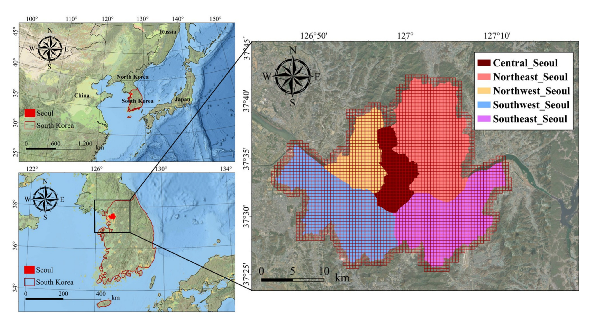
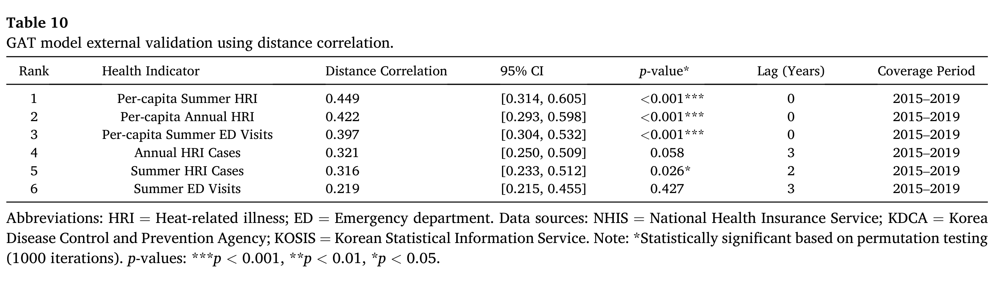

# 폭염은 왜 누구에게 더 잔인한가
## 서울을 500m 격자 2,634칸으로 쪼개 설명가능 AI에게 물어봤습니다 (Urban Climate 게재)

안녕하세요. 오늘은 제 첫 제1저자 논문 이야기를 해보려고 합니다. 국제 학술지 **Urban Climate**에 실렸고, 제목은 이렇습니다.

> **Climate justice through explainable graph neural networks: A spatiotemporal attention-based urban heat risk assessment under IPCC AR6 framework**
> 최희도, 박지수, 임철희 · *Urban Climate* 67 (2026) 102981

제목이 길고 딱딱하니 한 문장으로 풀어보겠습니다.

**"서울을 500m 격자 2,634칸으로 쪼개서, 어느 칸이 폭염에 얼마나 위험한지를 AI가 계산하게 하고, 그 AI가 왜 그렇게 판단했는지까지 열어본 연구입니다."**

이 글에 실린 그림과 표는 모두 **게재된 논문에 실제로 실린 것**입니다. 제가 분석하고 만든 그림들이라 하나하나 어떤 의도로 그렸는지 설명드릴 수 있습니다.

그리고 이 연구를 하면서 제가 가장 놀랐던 결과가 하나 있습니다. **"어느 축척으로 보느냐에 따라 폭염 위험의 주범이 바뀐다"**는 것입니다. 이 이야기를 하려고 이 글을 씁니다.

> **논문 DOI: https://doi.org/10.1016/j.uclim.2026.102981**

---

## 1. 시작은 "이 지도를 정말 믿을 수 있나?"라는 의문이었습니다

폭염 취약성을 다루는 연구는 이미 많습니다. 지자체마다 '폭염 취약지도'가 있고, 학계에서도 **폭염취약성지수(HVI, Heat Vulnerability Index)**라는 방법이 널리 쓰입니다.

만드는 방식은 대체로 이렇습니다. 기온, 고령인구 비율, 소득, 녹지 면적 같은 지표를 모아서, 각각에 가중치를 곱하고, 다 더해서 하나의 점수를 냅니다. 점수가 높으면 취약한 곳입니다.

직관적이고 이해하기 쉽습니다. 그런데 저는 이 방식에 세 가지 의문이 있었습니다.

### 첫째, 가중치를 누가 정하나요?

기온에 0.4, 고령인구에 0.3, 녹지에 0.3을 준다고 해봅시다. **왜 0.4일까요?** 대부분 전문가 설문이나 주성분분석으로 정하는데, 연구마다 다릅니다. 그래서 같은 도시를 분석해도 연구자가 다르면 취약지도가 달라집니다.

실제로 이 문제를 지적한 체계적 문헌 검토가 있습니다. Cheng 등(2021)과 Niu 등(2021)은 HVI 연구들이 **지표 선정과 가중치 방식이 일관되지 않아 서로 비교하기 어렵다**고 결론 내렸습니다.

### 둘째, 자치구 평균으로 묶으면 실제 위험이 사라집니다

대부분의 취약지도는 자치구나 행정동 단위입니다. 그런데 자치구 하나가 얼마나 넓은지 생각해 보세요. 그 안에는 아파트 단지도 있고, 재래시장도 있고, 산도 있고, 공원도 있습니다.

이걸 하나의 숫자로 평균 내면 어떻게 될까요. **공원 옆의 시원한 곳과 고밀 상업지역의 뜨거운 곳이 상쇄되어 사라집니다.** 공간통계학에서는 이걸 **가변적 공간단위 문제(MAUP, Modifiable Areal Unit Problem)**라고 부릅니다. 어떤 단위로 자르느냐에 따라 결과가 달라지는 현상입니다.

### 셋째, 그리고 이게 가장 결정적입니다 — 검증을 안 합니다

취약지도를 만들었다면 확인해야 합니다. **정말 그 동네에서 사람들이 더 많이 아팠는가?**

Niu 등(2021)의 검토 결과가 충격적이었습니다. **HVI 연구 중 실제 건강 데이터로 검증한 것은 28%뿐**이었습니다. 그리고 검증한 연구들조차 상관이 약했습니다. 미국 댈러스를 분석한 한 연구는 취약성 지수와 사망률의 **결정계수(R²)가 0.03**이었습니다.

R² 0.03이 무슨 뜻인지 풀어보면, **취약성 지수가 실제 사망률 변동의 3%만 설명한다**는 뜻입니다. 사실상 관계가 없다고 봐야 하는 수준입니다.

그런데 이런 지도가 실제 정책에 쓰입니다. 무더위쉼터를 어디 놓을지, 예산을 어디 배정할지가 여기서 결정됩니다. 저는 이 간극이 마음에 걸렸습니다.

---

## 2. AI를 쓰기로 했지만, 블랙박스는 쓸 수 없었습니다

그래서 딥러닝을 생각했습니다. 딥러닝은 가중치를 사람이 정하지 않고 **데이터에서 배웁니다.** 그리고 기온과 인구의 비선형 관계, 즉 "어느 문턱을 넘으면 급격히 위험해지는" 패턴도 잡을 수 있습니다.

그런데 여기서 새로운 문제가 생깁니다. **딥러닝은 왜 그렇게 판단했는지 설명하지 못합니다.** 이걸 블랙박스 문제라고 합니다.

정책 현장에서 이건 치명적입니다. 공무원이 "이 동네에 예산을 더 배정해야 한다"고 주장하려면 근거를 제시해야 합니다. "AI가 그렇게 말했습니다"로는 아무도 설득할 수 없습니다.

그래서 이 연구의 설계 원칙이 정해졌습니다.

> **성능만 좋은 모델은 쓸 수 없다. 성능이 좋으면서 동시에 판단 근거를 열어 보일 수 있어야 한다.**

이 두 가지를 동시에 만족시키는 게 이 연구의 가장 어려운 부분이었습니다.

---

## 3. 대상지: 서울을 2,634칸으로 쪼갰습니다

대상지는 서울로 정했습니다. 인구 1,000만 명에 가까운 초거대도시이면서, 압축 성장 과정에서 물리적 도시 구조와 사회경제적 계층이 복잡하게 얽힌 곳입니다.

공간 단위는 **500m × 500m 격자**로 잡았습니다. 서울 전역을 이렇게 자르면 **2,634칸**이 나옵니다. 자치구 25개로 나누는 것과 비교하면 100배 이상 세밀합니다.

권역을 다섯 개로 나눈 것은 서울의 구조를 반영한 것입니다. 도심권은 업무·상업 밀집지역이고, 서남권은 산업단지와 주거가 섞여 있고, 동남권은 상대적으로 소득이 높습니다. 한강을 기준으로 한 사회경제적 분화도 뚜렷합니다.

분석 기간은 **2015년부터 2019년까지 5년**입니다. 격자 2,634칸 × 5년이니 총 **13,170개의 관측치**를 다룬 셈입니다.

---

## 4. IPCC가 정한 틀을 그대로 따랐습니다

여기서 중요한 선택이 있었습니다. 위험도를 어떤 구조로 정의할 것인가입니다.

저는 **IPCC 제6차 평가보고서(AR6)의 위험 프레임워크**를 그대로 따랐습니다. 제가 새로 만들지 않은 이유는 명확합니다. 국제적으로 합의된 틀을 써야 결과를 다른 연구·다른 도시와 비교할 수 있기 때문입니다.

AR6는 위험을 세 요소의 상호작용으로 봅니다.

- **기후 위해(Hazard)** — 폭염이라는 물리적 현상 자체
- **노출(Exposure)** — 그 위해에 사람과 자산이 얼마나 놓여 있는가
- **취약성(Vulnerability)** — 같은 위해를 받아도 더 크게 다치는 정도. 이건 다시 **사회적 민감도(Sensitivity)**와 **적응 역량(Adaptive capacity)**으로 나뉩니다

여기서 핵심은 이 세 요소가 **더해지는 게 아니라 서로 곱하고 얽힌다**는 점입니다. 폭염이 심해도 사람이 없으면 피해가 없고, 사람이 많아도 에어컨과 쉼터가 충분하면 피해가 줄어듭니다.

각 요소에 변수를 네 개씩, 총 **16개 변수**를 배정했습니다. 기상청, 통계청, 서울시 등의 공공데이터를 썼습니다.

변수 선정에서 제가 특히 신경 쓴 게 **반지하 주거 비율**입니다. 서울에는 반지하에 사는 분들이 상당히 많은데, 반지하는 환기가 어렵고 습하며 여름에 열이 빠지지 않습니다. 그런데 기존 취약지도에서 이 변수를 잘 쓰지 않았습니다. 서울의 폭염 취약성을 말하려면 반드시 들어가야 한다고 봤습니다.

---

## 5. 그래프 어텐션 네트워크를 쓴 이유

모델로는 **그래프 어텐션 네트워크(GAT, Graph Attention Network)**를 골랐습니다. 이름이 어려우니 왜 이걸 골랐는지부터 설명하겠습니다.

### 폭염은 격자 하나에 갇히지 않습니다

가장 중요한 이유입니다. 어떤 격자의 온도는 그 격자만의 문제가 아닙니다. **옆에 큰 공원이 있으면 시원한 공기가 흘러 들어오고, 옆이 고밀 개발지면 열이 넘어옵니다.**

일반적인 딥러닝 모델은 격자를 각각 독립된 데이터로 취급합니다. 이러면 이 '이웃 효과'를 놓칩니다. 그런데 그래프 신경망은 **각 격자를 점으로, 이웃 관계를 선으로** 만들어서 이웃의 정보가 서로 흘러가게 합니다.

이 연구에서는 각 격자를 **가장 가까운 이웃 8개**와 연결했고, 거리에 따라 영향이 줄어들도록 **1.5km 폭의 가중치**를 걸었습니다. 시간 방향으로도 5년 창을 두어 연도 간 연결을 만들었습니다.

### 그리고 '어텐션'이 설명의 열쇠였습니다

여기가 이 연구의 핵심 아이디어입니다.

어텐션(attention)은 모델이 **"지금 이 판단에서 어느 정보를 얼마나 중요하게 봤는지"**를 스스로 정하는 장치입니다. 사람이 글을 읽을 때 중요한 단어에 눈이 더 머무는 것과 비슷합니다.

여기서 좋은 성질이 나옵니다. 어텐션은 성능을 올리는 장치이면서, **동시에 그 값을 꺼내 보면 모델의 판단 근거가 됩니다.** 앞에서 말한 "성능과 설명을 동시에"라는 조건을 만족시킬 수 있는 것입니다.

모델 설정은 사람이 감으로 정하지 않고 **Optuna**라는 자동 탐색 도구로 **150회 시행**을 돌려 찾았습니다. 은닉차원 96, 어텐션 헤드 6개, 드롭아웃 0.2301, 학습률 0.0007 정도가 최적이었습니다.

그리고 **난수 시드를 5개(42, 123, 456, 789, 999)** 바꿔가며 학습시켰습니다. 딥러닝은 초기값에 따라 결과가 달라질 수 있어서, 시드를 바꿔도 비슷하게 나오는지 확인해야 합니다. 결과는 **0.635 ± 0.013**, 변동계수 0.0205로 안정적이었습니다.

---

## 6. 검증 ① 미래를 맞히게 하고, 안 보여준 지역을 맞히게 했습니다

모델을 만들었으니 이제 믿을 수 있는지 확인해야 합니다. 여기서 저는 일부러 까다로운 방식을 골랐습니다.

**시간 전진 교차검증**은 이런 방식입니다. 2015~2016년 데이터로만 학습시킨 뒤 **2017년을 맞히게** 합니다. 그다음 2015~2017년으로 학습해 2018년을, 다시 2015~2018년으로 2019년을 맞히게 합니다. 즉 **모델이 한 번도 본 적 없는 미래**를 예측하게 하는 것입니다.

**공간 블록 교차검증**은 지역을 통째로 빼는 방식입니다. 특정 권역을 학습에서 완전히 제외하고, 그 권역을 맞히게 합니다. 특정 지역에만 과적합됐는지 확인하는 방법입니다.

결과는 이랬습니다.

| 검증 방식 | R² | RMSE |
|---|---|---|
| 시간 전진 (2015–16 → 2017) | 0.9682 | 0.161 |
| 시간 전진 (2015–17 → 2018) | 0.9681 | 0.162 |
| 시간 전진 (2015–18 → 2019) | 0.9681 | 0.162 |
| 공간 블록 (5-fold 권역) | 0.9681 | 0.163 |
| 중첩 시공간 (20개 권역-연도 조합) | 0.9682 | 0.161 |

**R² 0.968**입니다. 그리고 어느 방식으로 검증해도 값이 거의 변하지 않았습니다. 저는 이 '변하지 않음'이 높은 값 자체보다 더 중요하다고 생각합니다. 시간을 빼도, 지역을 빼도 성능이 유지된다는 건 **특정 데이터에 기대어 외운 게 아니라 구조를 배웠다**는 뜻이기 때문입니다.

---

## 7. 검증 ② 모델이 정말 AR6 구조를 배웠을까

성능이 좋다고 끝이 아닙니다. **모델이 제가 의도한 대로 배웠는지**도 확인해야 합니다.

두 가지를 봤습니다.

**첫째, 어텐션이 미세한 신호를 살려냈는지.** 각 요소의 분산이 모델을 통과하면서 어떻게 변하는지 측정했습니다. 결과는 평균 **1.98배 증폭**이었습니다. 특히 사회적 민감도가 **2.15배**로 가장 크게 증폭됐습니다.

이게 왜 중요할까요. 사회적 민감도(고령인구, 저소득, 반지하)는 원래 분산이 작습니다. 값이 고르게 퍼져 있어서 신호가 약합니다. 단순한 모델은 이런 변수를 무시해 버립니다. 그런데 **어텐션이 이 약한 신호를 오히려 더 크게 키웠습니다.** 취약계층의 특성에 모델이 집중해서 학습했다는 뜻입니다.

**둘째, 변수끼리 겹치는 문제를 해결했는지.** 인구밀도와 건물밀도는 당연히 비슷하게 움직입니다. 이런 걸 다중공선성이라고 하는데, 그대로 두면 "무엇이 진짜 원인인지" 구분할 수 없습니다.

측정해 보니 노출과 민감도의 상관이 학습 전 **0.804**에서 학습 후 **0.051**로, **93.7% 감소**했습니다. 위해와 노출도 0.272 → 0.018로 93.4% 줄었습니다. 적응 역량의 분산팽창계수(VIF)는 10 이상에서 **1.057**로 내려갔습니다.

즉 **모델이 네 요소를 서로 뒤섞지 않고 각각의 고유한 의미로 분리해 냈습니다.** AR6 프레임워크를 흉내만 낸 게 아니라 실제로 구조를 학습한 것입니다.

---

## 8. 결과 ① 500m로 봐야 보이는 것들

이제 결과입니다. 서울 전체의 평균 위험도는 **0.441**(표준편차 0.129)이었습니다.

권역별로는 이렇게 나왔습니다.

| 권역 | 평균 위험도 | 순위 |
|---|---|---|
| 도심권 (중구·종로구) | **0.468** | 1 |
| 서북권 | 0.452 | 2 |
| 동북권 | 0.447 | 3 |
| 동남권 | 0.429 | 4 |
| 서남권 | 0.429 | 5 |

**도심권이 서남권보다 9.1% 높았습니다.** 업무·상업 기능이 밀집하고 불투수면이 많은 도심의 특성이 그대로 드러났습니다.

그런데 제가 이 연구에서 정말 보여주고 싶었던 건 다음 그림입니다.

이 두 장을 나란히 놓은 이유가 있습니다. 오른쪽처럼 자치구 평균으로 보면 "이 구는 위험, 저 구는 안전"이라는 결론이 나옵니다. 그런데 왼쪽을 보면 **같은 구 안에서도 위험이 크게 다릅니다.** 녹지에 인접한 격자와 고밀 상업지역 격자가 확연히 갈립니다.

정책 관점에서 이건 큰 차이입니다. 자치구 단위로 예산을 배정하면 그 구 안의 가장 위험한 곳을 놓칠 수 있습니다. **500m 해상도는 자치구 평균에 가려진 국지적 고위험 지점을 짚어냅니다.**

---

## 9. 결과 ② 뭉쳐 있던 위험이 흩어졌습니다

여기서 흥미로운 통계 결과가 나왔습니다. **공간자기상관**을 측정했는데, 이건 "비슷한 값끼리 얼마나 뭉쳐 있는가"를 재는 지표입니다(Moran's I). 1에 가까우면 완전히 뭉쳐 있고, 0이면 무작위입니다.

| 요소 | Moran's I | Z-score |
|---|---|---|
| 기후 위해 | **0.9718** | 100.76 |
| 사회적 민감도 | 0.8528 | 88.42 |
| 도시 노출 | 0.7378 | 76.51 |
| 적응 역량 | 0.5627 | 58.36 |
| **최종 위험도** | **0.4978** | 51.64 |

기후 위해의 0.9718을 보시면 거의 1입니다. 당연합니다. 기온은 물리 현상이라 부드럽게 연속적으로 변합니다. 옆 격자와 온도가 크게 다를 수 없습니다.

그런데 **최종 위험도는 0.4978로 절반 수준까지 내려갔습니다.**

이게 무슨 뜻일까요. 저는 이 숫자를 이렇게 읽었습니다. **매끄럽게 뭉쳐 있던 기후 위해가, 사회경제적 조건과 비선형적으로 얽히면서 훨씬 복잡한 분포로 재편된 것입니다.**

다시 말해 **폭염 위험은 기온 지도가 아닙니다.** 뜨거운 곳이 곧 위험한 곳이 아니라, 뜨거운데 사람이 많고 취약하고 대비가 부족한 곳이 위험한 곳입니다. 이 숫자가 그걸 정량적으로 보여줍니다.

---

## 10. 결과 ③ AI에게 "왜?"를 세 번 물었습니다

이제 설명 단계입니다. 모델이 왜 그렇게 판단했는지 열어봐야 합니다.

여기서 저는 설명 기법을 **하나만 쓰지 않고 세 가지**를 썼습니다. 이유가 있습니다. **설명 기법 자체도 완벽하지 않기 때문입니다.** 어떤 기법으로 보면 A가 중요하고 다른 기법으로 보면 B가 중요하다면, 그 설명은 믿을 수 없습니다.

- **SHAP** — 게임이론에서 온 방법으로, 각 변수가 예측에 기여한 몫을 공평하게 배분합니다
- **GNNExplainer** — 그래프 전용 기법으로, 예측에 결정적인 이웃 관계(부분그래프)를 찾습니다
- **Integrated Gradients** — 기준점에서 실제 값까지 경로를 따라가며 기여도를 적분합니다

세 방법의 원리가 서로 다르기 때문에, **세 방법이 같은 답을 내면 그 설명은 신뢰할 수 있습니다.**

결과는 상위 5개 변수 순위에서 **89.6% 일치**, 방법 간 순위상관은 **ρ = 0.82~0.89**(모두 p < 0.001)였습니다. 네 요소의 위계는 **100% 일치**했습니다.

가장 중요한 변수 세 개는 **불투수면 비율, 고령인구, 건물밀도**였습니다. 합의율이 모두 90%를 넘었습니다.

흥미로운 조합입니다. 불투수면과 건물밀도는 **물리적 도시 구조**이고, 고령인구는 **사회적 조건**입니다. 폭염 위험이 도시 형태와 인구 구성이 겹치는 지점에서 만들어진다는 것을 보여줍니다.

그리고 이 설명이 **시간에 따라 흔들리지 않는지**도 확인했습니다.

도시 노출과 사회적 민감도는 5년 내내 ρ > 0.85로 안정적이었습니다. **구조적 요인이라 해마다 크게 변하지 않는 게 당연합니다.** 반면 기후 위해는 0.82에서 0.89로 점점 올라갔습니다. 폭염이 심해지는 추세가 모델 해석에도 반영된 것으로 봤습니다.

---

## 11. 그리고 가장 놀라웠던 발견: 축척을 바꾸니 주범이 바뀌었습니다

이 연구에서 제가 가장 예상하지 못했던 결과입니다.

방금 광역(서울 전체를 25개 자치구로 놓고 볼 때) 축척에서 **도시 노출이 33.73%로 1위**였습니다. 기후 위해는 23.57%로 3위였습니다.

그런데 축척을 권역(다섯 개 기능 권역 안을 들여다볼 때)으로 바꿔서 다시 계산했더니, 결과가 완전히 뒤집혔습니다.

**권역 축척에서는 다섯 권역 전부에서 기후 위해가 62~68%로 1위였습니다.**

처음 이 결과를 봤을 때는 계산 오류라고 생각했습니다. 그래서 통계적으로 여러 번 확인했습니다.

- 권역 평균 기후 위해 기여도 **66.0%** (95% 신뢰구간 64.0~67.5%) — 광역 추정치 23.57%와 **구간이 전혀 겹치지 않음**
- 일표본 t검정 **t = 42.32, p < 0.001**
- 다섯 권역 모두에서 기후 위해가 1위 (이항검정 **p < 0.001**)
- 권역 간 기여도 분포 차이 (Kruskal-Wallis **H = 16.14, p = 0.001**)
- 이웃 수를 k = 6, 8, 10, 12로 바꿔도 결과 유지

오류가 아니었습니다. **실제 현상이었습니다.**

### 왜 이런 일이 벌어지나

한참 고민하고 나서 이렇게 이해했습니다.

**광역 축척은 자치구들 사이의 차이를 봅니다.** 자치구 단위로 평균을 내면 국지적 변동은 상쇄되어 사라지고, **오래 누적된 구조적 격차**만 남습니다. 불투수면이 얼마나 깔렸는지, 건물이 얼마나 빽빽한지, 녹지에 접근할 수 있는지 — 이건 서울이 압축 성장하는 과정에서 굳어진 것이고 단기 정책으로 바뀌지 않습니다. 그래서 노출이 1위가 됩니다.

**권역 축척은 권역 안쪽을 봅니다.** 여기서는 그 구조적 조건이 대체로 비슷합니다. 같은 권역 안의 격자들은 개발 밀도가 비슷하니까요. 그러면 남는 차이는 무엇일까요. **지표면 온도, 폭염일수 같은 물리적 조건**입니다. 그래서 기후 위해가 1위가 됩니다.

정리하면 이렇습니다.

> **"어디가 위험한가"와 "왜 위험한가"는 서로 다른 축척에서 답해야 하는 질문입니다.**

### 정책으로 옮기면

이 발견은 정책 설계를 이원화해야 한다는 결론으로 이어집니다.

**광역 축척에서는 구조적 불평등을 다뤄야 합니다.** 자치구 사이에 냉방 인프라를 형평하게 배분하는 문제입니다. 이건 장기 계획이고 광역 정부의 몫입니다.

**권역 축척에서는 기후 위해 밀집지를 직접 공략해야 합니다.** 쿨페이브먼트, 도시 녹화, 쉼터망 확충처럼 현장에서 온도를 낮추는 조치입니다. 이건 기초 지자체의 몫입니다.

그리고 둘 중 하나만 하면 안 됩니다. **구조 개선 없는 단기 대응은 불평등을 재생산하고, 즉각 보호 없는 장기 계획은 지금 위험한 사람을 방치합니다.**

---

## 12. 마지막 검증: 정말 사람이 더 아팠는가

여기가 제가 가장 중요하게 생각한 부분입니다. 앞에서 기존 연구의 문제로 "건강 검증을 안 한다"를 지적했으니, 저는 반드시 해야 했습니다.

건강 데이터는 국민건강보험공단, 질병관리청, 국가통계포털에서 자치구별 온열질환 자료를 모아 썼습니다. 그리고 **거리상관(distance correlation)**으로 비교했습니다. 이 방법은 직선 관계뿐 아니라 비선형 관계까지 잡아냅니다.

**1인당 여름철 온열질환 발생률과의 거리상관이 0.449(p < 0.001)**로 가장 높았습니다.

앞에서 언급한 댈러스 연구의 R² 0.03과 비교하면 큰 차이입니다. 기존 HVI 접근이 보고한 값들을 상당히 넘어섭니다.

### 시차 분석에서 나온 흥미로운 이야기

표에서 제가 가장 재미있게 본 건 **시차(lag)** 열입니다.

**인구로 나눈 지표**는 시차 0년, 즉 **그해 바로** 상관이 가장 높았습니다(평균 0.423). 반면 **절대 건수 지표**는 시차 2~3년에서 최고값이 나왔습니다.

이 차이를 저는 이렇게 읽었습니다. 인구당 발생률은 **개인이 실제로 겪는 취약성**을 반영합니다. 폭염이 오면 그해에 바로 아픕니다. 그런데 절대 건수는 **의료 시스템에 누적되는 부담**을 반영합니다. 몇 해에 걸쳐 쌓이는 성격입니다.

즉 같은 온열질환 데이터인데 **인구로 나누느냐 마느냐에 따라 전혀 다른 시간 구조가 나타납니다.** 모델이 이 둘을 다르게 잡아냈다는 게 저는 인상 깊었습니다.

---

## 13. 한계도 솔직하게 적었습니다

논문에 한계를 세 가지 명시했습니다. 저는 이걸 적는 게 연구자의 의무라고 생각합니다.

**첫째, 예측은 500m인데 건강 데이터는 자치구 단위입니다.** 공간 단위가 맞지 않습니다. 자치구로 묶는 과정에서 구 안의 차이가 희석되므로, **관측된 0.449는 실제보다 낮게 나온 보수적인 하한값**일 가능성이 큽니다. 환자 위치가 좌표로 붙은 자료가 있으면 더 정확히 볼 수 있는데, 개인정보 문제로 접근이 어렵습니다.

**둘째, 5년(2015~2019)은 짧습니다.** 폭염이 심해지는 추세를 생각하면 기후 위해의 비중이 앞으로 더 커질 텐데, 이 기간으로는 그걸 과소평가할 수 있습니다. 기후 시나리오를 붙이면 보완할 수 있습니다.

**셋째, 다른 도시에 그대로 적용하기는 조심해야 합니다.** 서울은 압축 성장과 고밀 개발이라는 독특한 이력을 갖고 있습니다. 여러 도시를 비교해 봐야 이 축척 효과가 일반적인지 알 수 있습니다.

---

## 14. 이 연구를 하면서 배운 것

논문 이야기는 여기까지고, 개인적으로 배운 걸 적어보겠습니다.

**첫째, 검증이 결과보다 오래 걸렸습니다.** 모델을 만들어 R² 0.968을 얻는 것보다, 그 숫자를 믿을 수 있게 만드는 데 훨씬 많은 시간이 들었습니다. 시드 5개, 교차검증 3종, XAI 3종, 건강 지표 6종, 부트스트랩 1,000회, 순열검정, 이웃 수 민감도 분석. 논문 분량으로 보면 검증이 결과보다 많습니다. 그런데 그게 맞다고 생각합니다. **검증되지 않은 좋은 숫자는 위험합니다.**

**둘째, 예상과 다른 결과가 나왔을 때가 기회였습니다.** 축척에 따라 주범이 바뀐다는 결과는 제가 의도한 게 아니었습니다. 처음엔 오류라고 생각해서 몇 번이나 다시 계산했습니다. 그런데 그게 이 논문의 가장 중요한 발견이 됐습니다. **자기 가설과 다른 결과를 급히 지우지 않는 게 중요합니다.**

**셋째, 설명할 수 없는 성능은 정책에서 쓸 수 없습니다.** 이 연구를 시작할 때는 성능을 올리는 게 목표였습니다. 그런데 하다 보니 "왜 그렇게 판단했는지 보여줄 수 있는가"가 더 중요했습니다. 정책 담당자가 근거를 갖고 설명할 수 있어야 지도가 실제로 쓰이기 때문입니다.

**넷째, 반지하라는 변수가 오래 기억에 남습니다.** 통계 자료에서는 그냥 하나의 열이지만, 그 안에는 여름마다 열이 빠지지 않는 방에서 지내는 분들이 있습니다. 기후 위험을 숫자로 다루는 일이 결국 누군가의 여름을 다루는 일이라는 걸, 이 변수를 넣으면서 계속 생각했습니다.

---

긴 글 읽어주셔서 감사합니다. 논문은 아래 링크에서 볼 수 있습니다.

**논문** Choi, H., Park, J.S., Lim, C.-H. (2026). Climate justice through explainable graph neural networks: A spatiotemporal attention-based urban heat risk assessment under IPCC AR6 framework. *Urban Climate*, 67, 102981.
**DOI** https://doi.org/10.1016/j.uclim.2026.102981
**포트폴리오** https://portfolio-eight-ruddy-87.vercel.app
