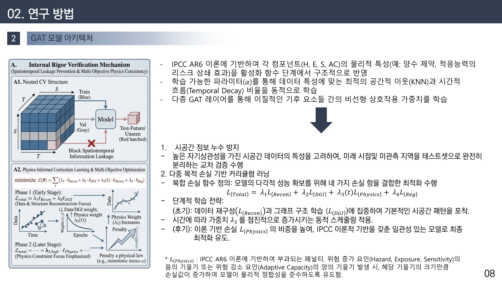
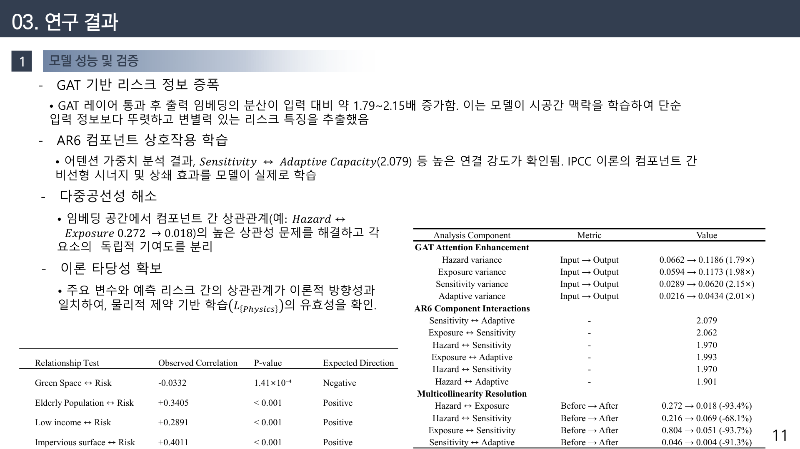
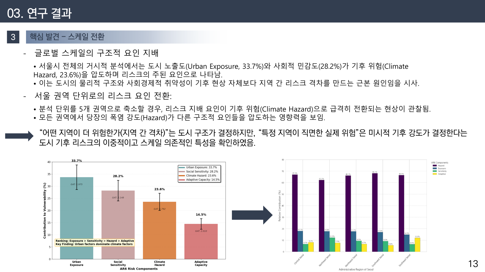
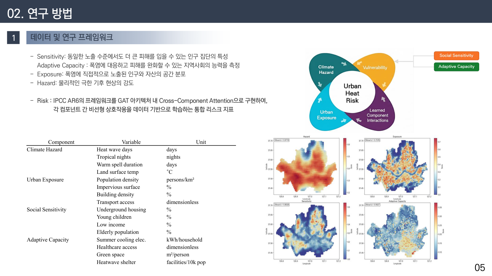

# 폭염은 왜 누구에게 더 잔인한가
## 설명가능 AI(XAI)로 서울의 열 리스크를 해부한 이야기, 그리고 국제 학술지에 실리기까지

안녕하세요. 오늘은 제가 제1저자로 국제 학술지 **Urban Climate**(임팩트 팩터 6.9, 해당 분야 상위 6%)에 게재한 연구를 처음부터 끝까지 풀어서 이야기해 보려고 합니다. 논문은 영어로 딱딱하게 쓰여 있지만, 사실 이 연구가 던지는 질문은 아주 단순합니다.

**"같은 폭염인데, 왜 어떤 동네는 더 많이 죽는가?"**

여름마다 뉴스에서 "오늘 서울 최고기온 36도"라는 말을 듣습니다. 그런데 그 36도는 서울 어디에서나 똑같은 36도가 아닙니다. 어떤 동네에서는 그냥 더운 하루이고, 어떤 동네에서는 누군가의 마지막 하루가 됩니다. 저는 이 차이가 어디서 오는지를 데이터로 규명하고 싶었습니다. 그리고 더 중요하게는, **왜 그런지 설명할 수 있는** 모델을 만들고 싶었습니다.

이 글은 전공자가 아니어도 읽을 수 있도록, 어려운 용어가 나오면 그때그때 풀어서 설명하겠습니다. 조금 길지만 천천히 따라오시면 "AI로 기후 리스크를 평가한다"는 말이 실제로 무엇을 하는 일인지 감이 잡히실 거예요.

---

## 1. 시작은 "지도 한 장이 이상하다"는 느낌이었습니다

폭염 연구를 하다 보면 '열 취약성 지도'를 자주 봅니다. 빨간색은 위험, 파란색은 안전. 그런데 저는 이 지도들을 보면서 계속 찜찜한 기분이 들었습니다. 이 지도는 대체 **무엇을 근거로** 이 동네를 빨갛게 칠했을까요?

기존 방식은 대부분 이렇게 만듭니다. 폭염일수, 고령인구 비율, 녹지 면적 같은 변수를 여러 개 모아서, 각각에 가중치를 곱해 더합니다. 예를 들어 "폭염일수 30% + 고령인구 40% + 녹지 30%" 같은 식이죠. 이게 **열 취약성 지수(HVI, Heat Vulnerability Index)**입니다.

문제는 이 30%, 40%라는 숫자를 **연구자가 정한다는 것**입니다. 왜 40%인가요? 왜 35%가 아닌가요? 명확한 답이 없습니다. 연구자가 바뀌면 지도의 색깔도 바뀝니다. 게다가 이렇게 만든 지수가 실제 온열질환 발생과 얼마나 맞는지 검증한 연구도 드물었습니다.

그럼 요즘 유행하는 딥러닝을 쓰면 될까요? 정확도는 올라갑니다. 그런데 이번엔 반대 문제가 생깁니다. **왜 그렇게 예측했는지 아무도 모릅니다.** 이걸 '블랙박스'라고 부릅니다. 정확하지만 설명할 수 없는 모델은 정책 근거로 쓰기 어렵습니다. 공무원이 "이 동네에 예산을 더 써야 합니다"라고 보고할 때, 근거가 "AI가 그렇게 말했습니다"일 수는 없으니까요.

정리하면 제가 마주한 상황은 이랬습니다. **정확한 모델은 설명을 못 하고, 설명이 되는 모델은 근거가 주관적이다.** 이 둘을 동시에 잡는 것이 이 연구의 출발점이었습니다.

---

## 2. 해결의 실마리는 IPCC 보고서에 있었습니다

여기서 저는 방향을 조금 틀었습니다. 가중치를 제가 정하는 대신, **이미 국제적으로 합의된 이론 틀을 가져와서 AI에 심으면 어떨까?**

기후변화 분야에서 가장 권위 있는 문서가 IPCC 평가보고서입니다. 가장 최신인 제6차 보고서(AR6)는 '위험(Risk)'을 이렇게 정의합니다. 위험은 다음 네 가지가 만나서 생긴다는 것입니다.

- **위해(Hazard)** — 폭염 그 자체의 강도. 며칠이나 더웠는지, 얼마나 뜨거웠는지.
- **노출(Exposure)** — 그 더위에 얼마나 많은 사람과 자산이 노출되어 있는지. 인구밀도, 건물밀도, 불투수면 비율 같은 것들.
- **취약성(Vulnerability)** — 노출된 사람들이 얼마나 약한지. 고령인구, 영유아, 저소득층, 지하주거 비율 등.
- **적응역량(Adaptive Capacity)** — 대응할 수 있는 힘. 무더위쉼터, 의료 접근성, 냉방 전력, 녹지 등.

즉 **위험 = f(위해, 노출, 취약성, 적응역량)** 입니다. 이 구조는 제가 만든 게 아니라 전 세계 과학자들이 합의한 것이고, 그래서 "왜 이 네 가지인가?"에 대한 답이 이미 마련되어 있습니다.

제 아이디어는 이 네 요소를 **AI 모델의 구조 자체에 물리적으로 심는 것**이었습니다. 변수를 그냥 한 통에 넣고 섞는 게 아니라, 네 요소를 각각 별도의 경로로 학습시키고 마지막에 결합하는 방식이죠. 그러면 학습이 끝난 뒤 "이 지역의 위험에서 위해가 몇 %, 노출이 몇 %를 기여했는가"를 이론에 맞춰 분해할 수 있습니다.

---

## 3. 왜 하필 '그래프' 신경망이었을까요

모델을 고를 때 한 가지를 더 고민했습니다. 도시의 더위는 **행정동 경계를 존중하지 않습니다.** 옆 동네가 아파트 숲이고 아스팔트로 덮여 있으면, 우리 동네 기온도 같이 올라갑니다. 열은 번지니까요.

그런데 기존 통계 모형은 대개 각 지역을 독립된 점으로 봅니다. 강남구는 강남구, 서초구는 서초구. 이러면 '옆 동네 효과'를 놓칩니다.

그래서 **그래프 어텐션 신경망(GAT, Graph Attention Network)**을 선택했습니다. 이름이 어렵지만 개념은 직관적입니다.

- 서울의 각 지역(행정동)을 **점(노드)**으로 놓습니다.
- 인접한 지역끼리 **선(엣지)**으로 연결합니다.
- 그리고 모델이 스스로 **"어느 이웃이 나에게 더 중요한가"**를 학습합니다. 이게 '어텐션(주목)'입니다.

즉 모든 이웃을 똑같이 취급하지 않고, "이 동네의 더위에는 북쪽 이웃보다 남쪽 이웃의 영향이 크다"는 식의 가중치를 데이터로부터 알아냅니다. 사람이 정해주는 게 아니라 모델이 찾아냅니다.

여기에 시간 축도 넣었습니다. 폭염은 하루 사건이 아니라 며칠씩 이어지며 누적됩니다. 그래서 시계열 학습이 가능한 구조를 결합해, **공간(어디)과 시간(언제)을 동시에** 다루도록 했습니다. 이걸 '시공간 모델'이라고 부릅니다.

---

## 4. 가장 신경 쓴 부분은 "정직하게 검증하기"였습니다

솔직히 말씀드리면, 이 연구에서 제가 가장 오래 붙잡고 있었던 건 모델 성능을 올리는 일이 아니었습니다. **성능을 부풀리지 않는 일**이었습니다.

공간 데이터에는 함정이 있습니다. 가까운 동네끼리는 지형·건물·인구가 서로 닮아 있습니다. 그래서 학습용과 검증용 데이터를 무작위로 섞으면, 모델이 "옆 동네 정답"을 슬쩍 보고 답을 맞히는 셈이 됩니다. 성적표는 화려해지지만 실력은 아닙니다. 이걸 **정보 누출(data leakage)**이라고 합니다.

그래서 세 가지 방식으로 일부러 어렵게 검증했습니다.

- **시간 순방향 검증**(Temporal Forward Chaining): 과거로 학습하고 미래를 예측합니다. 미래를 미리 보지 못하게 막는 방식입니다.
- **공간 블록 교차검증**(Spatial Block CV): 지역을 덩어리로 잘라내고, 아예 학습에서 본 적 없는 지역을 맞히게 합니다.
- **권역 단위 검증**(Nested LORO): 서울을 5개 권역으로 나눠, 한 권역을 통째로 빼고 학습한 뒤 그 권역을 예측합니다.

결과부터 말씀드리면, 이렇게 까다롭게 검증했음에도 **결정계수(R²)가 0.9681**로 나왔습니다. R²는 모델이 실제 값의 변동을 얼마나 설명하는지를 0~1로 나타내는 지표인데, 0.97에 가깝다는 건 상당히 잘 맞았다는 뜻입니다. 오차(RMSE)는 0.162였습니다.

여기에 하나 더, 변수들끼리 지나치게 겹쳐서 결과가 왜곡되지 않는지(다중공선성), 그리고 모델이 학습한 관계가 이론적으로 말이 되는 방향인지도 따로 확인했습니다. 예를 들어 '고령인구가 늘면 위험이 올라간다'처럼 상식과 이론에 부합하는 부호가 나오는지를 하나하나 점검한 것입니다.

---

## 5. 모델에게 "왜?"라고 세 번 물었습니다

이제 이 연구의 핵심입니다. 예측이 잘 되는 것만으로는 부족하고, **왜 그렇게 판단했는지**를 알아야 합니다. 그래서 설명가능 AI(XAI) 기법을 하나가 아니라 **세 가지**를 동시에 적용했습니다.

- **SHAP** — 각 변수가 예측값을 얼마나 밀어 올리거나 내렸는지 기여도를 나눠 계산합니다. 게임이론에서 나온 방법입니다.
- **GNNExplainer** — 그래프 구조에서 어떤 연결이 결정적이었는지를 찾아냅니다. "이 판단에는 이 이웃 관계가 중요했다"를 알려줍니다.
- **Integrated Gradients** — 입력을 조금씩 바꿔가며 예측이 변하는 경로를 추적합니다.

세 개를 쓴 이유는 명확합니다. 한 기법만 쓰면 그 기법의 편향인지 진짜 신호인지 구분할 수 없기 때문입니다. 서로 원리가 완전히 다른 세 방법이 **같은 결론을 낸다면**, 그건 방법의 착시가 아니라 데이터에 실제로 있는 구조라고 볼 수 있습니다.

결과는 기대 이상이었습니다. 세 기법의 변수 중요도 순위가 **평균 89.6% 일치**했고, 순위 상관(Spearman ρ)은 약 **0.89**(p<0.001)였습니다. 특히 AR6 네 요소의 위계는 **100% 일치**, 개별 변수 순위는 95% 일치했습니다. 5년간의 시계열 해석은 85%, 5개 권역의 공간 패턴은 80% 일치했습니다.

이 정도면 "우연히 그렇게 보인 것"이라고 말하기 어렵습니다.

---

## 6. 그런데 정말 놀라운 발견은 여기서 나왔습니다

여기까지는 "잘 만들었다" 수준의 이야기입니다. 제가 이 연구에서 가장 흥미로웠던 순간은 **분석 범위를 바꿔봤을 때** 찾아왔습니다.

서울 전체를 한 번에 놓고 "무엇이 지역 간 위험 차이를 만드는가"를 물었을 때, 답은 이랬습니다.

- 도시 노출(Urban Exposure) **33.7%**
- 사회적 민감도(Social Sensitivity) **28.2%**
- 기후 위해(Climate Hazard) **23.6%**
- 적응역량(Adaptive Capacity) **14.5%**

즉 **폭염 자체보다 도시의 물리적 구조와 사회경제적 취약성이 더 크게 작용**했습니다. 어떤 동네가 더 위험한지는 '얼마나 더웠는지'보다 '어떻게 지어진 동네인지, 누가 사는지'가 결정한다는 뜻입니다.

그런데 분석 단위를 서울 전체에서 **5개 권역으로 좁히자 순위가 뒤집혔습니다.** 모든 권역에서 기후 위해가 62~68%로 압도적 1위가 된 것입니다.

이 결과를 처음 봤을 때 한동안 화면만 봤습니다. 그리고 이렇게 정리했습니다.

> **"어떤 지역이 더 위험한가(지역 간 격차)"는 도시 구조가 결정하지만, "특정 지역이 실제로 직면하는 위험의 크기"는 그날의 기후 강도가 결정한다.**

말장난처럼 보이지만 정책적으로는 아주 중요한 구분입니다. 장기적으로 지역 간 폭염 불평등을 줄이려면 **도시 구조와 사회 안전망**을 손봐야 합니다. 반면 이번 주 폭염 특보에 대응하려면 **기온이 실제로 치솟는 곳**에 자원을 보내야 합니다. 둘은 다른 문제이고, 둘 다 필요합니다.

또 하나 눈에 띈 건 공간 패턴이었습니다. 위험은 무작위로 흩어져 있지 않고 **덩어리로 뭉쳐 있었습니다.** 국지적 공간통계(LISA)로 확인해 보니 고위험 지역끼리 붙어 있는 '고위험 군집(High-High)'이 통계적으로 유의하게 나타났습니다.

---

## 7. "그래서 이 모델이 현실을 맞히긴 하나요?"

모델이 아무리 정교해도 실제 건강 피해와 무관하다면 의미가 없습니다. 그래서 마지막으로 **외부 데이터로 검증**했습니다. 모델 학습에 전혀 쓰지 않은 국민건강보험공단(NHIS)과 질병관리청(KDCA)의 온열질환 자료를 가져와서, 모델이 예측한 위험도와 비교했습니다.

결과는 이랬습니다.

- 인구당 여름철 온열질환 발생률과의 거리상관(dCor) **0.449** (p<0.001)
- 인구당 연간 온열질환 **0.422**, 인구당 여름철 응급실 방문 **0.397**
- 상위 3개 지표가 **모두 인구당 보정 지표**였습니다.

여기서 '거리상관'은 선형 관계만 잡는 일반 상관계수와 달리 **휘어진 관계까지 잡아내는 지표**입니다. 폭염과 건강 피해의 관계는 직선이 아니라 어느 임계를 넘으면 급격히 나빠지는 형태라, 이 지표가 더 적절합니다.

그리고 시차(lag) 분석에서 **당해 연도의 상관이 가장 높게** 나왔습니다(평균 dCor≈0.423). 즉 이 모델이 잡아내는 위험은 몇 년 뒤에 서서히 나타나는 만성 영향이 아니라, **그 여름에 바로 사람을 아프게 하는 급성 영향**이라는 뜻입니다.

흥미로운 건 상위 지표가 모두 '인구당' 값이었다는 점입니다. 단순 발생 건수는 인구가 많은 동네에서 자연히 커지므로, 지역 간 비교에는 인구 보정이 필수라는 실무적 교훈도 함께 얻었습니다.

---

## 8. 데이터는 어디서, 무엇을 썼나요

궁금해하실 분들을 위해 정리하면, 서울시를 대상으로 **총 13,170개의 시공간 관측치**를 구성했습니다. 지역 단위로 잘라 여러 해에 걸쳐 쌓은 데이터입니다. 변수는 AR6 네 요소에 맞춰 16개를 사용했습니다.

- **위해**: 폭염일수, 열대야, 온난기간 지속일수, 지표면온도(위성 관측)
- **노출**: 인구밀도, 건물밀도, 불투수면 비율, 지하주거
- **취약성**: 고령인구, 영유아, 저소득층
- **적응역량**: 녹지율, 무더위쉼터 밀도, 의료 접근성, 냉방 전력, 대중교통 접근성

재미있는 발견 하나. XAI가 뽑은 상위 변수에 **대중교통 접근성**이 계속 올라왔습니다. 처음엔 의외였는데, 생각해 보면 자연스럽습니다. 교통 접근성이 좋다는 건 사람이 많이 모이고 개발이 집약된 곳이라는 뜻이고, 그건 곧 아스팔트와 건물이 많다는 의미이기도 하니까요. 데이터가 도시의 구조를 대신 말해주고 있었습니다.

---

## 9. 이 연구가 남긴 것

정리하겠습니다. 이 연구가 한 일은 세 가지입니다.

**첫째, 국제적으로 합의된 이론(IPCC AR6)을 AI 모델 구조에 직접 구현했습니다.** 가중치를 사람이 임의로 정하는 문제를 이론으로 대체했습니다.

**둘째, 정확도와 설명력을 함께 확보했습니다.** 엄격한 검증에서 R² 0.9681을 유지하면서, 세 가지 XAI로 89.6% 일치하는 해석을 제시했습니다. 그리고 외부 건강 데이터로 실제 피해와의 연관성까지 확인했습니다.

**셋째, 스케일에 따라 위험의 지배 요인이 바뀐다는 사실을 발견했습니다.** 이건 단순한 기술적 결과가 아니라, 정책의 시간 지평(장기 구조 개선 vs 단기 대응)을 나누어 설계해야 한다는 실천적 함의를 갖습니다.

개인적으로는, "AI로 예측했습니다"에서 멈추지 않고 **"그래서 왜 그런지 말할 수 있습니다"**까지 갔다는 점이 가장 뿌듯합니다. 정책은 숫자만으로 움직이지 않고 설명으로 움직이니까요. 담당 공무원이 "이 동네를 먼저 챙겨야 합니다. 이유는 이것입니다"라고 말할 수 있어야 예산이 움직입니다.

앞으로는 이 틀을 도시 폭염에서 **산림 재해**로 옮기는 작업을 하고 있습니다. 산불 뒤에 산사태가 따라오는 연쇄 재해를 같은 방식으로, 즉 위성과 설명가능 AI로 예측하고 근거를 함께 제시하는 연구입니다. 그 이야기는 다음에 따로 정리해 보겠습니다.

긴 글 읽어주셔서 감사합니다. 궁금한 점이나 데이터·방법에 대해 더 알고 싶은 부분이 있으면 댓글로 남겨주세요.

---

**논문 정보**
Choi, H., Park, J. S., & Lim, C.-H. (2026). Climate justice through explainable graph neural networks: A spatiotemporal attention-based urban heat risk assessment under IPCC AR6 framework. *Urban Climate*, Article 102981.
DOI: https://doi.org/10.1016/j.uclim.2026.102981

**링크** · 포트폴리오 https://portfolio-eight-ruddy-87.vercel.app · GitHub https://github.com/zxsa0716
