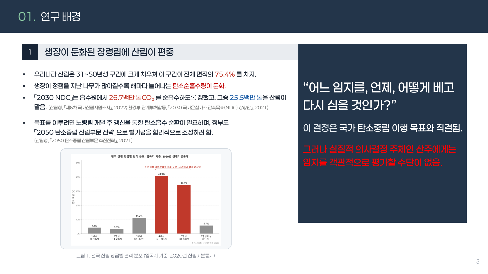
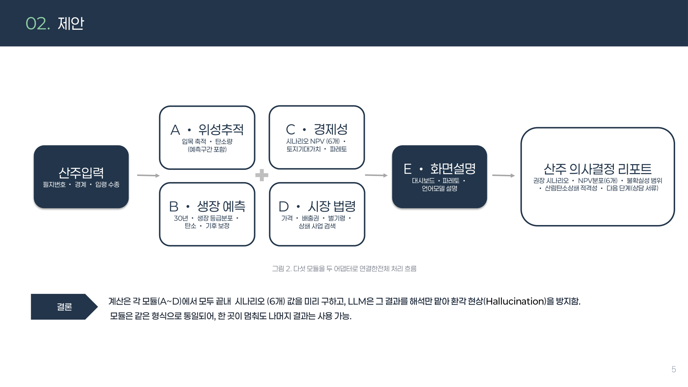
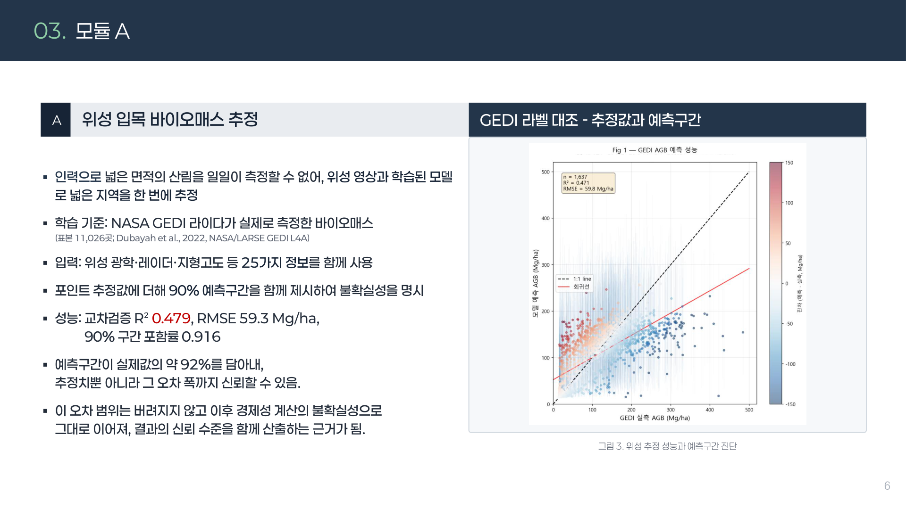
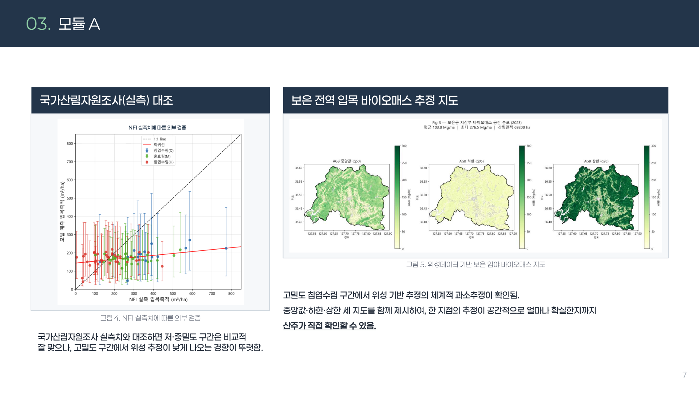
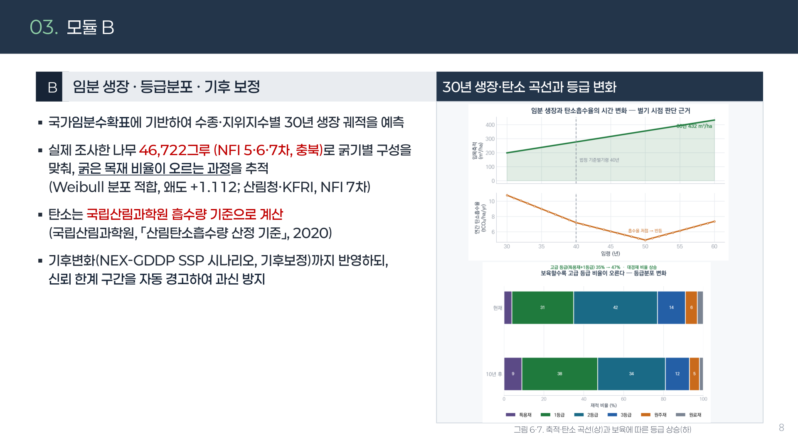
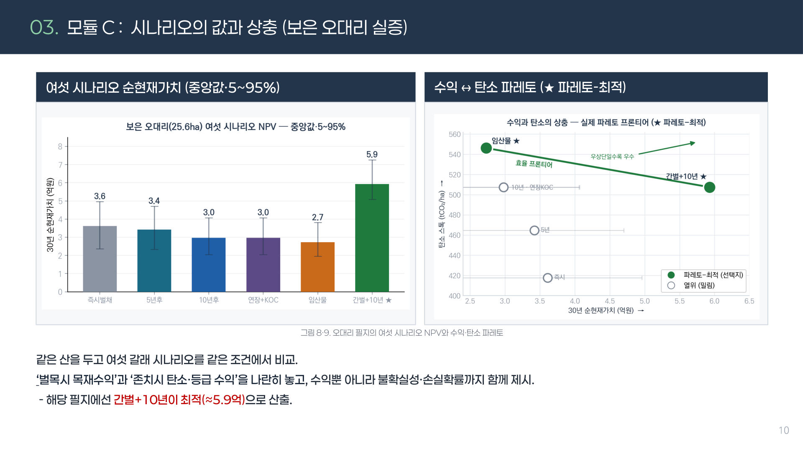
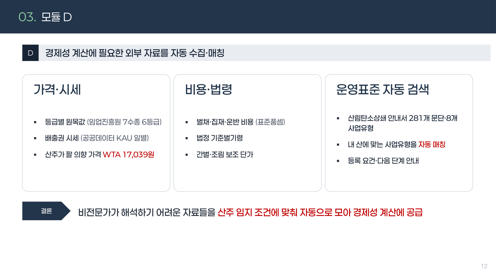
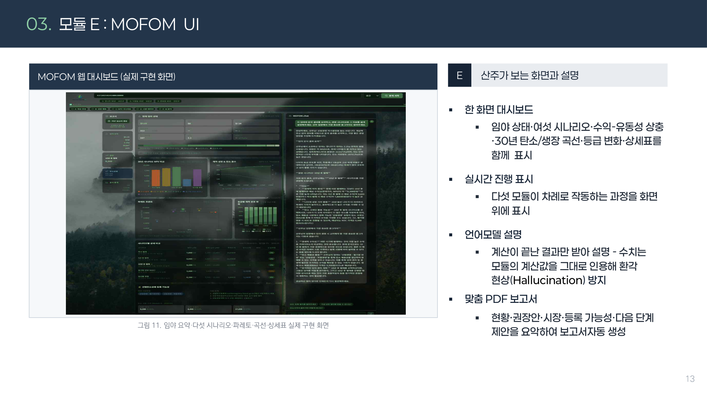
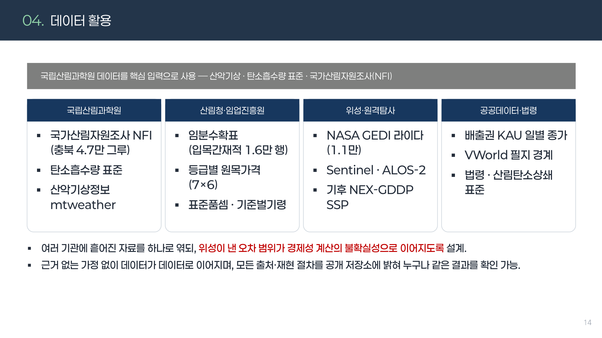
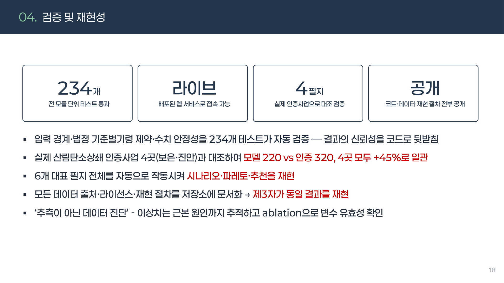

# 필지번호 하나로 30년 산림경영을 계산한다 — MOFOM
### 제1회 산림과학 AI활용 경진대회 **대상**(AI서비스창출상) · 팀 ‘산림의 국민’ 팀장

## 1. 여는 글
우리나라 산림은 31~50년생 장령림에 크게 치우쳐 있고, 생장이 정점을 지난 나무가 늘면서 해마다 늘어나는 탄소흡수량은 둔화되고 있습니다. “**어느 임지를, 언제, 어떻게 베고 다시 심을 것인가**”는 국가 탄소중립과 직결된 결정이지만, 정작 결정 주체인 산주에게는 자기 산을 객관적으로 평가할 수단이 없습니다. MOFOM은 그 공백을 메우기 위해 만든 서비스입니다.

*전국 산림 영급 분포. 장령림 편중이 뚜렷하며, 이는 탄소순흡수 둔화로 이어집니다.*

## 2. 문제 정의
산주의 86.2%가 판단 근거를 갖지 못하고, 임가 소득은 낮습니다. 정책은 ‘벌채 후 순환’을 권하지만 현실에서는 판단 도구가 없어 정책과 산주의 이익이 어긋납니다.

## 3. 제안 — 5개 모듈(A~E) 병렬 파이프라인
필지번호 하나를 입력하면 위성 추정부터 산주용 대시보드까지 다섯 모듈이 병렬로 돌아갑니다.

*A 위성추정 · B 생장예측 · C 경제성(NPV) · D 시장·법령 · E 대시보드. 각 모듈이 독립적으로 완결되어, 하나가 멈춰도 나머지 결과는 사용할 수 있습니다.*

**(A) 위성 입목 바이오매스 추정** — NASA GEDI 라이다가 실측한 바이오매스(표본 11,026곳)를 라벨로, 위성 광학·레이더·지형 25개 정보를 학습했습니다.

*교차검증 R² 0.479, RMSE 59.3 Mg/ha, 90% 예측구간 포함률 0.916. 점추정뿐 아니라 오차 폭까지 함께 제시해 신뢰 수준을 산출합니다.*

*국가산림자원조사와 대조·검증한 뒤 전국으로 확장했습니다.*

**(B) 30년 생장 예측** — 기후 보정을 거쳐 30년 뒤 임분 상태를 내다봅니다.

**(C) 경제성 — 6개 경영 시나리오 NPV·파레토** — 목재값에서 비용을 빼고 탄소수익을 더한 실제 가치를 시나리오별로 비교합니다.

*벌기·존치 등 6개 시나리오의 순현재가치(NPV)를 미리 계산해, 산주가 선택지를 값으로 견줄 수 있게 합니다.*

**(D) 시장·법령 자동 수집** — 가격·시세·보조사업·배출권·산림탄소상쇄를 자동으로 모아 계산에 반영합니다.

**(E) 산주 대시보드 + LLM 해석** — 결론 계산은 A~D에서 모두 끝내 시나리오 값을 확정하고, LLM은 그 결과의 ‘해석’만 맡아 환각을 방지합니다.

## 4. 데이터 & 검증
국립산림과학원 데이터(NFI·임분수확표·산악기상)와 NASA GEDI·Sentinel·NEX-GDDP를 결합했습니다.

*총 234개 테스트로 검증했고, 정책 반영으로 배출권 가치가 유의하게 상승(모델 220 vs 320, +45%)함을 확인했습니다.*

## 5. 활용 & 의미
MOFOM은 흩어져 있던 위성·생장·경제성·시장·설명을 하나로 이어 산림경영 판단을 산주의 손에 돌려줍니다. 한 필지의 선택이 수십 년간 수천만 원을 좌우하는 만큼, 데이터 기반 의사결정의 가치가 큽니다.

## 6. 맺음말
라이브 데모와 전체 코드를 공개했습니다. 직접 필지번호를 넣어 결과를 확인해 보실 수 있습니다. 긴 글 읽어주셔서 감사합니다.

---
**링크** · 데모: https://mofom-ai.vercel.app · GitHub: https://github.com/jwn6174-crypto/forest-ai-agent · 포트폴리오: https://portfolio-eight-ruddy-87.vercel.app
