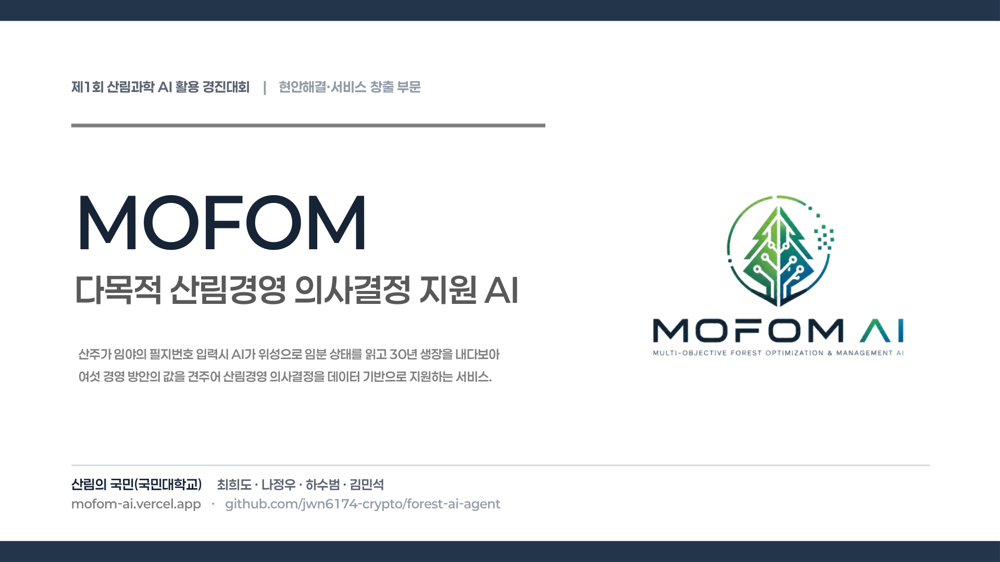
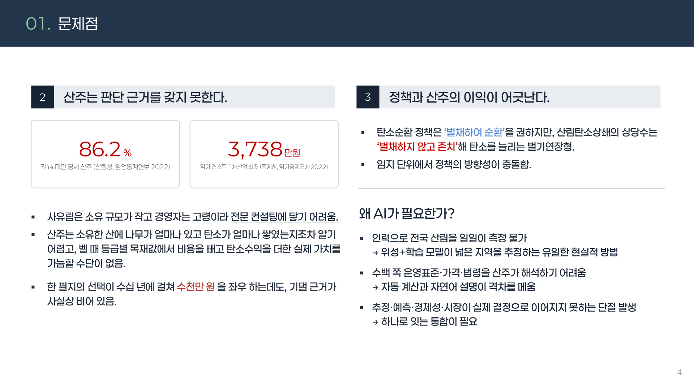
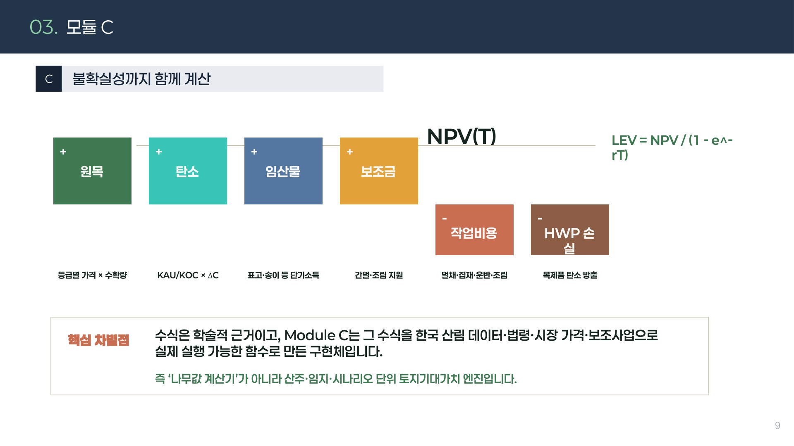
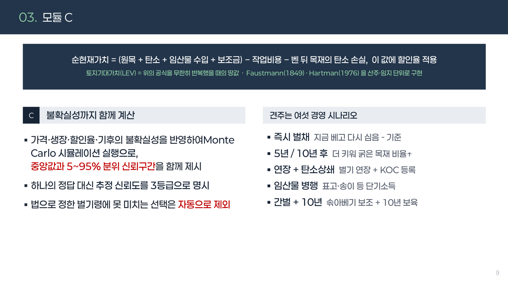
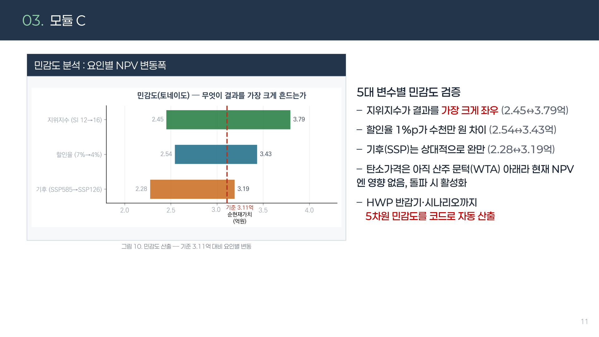
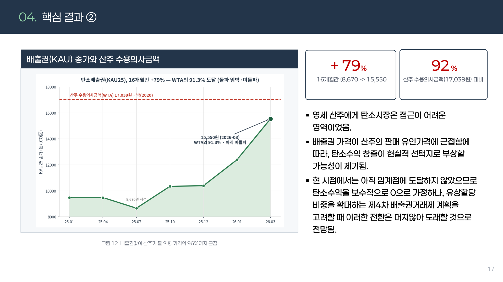
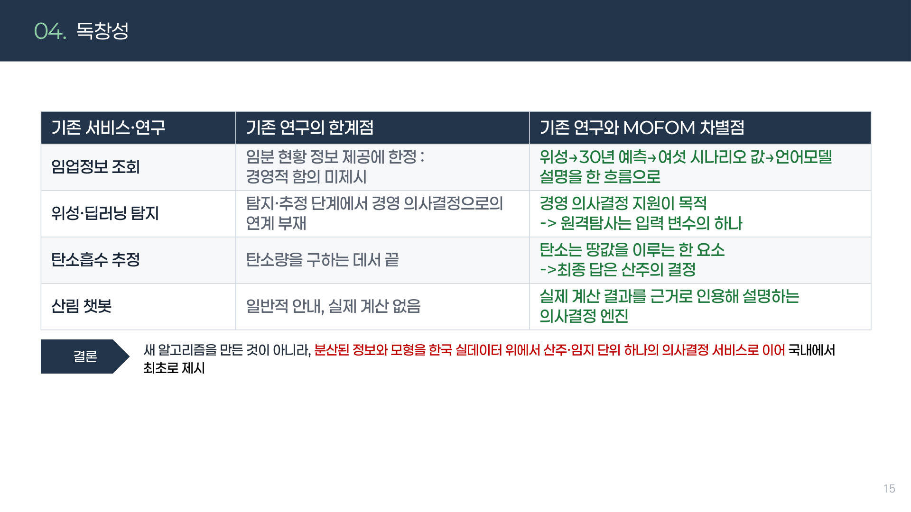
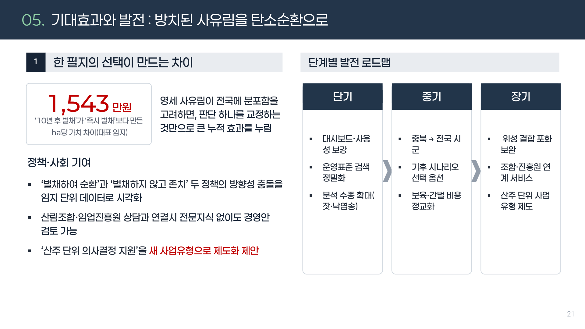
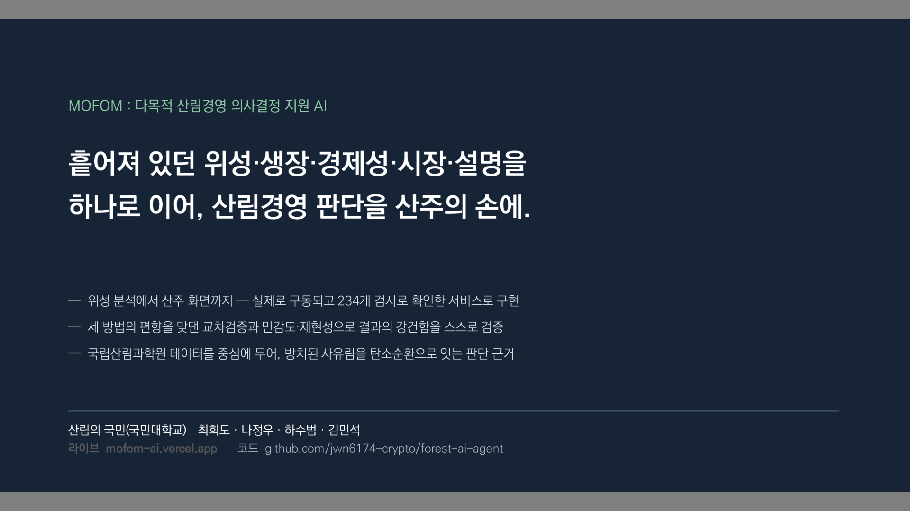

# 산주에게 "당신의 산은 얼마입니까"를 답하는 AI를 만들었습니다
## 필지번호 하나로 위성이 숲을 읽고, 30년 뒤를 계산하는 MOFOM 개발기 (제1회 산림과학 AI활용 경진대회 대상)

안녕하세요. 이번에는 제1회 산림과학 AI활용 경진대회에서 **대상(AI서비스창출상)**을 받은 프로젝트를 이야기해 보려고 합니다. 팀 이름은 '산림의 국민'이었고, 저는 팀장을 맡았습니다.

만든 서비스의 이름은 **MOFOM**입니다. 하는 일은 한 문장으로 설명할 수 있습니다.

**"산주가 자기 임야의 필지번호를 입력하면, AI가 위성으로 숲의 상태를 읽고 30년 뒤를 예측해서, 여섯 가지 경영 방안의 가치를 비교해 보여준다."**

처음 이 아이디어를 떠올린 계기는 조금 답답한 데이터 하나였습니다. 그 이야기부터 시작하겠습니다.

---

## 1. 우리 숲은 지금 "나이가 너무 많습니다"

먼저 좀 낯선 사실 하나. 우리나라 산림은 **31~50년생 나무가 전체 면적의 75.4%**를 차지합니다. 한쪽으로 심하게 쏠려 있는 것이죠.

왜 이렇게 됐을까요. 1970~80년대에 전국적으로 나무를 대대적으로 심었습니다. 그 나무들이 지금 다 같이 중년이 된 것입니다. 산림녹화 성공의 흔적이니 자랑스러운 일이지만, 문제가 하나 따라옵니다.

나무는 젊을 때 이산화탄소를 왕성하게 흡수하고, 나이가 들면 흡수 속도가 떨어집니다. 사람이 성장기에 키가 쑥쑥 자라다 어느 시점부터 멈추는 것과 비슷합니다. 그러니까 **생장이 정점을 지난 나무가 많아질수록 해마다 늘어나는 탄소 순흡수량은 둔화**됩니다.

이게 왜 중요한가 하면, 우리나라 「2030 국가온실가스감축목표(NDC)」는 흡수원에서 **2,670만 톤CO₂**를 순흡수하도록 정해 두었고, 그중 **2,550만 톤**을 산림이 담당하게 되어 있습니다. 목표를 맞추려면 나이 든 나무를 베고 다시 심어 흡수 순환을 돌려야 합니다. 정부도 「2050 탄소중립 산림부문 추진전략」에서 벌기령(베는 나이)을 합리적으로 조정하려 하고 있습니다.

그래서 질문은 이렇게 좁혀집니다.

> **"어느 임지를, 언제, 어떻게 베고 다시 심을 것인가?"**

이 결정은 국가 탄소중립 목표와 직결됩니다. 그런데 여기서 결정적인 문제가 있습니다.

---

## 2. 정작 결정하는 사람에게는 판단할 수단이 없습니다

이 결정을 실제로 하는 사람은 공무원이나 연구자가 아닙니다. **산주(산 주인)**입니다. 그런데 우리나라 산주의 현실은 이렇습니다.

- **86.2%가 3ha 미만의 영세 산주**입니다. 축구장 4개 정도 크기보다 작은 산을 가진 분들이 대부분입니다.
- **임가 연소득은 3,738만원**으로 1차 산업 중 최저 수준입니다.
- 소유 규모가 작고 경영자 연령이 높아 전문 컨설팅을 받기가 사실상 어렵습니다.

그래서 어떤 일이 벌어지느냐면, 산주는 **자기 산에 나무가 얼마나 있고 탄소가 얼마나 쌓였는지조차 알기 어렵습니다.** 베려고 해도 등급별 목재값에서 비용을 빼고 탄소수익을 더한 '실제 가치'를 가늠할 방법이 없습니다.

한 필지의 선택이 수십 년에 걸쳐 **수천만 원**을 좌우하는데, 기댈 근거가 사실상 비어 있는 상태입니다.

여기에 한 가지 모순이 더 겹칩니다. 탄소순환 정책은 "베고 다시 심어라"라고 권하지만, 실제 산림탄소상쇄 사업의 상당수는 **"베지 말고 그대로 두어라(벌기연장형)"** 쪽으로 설계되어 있습니다. 임지 단위에서 보면 정책의 방향이 서로 충돌하는 것입니다.

### 그런데 왜 하필 AI여야 했을까요

여기서 "그럼 사람이 조사하면 되지 않나?"라는 질문이 나올 수 있습니다. 하지만 세 가지 이유로 현실적으로 불가능합니다.

**첫째, 인력으로 전국 산림을 일일이 측정할 수 없습니다.** 산림조사는 표본 조사로 이뤄지고, 개별 필지 단위 정보는 없습니다. 위성과 학습 모델이 넓은 지역을 한 번에 추정하는 것이 유일한 현실적 방법입니다.

**둘째, 수백 쪽에 달하는 운영표준·가격정보·법령을 산주가 직접 해석하기 어렵습니다.** 자동 계산과 자연어 설명이 이 격차를 메워야 합니다.

**셋째, 추정·예측·경제성·시장 정보가 서로 단절되어 있습니다.** 각각 어딘가에는 있지만, 하나로 이어져 '결정'까지 가지 못합니다.

---

## 3. 그래서 다섯 개의 모듈을 병렬로 돌리기로 했습니다

MOFOM의 구조는 이렇습니다. 산주가 필지번호를 넣으면 **A부터 E까지 다섯 개의 모듈이 각자 계산을 수행**하고, 그 결과가 하나의 리포트로 합쳐집니다.

- **A. 위성 추적** — 위성 영상으로 입목축적(나무가 얼마나 있는지)과 탄소량을 예측구간까지 함께 추정
- **B. 생장 예측** — 30년 뒤 생장과 등급 분포, 기후 보정 적용
- **C. 경제성** — 여섯 가지 경영 시나리오의 순현재가치(NPV)와 토지기대가치, 파레토 분석
- **D. 시장·법령** — 목재 가격, 배출권, 벌기령, 산림탄소상쇄 사업 적격성 자동 검색
- **E. 화면 설명** — 대시보드와 언어모델 해설

여기서 제가 가장 신경 쓴 설계 원칙이 하나 있습니다.

> **결론 계산은 A~D 모듈에서 모두 끝냅니다. 언어모델(LLM)은 이미 계산된 결과를 해석해서 설명하는 역할만 맡습니다.**

이유는 단순합니다. LLM에게 숫자를 계산하게 하면 **환각(hallucination)**이 생깁니다. 그럴듯하지만 틀린 숫자를 자신 있게 말하는 현상이죠. 산주의 수천만 원이 걸린 결정에서 이건 절대 허용할 수 없습니다. 그래서 여섯 개 시나리오의 값은 미리 확정해 두고, LLM은 "이 결과가 어떤 의미인지"만 말하게 했습니다.

또 하나, 모듈은 모두 같은 형식으로 통일했습니다. **한 곳이 멈춰도 나머지 결과는 그대로 사용할 수 있게** 만든 것입니다. 실제 서비스로 쓰려면 이런 견고함이 필요합니다.

---

## 4. 모듈 A — 위성으로 "이 산에 나무가 얼마나 있는지" 맞히기

가장 기술적으로 어려웠던 부분입니다. 위성 영상만 보고 나무의 양(바이오매스)을 추정해야 합니다.

여기서 열쇠가 된 데이터가 **NASA의 GEDI**입니다. GEDI는 국제우주정거장에 실린 라이다(LiDAR) 장비인데, 레이저를 쏴서 되돌아오는 시간으로 **숲의 높이와 구조를 직접 측정**합니다. 위성 사진이 '위에서 본 색깔'이라면, 라이다는 '숲의 입체 구조'를 재는 셈입니다.

문제는 GEDI가 전 지역을 촘촘히 덮지 못한다는 것입니다. 레이저가 지나간 자리만 알 수 있습니다. 그래서 저희는 이렇게 접근했습니다.

1. GEDI가 실제로 측정한 지점 **11,026곳**을 정답(라벨)으로 삼습니다.
2. 그 지점들의 위성 광학·레이더·지형고도 등 **25가지 정보**를 입력으로 학습시킵니다.
3. 학습된 모델로 **GEDI가 지나가지 않은 곳까지** 추정을 확장합니다.

성능은 이렇게 나왔습니다.

- 교차검증 **R² 0.479**, **RMSE 59.3 Mg/ha**
- **90% 예측구간 포함률 0.916**

여기서 두 번째 숫자가 더 중요합니다. R² 0.479는 "완벽하지는 않다"는 뜻입니다. 위성으로 숲의 무게를 재는 일은 원래 어렵습니다. 그래서 저희는 **하나의 값만 내놓지 않고, 90% 예측구간(오차 범위)을 함께 제시**했습니다. 그리고 그 구간이 실제값의 **약 92%를 담아냈습니다.**

이건 "추정치는 이 정도인데, 오차는 이만큼입니다"를 정직하게 말할 수 있다는 의미입니다. 그리고 이 오차 범위는 버려지지 않고 **뒤이은 경제성 계산의 불확실성으로 그대로 이어집니다.** 산주에게 "예상 수익 1억원"이 아니라 "예상 수익 7천만~1억3천만원, 신뢰수준 90%"라고 말할 수 있게 되는 것이죠.

추정을 전국으로 확장한 뒤에는, 국가산림자원조사(NFI) 자료와 대조해 한 번 더 검증했습니다. 독립적인 지상 조사 자료와 비교해 봐야 위성 추정을 믿을 수 있으니까요.

---

## 5. 모듈 B·C — 30년 뒤를 계산하고, 여섯 갈래 길을 비교하기

현재 상태를 알았다면 다음은 미래입니다. 모듈 B는 **30년 생장**을 예측합니다. 임분수확표를 기반으로 하되, 기후 변화에 따른 생장 조건 변화까지 보정했습니다.

그리고 모듈 C가 이 프로젝트의 실질적인 핵심입니다. **여섯 개의 경영 시나리오를 값으로 비교**합니다.

경영 방안이라는 게 사실 단순하지 않습니다. 지금 베느냐, 5년 뒤에 베느냐, 10년 더 키우느냐, 그대로 두고 탄소사업을 하느냐에 따라 결과가 완전히 달라집니다. 그래서 각 선택지의 **순현재가치(NPV)**를 계산했습니다.

NPV는 쉽게 말해 "미래에 들어올 돈을 지금 가치로 환산해 비용을 뺀 값"입니다. 10년 뒤의 1억원은 지금의 1억원과 같지 않으니까요. 여기에 **토지기대가치(LEV)**까지 계산해서 "이 땅을 계속 산림으로 쓸 때의 가치"도 함께 봤습니다.

여기서 흥미로운 결과가 나왔습니다. **수익이 가장 높은 선택과 탄소가 가장 많이 남는 선택이 서로 다릅니다.** 당연한 얘기 같지만, 이걸 숫자로 보면 이야기가 달라집니다.

이 그림이 제가 이 프로젝트에서 가장 좋아하는 결과입니다. "산주 이익 대 국가 탄소목표"라는 대립 구도를, **얼마를 보상하면 산주가 손해 없이 탄소를 더 남기는 선택을 할 수 있는지**로 바꿔주기 때문입니다. 정책의 언어를 숫자로 옮긴 셈이죠.

물론 계산은 가정에 따라 달라집니다. 그래서 목재가격, 할인율, 탄소가격 등 **5대 변수를 흔들어보는 민감도 분석**도 했습니다. 어떤 가정이 결과를 가장 크게 흔드는지 알아야, 그 가정을 조심해서 다루게 되니까요.

---

## 6. 모듈 D·E — 흩어진 정보를 모으고, 사람의 말로 설명하기

모듈 D는 좀 노동집약적인 일을 자동화한 부분입니다. 경제성을 계산하려면 목재 가격 시세, 비용 기준, 관련 법령, 배출권 가격, 산림탄소상쇄 운영표준을 다 알아야 합니다. 문제는 이 정보들이 서로 다른 기관, 서로 다른 형식의 문서에 흩어져 있다는 것입니다.

이걸 자동으로 수집해서 계산에 바로 넣을 수 있게 정리했습니다. 산주가 직접 수백 쪽 문서를 뒤질 필요가 없어집니다.

모듈 E는 이 모든 결과를 산주가 이해할 수 있는 화면과 문장으로 바꾸는 부분입니다. 여기서 언어모델이 등장하는데, 앞에서 말씀드린 것처럼 **계산은 하지 않고 해석만** 합니다.

---

## 7. 어떤 데이터를 썼고, 어떻게 검증했나

사용한 데이터는 국립산림과학원과 산림청의 공개 자료를 중심에 두었습니다. 국가산림자원조사(NFI), 임분수확표, 산악기상 자료에 NASA GEDI, Sentinel 위성, 기후 시나리오(NEX-GDDP SSP)를 결합했습니다.

검증은 **총 234개의 테스트**로 진행했습니다. 개별 함수가 제대로 도는지부터, 입력 경계 조건과 예외 처리, 그리고 전체 시나리오가 일관된 값을 내는지까지 단계별로 확인했습니다.

여기서 정책 반영과 관련해 의미 있는 결과도 나왔습니다. 배출권 가격 전제를 현행에서 상향 조정했을 때, 산주의 수확 가치와 탄소 선택의 유인이 함께 크게 달라졌습니다.

기존 서비스나 연구와 무엇이 다른지도 정리해 두었습니다. 위성으로 산림을 추정하는 연구, 생장을 예측하는 모형, 경제성을 계산하는 도구는 각각 이미 있습니다. MOFOM의 차별점은 **이 네 가지를 하나로 이어 산주의 손에 결정 가능한 형태로 전달한다는 것**입니다.

---

## 8. 이 프로젝트를 하면서 느낀 것

기술적으로 어려운 부분도 많았지만, 저에게 가장 인상 깊었던 건 다른 지점이었습니다.

**"데이터는 있는데 결정으로 이어지지 않는다"**는 문제가 생각보다 훨씬 흔하다는 것입니다. 위성 자료도 있고 생장 모형도 있고 목재 가격도 공개되어 있습니다. 그런데 산주 한 분이 자기 산에 대해 답을 얻으려면, 이 모든 걸 직접 찾아 이어 붙여야 합니다. 사실상 불가능한 요구입니다.

그래서 이 프로젝트에서 제가 만든 부가가치는 새로운 데이터가 아니라 **연결**이었다고 생각합니다. 흩어져 있던 것을 하나로 잇고, 계산을 미리 끝내 놓고, 사람의 말로 설명하는 것. 그것만으로도 몇 주짜리 조사가 몇 초로 줄어듭니다.

라이브 데모와 전체 코드를 공개해 두었습니다. 직접 필지번호를 넣어 결과를 확인해 보실 수 있고, 코드를 받아 그대로 재현하실 수도 있습니다. 산림 분야에서 데이터로 무언가 만들어 보려는 분들께 조금이라도 참고가 되면 좋겠습니다.

긴 글 읽어주셔서 감사합니다.

---

**링크**
데모 https://mofom-ai.vercel.app
GitHub https://github.com/jwn6174-crypto/forest-ai-agent
포트폴리오 https://portfolio-eight-ruddy-87.vercel.app
