# "산에서 살고 싶은데 어디로 가야 하죠?"
## 자연어 한 문장으로 전국 466개 산촌을 분석하는 '숲 스타터' 개발기 (산림 공공데이터·AI 활용 창업경진대회 우수상)

안녕하세요. 이번 글은 2026년 산림청 **산림 공공데이터·AI 활용 창업경진대회**에서 우수상(한국등산·트레킹지원센터 이사장상)을 받은 프로젝트 이야기입니다. 팀명은 '숲스타터'였고 저는 팀장을 맡았습니다.

서비스 이름은 그대로 **숲 스타터(Soop Starter)**입니다. 하는 일은 이렇습니다.

**사용자가 자기 상황을 말하듯 한 문장으로 입력하면, AI가 27개 결정변수를 추출해 11개 모듈을 병렬로 실행하고, 14초 안에 통합 결과를 제시합니다.**

예를 들어 이렇게 쓰면 됩니다.

> "40대 초반이고 자본은 5천만원 정도 있어요. 표고버섯 같은 걸 해보고 싶은데 어디로 가야 할까요?"

그러면 후보 마을 5곳, 임산물 3종(근거 포함), 5년 소득 구간, 받을 수 있는 보조사업 일정, 산촌체류형 쉼터 자격과 비용, 조합·멘토 연결, 그리고 '이번 주 할 일'까지 하나의 패키지로 나옵니다.

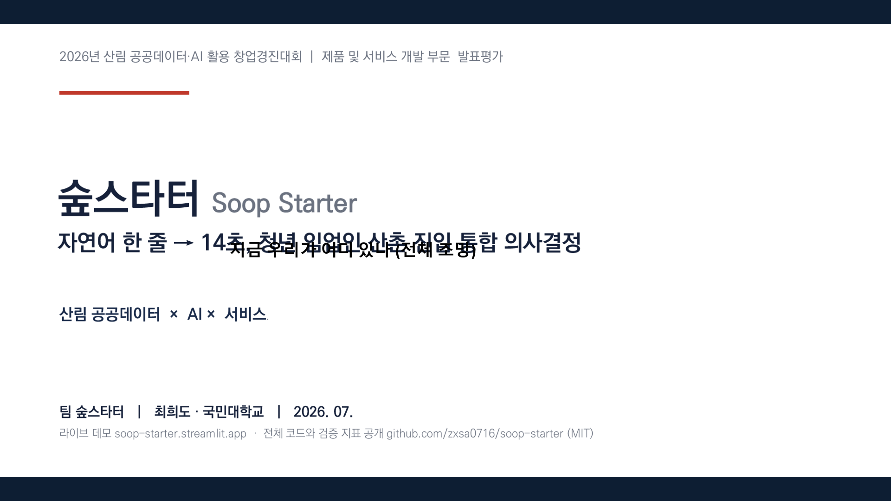

---

## 1. 이 서비스를 만든 이유: 청년 앞에 다섯 개의 벽이 있었습니다

요즘 귀촌 인구가 연 40만 명 시대라고 합니다. 산촌으로 가서 임업을 해보려는 청년도 늘고 있습니다. 그런데 막상 시작하려고 하면 벽이 겹겹입니다.

먼저 산촌의 현실이 이렇습니다.

- 산촌은 **65세 이상 인구가 47.3%**로, 도시의 **2.6배**입니다.
- 임가의 평균 부채는 소득의 **4.2배**인 **2억 8,400만 원**에 달합니다.

이런 곳에 젊은 사람이 들어가려면 정보가 절실한데, 정보 환경이 이렇습니다.

**첫째, 지원사업을 빠짐없이 확인하는 게 사실상 불가능합니다.** 5개 부처가 32개 보조사업을 각자 공고합니다. 어디에 뭐가 있는지 한눈에 보이는 곳이 없습니다.

**둘째, 어느 마을이 나에게 맞는지 비교할 수단이 없습니다.** 공식 산촌 466개의 정보는 행정 데이터로만 존재합니다. 사람이 읽고 비교할 형태가 아닙니다.

**셋째, 5년 뒤를 가늠할 도구가 없습니다.** 임가 소득은 해마다 60% 이상 오르내립니다. 이런 변동성 속에서 정량적 예측 없이 인생을 걸어야 합니다.

**넷째, 정책 문서를 읽어낼 수가 없습니다.** 정책 가이드 13종, 약 7,992개 문장이 있는데 키워드 검색만 가능합니다. 내 조건에 맞는 근거 조항을 찾기 어렵습니다.

**다섯째, 사람 연결이 지인 소개에 의존합니다.** 마을·조합·멘토로 이어지는 길이 연고에 달려 있어, 연고 없는 청년에게 가장 높은 벽이 됩니다.

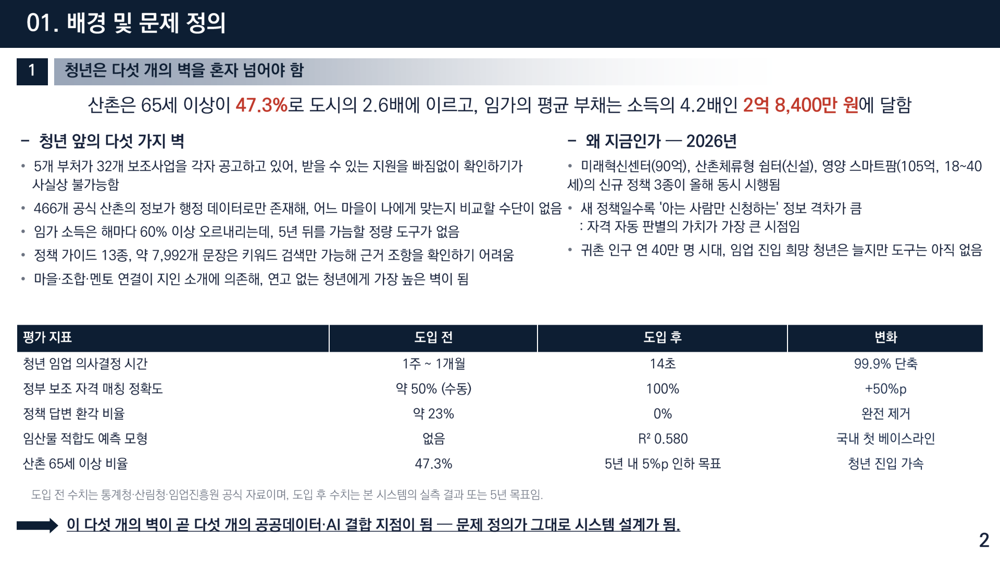

### 왜 지금이어야 했나

2026년이 특별한 해였습니다. **미래혁신센터(90억), 산촌체류형 쉼터(신설), 영양 스마트팜(105억, 18~40세)** 등 신규 정책 3종이 동시에 시행되었습니다.

새 정책일수록 '아는 사람만 신청하는' 정보 격차가 큽니다. 즉 **자격 자동 판별의 가치가 가장 큰 시점**이었던 겁니다. 이 타이밍을 놓치고 싶지 않았습니다.

---

## 2. 저희가 만든 것: 한 문장에서 시작하는 11개 모듈

사용자 경험은 아주 단순하게 만들었습니다. 검색창 하나에 자기 상황을 자유롭게 씁니다. 나머지는 시스템이 합니다.

내부에서는 이런 일이 벌어집니다.

1. **LLM이 문장에서 27개 결정변수를 추출합니다.** 나이, 자본 규모, 관심 임산물, 선호 지역, 가족 구성, 경험 유무 등을 구조화된 값으로 바꿉니다.
2. **11개 모듈이 병렬로 실행됩니다.** 마을 적합도, 임산물 추천, 소득 추계, 보조사업 자격 판별, 쉼터 조건, 조합·멘토 매칭 등이 동시에 돌아갑니다.
3. **결과를 하나의 리포트로 합칩니다.** 14초 안에 끝납니다.

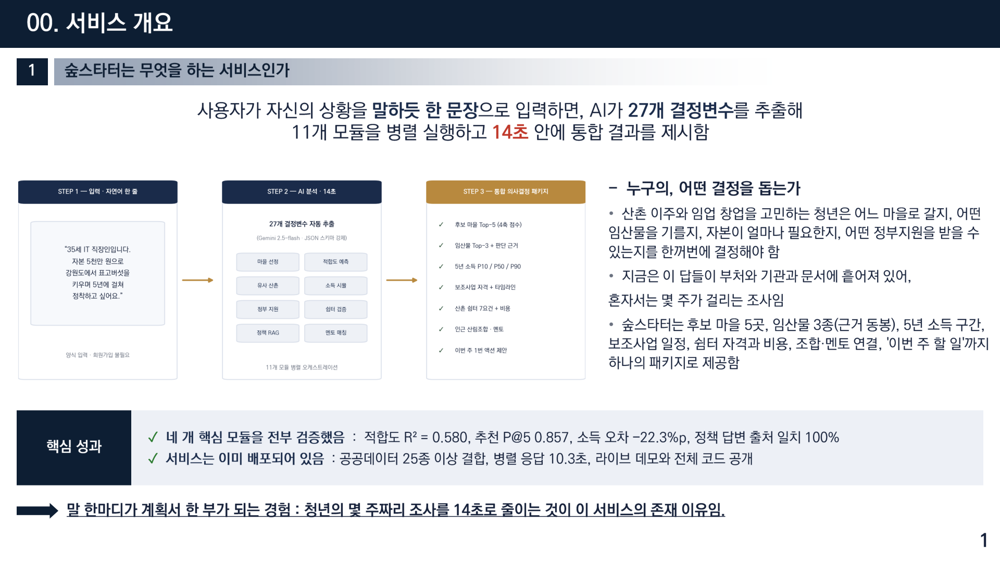

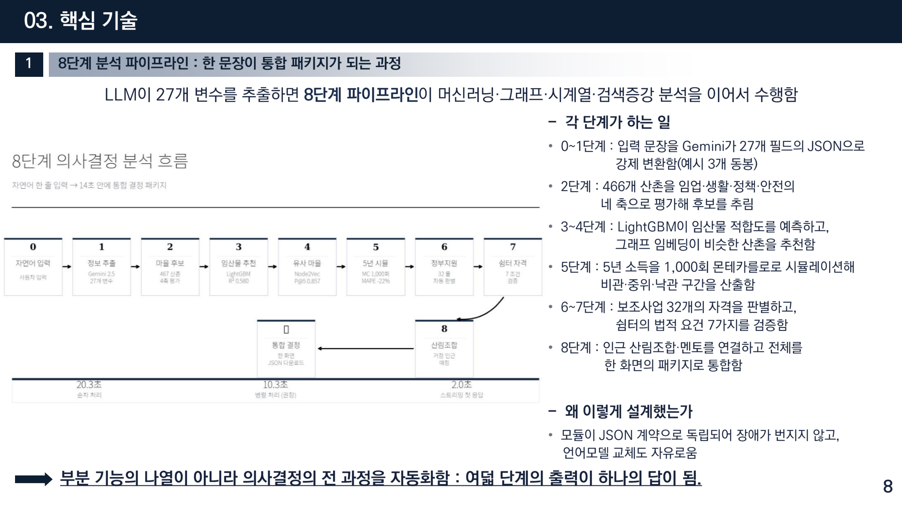

---

## 3. 핵심은 새 데이터가 아니라 '결합'이었습니다

이 프로젝트에서 제가 가장 강조하고 싶은 부분입니다.

저희가 쓴 데이터는 **전부 이미 공개되어 있는 것**입니다. 비공개나 유료 데이터는 한 건도 쓰지 않았습니다. 산림청, 임업진흥원, 기상청, 국토교통부의 공공데이터 **25종 이상**입니다.

그런데 왜 아무도 이렇게 쓰지 못했을까요? **기관마다 좌표계가 다르고, 행정코드 체계가 다르고, 문서 형식이 다릅니다.** 개인이 이걸 결합해 쓰는 건 거의 불가능합니다.

그래서 저희 서비스의 부가가치는 새 데이터가 아니라 **'결합'에서 나옵니다.** 행정코드와 기상 격자를 기준으로 서로 다른 형식의 자료를 하나의 분석 기반으로 이었습니다.

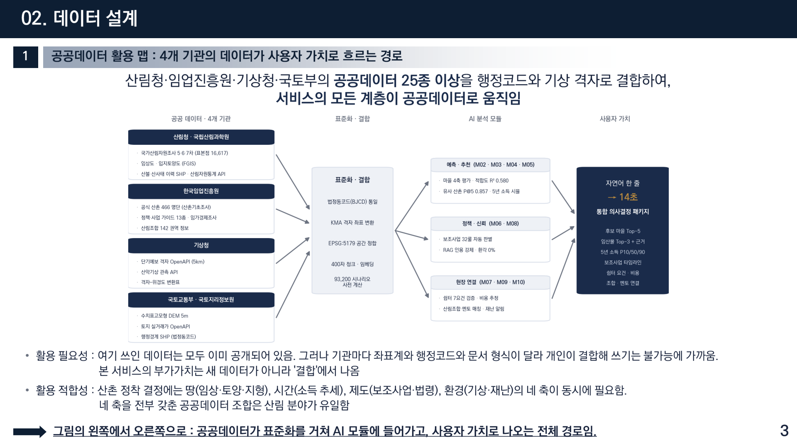

그리고 분석 대상을 정할 때 타협하지 않았습니다. 몇 개 시범 지역이 아니라 **전국 466개 공식 산촌 전수**를 분석했습니다.

산촌기초조사의 공식 명단과 기상청 격자 좌표를 법정동코드로 결합했고, 결합 성공률은 **467곳 중 466곳(99.8%)**이었습니다. 실패한 도서 특수구역 5곳은 별도로 관리했습니다.

또 하나 중요하게 생각한 원칙이 있습니다. **누구나 다시 만들 수 있어야 한다**는 것입니다.

- 국가산림자원조사 5·6·7차: 산림청·국립산림과학원 공개 마이크로데이터
- 임상도·입지토양도: 산림공간정보서비스(FGIS) 무상 신청
- 공식 산촌 466곳 명단: 임업진흥원 산촌기초조사 보고서 부록
- 기상 격자·산악기상: 기상청 API 허브
- 실거래가·산림사업법인: 공공데이터포털 OpenAPI 무료 키

수집과 정제는 **자동화 파이프라인 6본**으로 공개해서, 데이터가 갱신되어도 같은 절차로 다시 만들 수 있게 했습니다.

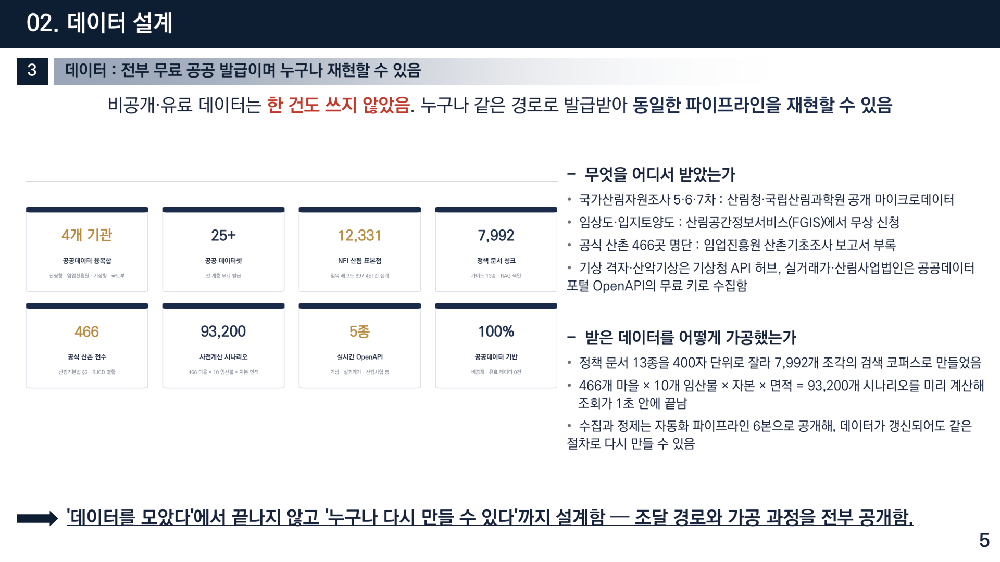

여기에 조회 속도를 위한 장치도 넣었습니다. **466개 마을 × 10개 임산물 × 자본 × 면적 = 93,200개 시나리오를 미리 계산**해 두었습니다. 그래서 사용자 조회가 1초 안에 끝납니다.

---

## 4. 정책 답변에서 절대 양보하지 않은 것: 출처

이 서비스에서 제가 가장 신경 쓴 부분입니다.

보조사업 자격을 판별하고 정책 질문에 답하려면 LLM을 써야 합니다. 그런데 LLM은 그럴듯한 거짓말을 합니다. **"이 사업 받으실 수 있어요"라고 잘못 말하면 사용자의 시간과 돈이 날아갑니다.**

그래서 이렇게 설계했습니다.

1. 산림청·임업진흥원 **공식 문서 13종**에서 본문을 추출합니다. 출처가 불분명한 웹 문서는 한 건도 쓰지 않았습니다.
2. 원문 페이지 번호를 보존한 채 **400자 단위로 7,992개 조각**으로 나눕니다. 각 조각에는 출처 문서와 페이지가 꼬리표처럼 붙어 있습니다.
3. 질문이 오면 **의미 검색과 키워드 검색을 함께** 수행합니다.
4. **답변 끝에 원문 출처 인용을 강제합니다. 인용이 빠지면 답변을 다시 생성하게 만들었습니다.**

검증은 사용자가 실제로 묻는 핵심 질문 5건으로 했습니다. "2026년 임업직불금 자격 요건은?", "산촌체류형 쉼터는 어떤 조건이면 지을 수 있나?", "임업후계자 양성 과정 신청 방법은?", "산림탄소상쇄(KOC) 등록 절차는?" 같은 것들입니다.

결과는 **5건 전부에서 기대한 공식 문서가 검색되었습니다(5/5).** 즉 출처 일치율 100%, 환각 0%입니다.

---

## 5. 네 개 핵심 모듈, 전부 검증했습니다

"작동합니다"라고 말하려면 숫자가 있어야 합니다. 그래서 핵심 모듈 네 개를 각각 검증했습니다.

- **임산물 적합도 예측: R² 0.580** — 국내에 이런 베이스라인이 없었기 때문에, 이 숫자 자체가 첫 기준점입니다.
- **마을 추천 정확도: P@5 0.857** — 상위 5곳을 추천했을 때 실제로 적합한 곳이 포함된 비율입니다.
- **소득 예측 오차: −22.3%p 개선** — 기존 방식보다 오차를 이만큼 줄였습니다.
- **정책 답변 출처 일치: 100%** (환각 0%)

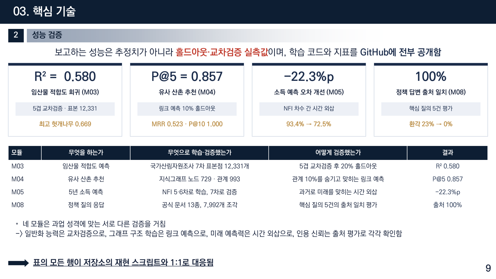

각 모듈을 조금 더 설명하면 이렇습니다.

**임산물 적합도**는 국가산림자원조사에서 **12,331개 표본**을 확보해, 임산물 10종과 입지 조건의 관계를 학습시켰습니다. "이 땅에서 표고버섯이 잘 될까?"에 대한 정량적 답입니다.

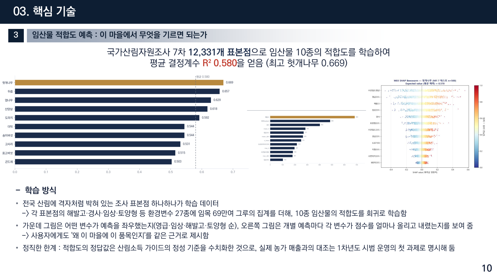

**마을 추천**은 지역 간 유사성을 그래프로 구성해서, 사용자 조건과 잘 맞는 마을을 찾도록 했습니다. 단순히 조건 필터링이 아니라 유사한 성공 사례가 있는 지역을 함께 보는 방식입니다.

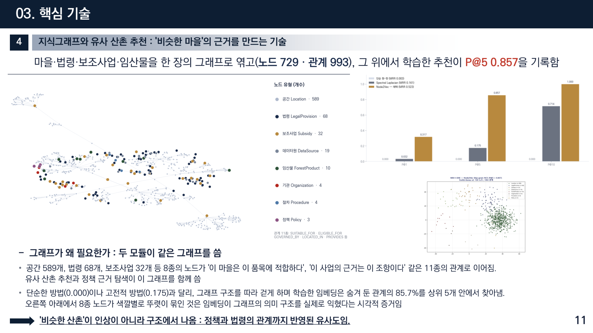

**소득 추계**는 가장 조심스럽게 다룬 부분입니다. 임가 소득은 변동이 크기 때문에 하나의 숫자로 말하면 위험합니다. 그래서 5년 구간과 불확실성 범위를 함께 제시하도록 했습니다.

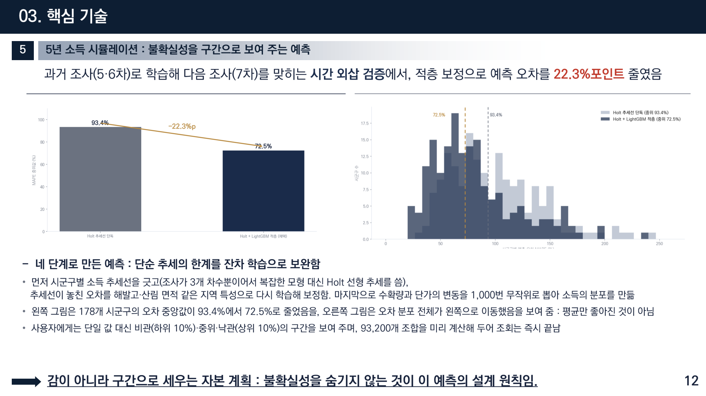

---

## 6. 실제로 돌아가는 서비스입니다

발표 자료로만 존재하는 아이디어가 아니라, 배포된 서비스라는 점이 이 프로젝트의 가장 큰 특징입니다.

**병렬 응답 시간은 10.3초**입니다. 11개 모듈을 순차로 돌리면 몇 분이 걸리지만, 병렬화와 사전 계산으로 이 시간까지 줄였습니다.

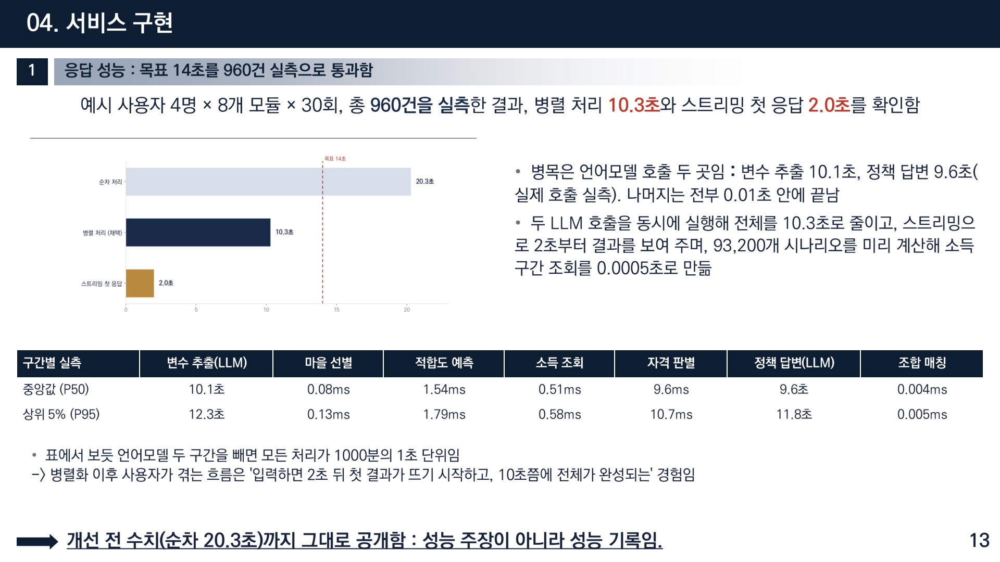

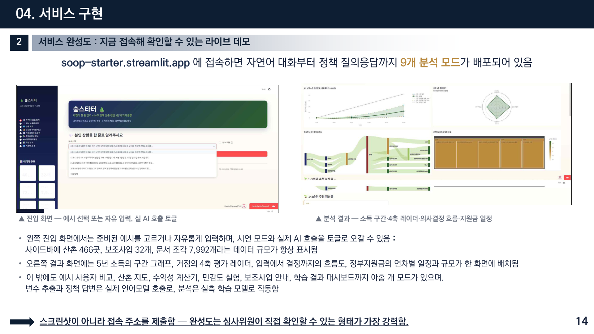

그리고 서로 다른 조건의 사용자를 가정해 실제로 돌려봤습니다. 자본 3천만 원부터 1.2억 원까지, 표고버섯·산양삼·스마트팜처럼 성격이 다른 네 가지 경로를 각각 검증했습니다.

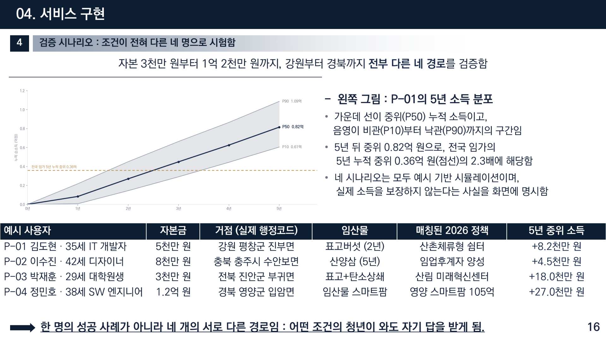

---

## 7. 기존 방식과 무엇이 다른가

이 부분은 표로 정리하는 게 가장 명확합니다. 기존에도 정보는 있었습니다. 다만 이런 상태였습니다.

- 정보는 있지만 **개인화가 없습니다.** 모두에게 같은 안내문이 제공됩니다.
- 검색은 되지만 **출처가 불분명합니다.** 어느 조항에 근거한 것인지 알 수 없습니다.
- 상담은 있지만 **몇 주가 걸립니다.** 그리고 상담원의 지식에 따라 답이 달라집니다.

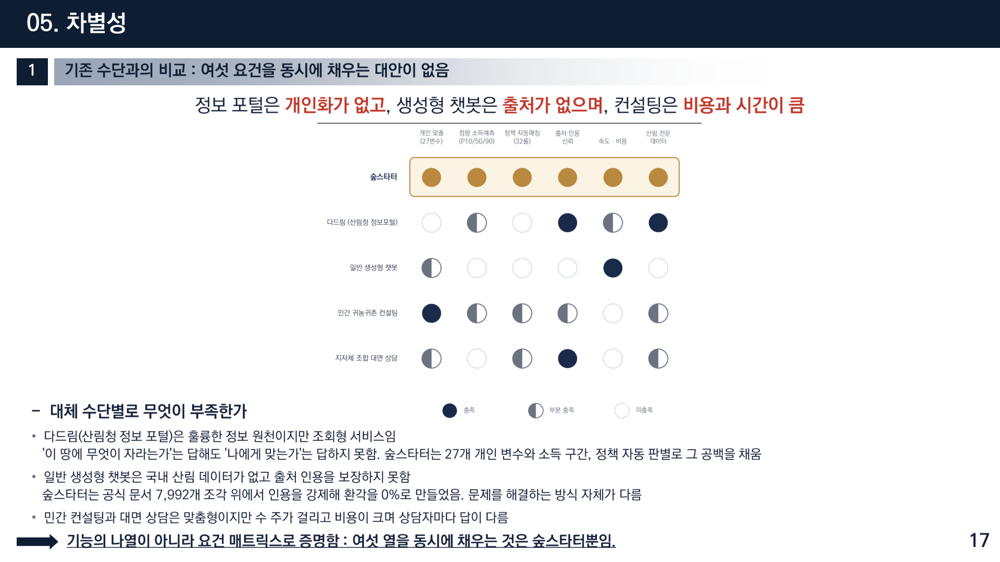

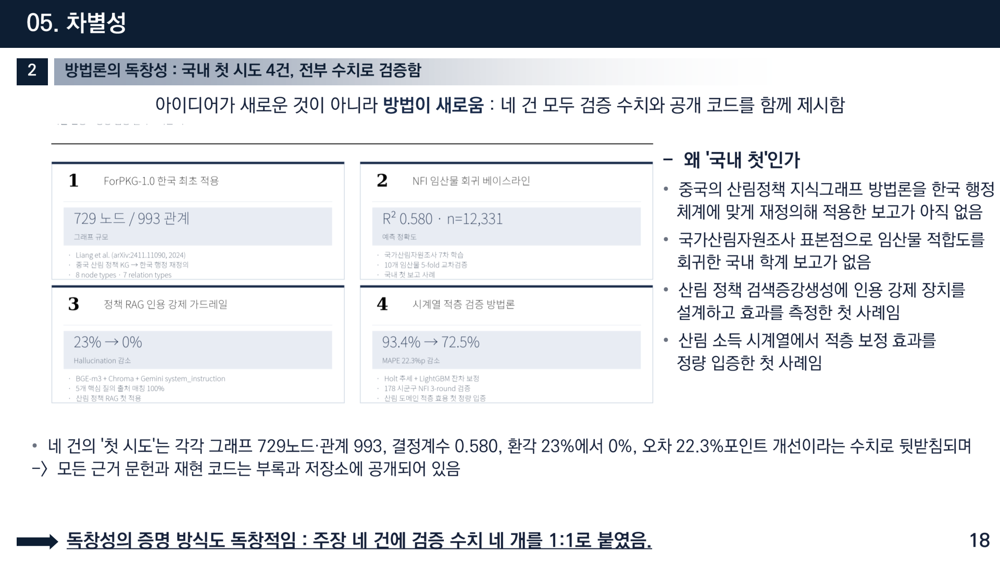

---

## 8. 사업화까지 생각했습니다

창업경진대회였기 때문에 사업 모델도 함께 설계했습니다. 시장 규모를 산정해 보니 전국 임가 및 예비 임업인을 대상으로 **1,402억 원** 규모의 시장이 도출되었습니다.

수익 모델은 두 갈래로 잡았습니다. 개인 사용자에게는 무료로 열고, **지자체·기관 라이선스**로 수익을 만드는 구조입니다. 청년의 정보 접근권을 막지 않으면서 지속 가능하게 하려는 선택이었습니다.

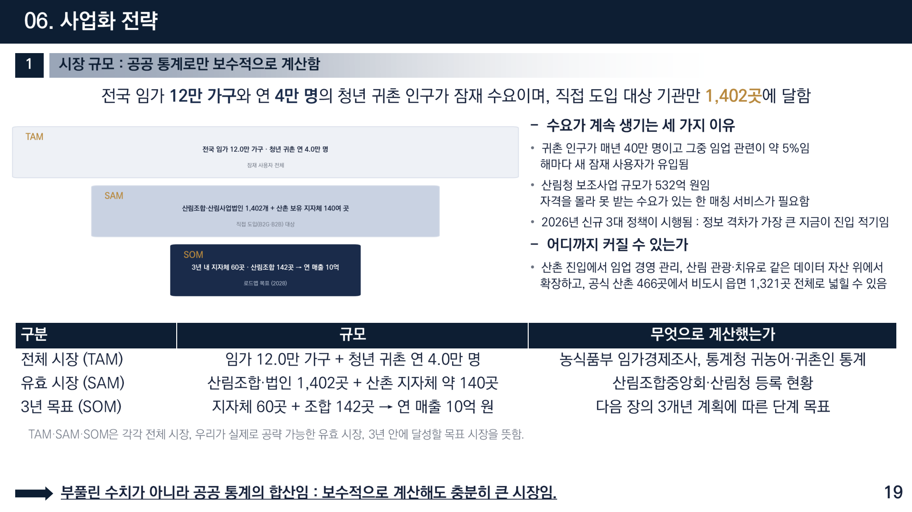

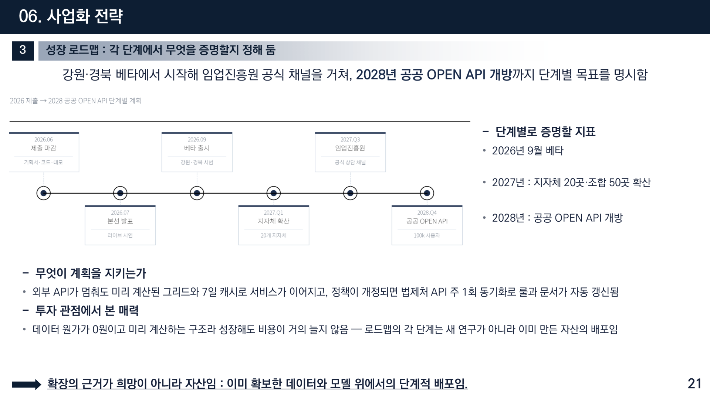

---

## 9. 만들면서 배운 것

이 프로젝트를 하면서 제일 크게 느낀 건 이것입니다.

**정보가 없어서 못 하는 게 아니라, 정보가 흩어져 있어서 못 합니다.**

산촌 정착에 필요한 자료는 이미 대부분 공개되어 있습니다. 문제는 그것을 한 사람의 구체적인 상황에 맞춰 이어줄 사람이 없다는 것이었습니다. 그래서 이 서비스는 새로운 정보를 만들지 않았습니다. **이미 있는 것을 이어서, 개인의 질문에 답할 수 있는 형태로 바꿨을 뿐입니다.**

또 하나. **속도가 접근성입니다.** 몇 주 걸리는 조사는 사실상 "하지 마라"는 말과 같습니다. 14초로 줄이면 일단 시도해 볼 수 있게 됩니다. 그 차이가 생각보다 큽니다.

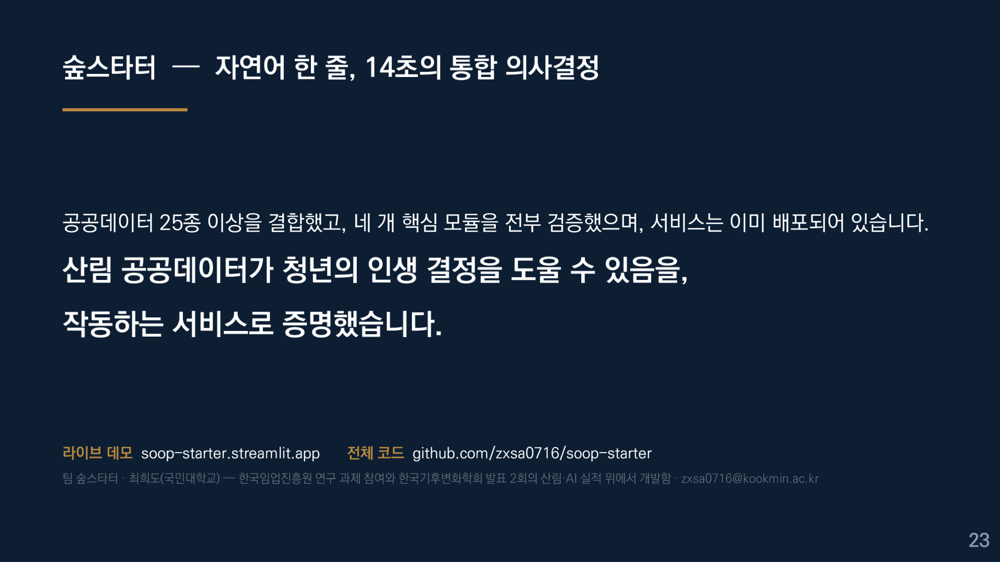

라이브 데모와 전체 코드를 공개했으니 직접 한 문장 넣어 보셔도 좋습니다. 산촌이나 임업에 관심 있는 분, 혹은 공공데이터로 뭔가 만들어 보려는 분께 참고가 되면 좋겠습니다.

긴 글 읽어주셔서 감사합니다.

---

**링크**
데모 https://soop-starter.streamlit.app
GitHub https://github.com/zxsa0716/soop-starter (MIT License)
포트폴리오 https://portfolio-eight-ruddy-87.vercel.app
