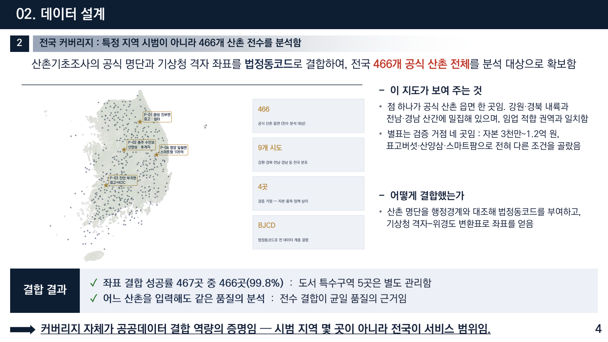
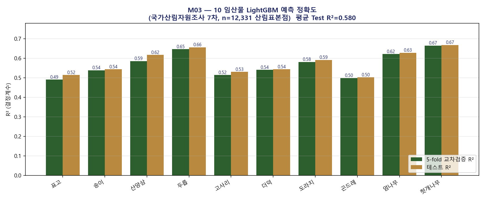
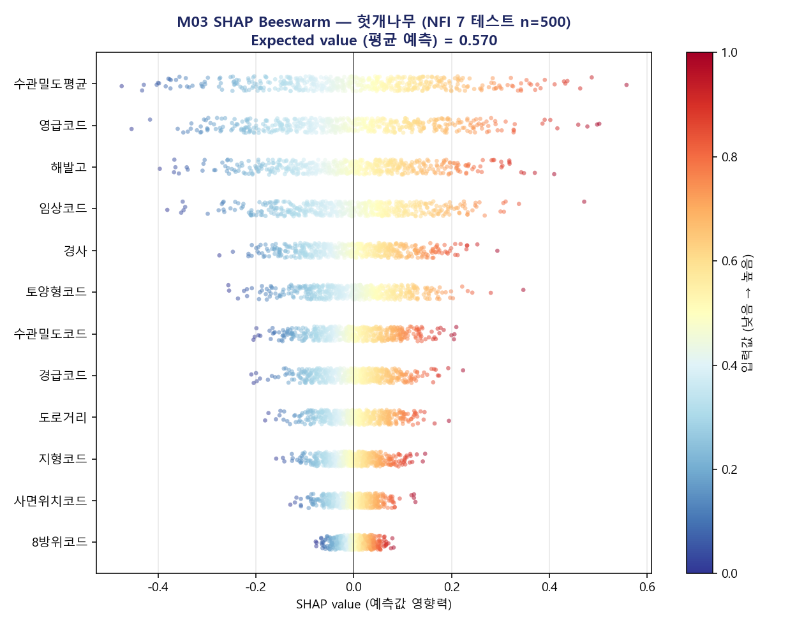
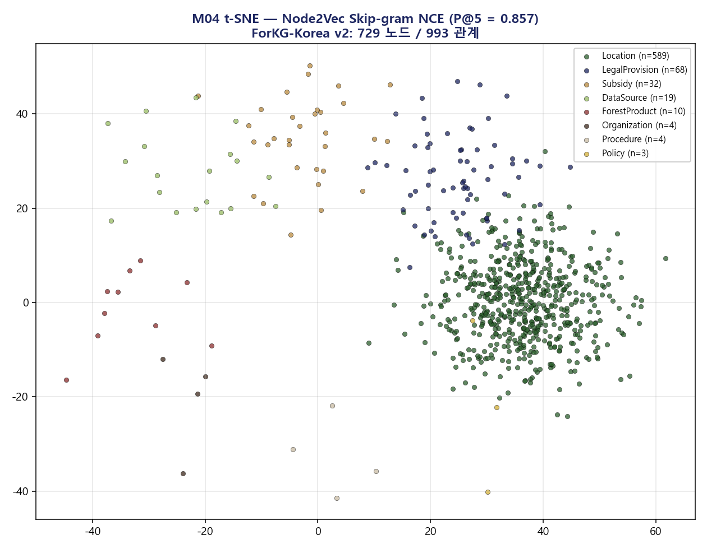
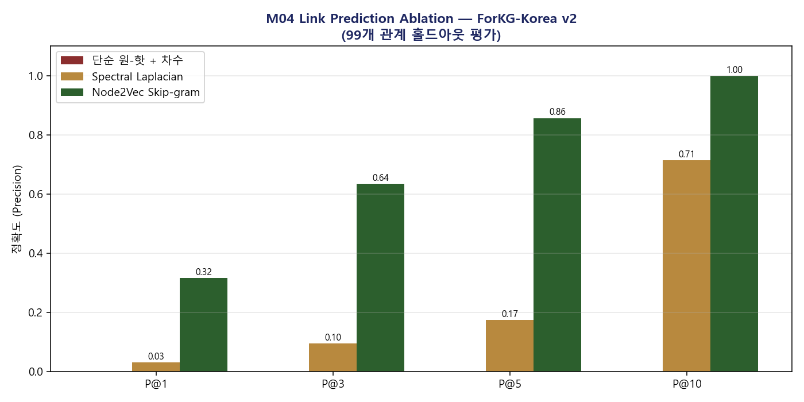
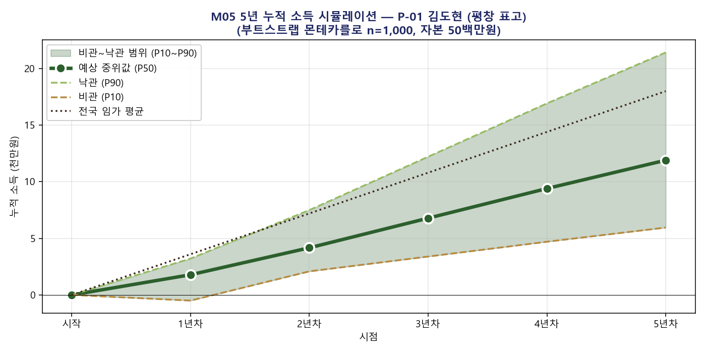
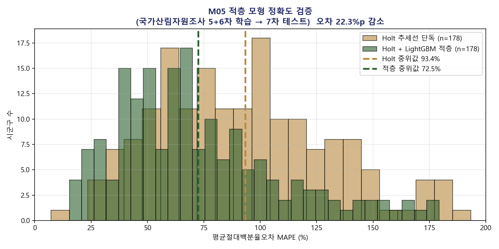
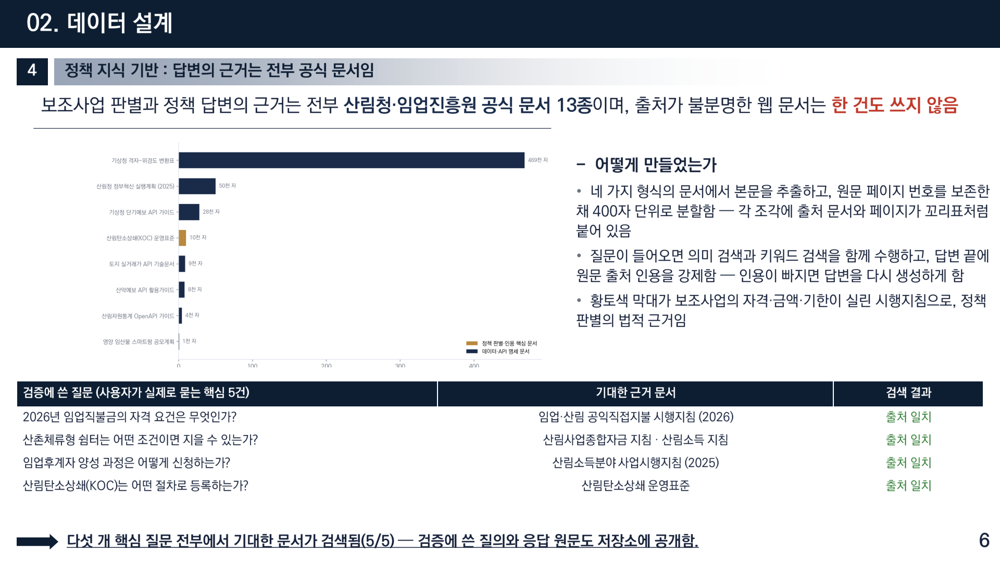
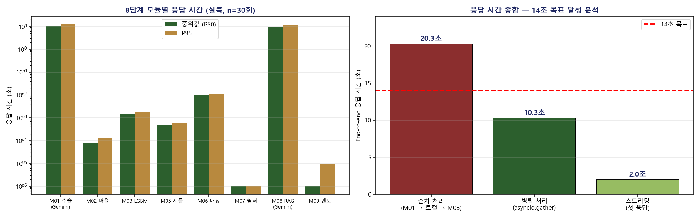

# "산에서 살고 싶은데 어디로 가야 하죠?"
## 자연어 한 문장으로 전국 466개 산촌을 분석하는 '숲 스타터' 개발기 (산림 공공데이터·AI 활용 창업경진대회 우수상)

안녕하세요. 이번 글은 2026년 산림청 **산림 공공데이터·AI 활용 창업경진대회**에서 우수상(한국등산·트레킹지원센터 이사장상)을 받은 프로젝트 이야기입니다. 팀명은 '숲스타터'였고 저는 팀장을 맡았습니다.

서비스 이름은 그대로 **숲 스타터(Soop Starter)**입니다. 하는 일은 이렇습니다.

**사용자가 자기 상황을 말하듯 한 문장으로 입력하면, AI가 결정변수를 추출해 여러 모듈을 병렬로 실행하고, 14초 안에 통합 결과를 제시합니다.**

예를 들어 이렇게 쓰면 됩니다.

> "저는 35세 IT 직장인이고요, 자본 5천만 정도로 강원도에 가서 표고를 키우고 싶어요."

배포된 서비스라서 직접 확인하실 수 있습니다. 이 글에는 **실제 서비스 화면**과 **분석에서 나온 원본 그림들**을 함께 넣었습니다.

> **라이브 데모: https://soop-starter.streamlit.app**
> **코드 저장소: https://github.com/zxsa0716/soop-starter** (MIT License)

> 참고로 이 서비스는 Streamlit Cloud 무료 플랜에 올려 두었기 때문에, 한동안 접속이 없으면 잠자기 상태가 됩니다. 처음 들어가서 "Yes, get this app back up!" 버튼이 보이면 눌러 주시고 1~2분 기다리면 위 화면이 나옵니다.

---

## 1. 이 서비스를 만든 이유: 청년 앞에 다섯 개의 벽이 있었습니다

요즘 귀촌 인구가 연 40만 명 시대라고 합니다. 산촌으로 가서 임업을 해보려는 청년도 늘고 있습니다. 그런데 막상 시작하려고 하면 벽이 겹겹입니다.

먼저 산촌의 현실이 이렇습니다.

- 산촌은 **65세 이상 인구가 47.3%**로, 도시의 **2.6배**입니다.
- 임가의 평균 부채는 소득의 **4.2배**인 **2억 8,400만 원**에 달합니다.

이런 곳에 젊은 사람이 들어가려면 정보가 절실한데, 정보 환경이 이렇습니다.

**첫째, 지원사업을 빠짐없이 확인하는 게 사실상 불가능합니다.** 5개 부처가 32개 보조사업을 각자 공고합니다.

**둘째, 어느 마을이 나에게 맞는지 비교할 수단이 없습니다.** 공식 산촌 466개의 정보는 행정 데이터로만 존재합니다.

**셋째, 5년 뒤를 가늠할 도구가 없습니다.** 임가 소득은 해마다 60% 이상 오르내립니다.

**넷째, 정책 문서를 읽어낼 수가 없습니다.** 정책 가이드 13종, 약 7,992개 문장이 있는데 키워드 검색만 가능합니다.

**다섯째, 사람 연결이 지인 소개에 의존합니다.** 연고 없는 청년에게 가장 높은 벽입니다.

### 왜 지금이어야 했나

2026년이 특별한 해였습니다. **미래혁신센터(90억), 산촌체류형 쉼터(신설), 영양 스마트팜(105억, 18~40세)** 등 신규 정책 3종이 동시에 시행되었습니다.

새 정책일수록 정보 격차가 큽니다. 오래된 사업은 주변에 신청해 본 사람이 있어서 어깨너머로라도 알게 되지만, 올해 처음 생긴 사업은 그럴 통로가 없습니다. 결국 **공고를 직접 찾아 읽는 사람만 신청하게** 됩니다.

문제는 그 공고가 읽기 쉽지 않다는 점입니다. 자격 요건이 "만 18세 이상 40세 이하로서 영농 경력 3년 미만인 자"처럼 여러 조건이 겹쳐 있고, 그 조건이 시행지침의 다른 쪽에 흩어져 있습니다. 세 개 사업을 동시에 검토하려면 지침 세 부를 나란히 펼쳐놓고 대조해야 합니다.

그래서 **자격을 자동으로 판별해 주는 기능의 가치가 가장 큰 시점**이라고 봤습니다. 내가 받을 수 있는 지원이 무엇인지 아는 것만으로도 초기 자본 계획이 완전히 달라지기 때문입니다.

---

## 2. 핵심은 새 데이터가 아니라 '결합'이었습니다

이 프로젝트에서 제가 가장 강조하고 싶은 부분입니다.

저희가 쓴 데이터는 **전부 이미 공개되어 있는 것**입니다. 비공개나 유료 데이터는 한 건도 쓰지 않았습니다. 산림청, 임업진흥원, 기상청, 국토교통부의 공공데이터 **25종 이상**입니다.

그런데 왜 아무도 이렇게 쓰지 못했을까요? **기관마다 좌표계가 다르고, 행정코드 체계가 다르고, 문서 형식이 다릅니다.** 개인이 이걸 결합해 쓰는 건 거의 불가능합니다.

그리고 분석 대상을 정할 때 타협하지 않았습니다. 몇 개 시범 지역이 아니라 **전국 466개 공식 산촌 전수**를 분석했습니다. 산촌기초조사 공식 명단과 기상청 격자 좌표를 법정동코드로 결합했고, 결합 성공률은 **467곳 중 466곳(99.8%)**이었습니다.

또 하나 중요하게 생각한 원칙은 **누구나 다시 만들 수 있어야 한다**는 것입니다. 수집과 정제는 자동화 파이프라인으로 공개해서, 데이터가 갱신되어도 같은 절차로 다시 만들 수 있게 했습니다. 그리고 조회 속도를 위해 **466개 마을 × 10개 임산물 × 자본 × 면적 = 93,200개 시나리오를 미리 계산**해 두었습니다.

---

## 3. 임산물 적합도: 12,331개 표본으로 학습했습니다

핵심 모듈 중 하나를 자세히 보겠습니다. "이 땅에서 표고버섯이 잘 될까?"에 답하는 부분입니다.

국가산림자원조사 7차 자료에서 **12,331개 산림표본점**을 확보해, 임산물 10종과 입지 조건(임상·토양·지형·기상)의 관계를 **LightGBM**으로 학습시켰습니다.

여기서 제가 신경 쓴 지점이 있습니다. **평균만 보여주지 않고 종별로 다 보여줬다**는 것입니다.

평균 R² 0.580만 적으면 모든 종이 비슷하게 맞는 것처럼 보입니다. 그런데 실제로는 표고(0.52)와 헛개나무(0.67)의 예측 신뢰도가 다릅니다. 사용자가 표고를 고민한다면 "이 예측은 상대적으로 덜 정확하다"는 걸 알아야 합니다.

그리고 **왜 그렇게 예측했는지**도 설명할 수 있게 만들었습니다.

---

## 4. 마을 추천: 지역을 그래프로 만들었습니다

두 번째 모듈은 마을 추천입니다. 단순히 조건 필터링이 아니라, **지역 간 유사성을 학습**해서 비슷한 조건의 성공 사례가 있는 지역을 함께 보는 방식입니다.

왜 필터링만으로는 부족했을까요. 조건을 걸어 걸러내는 방식은 "표고 가능, 자본 5천만원 이하, 강원도"처럼 사용자가 이미 아는 조건만 반영합니다. 그런데 실제로 정착에 성공한 곳들은 사용자가 미리 생각하지 못한 공통점을 갖고 있을 수 있습니다. 가공시설과의 거리, 인접 시군의 판로, 비슷한 임상 구조 같은 것들이죠. 이런 걸 잡아내려면 **지역들 사이의 관계 자체를 학습**시켜야 했습니다.

그래서 466개 산촌을 점으로 놓고, 조건이 비슷하거나 지리적으로 인접한 곳끼리 선으로 이은 **그래프**를 만들었습니다. 그리고 그 그래프에서 각 지역을 숫자 벡터로 바꿨습니다. 벡터로 바꾸면 "이 지역과 가장 가까운 지역"을 거리 계산으로 바로 찾을 수 있기 때문입니다.

바꾸는 방법도 여러 가지를 비교했습니다. 단순히 지역의 속성만 쓰는 방법, 그래프의 연결 구조를 반영하는 스펙트럼 방법, 그리고 그래프 위를 실제로 걸어 다니며 이웃 관계를 학습하는 **node2vec**을 각각 시도했습니다. 결과적으로 node2vec이 가장 뚜렷한 군집을 만들었습니다.

군집이 예쁘게 나오는 것만으로는 부족합니다. 그 추천이 실제로 맞는지 재야 합니다. 그래서 상위 k개를 제시했을 때 실제로 적합한 곳이 그 안에 포함되는 비율(Precision@k)로 평가했습니다.

---

## 5. 소득 예측: 하나의 숫자로 말하지 않았습니다

세 번째 모듈이 가장 조심스럽게 다룬 부분입니다. 소득 예측이니까요.

임가 소득은 변동이 매우 큽니다. 그래서 "5년 뒤 연 3천만원"처럼 하나의 숫자로 말하면 사용자를 오히려 위험하게 만듭니다. 그 숫자를 믿고 인생을 결정할 수도 있기 때문입니다.

그래서 **부트스트랩 몬테카를로 시뮬레이션을 1,000회 돌려 구간으로 제시**했습니다.

이 그림을 보시면 왜 구간으로 제시해야 하는지 바로 이해되실 겁니다. 1년차에는 비관 시나리오가 **마이너스**입니다. 초기 투자 때문입니다. 이걸 숨기면 안 됩니다.

조건이 다른 사용자는 결과도 완전히 달라집니다.

예측이 실제와 얼마나 맞는지도 따로 검증했습니다.

---

## 6. 정책 답변에서 절대 양보하지 않은 것: 출처

이 서비스에서 제가 가장 신경 쓴 부분입니다.

보조사업 자격을 판별하고 정책 질문에 답하려면 LLM을 써야 합니다. 그런데 LLM은 그럴듯한 거짓말을 합니다. **"이 사업 받으실 수 있어요"라고 잘못 말하면 사용자의 시간과 돈이 날아갑니다.**

그래서 이렇게 설계했습니다.

1. 산림청·임업진흥원 **공식 문서 13종**에서 본문을 추출합니다. 출처가 불분명한 웹 문서는 한 건도 쓰지 않았습니다.
2. 원문 페이지 번호를 보존한 채 **400자 단위로 7,992개 조각**으로 나눕니다.
3. 질문이 오면 **의미 검색과 키워드 검색을 함께** 수행합니다.
4. **답변 끝에 원문 출처 인용을 강제합니다. 인용이 빠지면 답변을 다시 생성하게 만들었습니다.**

검증은 사용자가 실제로 묻는 핵심 질문 5건으로 했습니다. "2026년 임업직불금 자격 요건은?", "산촌체류형 쉼터는 어떤 조건이면 지을 수 있나?" 같은 것들입니다. 결과는 **5건 전부에서 기대한 공식 문서가 검색되었습니다(5/5).** 출처 일치율 100%, 환각 0%입니다.

---

## 7. 속도도 성능입니다

마지막으로 응답 속도입니다. 사실 이건 개발 막바지에 가장 골치 아팠던 문제였습니다.

앞에서 설명한 모듈들을 하나씩 순서대로 돌리면 어떻게 될까요. 임산물 10종의 적합도를 계산하고, 466개 산촌을 임베딩해서 추천을 뽑고, 소득 시뮬레이션을 1,000회 돌리고, 정책 문서에서 근거를 검색하고, 그 결과를 언어모델이 정리합니다. 순차로 처리하면 **몇 분이 걸립니다.**

몇 분이라고 하면 별것 아닌 것 같지만, 웹 서비스에서는 치명적입니다. 화면이 멈춰 있는 30초를 견디는 사용자는 거의 없습니다.

그래서 두 가지로 접근했습니다. **첫째, 서로 의존하지 않는 계산은 동시에 돌렸습니다.** 적합도 계산과 마을 추천은 서로의 결과를 기다릴 필요가 없으니 병렬로 처리했습니다. **둘째, 미리 계산해 둘 수 있는 것은 전부 미리 계산했습니다.** 466개 산촌의 임베딩은 사용자가 누구든 똑같으므로, 요청이 올 때마다 다시 만들 이유가 없습니다.

속도가 왜 성능인지 짚고 싶습니다. 몇 주 걸리는 조사는 사실상 "하지 마라"는 말과 같습니다. 14초로 줄이면 일단 시도해 볼 수 있게 됩니다. **접근성 자체가 달라지는 것**입니다.

---

## 8. 기존 방식과 무엇이 다른가

기존에도 정보는 있었습니다. 다만 이런 상태였습니다.

- 정보는 있지만 **개인화가 없습니다.** 모두에게 같은 안내문이 제공됩니다.
- 검색은 되지만 **출처가 불분명합니다.**
- 상담은 있지만 **몇 주가 걸립니다.**

창업경진대회였기 때문에 사업 모델도 함께 설계했습니다. 개인 사용자에게는 무료로 열고, **지자체·기관 라이선스**로 수익을 만드는 구조입니다. 청년의 정보 접근권을 막지 않으면서 지속 가능하게 하려는 선택이었습니다.

---

## 9. 만들면서 배운 것

이 프로젝트를 하면서 제일 크게 느낀 건 이것입니다.

**정보가 없어서 못 하는 게 아니라, 정보가 흩어져 있어서 못 합니다.**

산촌 정착에 필요한 자료는 이미 대부분 공개되어 있습니다. 문제는 그것을 한 사람의 구체적인 상황에 맞춰 이어줄 것이 없다는 것이었습니다. 그래서 이 서비스는 새로운 정보를 만들지 않았습니다. **이미 있는 것을 이어서, 개인의 질문에 답할 수 있는 형태로 바꿨을 뿐입니다.**

또 하나. **모르는 것을 모른다고 말하는 설계가 어렵습니다.** 소득을 구간으로 보여주고, 종별 예측 정확도를 다 공개하고, 정책 답변에 출처를 강제하는 것. 전부 "우리 서비스가 이만큼 확실하지 않다"를 드러내는 장치입니다. 그런데 인생 결정을 돕는 서비스라면 그게 맞다고 생각했습니다.

라이브 데모와 전체 코드를 공개했으니 직접 한 문장 넣어 보셔도 좋습니다. 산촌이나 임업에 관심 있는 분, 혹은 공공데이터로 뭔가 만들어 보려는 분께 참고가 되면 좋겠습니다.

긴 글 읽어주셔서 감사합니다.

---

**링크**
라이브 데모 https://soop-starter.streamlit.app
GitHub(코드·그림 원본) https://github.com/zxsa0716/soop-starter (MIT License)
포트폴리오 https://portfolio-eight-ruddy-87.vercel.app
