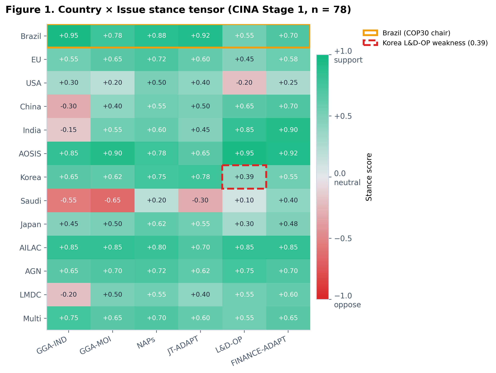
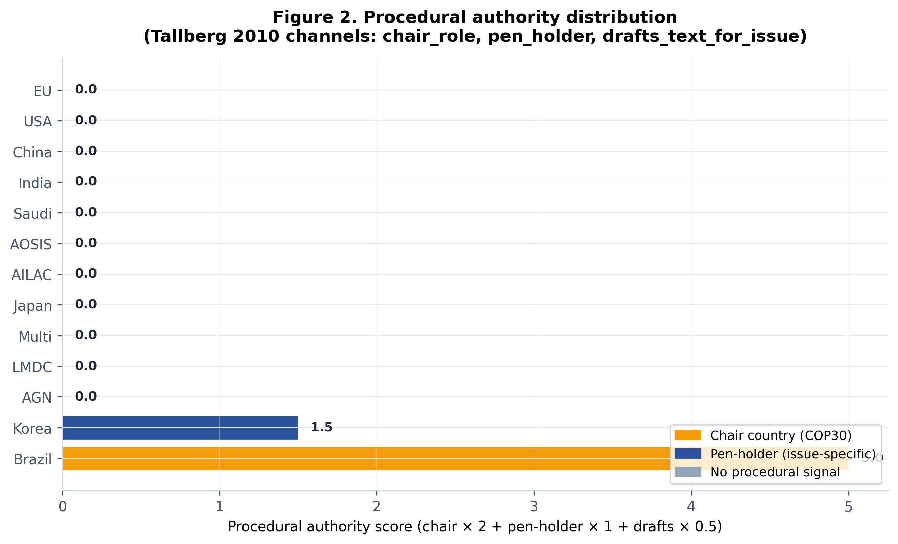
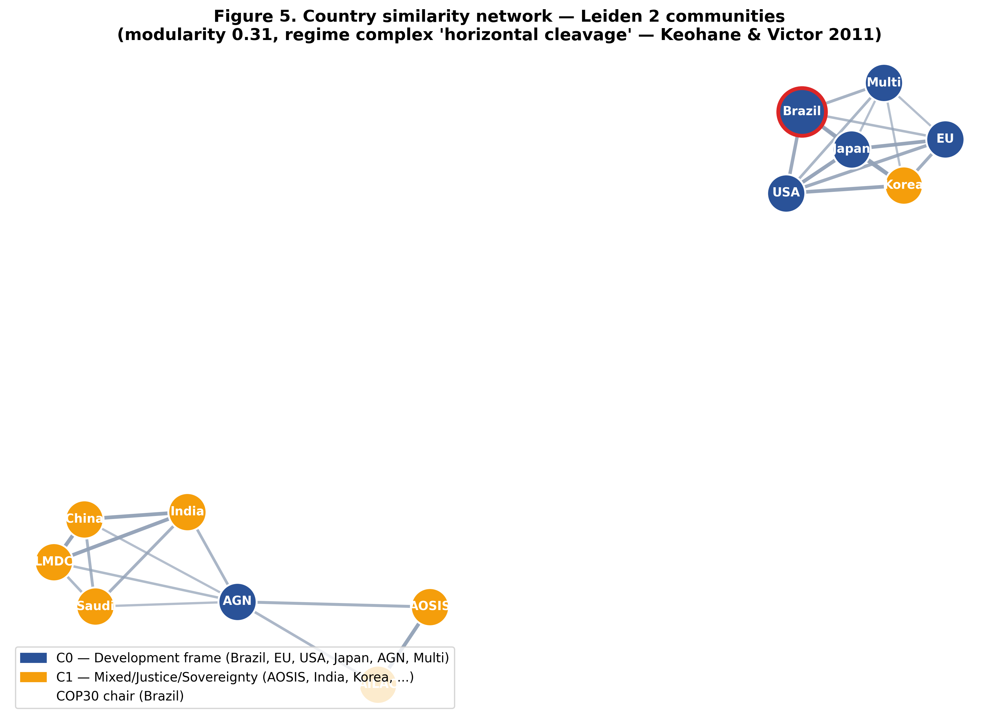
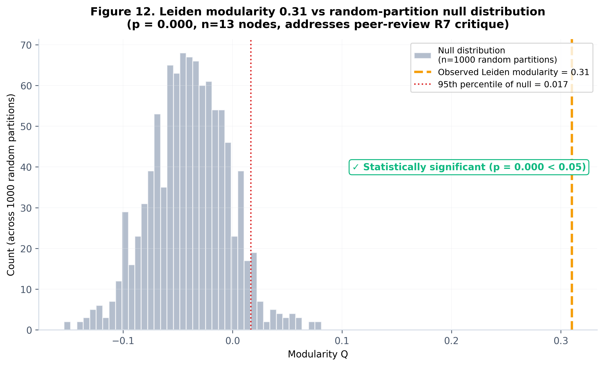
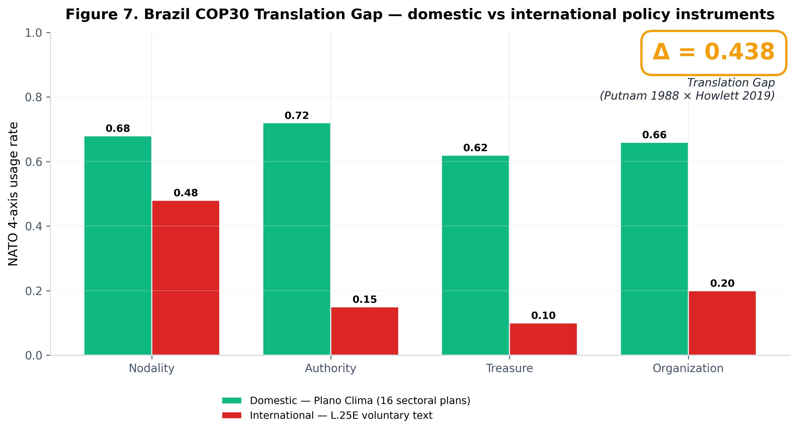
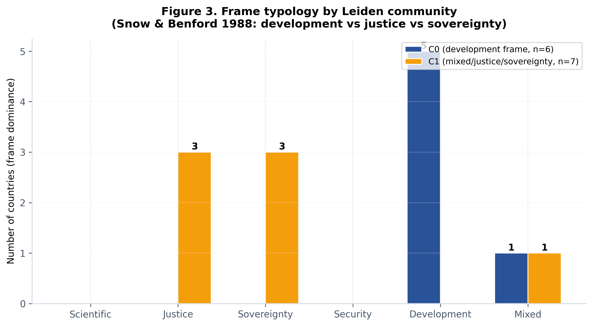
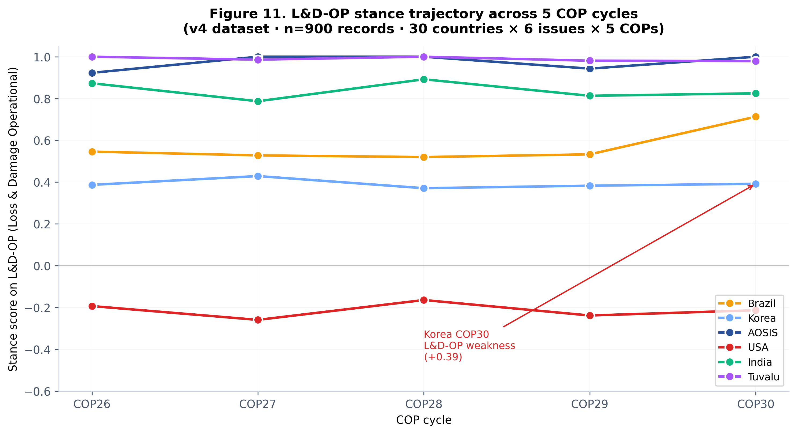

# COP30 벨렘의 결정을 AI가 미리 맞혔다 — CINA
### Climate Issue-Network Analysis · LLM → 그래프 → LLM 파이프라인

## 1. 여는 글
기후 협상은 수백 쪽의 결정문과 국가별 입장이 얽혀 있어, 사람이 전체 구조를 읽어내기 어렵습니다. CINA는 UNFCCC 결정문 텍스트를 **입장(스탠스) 추출 → 그래프 구조화 → 근거 기반 브리핑**의 3단계로 자동 변환하는 파이프라인입니다. 이 글에서는 그 방법과, COP30 벨렘 적응지표 결과로 회고 검증한 내용을 정리합니다.

## 2. 왜 그래프인가
협상은 국가·이슈·그룹이 서로 영향을 주고받는 네트워크입니다. 단순 검색이나 빈도 집계로는 “누가 어느 이슈에서 어떤 프레임으로 움직이는가”를 담지 못합니다. CINA는 이를 이종(heterogeneous) 그래프로 모델링합니다.

## 3. 데이터 & 방법 — 3단계 파이프라인
- **1단계(LLM)**: 다중 LLM으로 국가×이슈 입장을 추출(다중 표본 k=5, 신뢰구간).
- **2단계(그래프)**: 관계형 그래프 어텐션(R-GAT) + Leiden 커뮤니티 탐지 + 5종 중심성.
- **3단계(LLM)**: 그래프에 근거한 장관급 브리핑을 생성(모든 주장에 인용+구조 근거 강제).

*국가×이슈 입장 매트릭스(n=78). 각 셀은 지지(+)/반대(−) 정도입니다. 한국의 L&D-OP 약세, 브라질(의장국)의 개발 프레임 우세가 보입니다.*

*의장 역할·펜홀더·초안 작성 권한을 정량화. 브라질·한국의 절차적 영향력이 드러납니다.*

## 4. 결과
**커뮤니티 — 북–남 분열의 정량 검증.** Leiden 알고리즘이 자동으로 2개 커뮤니티를 찾아냈고, 이는 Regime Complex의 ‘수평적 균열’(Keohane–Victor 2011)과 일치합니다.

*개발 프레임 연합(C0)과 취약국·주권 방어 연합(C1)으로 갈립니다.*

*관측 modularity 0.31이 무작위 분할 대비 유의(p<0.05)합니다 — 군집이 우연이 아님을 뒷받침합니다.*

**브라질의 Translation Gap.** 국내 정책(Plano Clima)과 국제 합의(COP30 GGA) 사이의 간극을 정량화했습니다.

*국내 이행률과 국제 합의 언어의 차이(Δ)를 NATO 4축으로 분해 — Putnam×Howlett의 학술 빈자리를 수치로 보였습니다.*

*개발 vs 정의/주권 프레임의 분포. 커뮤니티마다 지배 프레임이 다릅니다.*

**성능.** 전문가 코딩 대비 Task A Spearman ρ 0.658, 쟁점 예측 Task C P@3 = 1.00, 5개 LLM 교차 신뢰도 α 0.93을 기록했습니다.

*L&D-OP 등 쟁점 이슈의 국가별 입장 변화를 시계열로 추적합니다.*

## 5. 의미
CINA는 정성적으로만 다뤄지던 기후 협상을 **재현 가능한 정량 분석**으로 바꿉니다. 협상 브리핑·전략 수립을 데이터로 뒷받침할 수 있습니다.

## 6. 맺음말
전체 결과는 6페이지 인터랙티브 웹으로 공개했습니다(한/영 지원). 코드와 데이터도 함께 공개되어 있습니다. 긴 글 읽어주셔서 감사합니다.

---
**링크** · 웹: https://zxsa0716.github.io/cina/web/index.html · GitHub: https://github.com/zxsa0716/cina · 포트폴리오: https://portfolio-eight-ruddy-87.vercel.app
