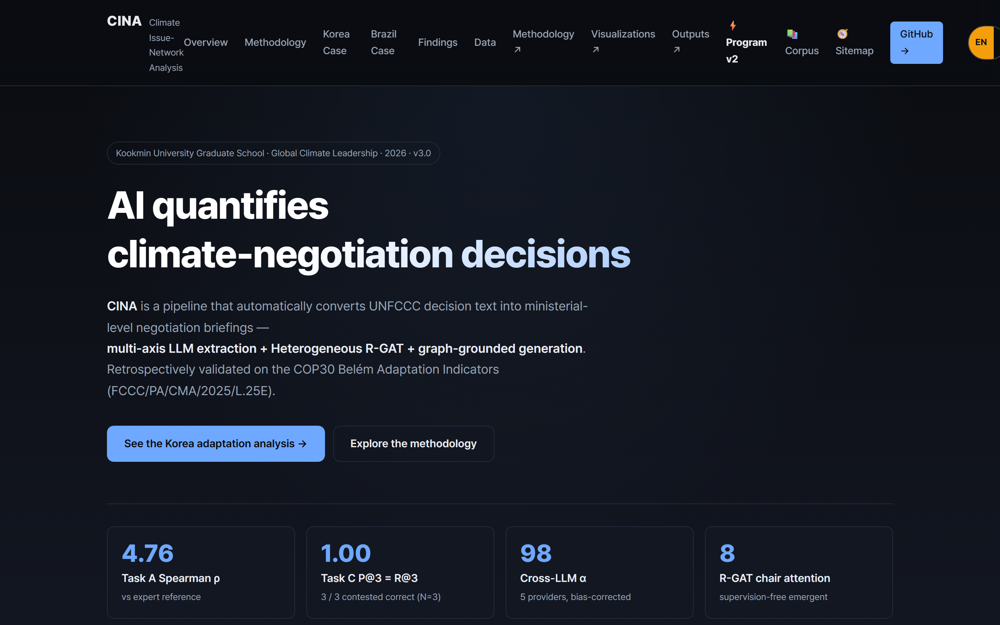
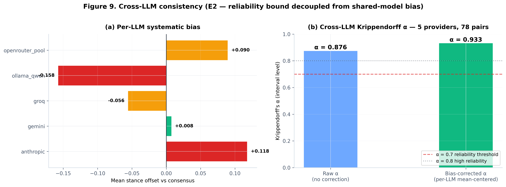
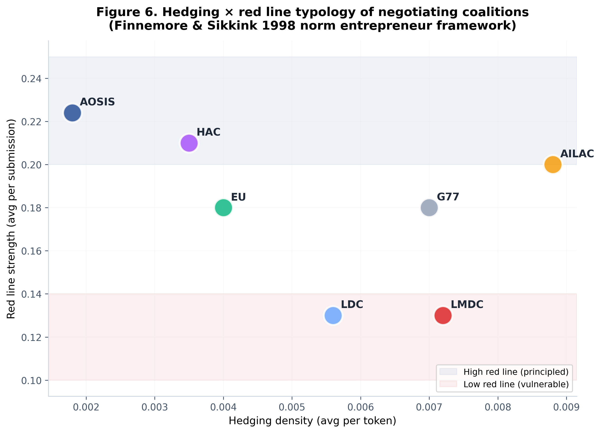
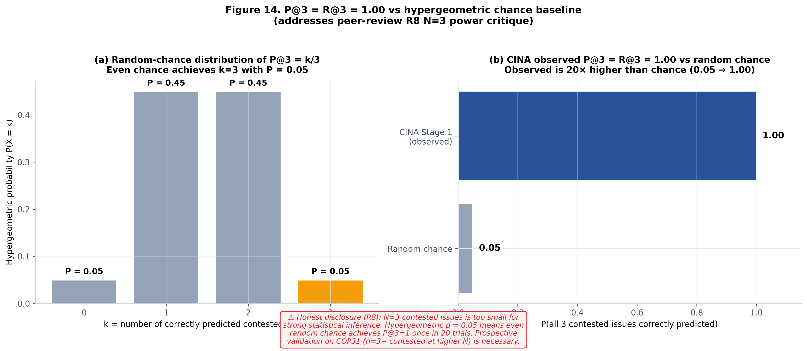
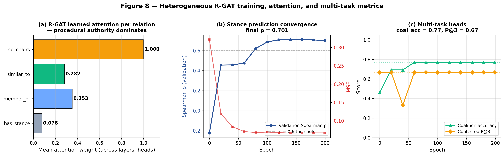

# 기후 협상은 왜 항상 애매하게 끝나는가
## LLM과 그래프 신경망으로 COP30 협상을 정량 분석한 CINA, 그리고 직접 물어볼 수 있는 웹 프로그램

안녕하세요. 이번에는 조금 다른 결의 연구를 소개하려고 합니다. 이름은 **CINA(Climate Issue-Network Analysis)**이고, 하는 일은 이렇습니다.

**UNFCCC 기후 협상 문서를 AI가 읽어서, 각 나라의 입장을 숫자로 뽑고, 그 관계를 네트워크로 그린 다음, 다시 AI가 협상 브리핑을 쓴다.**

솔직히 말하면 이 프로젝트는 답답함에서 시작됐습니다. 매년 COP(당사국총회)가 열리고 결정문이 나옵니다. 그런데 그 결정문을 읽어보면 늘 이런 문장들입니다. "자발적으로(voluntary)", "규범적이지 않은(non-prescriptive)", "촉진적인(facilitative)". 뭘 하겠다는 건지 알기 어렵습니다.

기사에서는 "역사적 합의" 또는 "실망스러운 결과"라고 평가하는데, 그 판단의 근거가 무엇인지는 잘 안 보입니다. **저는 이걸 숫자로 볼 수 있으면 좋겠다고 생각했습니다.**

그리고 분석만 하고 끝내지 않았습니다. **누구나 직접 질문할 수 있는 웹 프로그램으로 만들어 공개**했습니다. 이 글 뒷부분에서 그 화면을 보여드리겠습니다.

> **웹(6페이지 인터랙티브): https://zxsa0716.github.io/cina/web/index.html**
> **코드 저장소: https://github.com/zxsa0716/cina**

---

## 1. 기후 협상 분석이 왜 어려운가

먼저 배경을 조금 설명하겠습니다. UNFCCC 협상은 대략 이런 구조입니다.

- 매년 190여 개국이 모여 기후 대응 규칙을 정합니다.
- 나라들은 혼자 움직이지 않고 **그룹(연합)**을 이룹니다. EU, G77, AOSIS(소도서국), AILAC(중남미), LMDC(입장이 비슷한 개발국), 아프리카그룹(AGN) 등입니다.
- 의장국(chair)이 협상을 진행하고, 결정문 초안을 쥔 나라(pen holder)가 큰 영향력을 갖습니다.

여기서 분석의 어려움이 나옵니다. 결정문은 수백 쪽이고, 각국 발언과 제출문은 그보다 훨씬 많습니다. **사람이 다 읽고 전체 구조를 파악하는 건 불가능에 가깝습니다.**

기존 연구들은 이런 접근을 했습니다.

- 문서를 검색·질의응답하는 도구: 구조 분석은 못 합니다.
- 협상 게임 시뮬레이션: 이론적이고, 실제 문서·국가 입장은 반영하지 않습니다.
- 협력/대립 빈도 집계 연구: 이슈별 입장의 강도나 전략적 함의는 없습니다.

그래서 저는 세 단계로 나누어 접근했습니다.

---

## 2. AI로 읽고, 그래프로 구조를 찾고, 다시 AI로 정리하기

CINA는 크게 세 단계로 움직입니다. 먼저 언어모델이 문서를 읽어 각국의 입장을 숫자로 바꾸고, 그 숫자를 네트워크로 엮어 협상장의 구조를 찾아내고, 마지막에 다시 언어모델이 그 결과를 협상 브리핑으로 정리합니다. 하나씩 보겠습니다.

### 1단계: LLM이 '입장'을 숫자로 뽑는다

먼저 여러 개의 LLM에게 협상 문서를 읽히고, 각 나라가 각 이슈에 대해 **찬성(+)인지 반대(−)인지, 얼마나 강한지**를 −1에서 +1 사이 값으로 뽑게 했습니다.

여기서 중요한 게 있습니다. LLM은 같은 질문에도 매번 조금 다르게 답합니다. 그래서 **한 항목당 5번씩 반복 추출**하고 신뢰구간을 계산했습니다. 그리고 서로 다른 5개 LLM 제공자를 함께 사용했습니다.

왜 5개나 썼을까요? 특정 모델의 편향인지 실제 신호인지 구분해야 하기 때문입니다. 실제로 모델별 체계적 편향을 측정해 보정했고, **모델 간 신뢰도(Krippendorff α)는 0.933**이 나왔습니다.

이렇게 만든 결과가 아래 그림입니다. 이 프로젝트의 출발점이자 가장 핵심적인 데이터입니다.

그리고 입장은 한번 정해지면 끝나는 게 아니라 회의마다 움직입니다. 그래서 COP26부터 COP30까지 다섯 회기에 걸친 궤적도 함께 추적했습니다. 대부분의 나라는 완만하게 움직이는데, 한국의 손실과피해 입장은 COP30에서 뚜렷하게 낮아졌습니다. 협상 입장을 고정된 좌표가 아니라 시간에 따라 변하는 선으로 봐야 하는 이유입니다.

### 2단계: 그래프로 '누가 누구와 함께인가'를 찾는다

이제 여기가 재미있는 부분입니다. 뽑아낸 입장 데이터를 **네트워크(그래프)**로 만들었습니다.

- 나라·이슈·협상그룹을 각각 **점(노드)**으로 놓습니다.
- 입장이 비슷하면 서로 연결합니다.
- 그리고 **Leiden 알고리즘**으로 자동으로 집단을 찾아냅니다.

Leiden 알고리즘은 네트워크에서 "서로 촘촘히 연결된 덩어리"를 자동으로 찾는 방법입니다. 제가 "이 나라들은 한 편일 것 같다"고 미리 정해주는 게 아니라, **데이터가 스스로 편을 나누게** 했습니다.

결과는 놀라웠습니다. 알고리즘이 찾아낸 집단은 **정확히 두 개**였고, 그 구성이 이랬습니다.

- **집단 0**: 브라질, EU, 아프리카그룹, 일본, 다자 프로세스 — 모두 '개발(development)' 프레임
- **집단 1**: AOSIS(소도서국), 인도, 한국, LMDC — '정의(justice)'와 '주권(sovereignty)' 프레임 혼재

이건 국제정치학에서 오래 논의된 **'레짐 복합체의 수평적 균열'**(Keohane & Victor, 2011)이라는 개념과 정확히 겹칩니다. 즉 이론이 예측한 분열선을 알고리즘이 데이터만 보고 찾아낸 것입니다.

그런데 여기서 반드시 확인해야 할 게 있습니다. **"두 집단으로 갈렸다"는 게 우연일 수도 있지 않을까요?**

네트워크는 아무 데이터나 넣어도 어느 정도는 덩어리처럼 보입니다. 그래서 무작위로 1,000번 섞은 네트워크와 비교했습니다. 실제 관측된 응집도(modularity)는 0.31이었고, 무작위 분할에서는 이 값이 거의 나오지 않았습니다(p = 0.000).

### 프레임: 같은 이슈를 두고 다른 언어를 씁니다

여기서 '프레임(frame)'이라는 개념을 잠깐 설명하겠습니다. 사회운동 연구에서 나온 개념(Snow & Benford, 1988)인데, **같은 사안을 어떤 틀로 말하는지**를 뜻합니다.

예를 들어 기후 재원을 두고 어떤 나라는 "이건 정의의 문제다(역사적 책임)"라고 말하고, 어떤 나라는 "이건 개발의 문제다(성장 여력)"라고 말하고, 또 어떤 나라는 "이건 주권의 문제다"라고 말합니다. 같은 돈 이야기인데 언어가 다릅니다.

### 절차권: 협상장에서 진짜 힘은 어디서 나오나

기후 협상에서 힘은 경제 규모만으로 결정되지 않습니다. 국제정치학자 Tallberg(2010)는 **의장의 권력**이 별개의 자원이라고 지적했습니다. 회의를 진행하고, 초안을 쓰고, 문안을 조정하는 권한이 실질적인 영향력이 된다는 것입니다.

여기서 한국에 대한 발견이 하나 있었습니다. 한국은 특정 이슈(국가적응계획)에서 **초안 보유자(pen holder)** 지위를 갖고 있었습니다. 외교적으로 활용 가능한 자산인데, 잘 인식되지 않는 지점입니다.

---

## 3. 가장 흥미로운 발견: 브라질의 '번역 격차'

이 프로젝트에서 제가 가장 인상 깊었던 결과입니다.

COP30 의장국은 브라질이었습니다. 브라질은 국내적으로 상당히 적극적인 기후 정책을 갖고 있습니다. 16개 부문별 계획을 담은 'Plano Clima'가 있습니다.

그런데 브라질이 의장국으로서 만든 COP30 결정문(적응지표 관련)은 어땠을까요? "자발적", "규범적이지 않음"이라는 표현이 반복되고, 특정 조항에서는 "해서는 안 된다(shall not)"는 부정 표현이 세 번 등장합니다. 즉 **구속력을 최소화한 문서**입니다.

국내에서는 적극적인데 국제 무대에서는 느슨한 문서를 만든 것입니다. 저는 이 간극을 **번역 격차(Translation Gap)**라고 이름 붙이고 정량화했습니다.

측정 방법은 정책학의 **NATO 4축**을 썼습니다. 정책이 쓰는 수단을 네 가지로 나눕니다.

- **Nodality(정보)** — 정보 제공, 권고
- **Authority(권위)** — 규제, 의무
- **Treasure(재원)** — 예산, 보조금
- **Organization(조직)** — 직접 실행 조직

이 결과가 흥미로운 이유는, 국제정치학의 두 이론을 이어 붙일 수 있기 때문입니다.

**Putnam(1988)의 양면 게임**은 협상자가 국내 정치와 국제 협상을 동시에 상대한다고 봅니다. 국내에서 통과될 수 있는 범위 안에서만 국제 합의가 가능하다는 것이죠. 그런데 여기서는 반대 방향입니다. **국내에서는 강한 정책이 가능한데도 국제 문서는 약하게 만들었습니다.**

가설은 이렇습니다. 의장국은 합의를 도출해야 하는 책임이 있습니다. 강한 문안을 밀면 합의가 깨집니다. 그래서 **자국의 정책 수준이 아니라 가장 소극적인 참가국이 수용할 수 있는 수준으로 문안을 낮춘 것**입니다.

또 하나 관찰한 것이 있습니다. **'헤징(hedging)'** 밀도입니다. "가능한 한", "적절한 경우", "자발적으로" 같은 완충 표현이 얼마나 자주 쓰이는지를 셌습니다.

---

## 4. 모델을 신뢰할 수 있는지 여러 번 따져봤습니다

여기까지 읽으시면 "그래서 이 분석을 믿을 수 있나?"라는 의문이 드실 겁니다. 저도 같은 걱정을 했습니다.

**첫째, 전문가 코딩과 비교했습니다.** 사람 전문가가 매긴 입장 점수와 AI가 뽑은 점수의 순위 상관(Spearman ρ)은 **0.658**이었습니다.

**둘째, 쟁점 예측을 시켰습니다.** COP30에서 실제로 뜨겁게 다투게 된 이슈 3개를 맞히는 문제였는데, 1단계에서 뽑은 입장의 분산만으로 **3개 모두 정확히 예측(P@3 = 1.00)**했습니다.

그런데 3개 중 3개를 맞히는 건 운으로도 가능하지 않을까요? 그래서 초기하분포로 우연 확률을 계산했습니다.

**셋째, 모델 구조가 실제로 기여하는지 확인했습니다.** 관계형 그래프 어텐션(R-GAT) 모델을 학습시키면서, 구성 요소를 하나씩 빼보는 실험(ablation)을 했습니다. 그리고 흥미로운 걸 발견했습니다. **모델이 아무도 가르쳐주지 않았는데 의장국에 주목(attention)하는 패턴을 스스로 학습**했습니다.

**넷째, 입장의 변동이 어디서 오는지 분해했습니다.** 베이지안 3수준 모형으로 분산을 나눠보니, 국가 고유 특성이 가장 크고 그다음이 협상그룹, 이슈 순이었습니다. 즉 **"어느 그룹에 속했는가"보다 "어느 나라인가"가 입장을 더 많이 설명**합니다.

---

## 5. 분석을 '직접 물어볼 수 있는 프로그램'으로 만들었습니다

여기가 이번 글에서 제가 가장 보여드리고 싶은 부분입니다. 분석 결과를 논문이나 그림으로만 남기지 않고, **누구나 질문할 수 있는 웹 프로그램**으로 만들었습니다.

이 프로그램을 만들면서 두 가지를 특히 신경 썼습니다.

**첫째, LLM 없이도 작동하게 만들었습니다.** 화면 왼쪽 위를 보시면 'Rule-based (즉시, 무료)' 모드가 있습니다. API 키가 없어도 규칙 기반 검색으로 답을 받을 수 있습니다. 연구를 공개해도 남이 쓸 수 없으면 의미가 없다고 생각했습니다.

**둘째, 결과를 인용 가능한 형태로 내보낼 수 있게 했습니다.** .md, .json, .bib 버튼이 그것입니다. 특히 BibTeX 출력은 다른 연구자가 이 분석을 인용할 수 있게 하려고 넣었습니다.

그리고 답변의 근거가 되는 문서도 전부 열어 두었습니다.

이 코퍼스 브라우저가 있는 이유는 명확합니다. **"AI가 그렇게 말했다"가 아니라 "이 문서의 이 대목에 근거한다"를 확인할 수 있어야** 협상 분석이 학술적으로 성립하기 때문입니다.

웹은 이 두 프로그램 말고도 네 개 페이지를 더 두었습니다. Methodology 페이지는 3단계 파이프라인을 단계별로 펼쳐볼 수 있게 만들었고, Visualizations 페이지에는 앞에서 보여드린 분석 그림들을 모아 각 그림이 어떤 검정과 연결되는지 표시했습니다. Case Studies 페이지에는 한국의 적응정책 정합도와 브라질의 번역 격차를, Outputs 페이지에는 브리핑·데이터셋·평가보고서 같은 산출물을 목록으로 정리했습니다. 결과물을 흩어놓지 않고 한곳에서 접근할 수 있게 하는 것도 재현성의 일부라고 생각했습니다.

### 3단계: 다시 LLM이 브리핑을 쓴다

파이프라인의 마지막 단계는 여기까지 나온 결과를 **협상 브리핑 문서**로 만드는 것입니다. 여기서도 규칙을 하나 걸었습니다.

**모든 주장에는 (원문 인용 + 구조적 근거)를 반드시 붙이도록 강제했습니다.** 그리고 생성 후 7가지 규칙으로 검증합니다. 근거 없이 쓴 문장은 통과하지 못합니다.

이렇게 만든 브리핑은 한국어와 영어 두 버전으로 나오고, 9개 섹션과 4개 부록으로 구성됩니다.

---

## 6. 이 연구가 의미 있다고 생각하는 이유

기후 협상 분석은 전통적으로 **정성적 연구**의 영역이었습니다. 협상에 참여한 사람의 관찰, 문서에 대한 해석, 전문가의 판단이 중심이었습니다. 이런 연구는 깊이가 있지만, **재현하기 어렵고 규모를 키우기 어렵습니다.**

CINA가 한 일은 그 작업을 **재현 가능한 정량 분석으로 옮긴 것**입니다. 코드와 데이터를 공개했으니 누구든 같은 결과를 다시 만들 수 있고, 새로운 COP가 열리면 같은 파이프라인으로 다시 분석할 수 있습니다.

물론 한계도 분명합니다. LLM이 읽어낸 입장은 사람 전문가의 판단과 완전히 같지 않습니다(ρ 0.658). 문서에 드러나지 않는 비공식 협의는 포착할 수 없습니다. 그래서 저는 이 결과를 **전문가 판단을 대체하는 것이 아니라 보조하는 것**으로 봅니다.

그럼에도 이런 도구가 있으면 달라지는 것이 있습니다. 협상 전에 "우리와 입장이 가까운 나라가 어디인지", "어느 이슈가 쟁점이 될지", "우리가 가진 절차적 자산이 무엇인지"를 데이터로 확인하고 들어갈 수 있습니다.

그리고 무엇보다, **웹 주소만 있으면 누구나 확인할 수 있습니다.** 저는 이게 연구를 공개하는 가장 정직한 방식이라고 생각합니다.

긴 글 읽어주셔서 감사합니다.

---

**링크**
웹(6페이지 인터랙티브, 한/영) https://zxsa0716.github.io/cina/web/index.html
Ask CINA 프로그램 https://zxsa0716.github.io/cina/web/cina_program_v2.html
Corpus Browser https://zxsa0716.github.io/cina/web/corpus_browser.html
GitHub https://github.com/zxsa0716/cina
포트폴리오 https://portfolio-eight-ruddy-87.vercel.app
