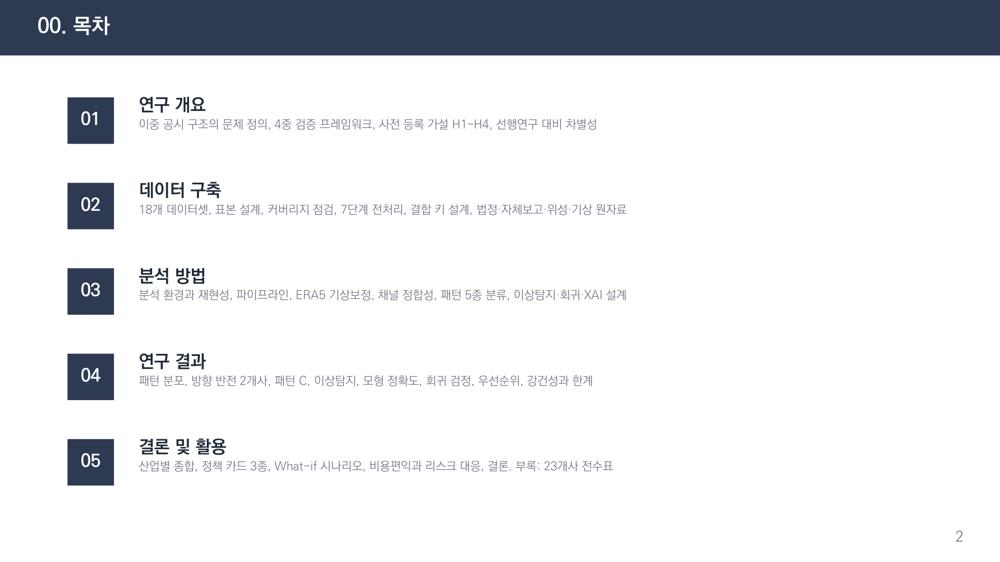
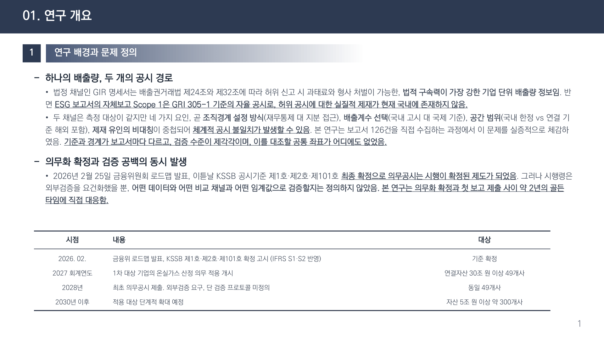

# 기업이 신고한 탄소, 위성이 4번 교차검증한다
### 2026 기후에너지환경부 AX 아이디어 경진대회 **우수상**(상금 300만원) · 주관 한전KDN·한국남동발전

## 1. 여는 글
기업의 온실가스 공시는 점점 의무화되고 있지만, 신고 값을 ‘어떻게 믿을 것인가’는 여전히 과제입니다. 자기 신고에 의존하는 구조에서는 검증(MRV)이 취약합니다. 이 아이디어는 **위성 영상으로 공시 값을 네 방향에서 교차검증**하는 체계를 제안합니다.

*자기 신고 기반 공시의 한계와, 위성 기반 검증의 필요성.*

## 2. 문제 정의
- 공시 값과 실제 배출의 괴리를 독립적으로 확인할 수단이 부족합니다.
- 현장 실측은 비용·범위의 한계가 큽니다. 위성은 광역·주기적 관측이 가능해 보완재로 적합합니다.

## 3. 방법 — 4중 검증 개념
위성 관측·배출 인벤토리·활동자료·모델 추정을 서로 대조하는 네 개의 독립 검증 축을 둡니다. 각 축이 서로를 견제해, 한 곳의 오류가 전체 결론을 왜곡하지 않도록 설계했습니다.

*네 개의 독립 검증 축으로 공시 값을 교차 확인합니다.*

*위성 관측을 축으로 여러 데이터 계층을 결합해 검증 신뢰도를 높입니다.*

## 4. 기대효과
- 공시 신뢰도 향상 → 배출권·정책의 근거 강화
- 광역·저비용 검증으로 전국·산업 단위 확장 가능

## 5. 의미
탄소 공시의 신뢰는 탄소시장과 규제의 토대입니다. 위성 기반 독립 검증은 그 토대를 다지는 실질적 수단이 될 수 있습니다.

## 6. 맺음말
아이디어 단계의 제안이지만, 위성 원격탐사가 기업 탄소 회계의 ‘제3자 검증자’가 될 수 있음을 보였습니다. (전체 구성은 발표자료 참조) 긴 글 읽어주셔서 감사합니다.

---
**링크** · GitHub: https://github.com/zxsa0716/AX_Contest · 포트폴리오: https://portfolio-eight-ruddy-87.vercel.app
