# 기업이 신고한 탄소, 위성으로 검증해 봤습니다
## GIR 법정 공시 × ESG 자체보고 × 위성 4종 × ODIAC, 4중 교차검증으로 찾아낸 것 (AX 아이디어 경진대회 우수상)

안녕하세요. 이번 글은 2026년 기후에너지환경부 **AX 아이디어 경진대회**(한전KDN·한국남동발전 주관)에서 우수상을 받은 연구입니다. 팀명은 'Save Earth'였습니다.

주제를 한 줄로 말하면 이렇습니다.

**"기업이 공시한 온실가스 배출량이 정말 맞는지, 하늘에서 본 위성 관측으로 검증할 수 있을까?"**

결론부터 말씀드리면, **찾았습니다.** 5년 동안 공시 수치는 계속 올라가는데 위성이 본 신호는 계속 내려간 기업이 있었습니다. 그것도 완전히 정반대 방향으로요. 어떻게 찾았는지 순서대로 이야기해 보겠습니다.

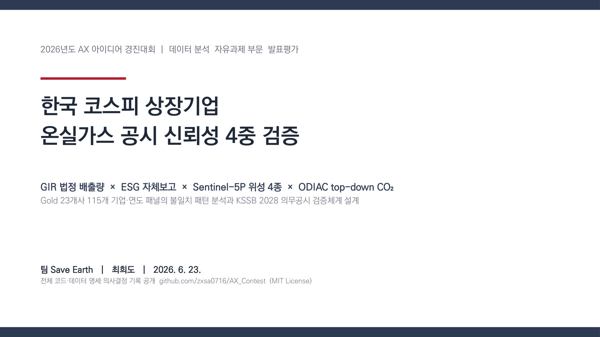

---

## 1. 문제의 시작: 하나의 배출량, 두 개의 공시

먼저 좀 이상한 구조를 설명해야 합니다. 우리나라 기업은 온실가스 배출량을 **두 곳에 따로 보고**합니다.

**첫째, GIR 명세서(법정 채널)**입니다. 온실가스종합정보센터에 제출하는 공식 문서로, 배출권거래법 제24조와 제32조에 따라 **허위 신고 시 과태료와 형사 처벌까지 가능**합니다. 법적 구속력이 가장 강한 기업 단위 배출량 정보입니다.

**둘째, ESG 보고서의 자체보고**입니다. 지속가능경영보고서에 실리는 Scope 1 수치인데, GRI 305-1 기준의 **자율 공시**입니다. 그리고 여기가 중요한데, **허위 공시에 대한 실질적 제재가 현재 국내에 존재하지 않습니다.**

같은 회사, 같은 해, 같은 배출량인데 두 개의 숫자가 있고 한쪽은 제재가 있고 한쪽은 없습니다. 그럼 두 숫자는 같을까요?

같지 않을 수 있습니다. 이유가 최소 네 가지입니다.

- **조직경계 설정 방식**이 다릅니다(재무통제 기준 vs 지분 접근).
- **배출계수 선택**이 다릅니다(국내 고시 vs 국제 기준).
- **공간 범위**가 다릅니다(국내 한정 vs 연결 기준으로 해외 포함).
- **제재 유인이 비대칭**입니다.

저는 이 연구를 위해 지속가능경영보고서 **126건을 직접 수집**했는데, 그 과정에서 이 문제를 몸으로 느꼈습니다. 기준과 경계가 보고서마다 다르고, 검증 수준이 제각각이며, **이를 대조할 공통 좌표가 어디에도 없었습니다.**

### 그리고 하필 지금이 중요한 시점입니다

2026년 2월 25일 금융위원회가 ESG 공시 로드맵을 발표했고, 이튿날 KSSB 공시기준 제1호·제2호·제101호가 최종 확정되었습니다. **의무공시는 이제 확정된 제도**입니다.

그런데 시행령은 "외부검증을 받아라"라고만 정했습니다. **어떤 데이터로, 어떤 채널과 비교해서, 어떤 임계값으로 검증할지는 정의하지 않았습니다.** 즉 의무는 생겼는데 검증 방법이 비어 있습니다.

의무화 확정과 첫 보고 제출 사이에 약 2년의 시간이 있습니다. 저는 이 시기를 골든타임이라고 봤습니다.

---

## 2. 수단은 이미 하늘에 있었습니다

여기서 제 아이디어가 나옵니다. **공시를 더 요구하는 대신, 이미 존재하는 독립 관측으로 공시를 비추면 어떨까?**

- **Sentinel-5P**는 2017년 발사 이후 전 지구를 매일 관측합니다. 한국 상공의 위성 신호와 국가 인벤토리의 격자 상관은 **0.96**에 이릅니다(Kim 외, 2020).
- **ODIAC**은 1km 격자에서 화석연료 CO₂를 추정합니다. 사업장 단위 접근이 가능합니다.

기술은 이미 성숙했습니다. 문제는 **어느 제도도 이것을 개별 기업의 공시 검증에 연결하지 않았다는 것**입니다. 위성 검증은 국가 단위나 도시 단위에 머물러 있었습니다.

국가나 도시 단위 결과는 개별 기업의 공시를 검증하는 행정 입력값이 될 수 없습니다. 공시 의무, 외부검증, 책임투자는 모두 **기업 단위**로 작동하는 제도이니까요. 이 간극을 메우는 것이 이 연구의 과제였습니다.

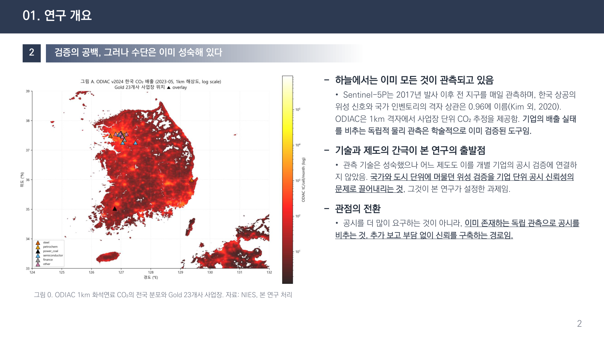

---

## 3. 네 개의 채널로 동시에 관측하기

설계의 핵심은 **교차 검증**입니다. 같은 기업, 같은 연도를 네 개의 독립적인 채널로 동시에 봅니다.

| 채널 | 출처 | 성격 |
|---|---|---|
| GIR | 환경부 명세서 | 법정, 검증 의무·제재 존재 |
| ESG | 지속가능경영보고서 | 자율 공시, 제재 부재 |
| 위성 4종 | Sentinel-5P (GEE) | 독립 물리 관측 |
| ODIAC | NIES 1km 인벤토리 | top-down 직접 CO₂ |

왜 이게 작동할까요? **네 채널의 산정 주체가 서로 다르기 때문입니다.** GIR과 ESG는 기업이 산정하고, Sentinel-5P는 유럽우주국 위성이 관측하고, ODIAC은 일본 국립환경연구소 모델이 추정합니다. 오류의 발생 구조가 독립적입니다.

따라서 **네 채널이 동시에 같은 방향으로 왜곡될 확률은 구조적으로 낮습니다.** 특정 채널의 산정 오류나 경계 변경, 의도적 왜곡은 나머지 세 채널에 흔적을 남깁니다. 단일 채널 검증으로는 보이지 않던 신호가 교차 비교에서 드러나는 것입니다.

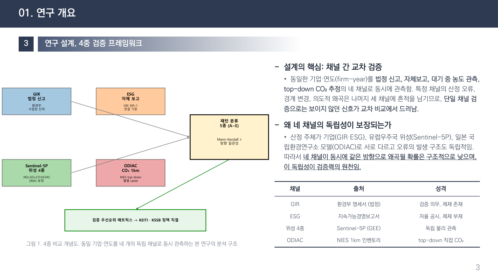

### 결과를 보기 전에 가설을 미리 등록했습니다

이 부분은 제가 특히 신경 쓴 지점입니다. 데이터를 다 본 다음에 "이런 패턴이 있네요"라고 말하는 건 위험합니다. 데이터가 크면 뭐라도 나오기 때문입니다. 이걸 사후 해석 편향이라고 합니다.

그래서 **분석 전에 가설과 판정 임계값을 먼저 등록**했습니다(사전등록, pre-registration). 확증적 설계라고 부르는 방식입니다.

- **H1(체계적 불일치)**: GIR와 ESG 사이에 측정오차를 넘어선 체계적 괴리가 있다. → 판정 기준: ln(GIR) 계수의 Bootstrap 95% 신뢰구간이 0을 포함하지 않을 것
- **H2(위성 방향 일관성)**: 신뢰 구간 기업은 GIR와 위성·ODIAC의 방향이 일치하고, 의심 기업은 일치율이 낮다.
- **H3(방향 반전 패턴)**: 공시 상승과 관측 하강이 동시에 나타나는 패턴이 실재한다. → Fisher 정확검정 p < 0.05
- **H4(정책 확장성)**: 우선순위 산출이 의무화 대상 49개사로 즉시 확장 가능하다.

결과는 **네 가설 모두 사전 임계값을 충족**했습니다. H1은 신뢰구간 [−216.31, −0.13]으로 0을 포함하지 않았고, H3는 p = 0.018로 유의했으며 2개사가 식별되었습니다.

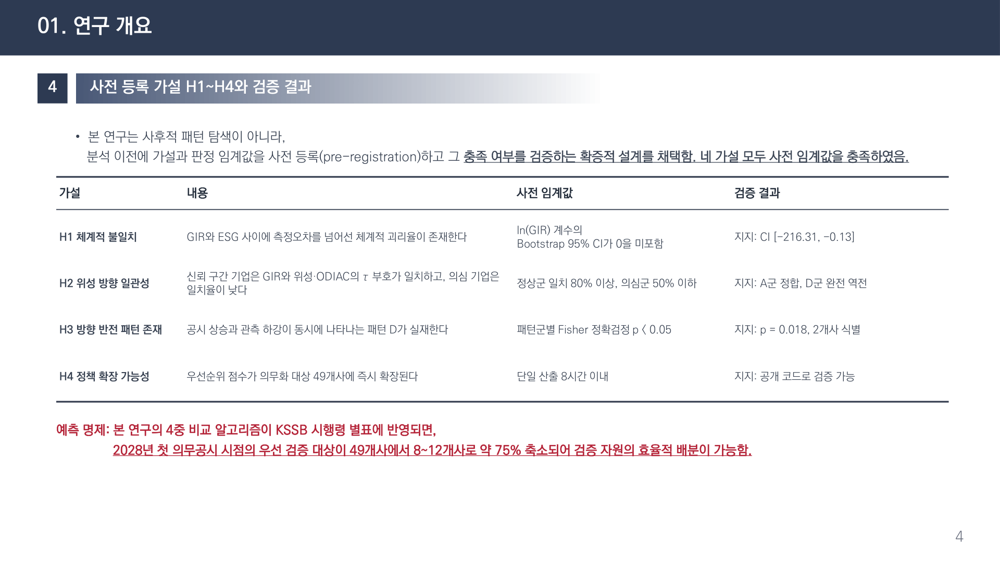

---

## 4. 표본은 제도가 정했습니다

표본 선정에 제 재량이 개입하지 않도록 만들었습니다. **KSSB 자산 30조 원 임계값**과 **GIR 명세서 3년 이상 등록**이라는 두 제도적 조건의 교집합이 곧 표본입니다.

그 결과가 **Gold 23개사, 115개 기업·연도(2019~2023)**입니다. 1차 의무화 대상 49개사를 도출하기 위해 DART 상장사 789개 전수의 연결자산을 직접 산정했습니다.

데이터는 4개 계층에 걸친 **18개 독립 데이터셋**을 하나의 패널로 통합했습니다. 주요 항목만 적으면 이렇습니다.

- GIR 배출량 명세서(2017~2024): **7,998행, 1,585개 법인**
- 지속가능경영보고서 PDF: **126건**
- Sentinel-5P NO₂·SO₂·CO·HCHO: **1,380 site-month**
- ODIAC v2024 1km CO₂: **60개월 GeoTIFF**
- ERA5-Land·MERRA-2·ASOS 지상관측: 5변수 60개월, 일자료 9,130행

모든 원본 파일의 **SHA-256 해시를 기록**해 무결성을 보장했습니다. 무료 API 키 4종과 단일 명령으로 수집부터 분석까지 전 과정이 재현됩니다.

### 결측을 숨기지 않고 공개했습니다

데이터 분석에서 흔한 유혹이 있습니다. 빈 데이터를 조용히 지우는 것입니다. 하지만 결측이 특정 기업이나 연도에 몰려 있으면, 분석이 데이터의 공백을 학습해 버립니다.

그래서 패널 충실도를 전수 공개했습니다. GIR·위성·ODIAC·기상·재무 채널은 115개 기업·연도 **전부 커버리지 100%**였습니다. ESG 채널만 **104건(90.4%)**이었고, 결측 11건의 사유를 전부 특정했습니다(LG에너지솔루션 분사 이전 3건, 롯데쇼핑·이마트 미발간 4건, 삼성생명 1건, 파싱 실패 3건).

그리고 여기서 한 걸음 더 갔습니다. **보고서 미발간이라는 결측 자체를 '보고 선택'이라는 정보로 전환**해서, 통계 모형의 종속변수로 다뤘습니다. 안 낸 것도 하나의 행동이니까요.

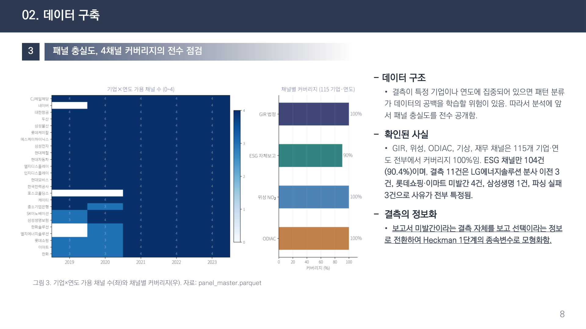

법정 채널의 원자료도 먼저 살펴봤습니다. 여기서 이미 흥미로운 게 보입니다.

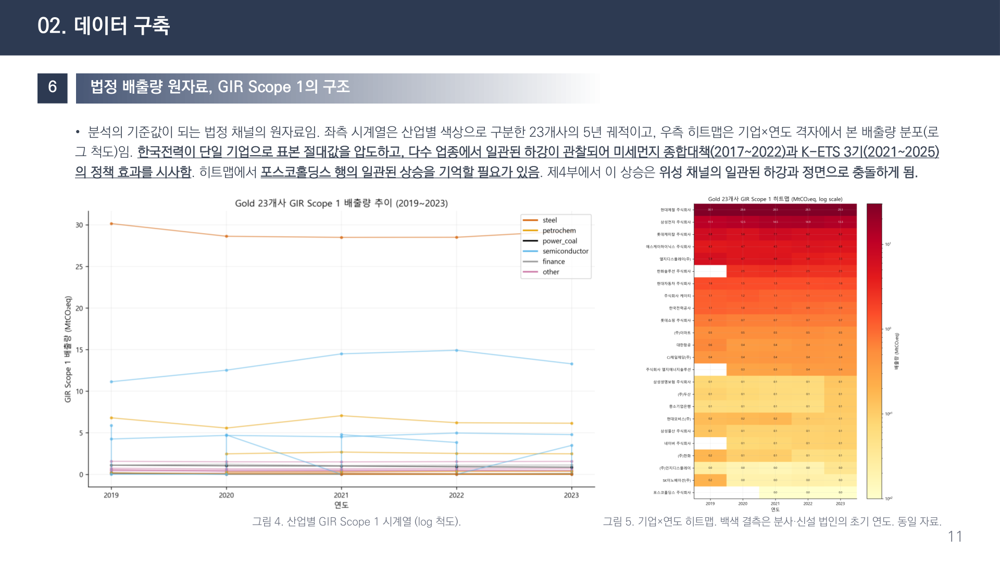

---

## 5. 위성이 보는 것과, 보정해야 하는 것

위성 4종을 왜 동시에 추적했을까요? **화학적 수명과 생성 경로가 다른 성분들이 같은 방향을 가리킬 때, 우연이 아닌 배출 활동의 신호로 해석할 수 있기 때문**입니다.

- **NO₂**: 연소 활동의 단기 지표(수 시간 수명)
- **SO₂**: 황 함유 연료의 연소 → 발전, 제철을 지시
- **CO**: 불완전연소
- **HCHO**: VOC 계열 → 석유화학을 지시

성분 조합만으로 업종 구분까지 가능해집니다.

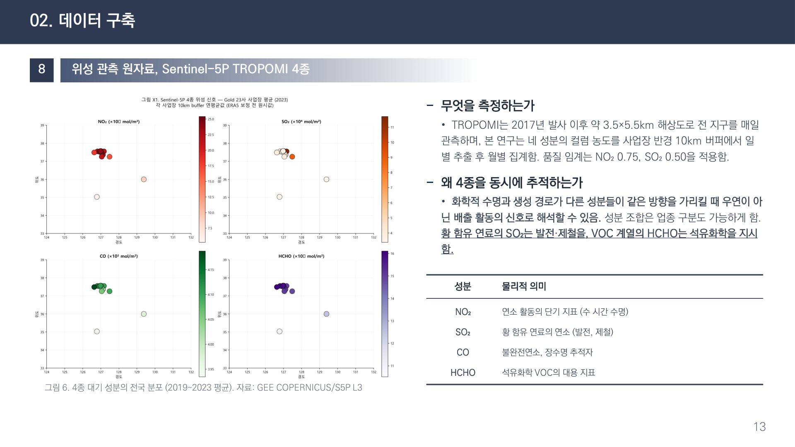

그런데 위성 4종에는 한계가 있습니다. **이산화질소는 이산화탄소가 아닙니다.** 연소 활동의 대용 지표일 뿐입니다. 이 비판은 정당합니다.

그래서 네 번째 채널로 **ODIAC**을 도입했습니다. 야간광과 발전소 배출목록을 융합해 1km 격자에서 화석연료 CO₂를 직접 추정하는 자료입니다. 즉 "대용 지표가 아닌 CO₂ 자체"로 응답한 것입니다.

여기서 눈으로 확인되는 결과가 나왔습니다.

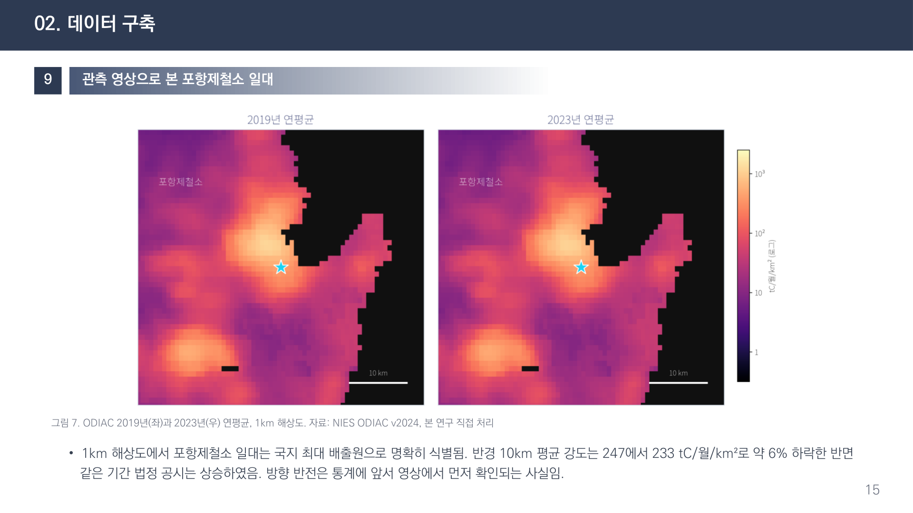

포항 한 곳만의 이야기가 아닌지 확인하기 위해 네 개 핵심 사업장을 비교했습니다.

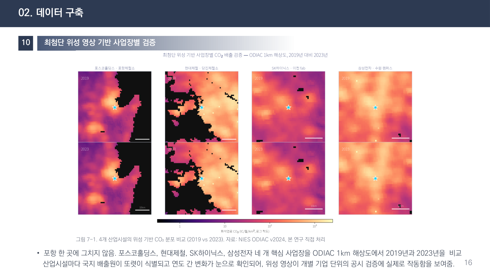

### 바람의 변화를 배출의 변화로 착각하지 않기

여기서 반드시 처리해야 하는 문제가 있습니다. 위성이 보는 대기 중 농도는 **바람이 세면 흩어지고 약하면 쌓입니다.** 기온, 강수, 대기경계층고도 영향을 줍니다. 그러니까 농도가 줄었다고 배출이 줄었다고 말할 수 없습니다.

그래서 사업장별로 **동서·남북 풍속, 2m 기온, 강수, 경계층고의 5개 기상 변수와 월 더미**를 설명변수로 회귀를 적합하고, **그 잔차만을 배출 신호로 사용**했습니다. 기상으로 설명되는 부분을 다 걷어낸 나머지를 쓰는 것입니다.

설명력은 HCHO 0.94부터 CO 0.67까지였는데, 이는 261개 도시를 분석한 국제 연구(Fioletov 외, 2025)와 정확히 같은 범위입니다. 그리고 NASA MERRA-2를 독립 대체 입력으로 두어, 기상 모델을 바꿔도 결과가 유지되는지 확인했습니다(R² 0.64~0.91, 패턴 식별 유지).

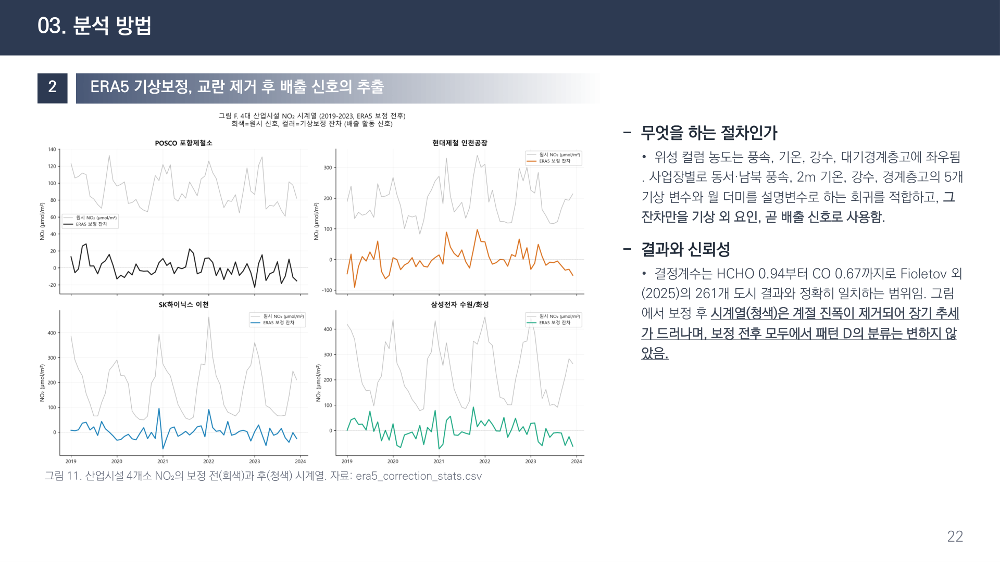

---

## 6. 절대값을 비교하지 않고 '방향'을 비교했습니다

이게 이 연구의 방법론적 핵심입니다. 왜 절대값을 직접 빼지 않았을까요? 세 가지 이유입니다.

**첫째, 네 채널은 단위와 조직경계와 배출계수가 모두 달라 절대값을 직접 뺄 수 없습니다.** 위성의 컬럼 농도와 공시의 톤CO₂를 어떻게 빼겠습니까.

**둘째, 사업장 위치와 위성 화소의 공간적 불일치가 측정 편의를 만듭니다.** 그런데 그 편의가 시간에 대해 일정하다면, **연도 간 차분에서 상쇄됩니다.** 이건 패널 계량경제학에서 고정효과가 시불변 개체효과를 제거하는 원리와 같습니다.

**셋째, 따라서 단위와 척도에 불변인 '방향'이 이질적인 네 채널이 만날 수 있는 유일한 공통 좌표입니다.**

방향을 재는 도구로는 **Mann-Kendall τ**를 썼습니다. 이 방법은 절대값이 아니라 **모든 연도쌍의 순위 부호만** 사용합니다. 5개년이면 10개 쌍이 생기는데, 10개가 모두 같은 부호면 완전 단조(τ = ±1.00)입니다. 정규성 가정이 필요 없어 적은 표본에도 적용할 수 있습니다.

실증적으로도 강건했습니다. **기상보정 전후의 NO₂ 추세 부호가 23개사 중 22개사에서 일치**했습니다.

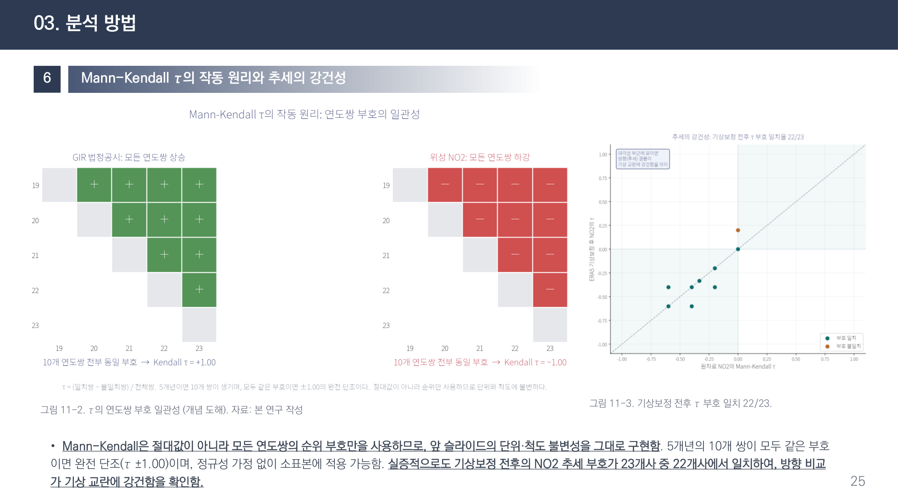

그리고 네 채널의 부호 조합으로 **다섯 가지 패턴**을 정의했습니다. |τ| 0.40을 임계로 상승·하강·무추세를 판정합니다(이 임계값도 사전 등록했습니다).

- **A↓ 일관 하강**: 4채널 모두 하강 → 정책 효과가 반영된 정상 사례
- **A↑ 일관 상승**: 4채널 모두 상승 → 사업 확장에 따른 정직한 보고(예: 데이터센터)
- **B ESG 이탈**: GIR·위성·ODIAC 일치, ESG만 반대 → 자체보고의 경계 변경 또는 산정 오류 신호
- **C GIR 의심**: ESG·위성·ODIAC 일치, GIR만 반대 → 법정 신고의 정확성에 대한 역방향 검증 신호
- **D 방향 반전**: 공시(GIR·ESG)는 상승, 관측(위성·ODIAC)은 하강 → 가장 주의가 필요한 신호

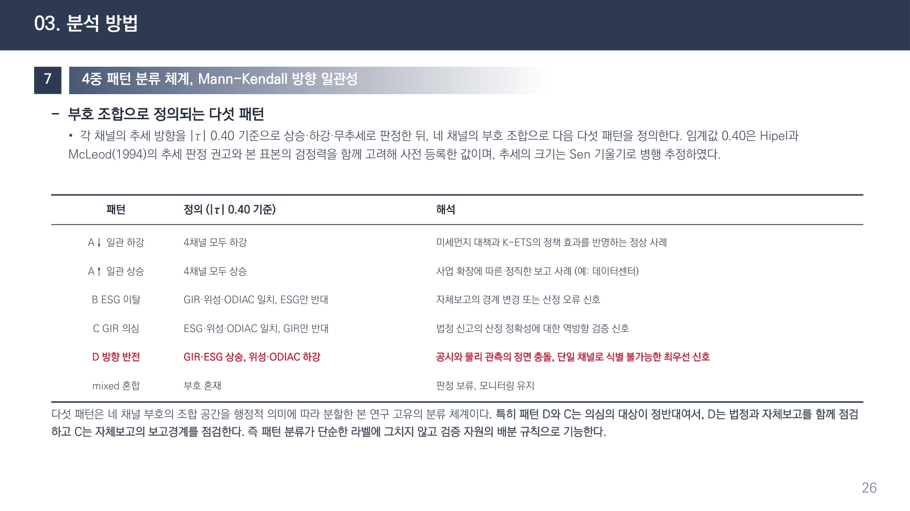

---

## 7. 결과: 23개사 전수 분류

분류 결과는 이랬습니다.

| 패턴 | 기업 수 | 비율 | 대표 기업 |
|---|---|---|---|
| A↓ 일관 하강 | 12 | 52.2% | 한국전력, 현대자동차, 롯데케미칼 외 |
| 혼합 | 7 | 30.4% | SK하이닉스, 현대제철, 대한항공 외 |
| **D 방향 반전** | **2** | **8.7%** | **포스코홀딩스, 삼성전자** |
| C GIR 의심 | 1 | 4.3% | 현대모비스 |
| A↑ 일관 상승 | 1 | 4.3% | 네이버(데이터센터 전력 수요) |

이 분포 자체가 하나의 제도 평가라고 생각합니다. **다수의 정합(A↓ 52.2%)은 현행 법정 검증 체계가 작동하고 있음**을 보여줍니다. 그리고 **소수의 역전(D)은 그 체계의 사각지대**를 보여줍니다.

D·C·혼합을 합한 약 39%는 **단일 채널 검증으로는 식별이 불가능했던 신호**입니다.

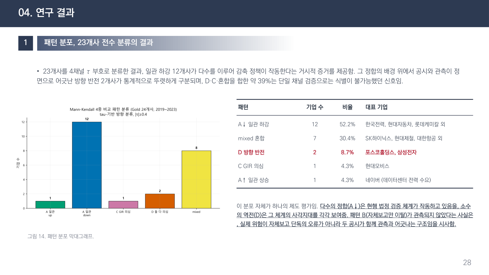

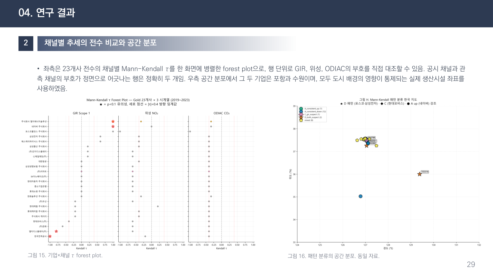

### 핵심 발견: 5년간 완전히 반대로 간 회사

가장 중요한 결과입니다. 포스코홀딩스의 네 채널을 보면 이렇습니다.

| 채널 | τ | 방향 |
|---|---|---|
| GIR 법정 | **+1.00** | 완전 상승 |
| ESG 자체보고 | +0.67 | 상승 |
| 위성 NO₂ | **−1.00** | 완전 하강 |
| ODIAC | **−1.00** | 완전 하강 |

**2019~2023년의 모든 인접 연도 쌍에서 법정 공시는 상승하고, 포항제철소 반경 10km의 위성 잔차와 ODIAC은 하강했습니다.** 완전 단조의 정면 충돌입니다. 기상보정 전후, MERRA-2 대체 검증에서도 동일하게 유지되었습니다.

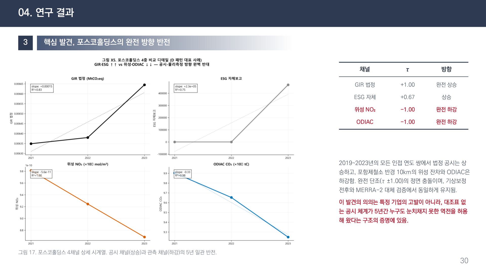

두 번째 사례인 삼성전자도 방향이 갈렸습니다. 특히 **자체보고 τ가 +1.00으로 23개사 중 가장 강한 상승 서사**였는데, 위성과 ODIAC은 −0.40으로 하강했습니다.

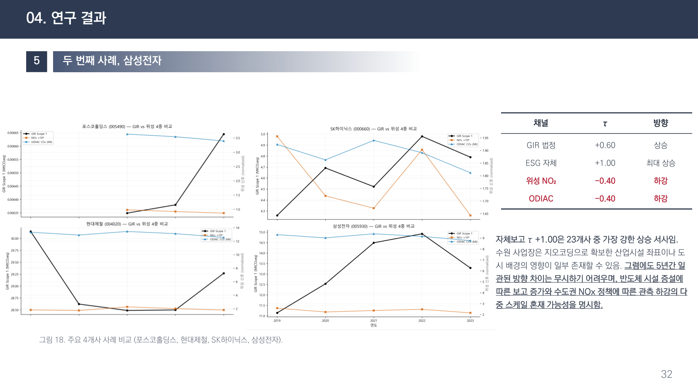

유리한 사례만 골라 보여준 게 아니라는 걸 보이기 위해, 전 채널을 표준화한 시계열을 **23개사 전부 공개**했습니다.

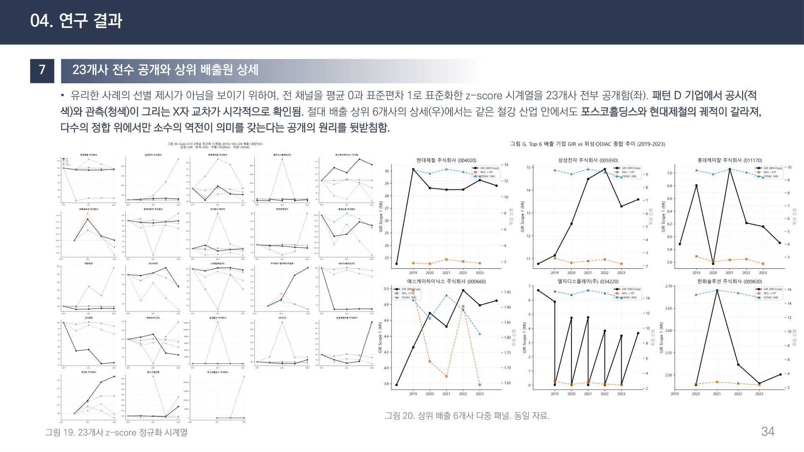

---

## 8. 여기서 매우 조심했습니다: 그린워싱이라고 말하지 않았습니다

이 부분이 이 연구에서 제가 가장 신중하게 다룬 지점입니다.

"공시는 오르고 위성은 내렸다"는 사실입니다. 하지만 그게 곧 "기업이 거짓말했다"는 뜻일까요? **아닙니다.** 저는 세 가지 경쟁 가설을 모두 제시했습니다.

**가설 1. 보고경계 확장** — 2022년 3월 지주회사 신설로 해외 자회사가 연결 범위에 편입되어 보고 수치가 올라갔을 가능성. 이 경우 국내 사업장의 위성 신호는 영향받지 않으므로 방향 반전이 자연스럽게 설명됩니다. 다만 이게 사실이라면 **경계 변경 공시가 불충분했다는 문제**는 남습니다.

**가설 2. Scope 재분류** — 자가발전을 Scope 1에서 매입전력의 Scope 2로 이전하는 등 산정 경계 재분류가 채널 간 비대칭을 만들었을 가능성. 대조표가 없는 현행 체계에서는 외부에서 이를 구분할 방법이 없습니다.

**가설 3. 실감축의 선반영** — 공정 효율화와 CCUS 도입으로 실제 배출이 줄었으나 보고에 시차가 있는 경우. 위성이 먼저 하강을 포착하고 공시가 늦게 따라오는 시나리오로, **기업에 가장 유리한 해석**입니다.

본 분석만으로는 세 가설 중 무엇이 맞는지 특정할 수 없습니다. 그래서 **이 연구는 그린워싱을 단정하지 않습니다.**

제가 말하고 싶은 것은 다른 것입니다.

> **이 발견의 의의는 특정 기업의 고발이 아니라, 대조표 없는 공시 체계가 5년간 누구도 눈치채지 못한 역전을 허용해 왔다는 '구조'의 증명에 있습니다.**

무엇이 원인이든, **5년 동안 아무도 이 불일치를 발견하지 못했다는 사실 자체가 문제**입니다. 검증 체계가 있었다면 첫해에 질문이 나왔을 것입니다.

---

## 9. 통계로 다시 확인하고, 판단 근거를 설명하게 했습니다

패턴 분류와 독립적인 방법으로도 검증했습니다. **이상탐지 3층 앙상블**입니다. 1층은 Isolation Forest와 LOF, 2층은 방향 불일치, 3층은 KCGS 등급조정 21건 같은 외부 라벨입니다. 교차검증 AUC 0.86, 외부 라벨 기준 정밀도 0.71이 나왔고, **패턴 분류와 다른 방법이 같은 기업을 다시 지목**했습니다.

회귀 분석에서는 **Heckman 2단계 모형**을 썼습니다. ESG 보고서 발간은 자발적 선택이라 발간 기업과 미발간 기업 사이에 자기선택 편향이 있기 때문입니다. 1단계에서 발간 확률을 추정해 보정한 뒤, 2단계에서 괴리율을 회귀했습니다.

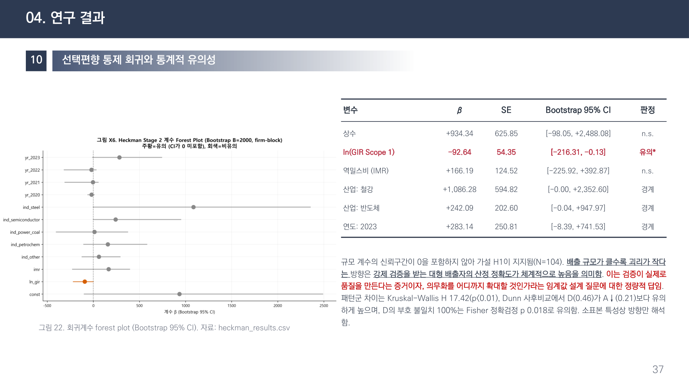

마지막으로, **왜 이 기업을 우선 검증 대상으로 지목했는지 설명할 수 있어야** 행정에서 쓸 수 있습니다. 그래서 SHAP으로 판단 근거를 변수 단위로 분해했습니다.

기여도 순서는 **기상보정 NO₂ > 로그 배출량 > 괴리율 > 보정 SO₂ > ODIAC**이었습니다. 즉 방향 반전 식별의 결정적 특성이 **위성과 ODIAC 잔차**임이 정량적으로 확인되었습니다.

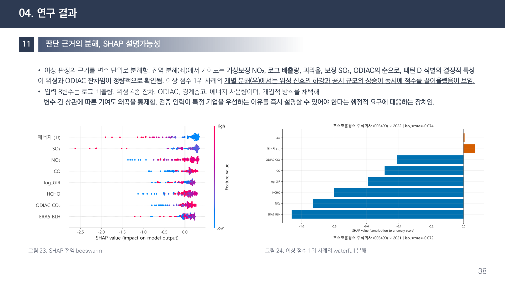

---

## 10. 그래서 무엇을 하자는 것인가

이 연구의 정책적 제안은 명확합니다.

**4중 비교 알고리즘을 KSSB 시행령 별표에 반영하면, 2028년 첫 의무공시 시점의 우선 검증 대상이 49개사에서 8~12개사로 약 75% 축소됩니다.**

검증 자원은 유한합니다. 49개사를 다 똑같이 검증할 인력은 없습니다. 그러면 **어디부터 봐야 하는지 정하는 근거**가 필요합니다. 이 연구는 그 근거를 제공합니다. 그것도 추가 보고 부담 없이, 이미 존재하는 공개 데이터만으로요.

## 11. 이 연구를 하면서 느낀 것

가장 크게 느낀 건 이것입니다. **관측 기술은 이미 충분한데, 제도가 그것을 쓰지 않고 있었습니다.**

위성은 2017년부터 매일 한국 상공을 찍고 있었습니다. ODIAC은 1km 격자로 CO₂를 추정하고 있었습니다. 그런데 이 자료들이 기업 공시 검증에 연결된 적은 없었습니다. 국가 단위, 도시 단위 연구에서 멈춰 있었습니다.

제가 한 일은 새 위성을 띄운 게 아닙니다. **이미 하늘에 있던 눈을 제도가 필요한 곳으로 내려온 것**입니다. 그리고 그 과정에서, 데이터를 수집하는 인프라조차 없다는 현실도 함께 기록했습니다. 대기업 다수의 지속가능경영보고서는 공시 시스템에 링크만 있고 원본은 각사 사이트에 흩어져 있었습니다. 검증 이전에 수집부터가 문제였습니다.

전체 코드와 데이터 명세, 의사결정 기록을 MIT 라이선스로 공개했습니다. 누구든 같은 절차로 다시 돌려볼 수 있습니다. 온실가스 공시나 위성 원격탐사에 관심 있는 분께 조금이라도 도움이 되면 좋겠습니다.

긴 글 읽어주셔서 감사합니다.

---

**링크**
GitHub https://github.com/zxsa0716/AX_Contest (MIT License)
포트폴리오 https://portfolio-eight-ruddy-87.vercel.app
