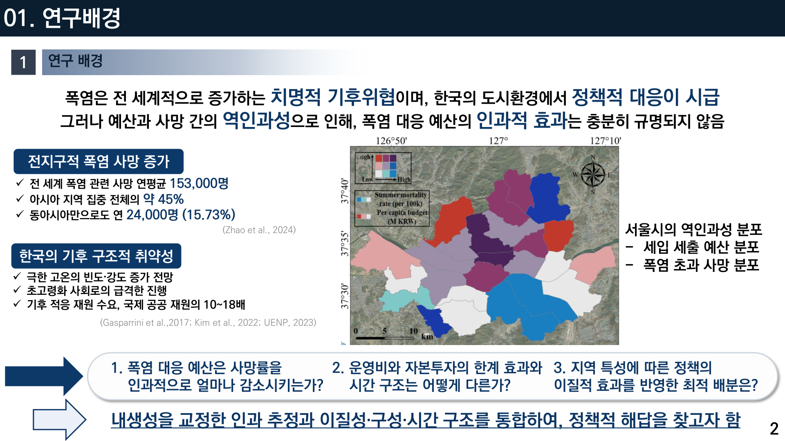
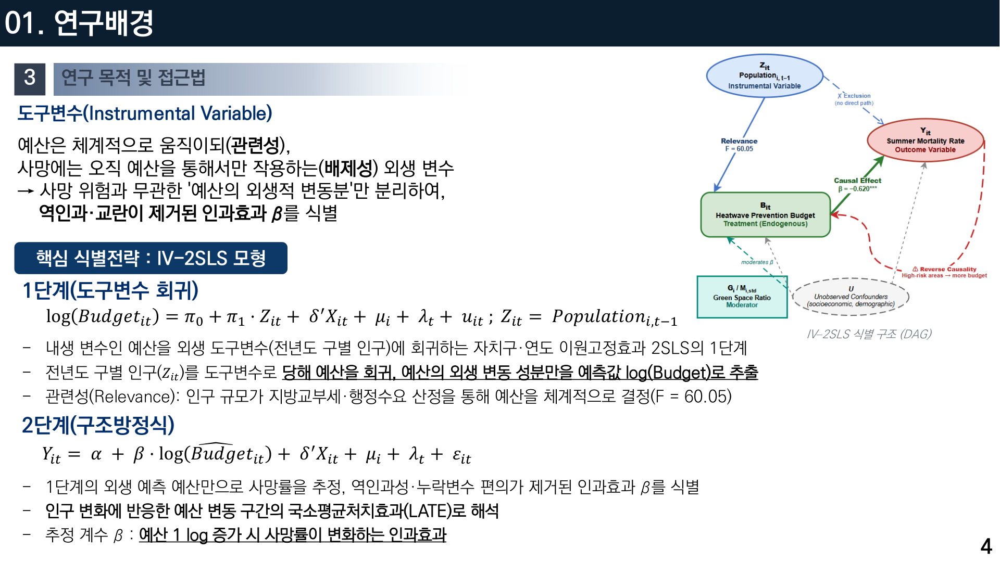
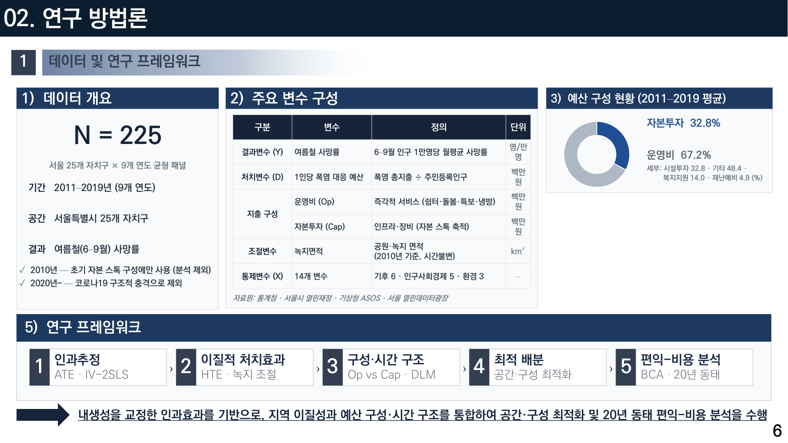
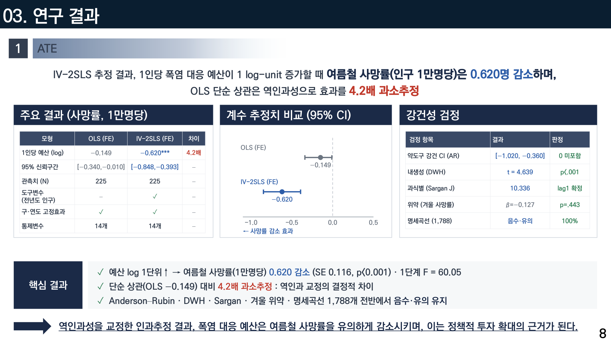
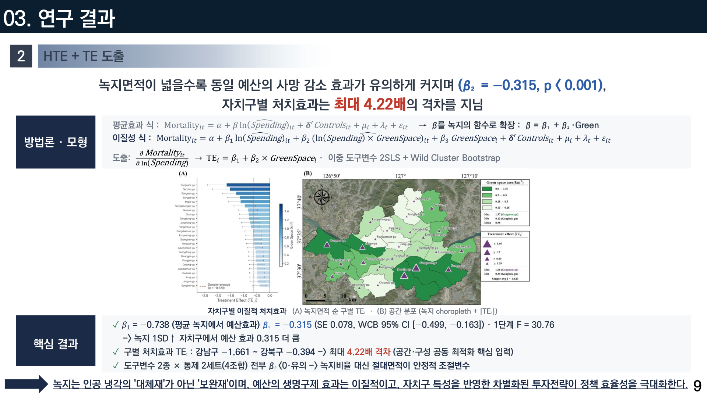
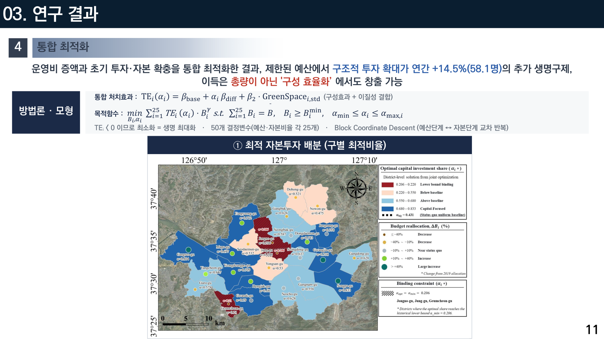
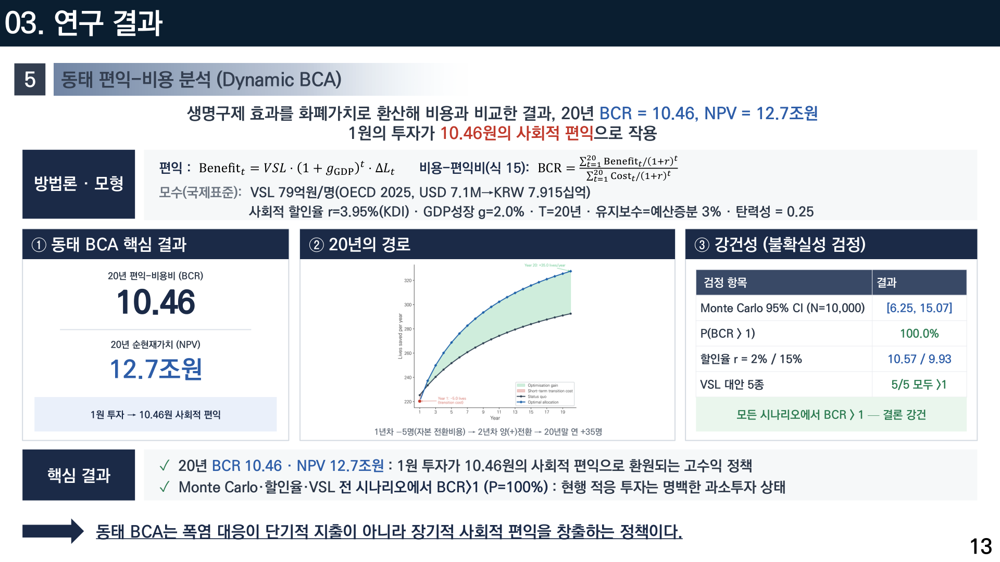

# 폭염 예산은 어디에 써야 가장 많은 생명을 구할까
### 서울시 25개 자치구를 중심으로 — 인과추론 기반 최적 배분 (2026 한국기후변화학회 춘계 구두발표, 제1저자)

## 1. 여는 글
폭염은 치명적 기후위협이지만, “**폭염 대응 예산이 실제로 사망을 얼마나 줄이는가**”, 그리고 “**어디에 써야 가장 효과적인가**”는 충분히 규명되지 않았습니다. 이 연구는 인과추론으로 그 답을 찾습니다.

## 2. 문제 정의
예산과 사망은 서로 영향을 주고받아(내생성), 단순 상관으로는 인과를 알 수 없습니다. 예산이 많은 지역이 원래 위험이 큰 지역일 수 있기 때문입니다.

*서울의 폭염 노출·취약·사망 분포. 지역 격차가 뚜렷합니다.*

## 3. 데이터 & 방법 — 도구변수(IV) 2SLS
내생성을 교정하기 위해 **도구변수 2단계 최소제곱(IV-2SLS)**을 사용했습니다. 서울 25개 자치구, 2011~2019년 패널(N=225)을 분석했습니다.

*예산이 사망에 미치는 인과 경로를 도구변수로 분리해 편향(Bias)을 제거합니다.*

*① 인과추정(IV-2SLS) ② 이질적 처치효과 ③ 구성·시차 구조 ④ 최적 배분 ⑤ 편익·비용 분석.*

## 4. 결과
- **인과효과**: 예산 1 log-unit 증가 시 여름철 사망(인구 1만명당)이 **0.620명 감소**. 단순 OLS는 이를 **4.2배 과소추정**했습니다.

*IV-2SLS 결과, 예산의 사망 저감 효과가 OLS보다 훨씬 크게 나타납니다(내생성 교정 효과).*

- **최적 배분**: 녹지율이 낮을수록 예산의 사망 저감 효과가 커져(β=−0.315, p<0.001), 자치구별 처치효과가 **최대 4.22배** 차이가 났습니다.

*같은 예산도 자치구·시점에 따라 효과가 크게 다릅니다. ‘무엇에·언제’ 쓰는가가 관건입니다.*

- **비용편익**: 동태 BCA 결과 20년 BCR 10.46, **NPV 12.7조 원**.

*폭염 대응은 단기 지출이 아니라 장기 사회 편익을 창출하는 투자임을 보였습니다.*

## 5. 의미
예산의 총량보다 **어디에·언제 쓰는가**가 생명을 좌우합니다. 녹지가 부족한 지역에 우선 배분하는 것이 효율적입니다.

## 6. 맺음말
인과추론과 최적화를 결합해, 폭염 정책을 ‘감’이 아닌 ‘근거’로 설계할 수 있음을 보였습니다. 긴 글 읽어주셔서 감사합니다.

---
**링크** · 발표자료: /materials/폭염예산_구두발표.pdf · 포트폴리오: https://portfolio-eight-ruddy-87.vercel.app
