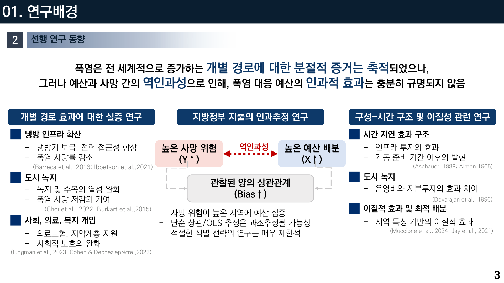
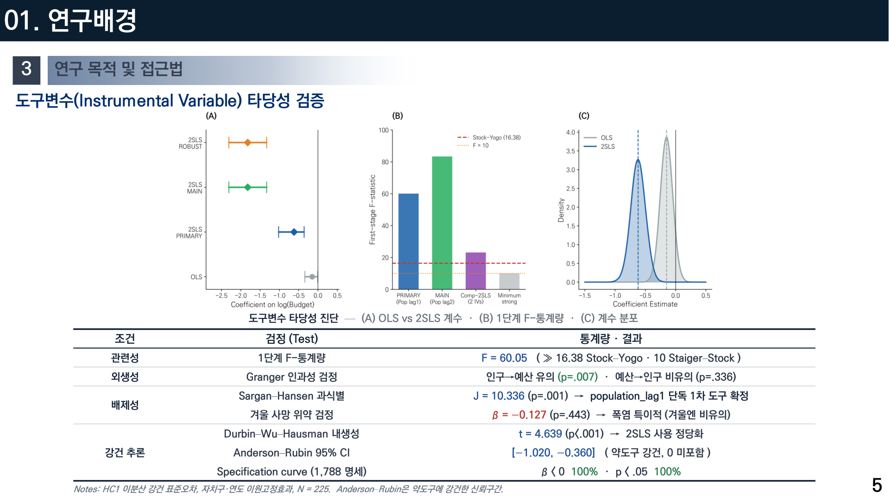
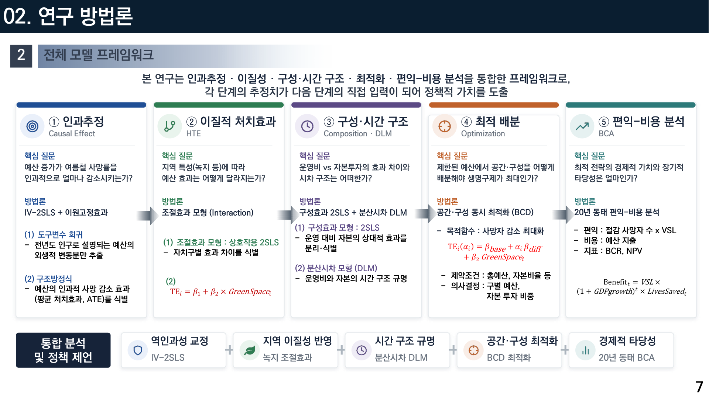
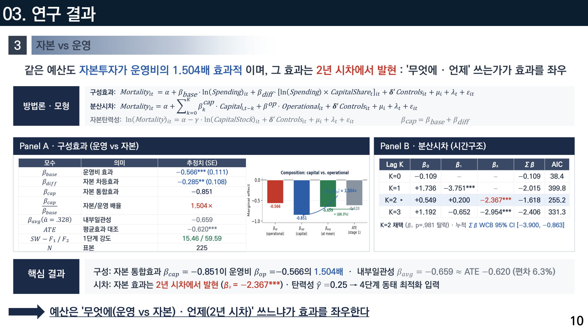
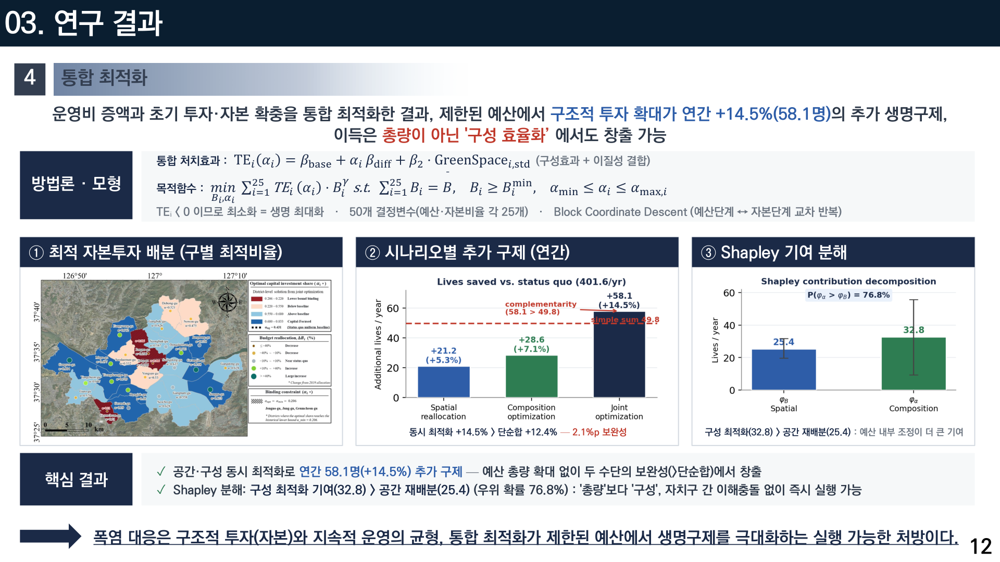
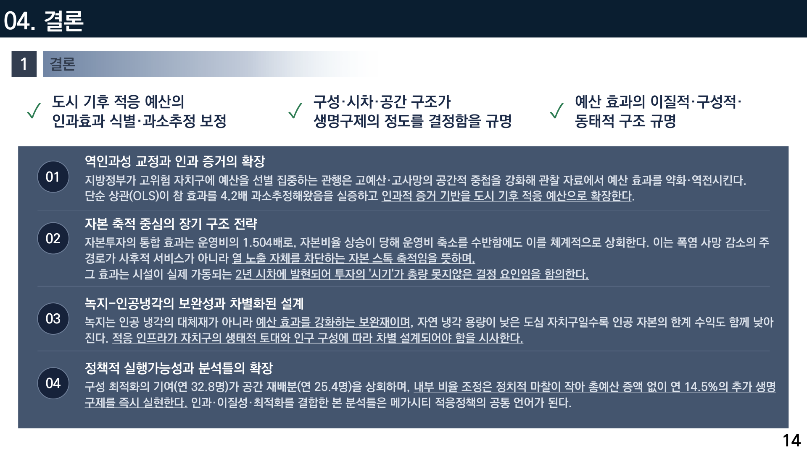

# 폭염 예산은 정말 사람을 살리는가
## 서울 25개 자치구 9년 데이터로 인과효과를 추정하고, 최적 배분까지 계산해 봤습니다

안녕하세요. 이번 글은 2026년 한국기후변화학회 상반기 학술대회에서 구두발표한 연구입니다. 질문은 아주 실용적입니다.

**"자치구가 폭염 대응에 쓰는 예산은, 실제로 사람을 몇 명 살리고 있을까?"**

그리고 한 걸음 더 나갑니다.

**"같은 돈이라면, 어디에 어떻게 써야 가장 많은 생명을 구할 수 있을까?"**

이 두 질문에 답하는 과정에서 예상 밖의 결과가 나왔습니다. 단순 통계로 보면 예산 효과가 거의 없어 보이는데, 인과관계를 제대로 따지면 **효과가 4.2배나 컸습니다.** 왜 이런 일이 생기는지부터 이야기해 보겠습니다.

---

## 1. 폭염은 이미 가장 치명적인 기후 위협입니다

숫자로 보면 상황이 분명합니다.

- 전 세계 폭염 관련 사망은 **연평균 153,000명**입니다.
- 그중 **아시아 지역이 약 45%**를 차지합니다.
- 동아시아만으로도 **연 24,000명(15.73%)**입니다.

여기에 우리나라는 구조적 취약성이 겹칩니다. 초고령화가 급격히 진행되고 있고, 기후 적응에 필요한 재원 수요는 국제 공공재원의 10~18배로 추정됩니다.

그래서 자치구들은 폭염 대응 예산을 씁니다. 무더위쉼터를 운영하고, 돌봄 인력을 배치하고, 그늘막을 설치하고, 냉방 지원을 합니다.

그런데 여기서 아주 이상한 문제가 생깁니다.

---

## 2. 데이터를 그냥 보면 "예산을 쓰면 더 죽는다"고 나옵니다

이게 이 연구가 다루는 핵심 문제입니다. 예산과 사망률의 관계를 단순히 상관으로 보면, 효과가 거의 없거나 심하면 **양의 관계**로 나옵니다. 예산을 많이 쓴 자치구에서 사망이 더 많은 것처럼 보이는 것이죠.

왜 이런 일이 벌어질까요? 답은 간단합니다. **자치구는 위험한 곳에 예산을 더 씁니다.**

- 고령 인구가 많고 취약한 자치구 → 사망 위험이 높다 → 그래서 예산을 더 배정한다
- 결과적으로 데이터에서는 "예산 많음 + 사망 많음"이 함께 관찰된다

이걸 **역인과성(reverse causality)**이라고 합니다. 예산이 사망을 늘린 게 아니라, 사망 위험이 예산을 불렀습니다. 인과의 방향이 거꾸로인 것이죠.

이 상태로 분석하면 **정책 효과를 심하게 과소평가**하게 됩니다. 그리고 실제로 지금까지의 연구들이 이 문제를 충분히 다루지 못했습니다.

---

## 3. 해결책: '도구변수'라는 통계적 장치

역인과성을 어떻게 걷어낼까요. 여기서 경제학에서 발전한 **도구변수(Instrumental Variable)** 방법을 씁니다.

개념을 최대한 쉽게 설명하겠습니다. 우리가 원하는 건 "예산의 순수한 효과"입니다. 그런데 실제 예산에는 두 가지가 섞여 있습니다.

1. 사망 위험이 높아서 늘어난 예산 (오염된 부분)
2. 그와 무관한 이유로 정해진 예산 (깨끗한 부분)

만약 2번만 뽑아낼 수 있다면, 그걸로 사망률을 설명하면 순수한 인과효과가 나옵니다.

그 도구로 저는 **전년도 자치구 인구**를 골랐습니다. 왜 이게 좋은 도구일까요?

- **관련성**: 인구 규모는 지방교부세와 행정수요 산정을 통해 예산을 체계적으로 결정합니다. 즉 인구가 예산을 움직입니다.
- **배제성**: 그런데 작년 인구 자체가 올해 여름 폭염 사망을 직접 늘리지는 않습니다. 오직 예산을 통해서만 작용합니다.

이 두 조건이 만족되면, 인구 변화에 반응한 예산 변동분만 뽑아 인과효과를 추정할 수 있습니다. 이 방법을 **2단계 최소제곱법(2SLS)**이라고 부릅니다.

### 도구변수가 정말 타당한지, 여섯 가지로 검증했습니다

도구변수 방법은 강력하지만, 도구가 부실하면 결과가 무의미해집니다. 그래서 통계학에서 요구하는 검정을 전부 통과시켰습니다.

- **관련성**: 1단계 F 통계량 **F = 60.05**. 통상 기준인 Stock–Yogo 16.38, Staiger–Stock 10을 크게 넘습니다. 약한 도구가 아닙니다.
- **외생성**: Granger 인과성 검정에서 인구→예산은 유의(p=.007), 예산→인구는 비유의(p=.336)였습니다. 방향이 한쪽입니다.
- **배제성**: Sargan–Hansen 과식별 검정으로 도구를 단일화했습니다.
- **위약 검정**: **겨울 사망률**에 같은 분석을 해봤습니다. 폭염 예산이 겨울 사망을 줄일 이유는 없으니까요. 결과는 β = −0.127, p = 0.443으로 **비유의**. 즉 이 효과는 폭염에 특이적입니다. 이 검정이 저는 개인적으로 가장 마음에 들었습니다.
- **내생성 확인**: Durbin–Wu–Hausman t = 4.639 (p<.001). 2SLS를 쓰는 것이 정당함을 확인했습니다.
- **약도구 강건 신뢰구간**: Anderson–Rubin 95% CI [−1.020, −0.360]. 0을 포함하지 않습니다.

여기에 하나 더 했습니다. 분석 방식을 조금씩 바꿔가며 **1,788개 명세(specification)**를 전부 돌려봤습니다. 결과는 **β<0이 100%, p<0.05가 100%**였습니다. 어떻게 돌려도 결론이 바뀌지 않았습니다.

---

## 4. 데이터: 서울 25개 자치구, 9년

분석 대상은 이렇습니다.

- **N = 225** (서울 25개 자치구 × 9개 연도 균형 패널)
- 기간: **2011~2019년**
- 결과변수: **여름철(6~9월) 인구 1만 명당 월평균 사망률**
- 처치변수: **1인당 폭염 대응 예산**
- 통제변수: 14개 (기후 6, 인구사회경제 5, 환경 3)

기간 선택에는 이유가 있습니다. 2010년은 초기 자본 스톡을 구성하는 데만 쓰고 분석에서 제외했습니다. 그리고 **2020년 이후는 코로나19의 구조적 충격 때문에 제외**했습니다. 코로나 시기의 사망률 변동을 폭염 효과로 오해하면 안 되니까요.

예산 구성도 나눠서 봤습니다. 2011~2019년 평균으로 **운영비 67.2%, 자본투자 32.8%**입니다. 운영비는 쉼터 운영·돌봄·특보·냉방처럼 즉각적인 서비스이고, 자본투자는 인프라와 장비처럼 시간이 지나며 쌓이는 것입니다. 나중에 보시면 이 구분이 매우 중요해집니다.

분석은 다섯 단계로 이어집니다. 각 단계의 추정치가 **다음 단계의 직접 입력**이 되는 구조로 설계했습니다.

---

## 5. 첫 번째 결과: 효과는 4.2배 컸습니다

이제 핵심 결과입니다.

| 모형 | 1인당 예산(log) 계수 | 해석 |
|---|---|---|
| OLS(단순 고정효과) | **−0.149** | 효과가 작아 보임 |
| **IV-2SLS** | **−0.620*** | 실제 인과효과 |

즉 **1인당 폭염 대응 예산이 1 log-unit 증가할 때 여름철 사망률(인구 1만 명당)이 0.620명 감소**합니다. 그리고 단순 상관은 이 효과를 **4.2배 과소추정**하고 있었습니다.

이게 이 연구의 첫 번째 메시지입니다. **지금까지 폭염 예산의 효과는 과소평가되어 왔습니다.** 이유는 앞서 설명한 역인과성입니다. 위험한 곳에 예산이 몰리기 때문에, 관찰 데이터만 보면 예산의 효과가 가려집니다.

---

## 6. 두 번째 결과: 같은 예산이 어디서는 4배 더 효과적입니다

여기서 더 흥미로운 질문으로 넘어갑니다. **예산의 효과는 모든 자치구에서 같을까요?**

아닙니다. 저는 **녹지 면적**을 조절변수로 넣어 봤습니다. 결과가 이랬습니다.

- 녹지가 넓은 자치구일수록 **같은 예산의 사망 감소 효과가 유의하게 커집니다** (β₂ = −0.315, p < 0.001)
- 자치구별 처치효과 격차는 **최대 4.22배**

이 결과의 해석이 중요합니다. **녹지는 인공 냉각의 대체재가 아니라 보완재**라는 뜻입니다. 나무가 많으면 에어컨이 덜 필요할 것 같지만, 실제로는 반대입니다. 자연 냉각 기반이 있는 곳에서 인공 개입의 효과가 더 커집니다.

거꾸로 말하면, **자연 냉각 용량이 낮은 도심 자치구에서는 인공 자본의 한계 수익도 함께 낮아집니다.** 콘크리트로 둘러싸인 곳에 쉼터 하나를 더 놓는 것으로는 한계가 있다는 것이죠. 그런 곳에는 다른 설계가 필요합니다.

---

## 7. 세 번째 결과: '무엇에' 그리고 '언제' 쓰는가

이 부분이 정책적으로 가장 실용적인 발견이라고 생각합니다.

예산을 운영비(즉각 서비스)와 자본투자(인프라)로 나눠 효과를 비교했습니다. 결과는 이랬습니다.

- **자본투자가 운영비보다 1.504배 효과적**입니다.
- 그런데 그 효과는 **2년 시차에서 발현**됩니다.

분산시차 모형으로 확인해 보니, 시차 0년에서는 효과가 거의 없고, **2년 시차에서 유의한 효과**가 나타났습니다(3년 시차는 통계적으로 탈락). 당연한 이야기이긴 합니다. 시설을 지어도 실제로 가동되기까지 시간이 걸리니까요.

이 발견의 함의는 이렇습니다. **폭염 사망을 줄이는 주된 경로는 사후 서비스가 아니라, 열 노출 자체를 차단하는 자본 스톡의 축적입니다.** 그리고 그 효과가 2년 뒤에 나타나므로, **투자의 '시기'가 총량 못지않게 중요합니다.** 올해 급하게 늘린 예산은 2년 뒤에 효과를 냅니다.

---

## 8. 네 번째 결과: 총량을 안 늘려도 14.5% 더 살릴 수 있습니다

여기까지 알아낸 것을 종합하면 최적화 문제를 세울 수 있습니다.

- 자치구마다 예산 효과가 다르다(이질성)
- 운영비와 자본투자의 효과가 다르다(구성)
- 예산 총액은 제한되어 있다

그러면 **"어느 구에 얼마를, 그리고 그 안에서 자본 대 운영을 어떤 비율로"** 배분해야 생명 구제가 최대가 되는지를 계산할 수 있습니다. 결정변수 50개(예산 25개 + 자본비율 25개)의 최적화 문제입니다.

결과는 이랬습니다.

- 공간·구성 **동시 최적화로 연간 58.1명(+14.5%) 추가 구제**
- 공간만 재배분(+12.4%)보다 **2.1%p 더 좋습니다.** 두 수단 사이에 보완성이 있다는 뜻입니다.
- Shapley 분해로 기여를 나눠보니 **구성 최적화(32.8) > 공간 재배분(25.4)** (우위 확률 76.8%)

마지막 결과가 정책적으로 특히 중요합니다. **예산을 자치구 간에 옮기는 것보다, 각 구 안에서 자본 대 운영 비율을 조정하는 것이 더 큰 효과를 냅니다.**

왜 이게 중요할까요? **자치구 간 예산 재배분은 정치적으로 어렵습니다.** 예산을 빼앗기는 구가 반대하니까요. 반면 구 내부의 구성 조정은 **이해충돌 없이 즉시 실행 가능**합니다. 즉 실행 가능성이 훨씬 높은 처방입니다.

그리고 이 모든 것이 **예산 총량 증액 없이** 얻어지는 이득입니다.

---

## 9. 다섯 번째 결과: 1원 투자가 10.46원의 사회적 편익

마지막으로 경제적 타당성을 따졌습니다. 생명 구제 효과를 화폐 가치로 환산해 비용과 비교하는 **동태 편익-비용 분석**입니다.

모수는 국제 표준을 따랐습니다.

- 통계적 생명가치(VSL) **79억원/명** (OECD 2025)
- 사회적 할인율 **3.95%** (KDI)
- GDP 성장률 2.0%, 분석기간 20년

결과는 이랬습니다.

- **20년 편익-비용비(BCR) = 10.46**
- **20년 순현재가치(NPV) = 12.7조 원**

즉 **1원의 투자가 10.46원의 사회적 편익**으로 돌아옵니다.

경로도 흥미롭습니다. **1년차에는 오히려 −5명**입니다. 자본 전환 비용 때문입니다. 그리고 **2년차에 양(+)으로 전환**되어, **20년 말에는 연 +35명**까지 올라갑니다. 앞에서 본 2년 시차가 여기서도 그대로 나타납니다.

불확실성도 따졌습니다. 몬테카를로 시뮬레이션 10,000회 결과 95% 신뢰구간 [6.25, 15.07]이고, **BCR이 1을 넘을 확률은 100%**였습니다. 할인율을 2%로 낮추거나 15%로 크게 높여도 각각 10.57과 9.93으로 유지되었고, 생명가치 대안 5종에서도 모두 1을 넘었습니다. **어떤 시나리오에서도 결론이 뒤집히지 않았습니다.**

---

## 10. 정리하면

네 가지로 요약할 수 있습니다.

**첫째, 폭염 예산의 효과는 지금까지 4.2배 과소평가되어 왔습니다.** 지방정부가 고위험 자치구에 예산을 집중하는 관행이 데이터에서 효과를 가려왔기 때문입니다. 역인과성을 교정하면 효과가 뚜렷하게 드러납니다.

**둘째, 자본 축적이 핵심 경로입니다.** 자본투자가 운영비보다 1.504배 효과적이고, 그 효과는 2년 시차에 발현됩니다. 폭염 대응은 사후 서비스보다 열 노출 자체를 차단하는 구조로 가야 합니다.

**셋째, 녹지는 인공 냉각의 보완재입니다.** 자연 냉각 기반이 있는 곳에서 예산 효과가 커집니다. 도심과 녹지 지역의 적응 설계가 달라야 합니다.

**넷째, 총량보다 구성입니다.** 예산을 늘리지 않고도 구성 최적화만으로 연 14.5%를 더 구할 수 있고, 이는 자치구 간 이해충돌 없이 실행 가능합니다.

개인적으로 이 연구를 하면서 인상 깊었던 건, **"효과가 없어 보이는 것"과 "효과가 없는 것"은 전혀 다르다**는 점이었습니다. 데이터를 그냥 보면 폭염 예산은 별 효과가 없어 보입니다. 그래서 예산 삭감 논리로 쓰일 수도 있습니다. 하지만 인과관계를 제대로 따지면 정반대의 결론이 나옵니다.

통계 방법이 단순히 학술적 엄밀성의 문제가 아니라, **실제 예산과 사람의 목숨이 걸린 문제**라는 걸 이 연구를 통해 실감했습니다.

긴 글 읽어주셔서 감사합니다.

---

*본 연구는 과학기술정보통신부 한국연구재단 이공분야기초연구사업(우수신진연구, 2022R1C1C1008489) 및 국립생물자원관 '생물기후 연구 전문인력 양성' 사업(NIBRE202602)의 지원을 받아 수행되었습니다.*

**링크** · 포트폴리오 https://portfolio-eight-ruddy-87.vercel.app · GitHub https://github.com/zxsa0716
