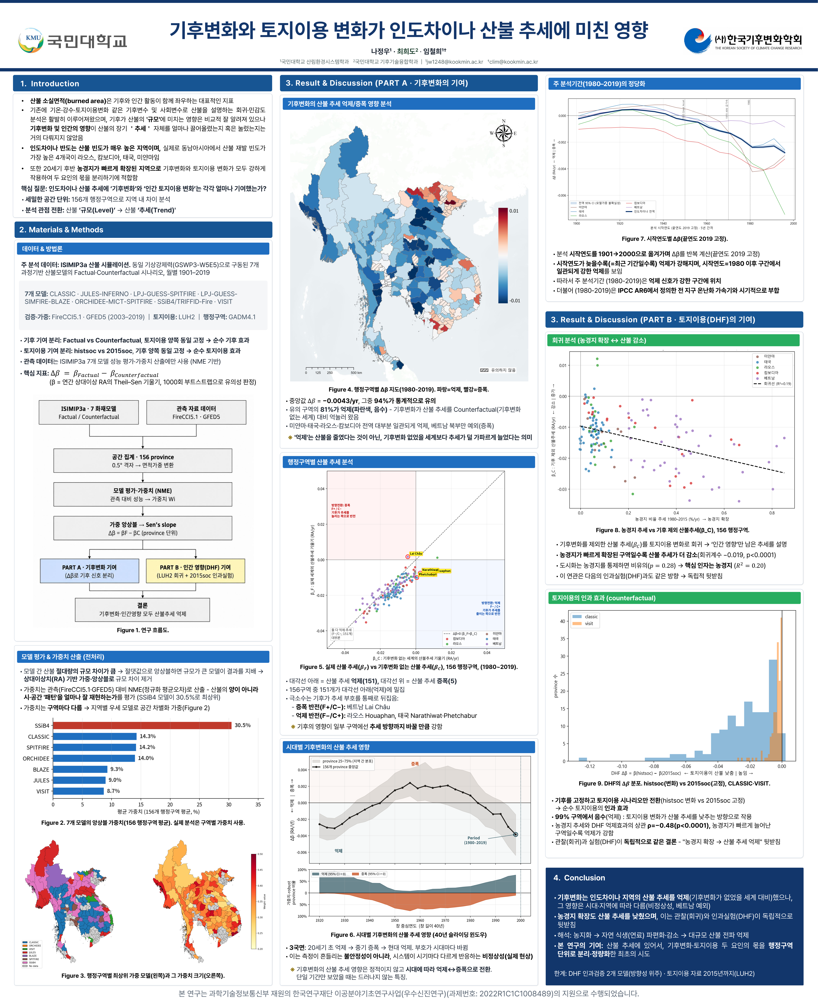
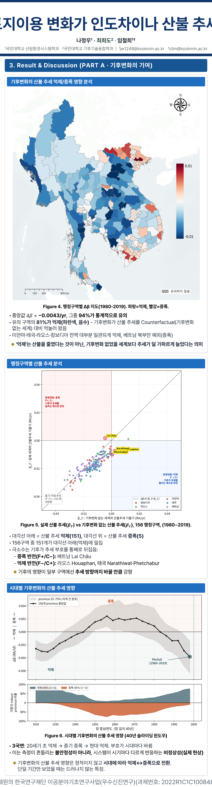
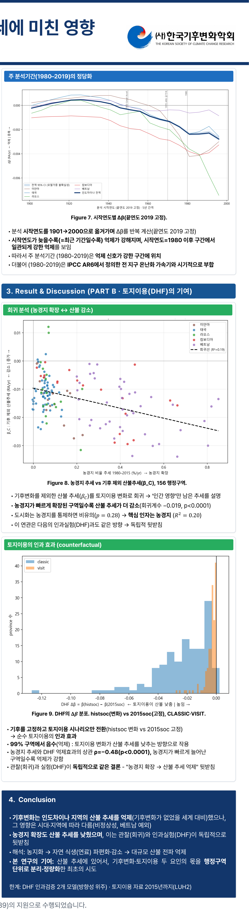

# 기후변화는 인도차이나 산불을 어떻게 바꿨나
### 소실면적 ‘추세(Trend)’에 대한 기후변화 vs 토지이용의 인과 분해 (2026 한국기후변화학회 춘계 포스터, 제2저자)

## 1. 여는 글
산불 소실면적은 기후와 인간 활동이 함께 좌우하는 지표입니다. 기존 연구는 기후가 산불의 ‘규모(Level)’에 미치는 영향은 많이 다뤘지만, **장기 ‘추세(Trend)’ 자체를 얼마나 끌어올렸는지/눌렀는지**는 거의 다루지 않았습니다. 이 연구는 산불 재발 빈도가 세계에서 가장 높은 인도차이나(라오스·캄보디아·태국·미얀마)를 대상으로, 156개 행정구역 단위에서 그 질문에 답합니다.

*연구 흐름(Fig 1)·행정구역별 기후 기여 지도(Fig 4)·실제 vs 반사실 추세(Fig 5)·시대별(Fig 6)·농경지 vs 산불(Fig 8)·토지이용 인과(Fig 9)를 한 장에 담았습니다.*

*Fig 4 행정구역별 Δβ 지도와 Fig 5 실제 vs 반사실 추세. 파란색이 억제, 빨간색이 증폭입니다.*

*Fig 8 농경지 확장 vs 산불 추세 산점도와 Fig 9 반사실 인과실험(DHF). 농경지가 빠르게 는 구역일수록 산불 추세가 더 감소했습니다.*

## 2. 데이터 & 방법
ISIMIP3a 산불 시뮬레이션(동일 기상강제력으로 구동된 7개 과정기반 산불모델의 Factual·Counterfactual, 월별 1901–2019)을 사용했습니다. 핵심 지표는 **Δβ = β(Factual) − β(Counterfactual)** — 연 상대이상치의 Theil–Sen 기울기 차이(1000회 부트스트랩)입니다. 즉 “기후변화가 있던 세계”와 “없던 세계”의 추세 기울기 차이를 봅니다.

## 3. 결과
- **기후변화의 기여**: 중앙값 Δβ ≈ **−0.0043/yr**, 그중 **94%가 통계적으로 유의**. 유의 구역의 **81%가 억제(추세를 덜 가파르게)** — 기후변화 없는 세계보다 산불 추세가 눌렸습니다(미얀마·태국·라오스·캄보디아 대부분, 베트남 북부만 증폭 예외).
  - ‘억제’는 산불이 줄었다는 뜻이 아니라, 기후변화가 없었을 세계보다 추세가 덜 가파르게 늘었다는 의미입니다.
- **시대별 비정상성**: 20세기 초 억제 → 중기 증폭 → 현대 억제로, 부호가 시대마다 바뀌었습니다. 단일 기간만 보면 드러나지 않는 특징입니다.
- **토지이용(인간)의 기여**: 농경지가 빠르게 확장된 구역일수록 산불 추세가 더 감소(회귀계수 −0.019, p<0.0001). 도시화를 통제해도 핵심 인자는 농경지(R²=0.20)였고, 반사실 인과실험(DHF)과도 같은 방향으로 독립 뒷받침되었습니다.

## 4. 의미
산불의 ‘추세’를 기후변화와 토지이용 두 요인의 몫으로 **행정구역 단위로 분리·정량화한 최초의 시도**입니다. 산불 대응 정책이 규모뿐 아니라 장기 추세의 원인까지 겨냥해야 함을 시사합니다.

## 5. 맺음말
같은 산불이라도 어디서는 기후가 눌렀고 어디서는 밀어올렸습니다. 원인을 지역 단위로 분해해야 정책이 정밀해집니다. 긴 글 읽어주셔서 감사합니다.

---
**링크** · 발표자료: /materials/인도차이나산불_포스터.pdf · 포트폴리오: https://portfolio-eight-ruddy-87.vercel.app
