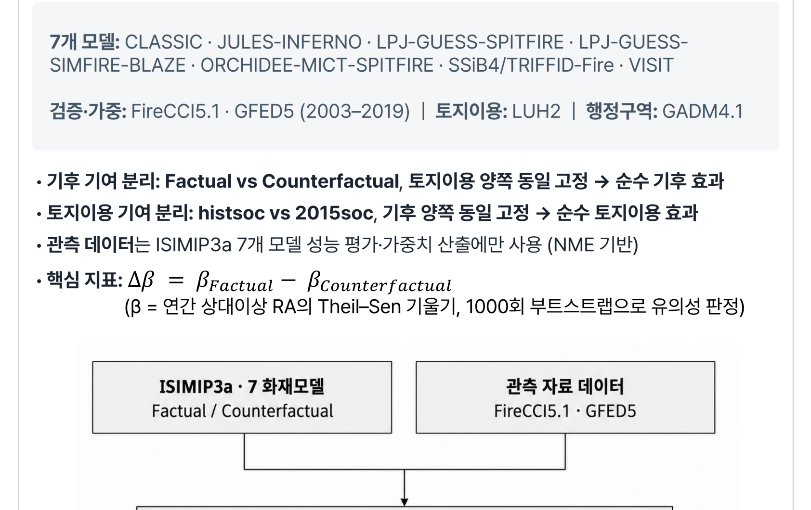
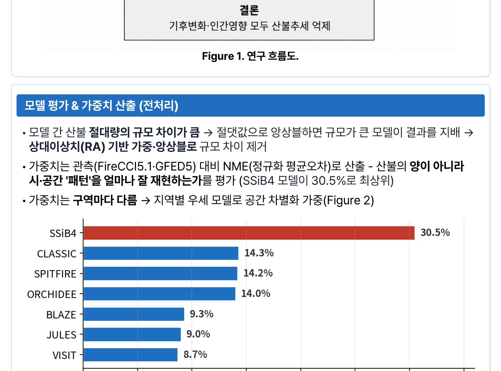
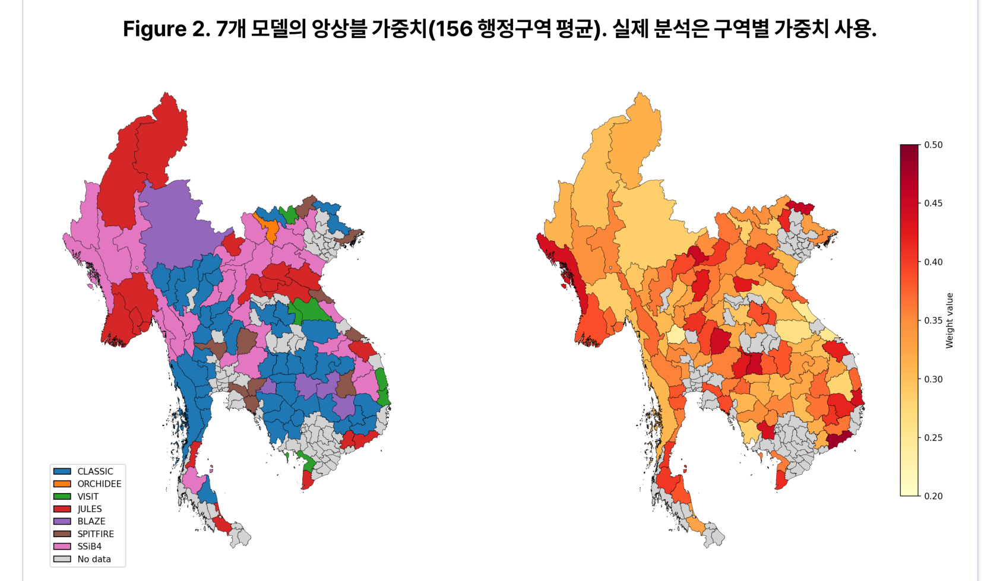
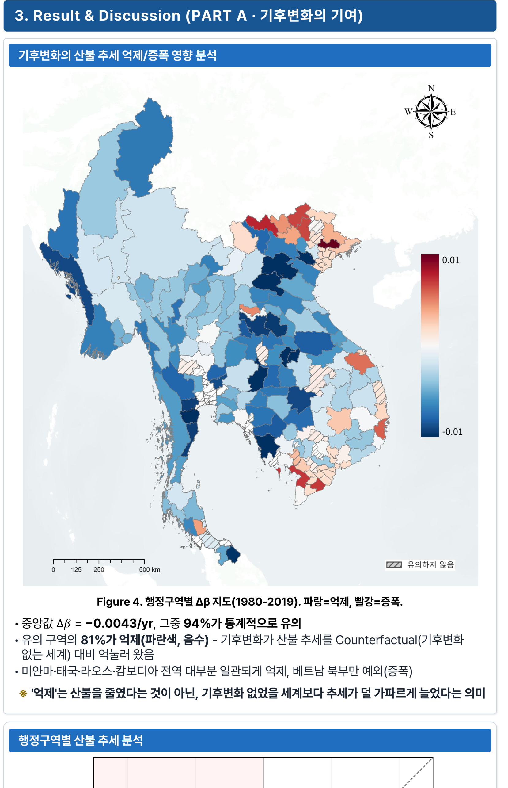
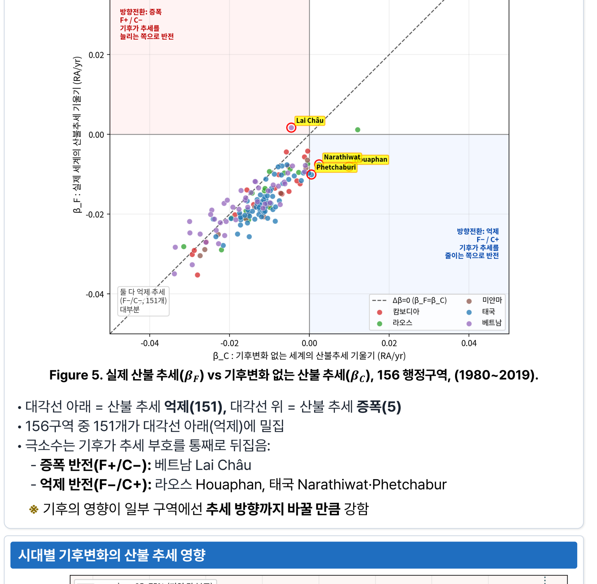
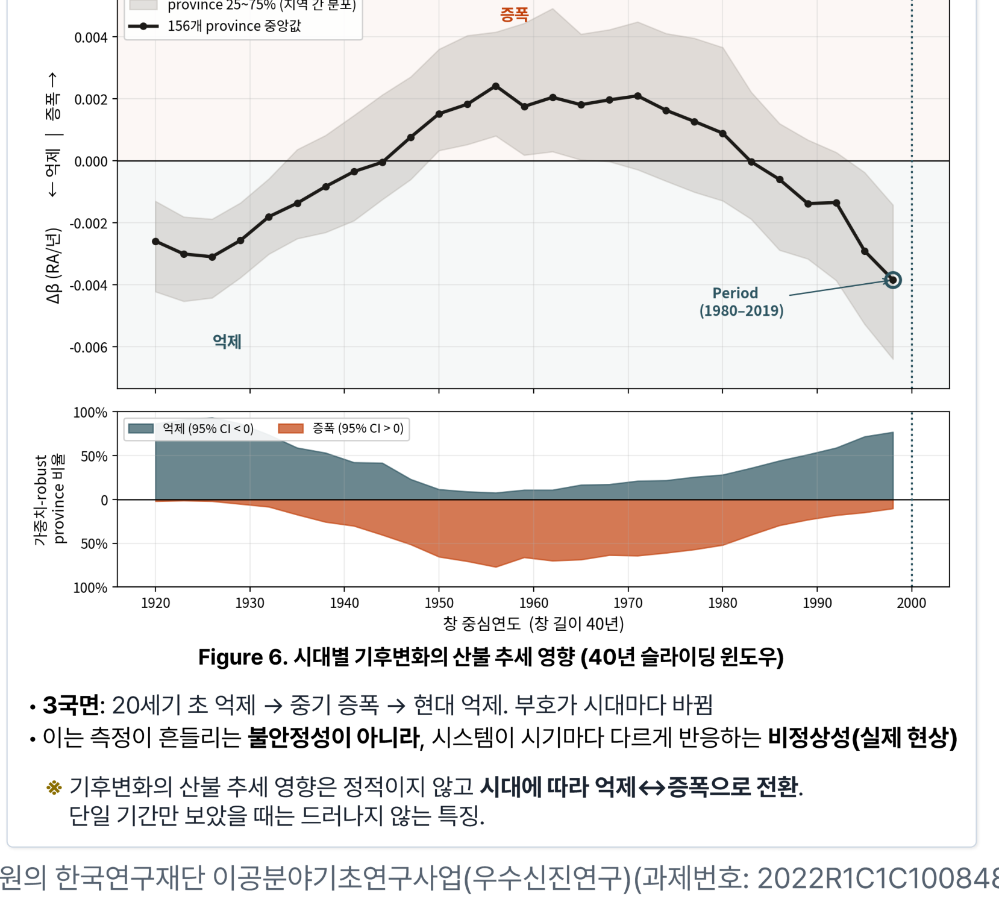
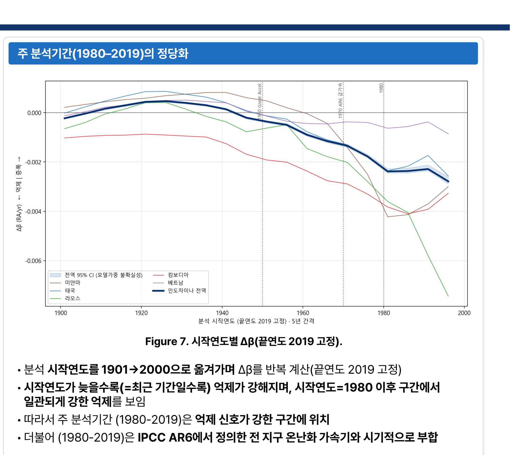
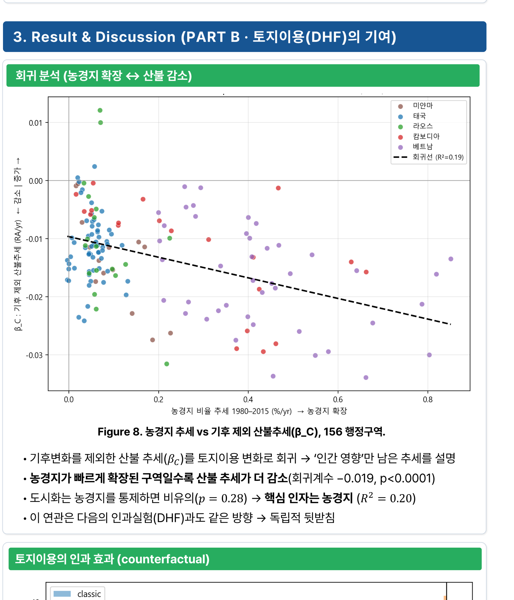
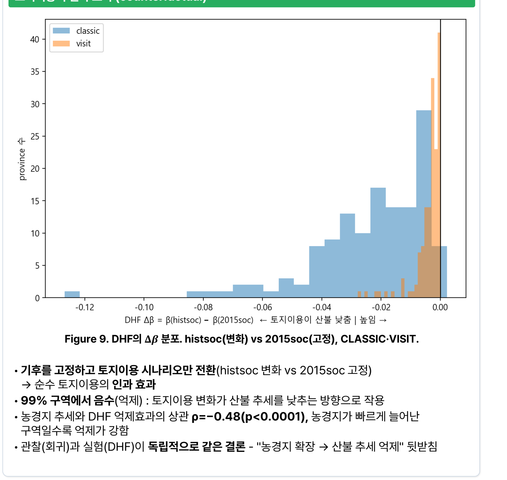
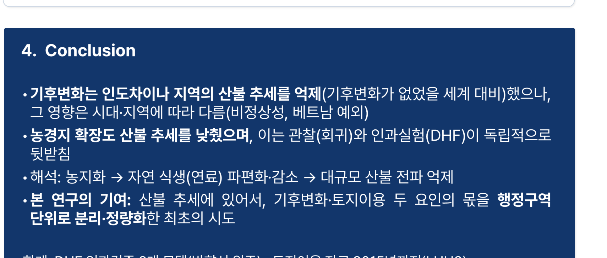

# 기후변화가 산불을 '줄였다'는 결과가 나왔습니다
## 인도차이나 156개 행정구역에서 기후와 토지이용의 몫을 분리해 본 연구

안녕하세요. 이번 글은 2026년 한국기후변화학회 상반기 학술대회에서 포스터로 발표한 연구입니다(제1저자 나정우, 제2저자 최희도, 지도교수 임철희).

결과를 먼저 말씀드리면, 상식과 반대되는 것처럼 보이는 숫자가 나왔습니다.

**"기후변화는 인도차이나 지역의 산불 추세를 오히려 억제했다."**

기후변화가 산불을 늘린다는 게 상식인데 왜 이런 결과가 나왔을까요? 그리고 이 '억제'라는 말이 정확히 무슨 뜻일까요?

미리 결론을 말씀드리면 **이건 "기후변화가 좋았다"는 뜻이 전혀 아닙니다.** 이 오해하기 쉬운 결과를 정확히 설명하는 게 이 글의 가장 중요한 목적입니다. 천천히 따라와 주세요.

---

## 1. 질문을 바꿨습니다: '규모'에서 '추세'로

먼저 기존 연구가 무엇을 봤는지 정리하겠습니다.

산불 소실면적(burned area)은 기후와 인간 활동이 함께 좌우하는 대표적인 지표입니다. 그동안 기온·강수·토지이용 변화 같은 변수로 산불을 설명하는 회귀·민감도 분석은 활발히 이뤄져 왔습니다. 그래서 **기후가 산불의 '규모'에 미치는 영향은 비교적 잘 알려져 있습니다.** 더우면 잘 타고, 건조하면 잘 번집니다.

그런데 저희가 던진 질문은 결이 다릅니다.

> **기후변화와 인간의 영향이 산불의 장기 '추세' 자체를 얼마나 끌어올렸거나 눌렀는가?**

'규모'와 '추세'는 다릅니다. 규모는 "올해 얼마나 탔나"이고, 추세는 "수십 년에 걸쳐 늘거나 줄어드는 속도"입니다. 그리고 이 추세에 대한 기여는 거의 다뤄지지 않았습니다.

대상지는 인도차이나 반도(라오스·캄보디아·태국·미얀마)로 정했습니다. 이유가 두 가지입니다.

- 이 지역은 **산불 재발 빈도가 세계에서 가장 높은 4개국**이 모여 있습니다.
- **20세기 후반 농경지가 빠르게 확장**된 지역이라, 기후와 인간의 몫을 분리하기에 적합합니다.

분석 단위는 **156개 행정구역(province)**으로 세밀하게 잘랐습니다. 국가 단위로 보면 지역 내부의 차이가 뭉개지기 때문입니다. 같은 태국 안에서도 북부 산간과 남부 반도의 사정이 전혀 다릅니다.

---

## 2. 방법: '기후변화가 없었던 세계'를 만들어 비교하기

여기가 이 연구의 핵심 아이디어입니다. 기후변화의 기여를 알려면 **기후변화가 없었을 경우와 비교**해야 합니다. 그런데 그런 세계는 존재하지 않죠. 그래서 모델로 만듭니다.

**ISIMIP3a**라는 국제 모델 비교 프로젝트의 산불 시뮬레이션을 사용했습니다. 동일한 기상 강제력(GSWP3-W5E5)으로 구동된 **7개 과정기반 산불 모델**의 두 가지 실험 결과가 있습니다.

- **Factual(사실 세계)**: 실제 관측된 기후를 넣고 돌린 결과
- **Counterfactual(반사실 세계)**: 기후변화가 없었다고 가정한 기후를 넣고 돌린 결과

사용한 7개 모델은 CLASSIC, JULES-INFERNO, LPJ-GUESS-SPITFIRE, LPJ-GUESS-SIMFIRE-BLAZE, ORCHIDEE-MICT-SPITFIRE, SSiB4/TRIFFID-Fire, VISIT입니다. 기간은 1901~2019년 월별 자료이고, 검증·가중에는 위성 관측 산불자료(FireCCI5.1, GFED5), 토지이용에는 LUH2, 행정구역에는 GADM4.1을 썼습니다.

핵심 지표는 이렇게 정의했습니다.

**Δβ = β(Factual) − β(Counterfactual)**

여기서 β는 연 상대이상치의 **Theil–Sen 기울기**(추세)이고, 유의성은 1,000회 부트스트랩으로 판정했습니다. Theil–Sen을 쓴 이유는 극단값에 강건한 추세 추정 방법이기 때문입니다. 산불 데이터에는 한 해 유독 크게 타는 경우가 있어서, 일반 회귀를 쓰면 그 한 해가 추세 전체를 흔듭니다.

### 모델 7개를 어떻게 합쳤나

여기서 신경 쓴 부분이 하나 있습니다. 모델마다 산불 규모 추정치가 크게 다릅니다. 어떤 모델은 다른 모델의 몇 배를 태웁니다. 절댓값으로 그냥 평균 내면 **규모가 큰 모델이 결과를 지배**해 버립니다.

그래서 두 가지 조치를 했습니다.

**첫째, 상대이상치(RA) 기반으로 앙상블**해 규모 차이를 제거했습니다. 절대량이 아니라 평년 대비 변화율로 바꿔서 비교한 것입니다.

**둘째, 가중치를 관측 재현 능력으로 산출**했습니다. 관측자료(FireCCI5.1·GFED5) 대비 NME(정규화 평균오차)로 평가했는데, 여기서 중요한 건 평가 기준입니다. **산불의 '양'을 얼마나 맞히는가가 아니라, 시·공간 '패턴'을 얼마나 잘 재현하는가**로 평가했습니다.

그 결과 SSiB4/TRIFFID-Fire가 30.5%로 최상위 가중치를 받았고, CLASSIC 14.3%, SPITFIRE 14.2%, ORCHIDEE 14.0%, BLAZE 9.3%, JULES 9.0%, VISIT 8.7% 순이었습니다.

그리고 가중치는 **구역마다 다르게** 적용했습니다. 이게 꽤 중요한 처리입니다. 어떤 모델은 미얀마에서 잘 맞고, 어떤 모델은 캄보디아에서 잘 맞습니다. 전 지역에 같은 가중치를 쓰면 지역별 강점을 버리는 셈입니다.

---

## 3. 결과 1: 유의 구역의 81%에서 '억제'가 나타났습니다

이제 결과입니다.

- 중앙값 **Δβ = −0.0043/yr**이고, 그중 **94%가 통계적으로 유의**했습니다.
- 유의한 구역의 **81%가 억제(파란색)** 방향이었습니다.
- 미얀마·태국·라오스·캄보디아 전역이 대부분 일관되게 억제였고, **베트남 북부만 예외적으로 증폭**이었습니다.

### 여기서 '억제'의 뜻을 정확히 해야 합니다

이 부분을 오해하시면 결론이 완전히 반대로 전달됩니다. 다시 강조하겠습니다.

> **'억제'는 산불이 줄었다는 뜻이 아닙니다. 기후변화가 없었을 세계보다 추세가 덜 가파르게 늘었다는 뜻입니다.**

즉 산불은 여전히 늘어날 수 있습니다. 다만 "기후변화 때문에 더 빠르게 늘었다"고 말하기는 어렵다는 것입니다. **기준선이 '현재 대비'가 아니라 '기후변화 없는 가상 세계 대비'**라는 점이 핵심입니다.

왜 이런 일이 가능할까요. 이 지역은 원래 매우 건조한 건기에 산불이 집중됩니다. 그런데 기후변화가 강수 패턴을 바꾸면서 일부 지역에서는 건기 조건이 오히려 완화되거나, 식생 생장 조건이 바뀌어 연료 구조가 달라질 수 있습니다. 기후변화의 효과가 지역과 계절에 따라 다르게 작용한다는 뜻입니다.

또 하나 흥미로운 발견이 있습니다. 156개 구역 중 151개는 억제 쪽(대각선 아래)에 몰려 있었지만, **극소수 구역에서는 기후가 추세의 부호 자체를 뒤집었습니다.**

- **증폭 반전(F+/C−)**: 베트남 Lai Châu — 기후변화가 있어야 증가로 바뀜
- **억제 반전(F−/C+)**: 라오스 Houaphan, 태국 Narathiwat·Phetchabur — 기후변화가 없었으면 증가했을 곳

기후의 영향이 일부 구역에서는 **추세 방향까지 바꿀 만큼 강하다**는 뜻입니다.

### 시대에 따라 부호가 바뀝니다

40년 슬라이딩 윈도우로 시대별 변화를 봤더니, 이런 패턴이 나왔습니다.

**20세기 초 억제 → 중기 증폭 → 현대 억제**

부호가 시대마다 바뀌었습니다. 이걸 **비정상성(non-stationarity)**이라고 하는데, 시스템이 시기마다 다르게 반응한다는 뜻입니다. 단일 기간만 잘라서 보면 절대 드러나지 않는 특성입니다.

이 발견이 방법론적으로 중요한 이유가 있습니다. 만약 누가 "1950~1990년만 분석했더니 기후변화가 산불을 증폭시켰다"고 말하고, 다른 누가 "1980~2019년을 분석했더니 억제했다"고 말한다면, 둘 다 맞을 수 있습니다. **기간 선택이 결론을 바꿉니다.**

그래서 저희는 주 분석기간도 근거를 갖고 정했습니다. 시작연도를 1901년부터 2000년까지 옮겨가며 Δβ를 반복 계산해 봤더니, **시작연도가 늦을수록(최근 기간일수록) 억제가 강해지고, 1980년 이후 구간에서 일관되게 강한 억제**가 나타났습니다.

그래서 주 분석기간을 **1980~2019년**으로 정했고, 이는 IPCC AR6가 정의한 전 지구 온난화 가속기와도 시기적으로 부합합니다. 기간을 임의로 고른 게 아니라 데이터로 정당화한 것입니다.

---

## 4. 결과 2: 농경지가 늘어난 곳에서 산불 추세가 더 줄었습니다

이제 인간의 몫입니다. 기후 효과를 제외한 산불 추세(β_C)를 토지이용 변화로 회귀 분석했습니다.

결과는 이랬습니다.

- **농경지가 빠르게 확장된 구역일수록 산불 추세가 더 감소**했습니다(회귀계수 −0.019, p<0.0001).
- 도시화를 통제하면 비유의(p = 0.28)했고, **핵심 인자는 농경지**였습니다(R² = 0.20).

그런데 여기서 저희가 신경 쓴 부분이 있습니다. **회귀 분석은 상관관계를 보여줄 뿐입니다.** 농경지가 늘어난 곳에서 산불이 줄었다는 것과, 농경지 확장이 산불을 줄였다는 것은 다른 주장입니다.

그래서 **인과실험을 따로 했습니다.** 기후를 고정하고 토지이용 시나리오만 바꿔서(변화 vs 2015년 고정) 순수한 토지이용 효과를 뽑았습니다.

- **99% 구역에서 음수(억제)**로 나타났습니다.
- 농경지 추세와 이 억제효과의 상관은 **ρ = −0.48(p<0.0001)**이었습니다.

즉 **관찰(회귀)과 실험(반사실 시나리오)이 서로 독립적으로 같은 결론**을 내놓았습니다. 이런 이중 확인이 있으면 결론의 신뢰도가 크게 올라갑니다. 방법이 다른데 같은 답이 나오면, 특정 방법의 착시일 가능성이 낮아지니까요.

### 왜 농경지가 늘면 산불이 줄어드는가

해석은 이렇습니다. **농지화가 진행되면 자연 식생, 즉 연료가 파편화되고 줄어듭니다.** 논밭이 들어서면 숲이 조각조각 나뉘고, 그 사이가 끊깁니다. 그러면 불이 크게 번지기 어려워집니다.

즉 개별 화재 건수는 늘어날 수 있어도(농업 소각 등), **대규모 산불의 전파는 억제**되는 것입니다. 소실면적 추세로 보면 감소로 나타납니다.

이건 좋은 소식일까요? 반드시 그렇지 않습니다. **산불이 줄어든 이유가 숲이 줄어들었기 때문**이라면, 그건 생태계 측면에서는 손실입니다. 산불 통계가 개선된 것이 산림 건강이 개선된 것과 같지 않다는 뜻입니다.

---

## 5. 이 연구의 기여와 한계

**기여**는 명확합니다. 산불 추세에 있어서 **기후변화와 토지이용이라는 두 요인의 몫을 행정구역 단위로 분리해 정량화한 최초의 시도**입니다. 국가 단위로는 뭉개지고, 전 지구 단위로는 지역 특성이 사라지는데, 156개 구역 단위로 나눠 각각의 기여를 계산했습니다.

**한계**도 포스터에 그대로 밝혔습니다.

- 반사실 인과실험은 2개 모델(CLASSIC·VISIT)로만 수행해 방향성 확인 위주입니다.
- 토지이용 자료(LUH2)가 2015년까지여서 최근 변화는 반영되지 않았습니다.

## 6. 제가 이 연구에서 배운 것

저는 제2저자로 참여했는데, 이 연구를 통해 크게 배운 게 있습니다. **"결과가 상식과 반대일 때, 결과를 바꾸려 하지 말고 상식을 정확히 다시 정의해야 한다"**는 것입니다.

"기후변화가 산불을 억제했다"는 문장만 떼어 놓으면 오해를 부릅니다. 기후 회의론에 오용될 수도 있습니다. 실제로 이런 결과는 조심스럽게 다뤄야 합니다.

그래서 저희는 포스터 전체에서 **'억제'가 무엇에 대비한 억제인지**를 반복해서 명시했습니다. 지도 캡션에도, 결과 요약에도, 결론에도 넣었습니다. 기준선이 '현재'가 아니라 '기후변화 없는 가상 세계'라는 점을 놓치면 결론이 정반대로 전달되기 때문입니다.

과학 커뮤니케이션에서 **기준선 명시가 얼마나 중요한지** 체감한 연구였습니다. 숫자는 거짓말을 하지 않지만, 기준선을 빼놓으면 숫자가 거짓말을 하게 만들 수 있습니다.

긴 글 읽어주셔서 감사합니다.

---

*본 연구는 과학기술정보통신부 재원의 한국연구재단 이공분야기초연구사업(우수신진연구, 과제번호 2022R1C1C1008489)의 지원으로 수행되었습니다.*

**링크** · 포트폴리오 https://portfolio-eight-ruddy-87.vercel.app
