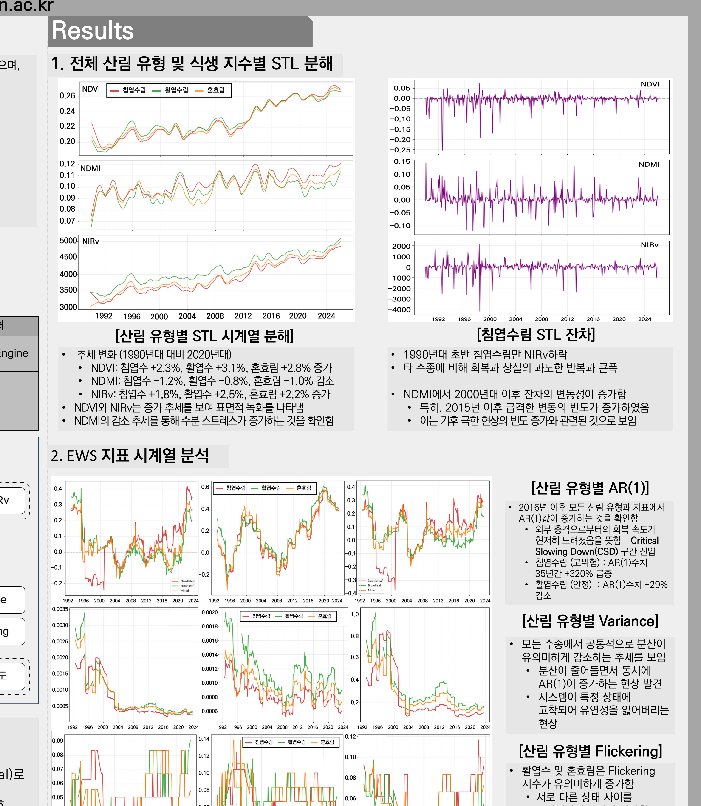
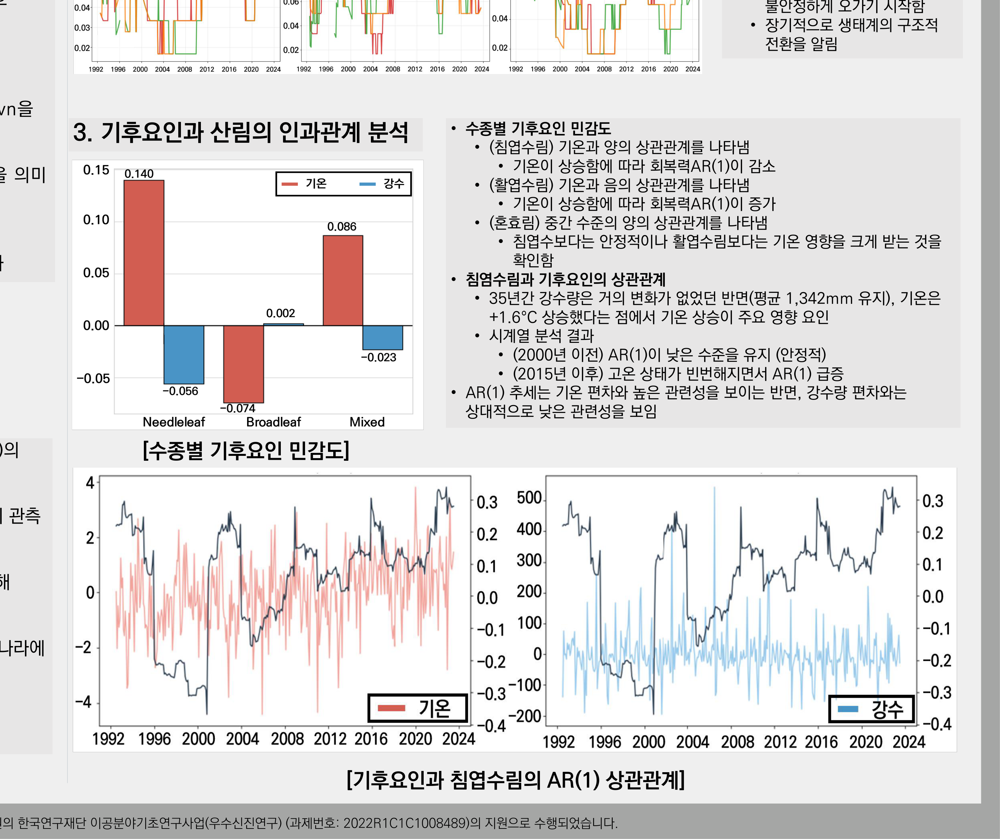

# 숲이 무너지기 전, 조기경보신호를 읽다
### EWS 기반 시계열 분석과 AR(1) 지표로 본 강원 침엽수림의 복원력 상실 (2026 산림과학 공동학술대회 포스터)

## 1. 여는 글
숲은 겉으로 푸르러 보여도 속으로는 회복력을 잃어가고 있을 수 있습니다. 일부 연구는 위성 관측상 ‘녹화’가 보임에도 **임계감속(Critical Slowing Down, CSD)** 신호가 뚜렷해지는 현상을 보고합니다. 이 연구는 강원도 산림을 대상으로 그 신호를 읽어냅니다.

*STL 분해 → EWS 3종(AR(1)·분산·Flickering) → 기후요인 상관까지의 전체 흐름과 결과를 한 장에 담았습니다.*

*산림 유형별 STL 분해와 AR(1)·분산·Flickering 시계열. 침엽수림의 AR(1)이 뚜렷이 상승합니다.*

*수종별 기온·강수 민감도. 침엽수림은 기온과 양(+)의 상관 — 기온 상승이 회복력 악화와 연결됩니다.*

## 2. 데이터 & 방법
- **데이터**: Landsat(5/7/8/9) 위성영상(1990–2025, 30m, Google Earth Engine), 임상도(수종), 월별 기상.
- **방법**: 분광지수(NDVI·NDMI·NIRv)를 STL로 추세·계절·잔차로 분해하고, 잔차에서 **조기경보신호(EWS)** 3종을 계산합니다.
  - **AR(1)**: 교란에서 회복하는 속도의 역수 — 1에 가까울수록 회복이 느려져 CSD를 의미
  - **분산(Variance)**: 평형에서 이탈하는 진폭
  - **Flickering**: 두 안정 상태 사이의 빠른 전환
- Kendall’s Tau로 시간 추세를, Pearson으로 기후요인과의 상관을 정량화했습니다.

## 3. 결과
- **AR(1) 급증**: 2016년 이후 모든 산림 유형에서 AR(1)이 상승. 특히 **침엽수림은 35년간 AR(1)이 +320% 급등**(활엽수림은 −29% 감소) — 침엽수림이 CSD 구간에 진입했음을 시사합니다.
- **분산·Flickering**: 분산이 줄면서 AR(1)이 동시에 증가 — 시스템이 특정 상태에 고착되어 유연성을 잃는 현상. 활엽·혼효림에서 Flickering이 유의하게 증가.
- **기후요인 민감도**: 침엽수림은 기온과 양(+)의 상관 — **기온이 오를수록 회복력(AR(1) 관점)이 악화**. 35년간 강수는 거의 변화가 없었던 반면 기온은 +1.6℃ 상승해, 기온이 주요 요인으로 확인되었습니다.

## 4. 의미
단순 식생 지수 모니터링으로는 보이지 않는 **복원력 상실 과정**을 STL+EWS로 시각화·정량화했습니다. ‘녹색이지만 병든 숲’을 조기에 진단하는 틀을 제시합니다.

## 5. 맺음말
겉의 녹화가 아니라 속의 회복력을 봐야 합니다. 향후 고해상(Sentinel-2·드론)·바이오매스 데이터와 결합해 고도화할 계획입니다. 긴 글 읽어주셔서 감사합니다.

---
**링크** · 발표자료: /materials/산림과학회_포스터.pdf · 포트폴리오: https://portfolio-eight-ruddy-87.vercel.app
