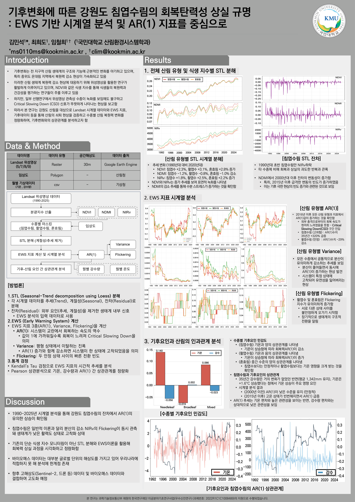
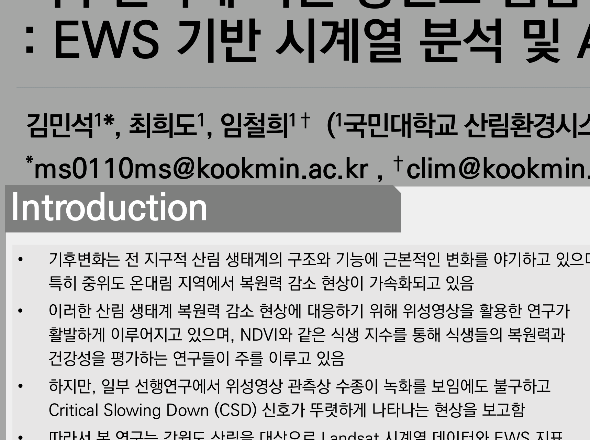
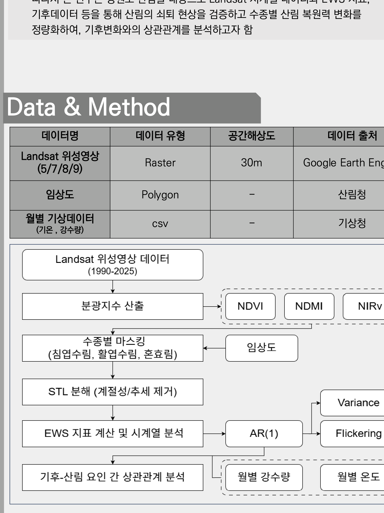
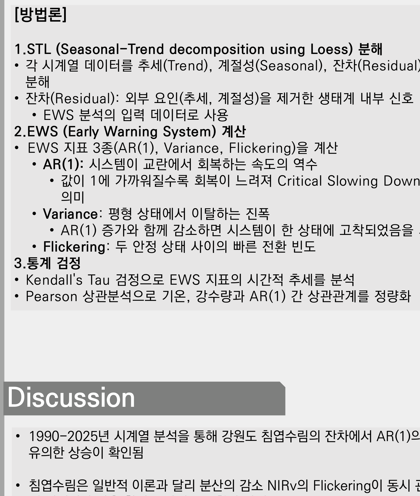
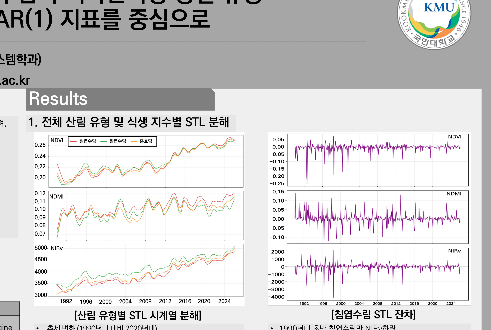
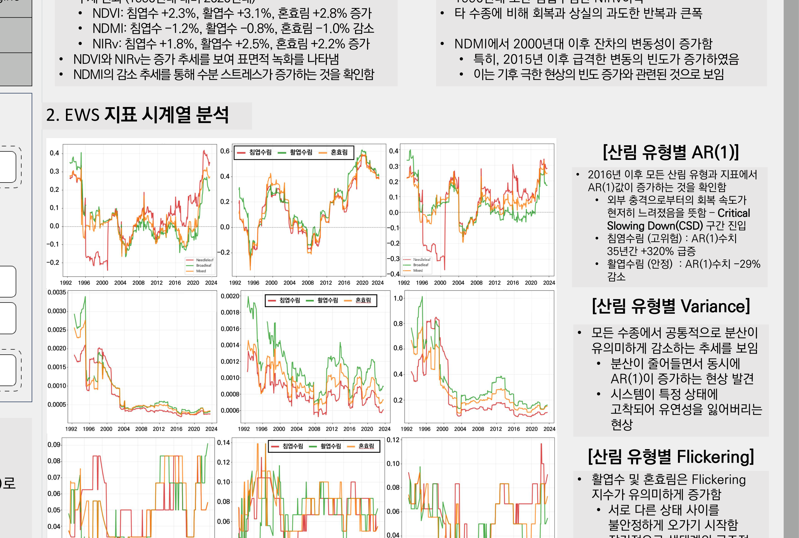
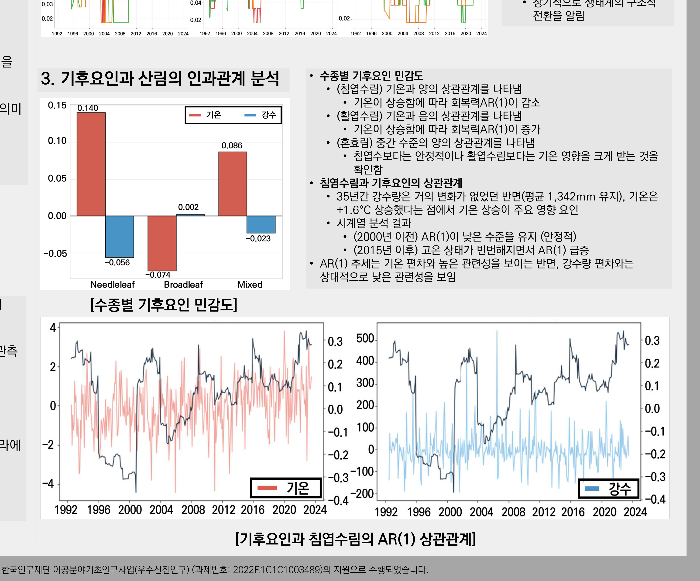
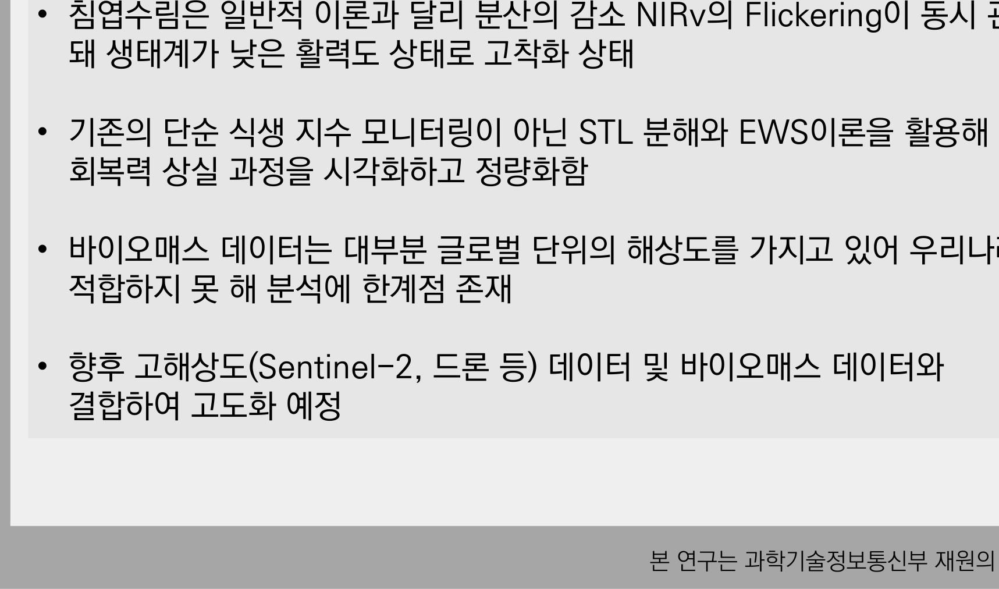

# 숲은 푸른데 병들고 있었습니다
## 위성 35년 시계열로 강원도 침엽수림의 회복탄력성 상실을 잡아낸 연구

안녕하세요. 이번 글은 2026년 산림과학 공동학술대회에서 포스터로 발표한 연구입니다(제1저자 김민석, 제2저자 최희도, 지도교수 임철희).

이 연구의 출발점은 조금 이상한 관찰이었습니다.

**"위성으로 보면 숲이 더 푸르러지고 있는데, 왜 어떤 연구들은 숲이 위험하다고 말하는가?"**

식생지수는 올라가는데 생태계는 나빠지고 있다는 상반된 신호. 이 모순을 어떻게 이해해야 할까요. 이 연구는 **'푸른 정도'가 아니라 '회복하는 힘'을 측정**해서 답을 찾았습니다.

그리고 결과는 꽤 심각했습니다. **강원도 침엽수림의 회복력 지표가 35년간 320% 악화**되어 있었습니다.

---

## 1. 식생지수가 오르는데 왜 위험하다고 하는가

먼저 배경입니다. 기후변화는 전 지구적 산림 생태계의 구조와 기능에 근본적인 변화를 야기하고 있고, 특히 **중위도 온대 지역에서 회복력 감소 현상이 가속**되고 있습니다.

산림 건강을 평가할 때 가장 흔히 쓰는 게 **NDVI(정규화식생지수)** 같은 식생지수입니다. 잎이 많고 푸르면 값이 올라갑니다. 그래서 NDVI가 오르면 "숲이 좋아졌다"고 해석하는 게 보통입니다.

그런데 일부 선행연구에서 이상한 보고가 나왔습니다. **위성 관측상 수종이 녹화(greening)를 보임에도 임계감속(Critical Slowing Down, CSD) 신호가 뚜렷하게 나타나는 현상**입니다.

### 임계감속이란 무엇인가

이 개념이 이 연구의 핵심이라 조금 자세히 설명하겠습니다.

건강한 시스템은 외부에서 충격을 받아도 빨리 원래 상태로 돌아옵니다. 태풍이 지나가도, 가뭄이 와도 이듬해에는 회복합니다. 이 '되돌아오는 힘'을 **회복탄력성(resilience)**이라고 합니다.

그런데 시스템이 한계에 가까워지면 **회복 속도가 점점 느려집니다.** 충격을 받은 뒤 원래대로 돌아오는 데 시간이 오래 걸립니다. 이것이 **임계감속**이고, 생태학에서는 **급격한 전환(regime shift)이 임박했다는 조기경보신호**로 해석합니다.

사람에 비유하면 이렇습니다. 젊을 때는 감기에 걸려도 3일이면 낫습니다. 그런데 몸이 약해지면 같은 감기가 2주씩 갑니다. 겉모습은 비슷해 보이지만 회복력이 떨어진 상태입니다.

즉 **'푸른 정도'와 '회복하는 힘'은 완전히 다른 것**입니다. 겉으로는 아직 멀쩡해 보이지만 내부적으로는 이미 취약해진 숲이 있을 수 있다는 뜻입니다. 이 연구는 후자를 측정했습니다.

---

## 2. 방법: 시계열을 분해하고 '회복 속도'를 재기

### 2-1. 데이터

- **Landsat 위성영상**(5/7/8/9호), 1990~2025년, 공간해상도 30m, Google Earth Engine으로 처리
- **임상도**(산림청, 폴리곤): 수종별로 침엽수림·활엽수림·혼효림을 구분하는 데 사용
- **월별 기상자료**(기상청, CSV): 기온과 강수량

35년이라는 긴 기간이 중요합니다. 회복력 변화는 몇 년 단위로는 보이지 않기 때문입니다. Landsat이 1980년대부터 운영되어 온 덕분에 이런 장기 분석이 가능합니다.

분광지수는 세 가지를 썼습니다.

- **NDVI**: 잎의 양(녹색 정도)
- **NDMI**: 수분 상태(건조 스트레스)
- **NIRv**: 실제 광합성 활동에 더 가까운 지표

세 개를 함께 본 이유는, 하나만 보면 놓치는 게 있기 때문입니다. 뒤에서 보시면 이 선택이 결정적이었습니다.

### 2-2. STL 분해: 계절을 걷어내야 진짜 신호가 보입니다

여기가 방법론의 첫 단계이고, 개인적으로 가장 중요한 처리라고 생각합니다.

위성 시계열을 그대로 보면 **계절 변동이 압도적**입니다. 여름에 푸르고 겨울에 갈색인 것은 당연하니까요. 이 계절 리듬 때문에 정작 봐야 할 신호가 묻힙니다.

그래서 **STL(Seasonal-Trend decomposition using Loess)**로 시계열을 세 성분으로 나눴습니다.

- **추세(Trend)**: 장기적으로 올라가는지 내려가는지
- **계절성(Seasonal)**: 매년 반복되는 리듬
- **잔차(Residual)**: 추세와 계절로 설명되지 않는 나머지

그리고 **잔차만을 조기경보신호 분석의 입력**으로 씁니다. 왜냐하면 잔차가 곧 **외부 요인(추세·계절)을 제거한 생태계 내부의 반응**이기 때문입니다. 시스템이 흔들리고 회복하는 과정이 여기에 담깁니다.

### 2-3. 조기경보신호 3종

잔차에서 세 가지 지표를 계산했습니다.

**AR(1) 자기상관** — 이번 값이 직전 값과 얼마나 닮았는지를 재는 지표입니다. 값이 1에 가까워질수록 **회복이 느려짐**을 의미합니다. 교란에서 회복하는 속도의 역수라고 보면 됩니다. 어제와 오늘이 너무 비슷하다는 건, 흔들린 상태가 계속 이어진다는 뜻이니까요.

**분산(Variance)** — 평형 상태에서 이탈하는 진폭입니다. 보통 시스템이 불안정해지면 진폭이 커집니다.

**Flickering** — 두 안정 상태 사이를 빠르게 오가는 빈도입니다. 시스템이 어느 상태에 있어야 할지 못 정하고 흔들리는 상황을 잡아냅니다.

통계 검정으로는 Kendall's Tau로 시간 추세의 유의성을, Pearson 상관으로 기후요인과의 관계를 검정했습니다.

---

## 3. 결과 1: 겉으로는 녹화, 속으로는 건조

먼저 STL 분해로 본 장기 추세입니다. 1990년대 대비 2020년대를 비교했습니다.

| 지표 | 침엽수림 | 활엽수림 | 혼효림 | 의미 |
|---|---|---|---|---|
| NDVI | **+2.3%** | +3.1% | +2.8% | 표면적 녹화 |
| NDMI | **−1.2%** | −0.8% | −1.0% | **수분 스트레스 증가** |
| NIRv | **+1.8%** | +2.5% | +2.2% | 광합성 활동 증가 |

여기서 첫 번째 모순이 드러납니다. **NDVI와 NIRv는 증가(녹화)하는데, NDMI는 감소(건조)합니다.**

잎은 더 많아졌는데 수분 상태는 나빠졌습니다. 사람으로 비유하면 겉보기 체격은 커졌는데 만성 탈수 상태인 셈입니다. 그러니까 **식생지수 하나만 보고 "숲이 좋아졌다"고 판단하면 놓치는 게 있습니다.** 세 지표를 함께 본 이유가 여기서 드러납니다.

잔차 쪽에서도 신호가 잡혔습니다. **1990년대 초반 침엽수림만 NIRv가 하락**했고, 다른 수종에 비해 회복과 상실의 과도한 반복과 큰 폭을 보였습니다. 특히 NDMI에서 **2000년대 이후 잔차의 변동성이 증가**했고, 그중에서도 **2015년 이후 급격한 변동의 빈도가 증가**했는데, 이는 기후 극한현상의 빈도 증가와 관련된 것으로 보입니다.

---

## 4. 결과 2: 침엽수림의 AR(1)이 35년간 320% 급등했습니다

이 연구의 핵심 결과입니다.

**2016년 이후 모든 산림 유형과 지표에서 AR(1)이 증가**했습니다. 즉 외부 충격으로부터 회복하는 속도가 현저히 느려졌다는 뜻이고, **임계감속 구간에 진입**했음을 시사합니다.

그런데 수종별로 방향이 완전히 갈렸습니다.

- **침엽수림(고위험): AR(1) 수치가 35년간 +320% 급등**
- **활엽수림(안정): AR(1) 수치 −29% 감소**

침엽수림은 회복력이 급격히 나빠지고 있고, 활엽수림은 오히려 나아졌습니다. 같은 강원도, 같은 기후 조건인데 수종에 따라 정반대로 반응한 것입니다.

### 이론과 다른 조합이 나타났습니다

여기서 이론적으로 매우 흥미로운 관찰이 있었습니다. **모든 수종에서 분산이 유의하게 감소**했습니다.

그런데 일반적인 조기경보신호 이론에서는 **AR(1)과 분산이 함께 증가**할 것으로 예측합니다. 시스템이 불안정해지면 회복도 느려지고 흔들림도 커진다는 게 상식적인 예측이니까요.

침엽수림에서는 **분산은 줄어드는데 AR(1)은 증가**하는, 이론과 다른 조합이 나타났습니다. 이건 무슨 뜻일까요?

연구팀의 해석은 이렇습니다. **시스템이 특정 상태에 고착되어 유연성을 잃어버린 상태**입니다. 진폭이 줄어든 게 안정된 것이 아니라, **반응할 여력 자체가 사라진 것**입니다. 낮은 활력도 상태에 갇힌 것이죠.

다시 사람에 비유하면, 체온이 일정한 게 건강해서가 아니라 체온 조절 능력을 잃어서일 수도 있습니다. 변동이 없다는 게 반드시 좋은 신호가 아니라는 뜻입니다.

Flickering은 활엽수림과 혼효림에서 유의하게 증가했는데, 이는 서로 다른 상태 사이를 불안정하게 오가기 시작했음을, 장기적으로는 생태계의 구조적 전환을 알리는 신호로 볼 수 있습니다.

---

## 5. 결과 3: 원인은 강수가 아니라 기온이었습니다

그럼 무엇이 이 변화를 만들었을까요. 기후요인과의 상관을 봤습니다.

- **침엽수림**: 기온과 **양(+)의 상관**(0.140). 기온이 상승할수록 AR(1)이 증가 → **회복력 악화**
- **활엽수림**: 기온과 **음(−)의 상관**(−0.074). 기온이 상승할수록 AR(1)이 감소 → 상대적으로 유리
- **혼효림**: 중간 수준의 양의 상관(0.086)

침엽수림은 활엽수림보다 **기온 영향을 크게 받는다**는 것이 확인되었습니다.

그리고 결정적인 관찰이 있었습니다. 35년간 **강수량은 거의 변화가 없었던 반면(평균 1,342mm 유지), 기온은 +1.6℃ 상승**했습니다.

즉 **강수가 아니라 기온이 주요 영향 요인**입니다. AR(1) 추세는 기온 편차와 유의한 관련성을 보였고, 강수량 편차와는 상대적으로 낮은 관련성을 보였습니다.

시계열로 보면 더 명확합니다. **2000년 이전에는 AR(1)이 낮은 수준으로 안정적이었는데, 2015년 이후 고온 상태가 빈번해지면서 AR(1)이 급증**했습니다.

왜 침엽수림이 기온에 더 취약할까요. 침엽수는 일반적으로 서늘한 기후에 적응한 수종입니다. 강원도의 침엽수림은 상당 부분 고지대나 북향 사면에 분포하는데, 기온이 오르면 이들에게는 서식 조건이 나빠집니다. 반면 활엽수는 상대적으로 온난한 조건에서 유리할 수 있습니다.

즉 기온 상승이 **수종 간 경쟁 구도를 바꾸고 있고**, 그 과정이 회복력 지표에 먼저 나타나고 있는 것으로 볼 수 있습니다.

---

## 6. 이 연구가 말하는 것

정리하면 이렇습니다.

**1990~2025년 시계열 분석을 통해 강원도 침엽수림의 잔차에서 AR(1)의 유의한 상승이 확인되었습니다.** 침엽수림은 일반 이론과 달리 분산의 감소와 NIRv의 Flickering이 동시에 관측되어, **생태계가 낮은 활력도 상태에 고착**된 것으로 판단됩니다.

방법론적으로는 **단순 식생지수 모니터링이 아니라 STL 분해와 EWS 이론을 활용해 회복력 상실 과정을 시각화하고 정량화**했다는 점이 이 연구의 기여입니다.

한계도 밝혔습니다. 바이오매스 데이터는 대부분 글로벌 단위의 해상도를 가지고 있어 우리나라 분석에 적합하지 못한 부분이 있었습니다. 향후 고해상도(Sentinel-2, 드론) 데이터 및 바이오매스 데이터와 결합해 고도화할 예정입니다.

## 7. 제가 인상 깊었던 지점

저는 제2저자로 참여했는데, 이 연구에서 가장 배운 게 있습니다.

**"지표가 좋아진다고 상태가 좋아진 게 아니다"**는 것입니다.

NDVI만 보면 우리 숲은 계속 좋아지고 있습니다. 실제로 산림녹화 이후 한국의 식생지수는 세계적으로도 눈에 띄게 개선되었습니다. 국제 비교 자료에서 한국은 녹화 성공 사례로 자주 언급됩니다.

그런데 회복력 관점에서 보면 침엽수림은 위험 신호를 보내고 있었습니다. 겉은 푸른데 회복하는 힘을 잃어가고 있었던 것입니다.

**무엇을 측정하느냐가 결론을 바꿉니다.** 그리고 더 중요하게는, **정책은 측정된 것을 따라갑니다.** 만약 우리가 계속 '푸른 정도'만 측정한다면, 회복력이 무너지는 과정은 아무도 모르는 채 진행될 것입니다. 그리고 어느 순간 급격한 전환이 일어난 뒤에야 알게 될 것입니다.

그래서 이런 조기경보 연구가 필요하다고 생각합니다. **무너지기 전에 신호를 읽을 수 있다면, 아직 손 쓸 시간이 있으니까요.**

긴 글 읽어주셔서 감사합니다.

---

*본 연구는 과학기술정보통신부 재원의 한국연구재단 이공분야기초연구사업(우수신진연구, 과제번호 2022R1C1C1008489)의 지원으로 수행되었습니다.*

**링크** · 포트폴리오 https://portfolio-eight-ruddy-87.vercel.app
