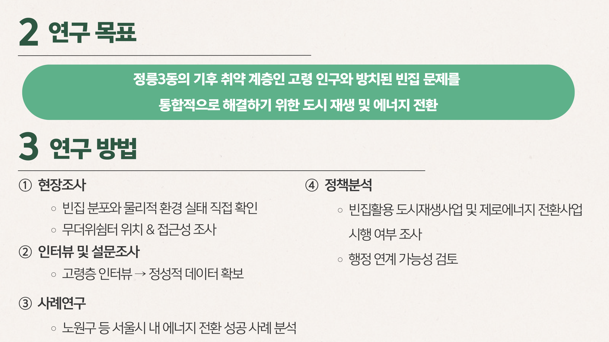
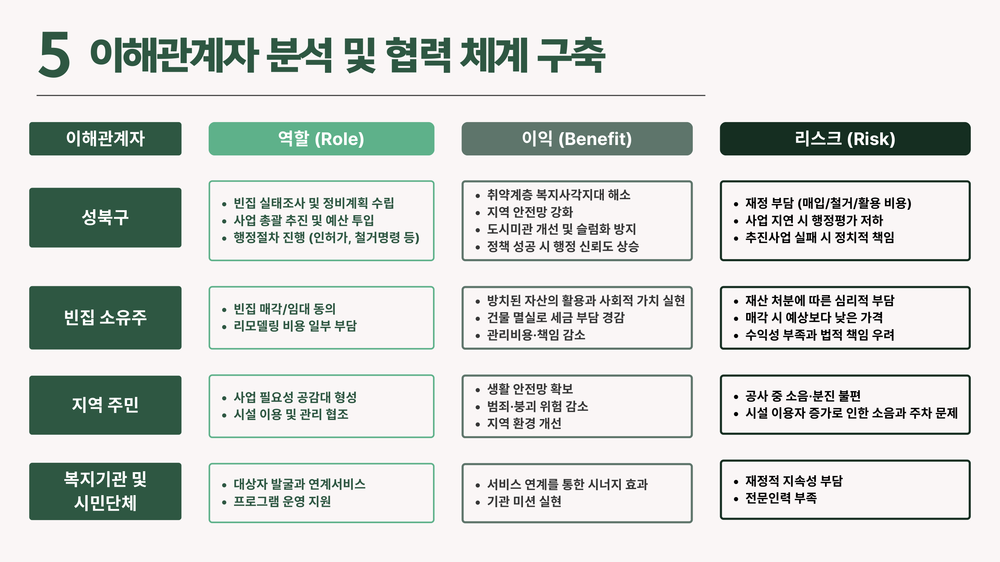
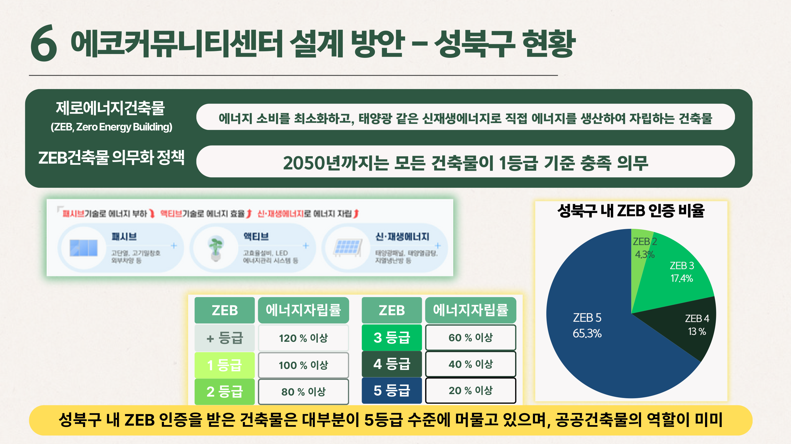
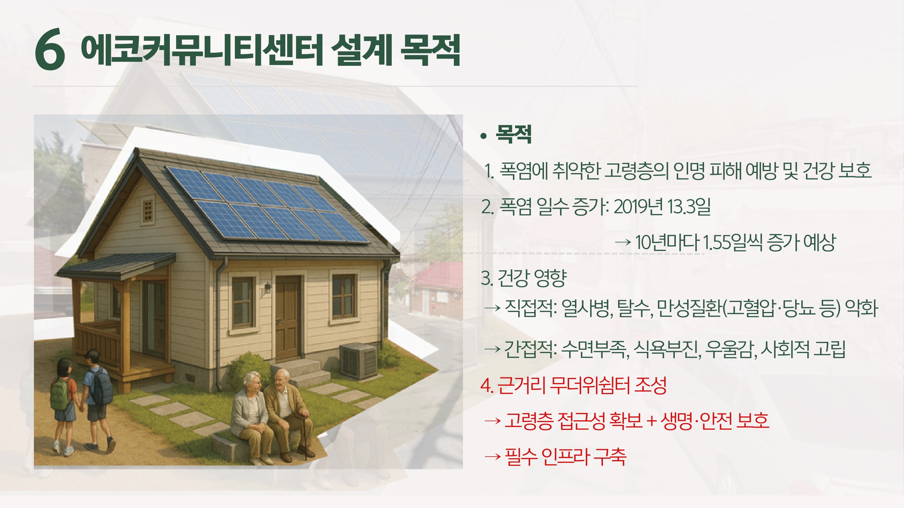

# 버려진 빈집을 무더위 쉼터로 — 정릉3동 에코커뮤니티센터 제안
### 기후취약 계층 고령자 보호를 위한 빈집 활용 무더위쉼터 조성 방안 (HUSS 환경컨소시엄 컨퍼런스, 제1저자)

## 1. 여는 글
폭염 피해는 매년 커지는데, 정작 이를 피할 냉방 공간에 접근하기 어려운 고령 취약계층이 많습니다. 한편 도심에는 방치된 빈집이 늘고 있습니다. 이 두 문제를 하나로 묶어, **빈집을 고령자 무더위 쉼터(에코커뮤니티센터)로 재생**하는 방안을 정릉3동 사례로 제안했습니다.

*2019년 대비 폭염일수가 1.55배 증가할 것으로 전망되는 가운데, 냉방 취약 고령자 보호가 시급합니다.*

## 2. 문제 정의
정릉3동 고령층·종합사회복지관 인터뷰 결과, 접근 가능한 냉방 쉼터가 부족하고 기존 쉼터는 이용에 제약이 있었습니다. 데이터로도 취약이 확인됩니다.

## 3. 데이터 & 근거 — 빈집이라는 자원
성북구 빈집은 **2018년 78곳 → 2023년 162곳**으로 늘었고, 정릉3동은 그 중에서도 밀집 지역입니다.

*빈집이 빠르게 늘고 있어, ‘철거 대상’이 아니라 ‘활용 자원’으로 볼 여지가 큽니다.*

*접근성·수요를 함께 고려해 후보 입지를 도출했습니다.*

## 4. 제안 — 에코커뮤니티센터 설계
기존 무더위쉼터의 한계(냉방비·접근성)를 넘기 위해, 에너지 자립형으로 설계했습니다.

*단열·차양·자연환기 등 패시브 요소로 냉방 부하 자체를 줄입니다.*

*태양광·고효율 냉방으로 운영비를 낮추고 에너지 자립도를 높입니다.*

*냉방비 절감과 탄소 저감을 함께 달성 — 폭염 대응과 기후 대응을 겸합니다.*

## 5. 운영 & 예산
지역 복지관·주민과 연계한 운영 체계와 단계별 예산안을 함께 제시해 실행 가능성을 높였습니다.

## 6. 맺음말
빈집이라는 방치 자원과 고령자 폭염 취약이라는 사회 문제를 하나로 이었습니다. 데이터로 진단하고 설계로 답한 제안입니다. 긴 글 읽어주셔서 감사합니다.

---
**링크** · 발표자료: /materials/에코커뮤니티_발표.pdf · 포트폴리오: https://portfolio-eight-ruddy-87.vercel.app
