# 빈집을 무더위쉼터로 바꾸자는 제안을 하기까지
## 정릉3동 현장에서 고령자 11명을 인터뷰하며 설계한 에코커뮤니티센터

안녕하세요. 이번 글은 조금 다른 결의 프로젝트입니다. 위성이나 AI가 아니라 **직접 동네를 걸어 다니고 어르신들과 이야기하며 만든 연구**입니다. 2025 HUSS 환경컨소시엄 컨퍼런스에서 발표했고, 국민대 정치외교학과 정민주 학생과 함께 진행했습니다.

제안은 단순합니다.

**"방치된 빈집을 고령자용 무더위쉼터(에코커뮤니티센터)로 바꾸자."**

두 개의 문제를 하나로 묶는 아이디어입니다. 한쪽에는 폭염에 취약하지만 갈 곳이 없는 어르신들이 있고, 다른 한쪽에는 비어서 방치된 집들이 있습니다. 그런데 이 아이디어를 실제 제안으로 만드는 과정에서, 저는 데이터 분석보다 훨씬 어려운 것들을 마주했습니다.

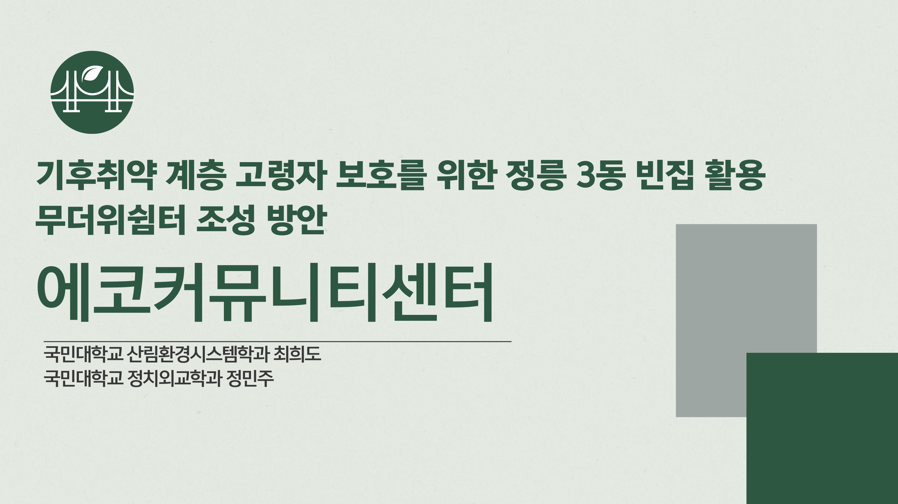

---

## 1. 왜 정릉3동이었나

저희가 다니는 학교(국민대)가 있는 동네입니다. 그런데 이 동네를 자세히 들여다보니 폭염 취약성의 조건이 전부 겹쳐 있었습니다.

**첫째, 온열질환에 취약한 고령층이 많습니다.** 고령일수록 온도에 대한 신체 적응 능력이 낮고, 심뇌혈관질환 같은 만성질환을 함께 갖고 있어 더욱 주의가 필요합니다.

**둘째, 무더위쉼터 인프라와 접근성이 부족합니다.** 정릉3동의 무더위쉼터는 고작 3곳입니다. 주민이 14,000명을 넘는데 말이죠.

**셋째, 주택 노후화와 빈집이 늘고 있습니다.** 성북구 빈집 전수조사에서 정릉3동은 구 내에서 상당한 비중(약 19.6%)을 차지했습니다.

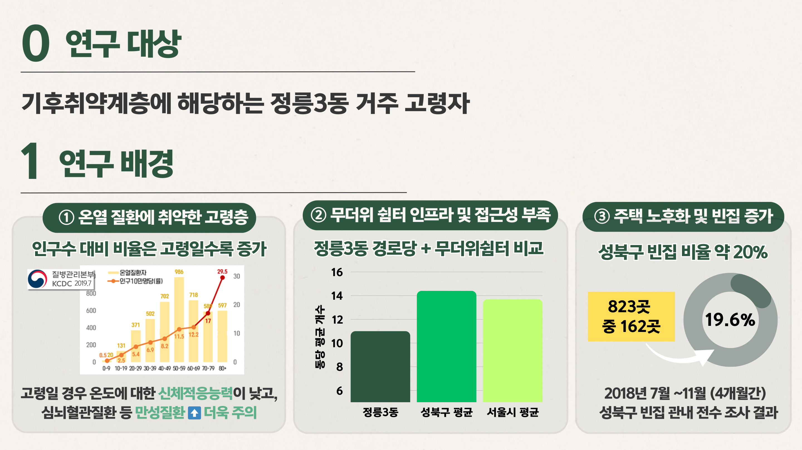

그리고 이 지역에는 **지형적 문제**가 하나 더 있습니다. 정릉3동은 급경사지에 위치해 있고, 내부를 운행하는 마을버스가 **1개 노선뿐**입니다.

이게 왜 중요할까요. 이동성이 제한된 고령자나 거동이 불편한 분들에게는 **쉼터가 있어도 갈 수가 없습니다.** 지도상 거리가 가까워도 경사가 심하면 실제로는 접근 불가입니다.

폭염 전망도 확인했습니다. 2019년 13.3일이던 폭염일수가 **10년마다 1.55일씩 증가**할 것으로 전망됩니다. 문제가 계속 심해진다는 뜻입니다.

여기에 노후주택의 단열 성능 저하, 냉방시설 부족, 전기요금 부담이 겹치면서 실질적인 폭염 대응이 어려운 상황이었습니다. 그 결과 열사병·탈수증 같은 직접적 건강 문제뿐 아니라, 우울감·사회적 고립 같은 **간접적 피해**도 증가하고 있었습니다.

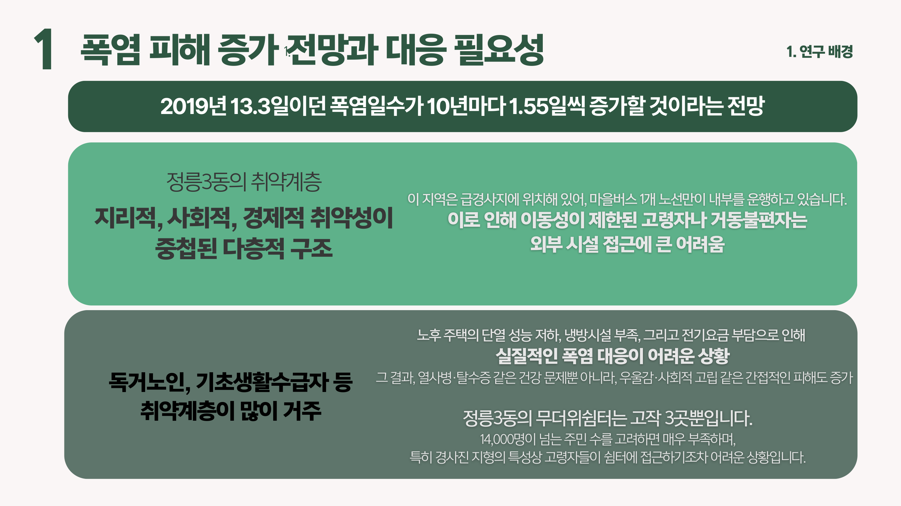

---

## 2. 데이터가 아니라 사람을 만나야 알 수 있는 것들

이 프로젝트에서 제가 가장 크게 배운 부분입니다. 저는 처음에 "쉼터 개수와 접근성을 GIS로 분석하면 되겠다"고 생각했습니다. 그런데 현장에 가보니 지도로는 절대 알 수 없는 것들이 있었습니다.

그래서 네 가지 방법을 병행했습니다.

- **현장조사**: 빈집 분포와 물리적 환경 실태를 직접 확인, 무더위쉼터 위치와 접근성 조사
- **인터뷰·설문**: 고령층 인터뷰로 정성적 데이터 확보
- **사례연구**: 노원구 등 서울시 내 에너지 전환 성공 사례 분석
- **정책분석**: 빈집 활용 도시재생사업과 제로에너지 전환사업 시행 여부, 행정 연계 가능성 검토

### 어르신 11명을 인터뷰했더니

정릉3동 고령층 11명을 직접 인터뷰했습니다. 결과가 상당히 충격적이었습니다.

- 경로당을 **인지하는 분**: 8명(72.7%)
- 경로당을 **실제 이용해 본 분**: **1명(9.1%)**
- 실버복지센터 등 대체 공간을 이용하는 분: 5명 이상

이용하지 않는 이유를 물었더니 이런 답이 나왔습니다.

- "경사가 심해서" — 물리적 접근 불가
- "거리가 멀어서"
- "복지관 지하가 더 쾌적해서" — 시설 품질 문제
- "이용률이 낮아서" — 사람이 없으면 안 가게 되는 순환
- "정보가 부족해서" — 존재를 몰라서

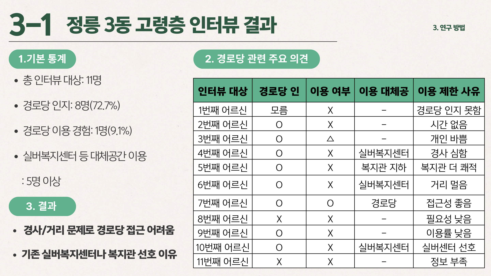

이 결과가 제 생각을 완전히 바꿨습니다. 처음에는 "쉼터가 3곳뿐이니 개수를 늘리자"고 접근했는데, 인터뷰를 하고 나니 **개수보다 위치와 품질이 문제**였습니다. 아무리 많이 만들어도 경사 위에 있으면 쓰지 않습니다.

즉 **단순 공간 조성이 아니라 실제 수요자 중심의 설계**가 필요했습니다.

### 복지관 담당자의 한마디

정릉종합사회복지관 담당자와도 서면 인터뷰를 했습니다. 여기서 나온 말이 프로젝트 방향을 바꿨습니다.

> **"지속성이 정말 중요합니다. 한 번 설치하고 끝나는 게 아니라, 이 사업이 정책이 바뀌더라도 흔들리지 않고 우리의 일상 속에 자연스럽게 자리 잡아야 해요. 또한 설치된 장비들이 오래 잘 작동하려면 사후 A/S나 업데이트 대응 방안도 꼭 필요하죠. 실제로 비슷한 사업들이 업체가 문을 닫거나 정책 방향이 바뀌면서 중단된 사례도 있었거든요."**

이 말을 듣고 저희 제안서에 **운영·유지관리 계획과 예산안**을 반드시 넣기로 했습니다. 아이디어만 좋고 운영이 없으면 결국 방치된다는 걸 현장에서 배운 것입니다.

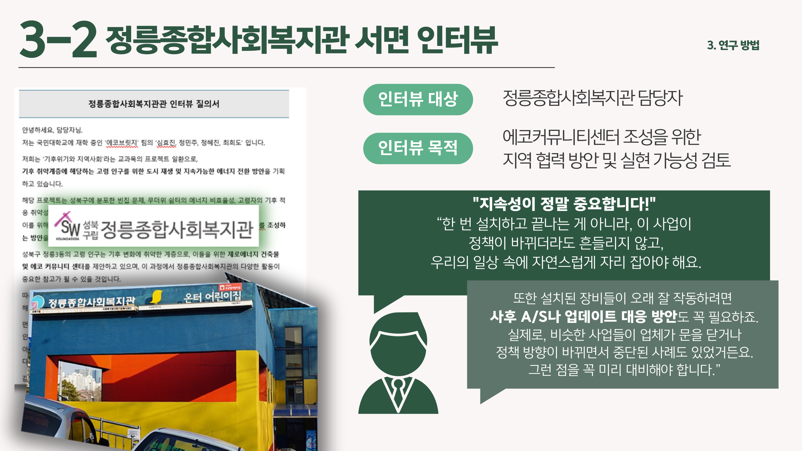

---

## 3. 현장에서 부딪힌 세 가지 벽

솔직하게 적겠습니다. 이 프로젝트는 순조롭지 않았습니다.

**첫째, 후보 빈집의 입지 문제.** 현장조사를 나가보니 후보로 본 3곳 중 **2곳은 이미 철거되었고, 1곳은 고지대**에 있었습니다. 고령자가 도보로 접근하기 어려워 실질적 이용이 어려운 위치였습니다.

**둘째, 다른 자치구와의 격차.** 노원구 '편백경로당', 영등포 '신우·남부경로당'은 이미 **제로에너지 1등급, 에너지 자립률 100%**를 달성했습니다. 그런데 성북구는 빈집 도시재생사업은 있으나 **제로에너지 전환사업은 미추진 상태**였습니다. 정부 사업은 있지만 실행은 지자체 의지에 좌우된다는 걸 확인했습니다.

**셋째, 공공기관의 비협조.** 성북구 내 주민센터에 인터뷰를 요청했으나 응답을 받지 못했습니다. 필요한 자료의 상당 부분을 주민·언론 같은 비공식 루트로 확보해야 했습니다. 행정기관의 무관심이 기후 적응형 사업 실행의 장벽이 된다는 것을 체감했습니다.

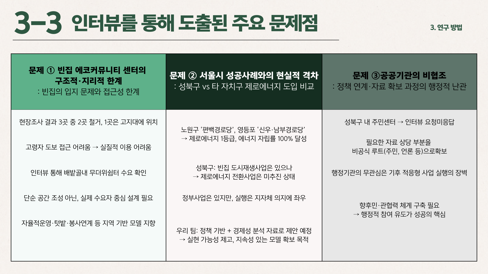

---

## 4. 그런데 빈집은 분명히 자원이었습니다

문제가 많았지만 빈집 자체는 활용 가치가 충분했습니다. 성북구 빈집을 등급별로 분석해 봤습니다.

- 2등급 35%
- 4등급 33%
- 1등급 28%
- 3등급 4%

**1~2등급이 63%**입니다. 등급이 높을수록 상태가 양호하다는 뜻이니, 활용 가능한 빈집이 상당히 많다는 것입니다. 안전성 문제는 **1~2등급 빈집을 우선 선정**하면 최소화할 수 있습니다.

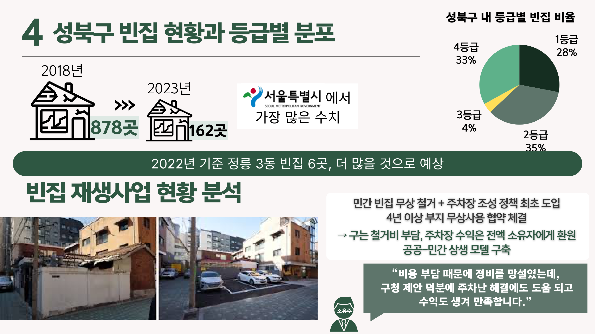

그런데 기존 빈집 활용 사업에는 한계가 있었습니다. **주차장 조성 위주**라는 점입니다.

- 연간 10개소 51면이라는 제한적 규모
- 주차장 조성 위주여서 직접적인 복지서비스 연계가 부족
- 주차장 이용료가 취약계층에게는 오히려 접근성 제약 요인으로 작용

목적과 이용 방식에서 근본적인 차이가 있습니다. 주차장은 차량을 위한 **일시적 이용 공간**이고, 무더위쉼터는 폭염 취약계층을 위한 **지속적 체류 공간**입니다.

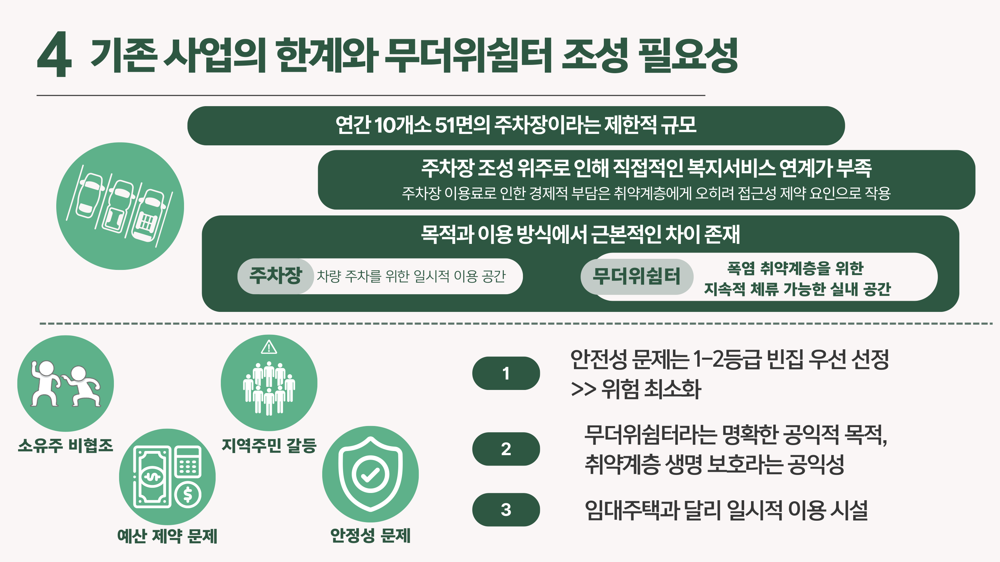

---

## 5. 그래서 어떻게 설계했나

설계는 **에너지 자립**을 중심에 뒀습니다. 이유가 있습니다. 앞서 인터뷰에서 나온 "지속성" 때문입니다. 냉방비가 계속 들어가는 시설은 예산이 끊기면 문을 닫습니다. 반면 에너지를 스스로 만드는 시설은 운영비 부담이 적습니다.

노원구 편백경로당 사례를 참고했습니다. 제로에너지 1등급, 에너지 자립률 100%를 달성한 그린리모델링 사례입니다.

설계는 세 갈래로 구성했습니다.

**첫째, 패시브 설계.** 에너지를 쓰기 전에 **에너지가 필요 없게** 만드는 방식입니다. 단열 강화, 차양, 자연 환기를 통해 냉방 부하 자체를 줄입니다. 돈이 들지 않는 냉방인 셈입니다.

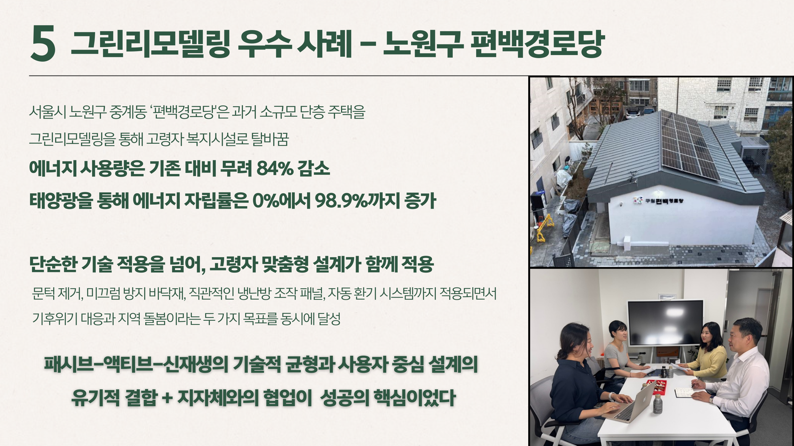

**둘째, 액티브 설계.** 그래도 필요한 냉방은 고효율 설비로 해결합니다.

**셋째, 신재생에너지.** 태양광 발전으로 운영 전력을 스스로 만듭니다.

이렇게 하면 에너지 측면에서 어떤 효과가 있을까요. **제로에너지건축물(ZEB) 상위 등급 수준의 에너지 자립**을 목표로 설정했습니다. 냉방비 절감과 탄소 저감을 함께 달성하는 구조입니다.

즉 이 시설은 **폭염 대응 시설이면서 동시에 기후 완화 시설**입니다. 적응과 감축을 한 건물에서 함께 하는 셈이죠.

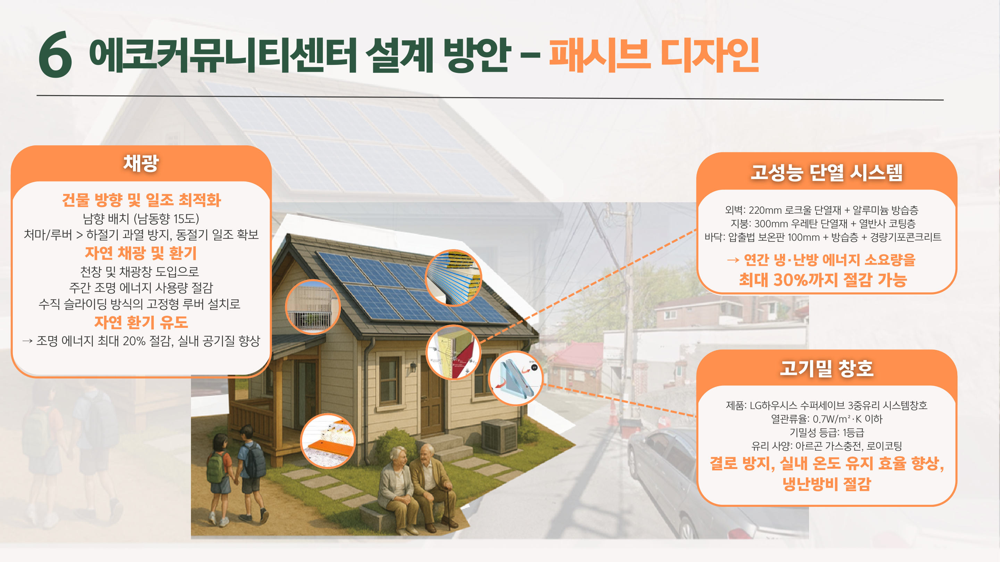

공간 계획도 실제 이용을 고려했습니다. 단순히 에어컨 있는 방 하나가 아니라, 어르신들이 하루를 보낼 수 있는 구성으로 짰습니다.

---

## 6. 운영과 예산까지 넣었습니다

앞서 복지관 담당자가 강조한 "지속성"을 반영해, 운영 계획을 구체적으로 넣었습니다.

- **지역 연계**: 복지관, 주민자치회, 자원봉사와 연결한 자율 운영 모델
- **교육 연계**: 환경교육과 텃밭 등 프로그램 결합
- **협력 체계**: 공공-민간 파트너십 강화

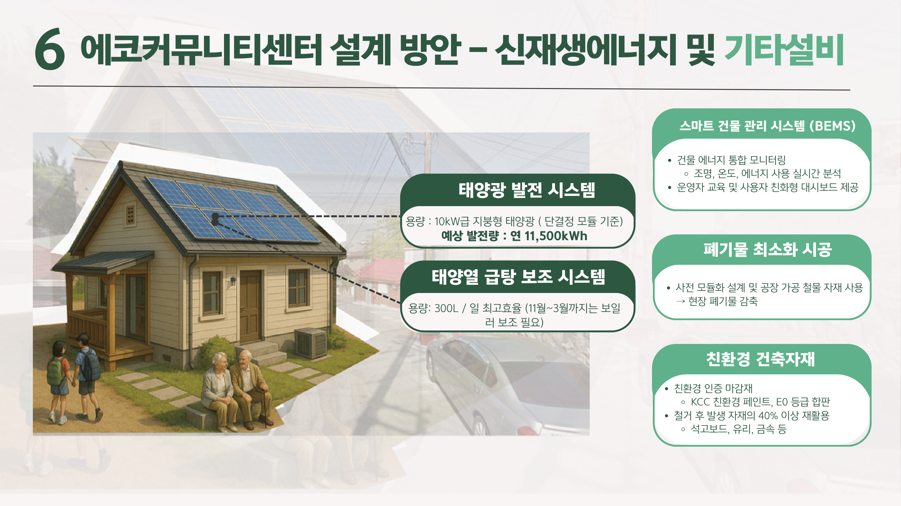

그리고 예산안도 산정했습니다. 아이디어만 제시하고 "예산은 알아서" 하는 제안은 실현되지 않습니다.

---

## 7. 결론과, 제가 배운 것

최종 제안은 **빈집 기반 취약계층 보호를 위한 종합 정책 제안**입니다. 정책 설계, 기술 설계, 운영 설계를 하나로 묶었습니다.

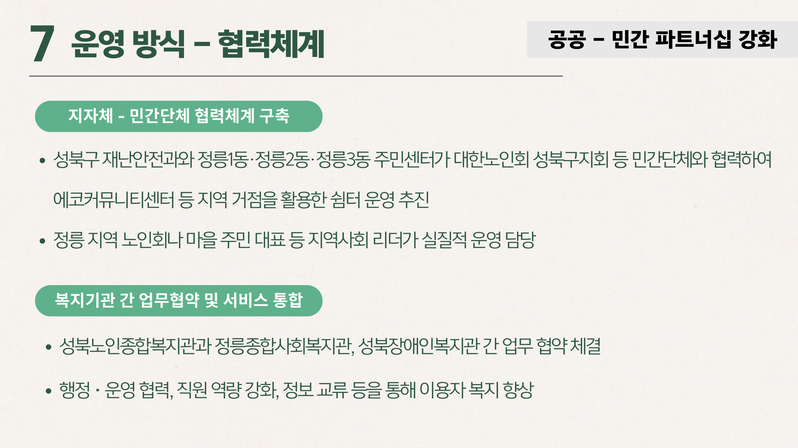

이 프로젝트를 하면서 배운 걸 솔직하게 적겠습니다.

**첫째, 지도와 현장은 다릅니다.** GIS로 접근성을 계산하면 "쉼터까지 300m"라고 나옵니다. 그런데 그 300m가 급경사면 고령자에게는 접근 불가입니다. 데이터만 보고 정책을 설계하면 이런 걸 놓칩니다.

**둘째, 좋은 아이디어보다 운영 계획이 어렵습니다.** "빈집을 쉼터로"는 누구나 떠올릴 수 있습니다. 그런데 누가 관리하고, 고장 나면 누가 수리하고, 예산이 끊기면 어떻게 하느냐가 실제 성패를 가릅니다. 복지관 담당자의 한마디가 그걸 가르쳐 주었습니다.

**셋째, 행정의 관심이 사실상 결정적입니다.** 같은 정부 사업이 있는데도 어떤 구는 제로에너지 전환을 이뤘고 어떤 구는 시작조차 못했습니다. 기술이나 예산의 문제가 아니라 의지의 문제였습니다.

저는 주로 위성과 AI로 연구하지만, 이 프로젝트는 **동네를 직접 걷고 사람을 만나야만 얻을 수 있는 데이터**가 있다는 걸 알려주었습니다. 두 접근이 서로를 보완한다고 생각합니다.

긴 글 읽어주셔서 감사합니다.

---

**링크** · 포트폴리오 https://portfolio-eight-ruddy-87.vercel.app
