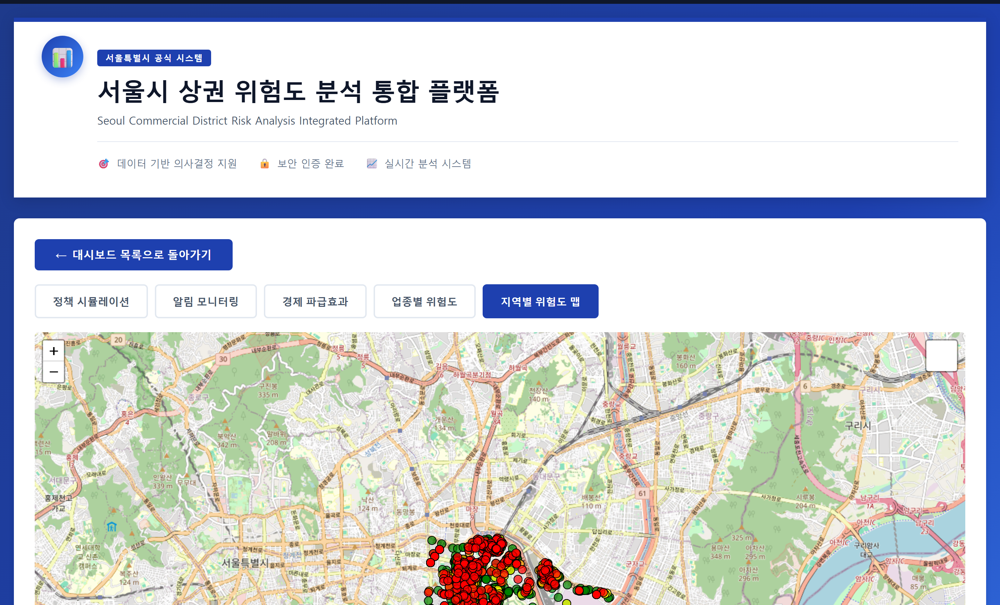
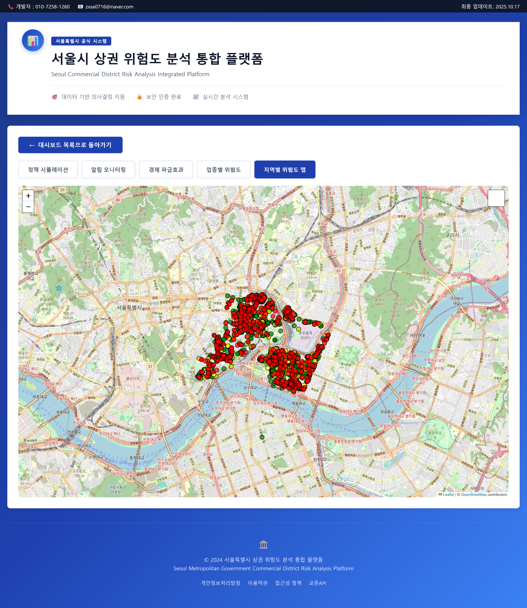
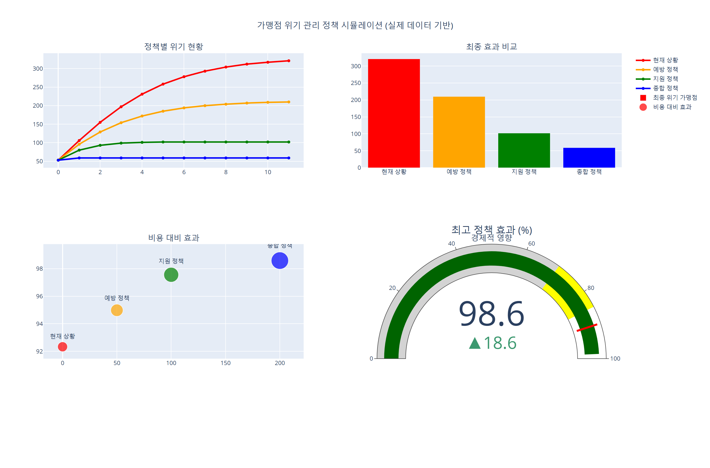
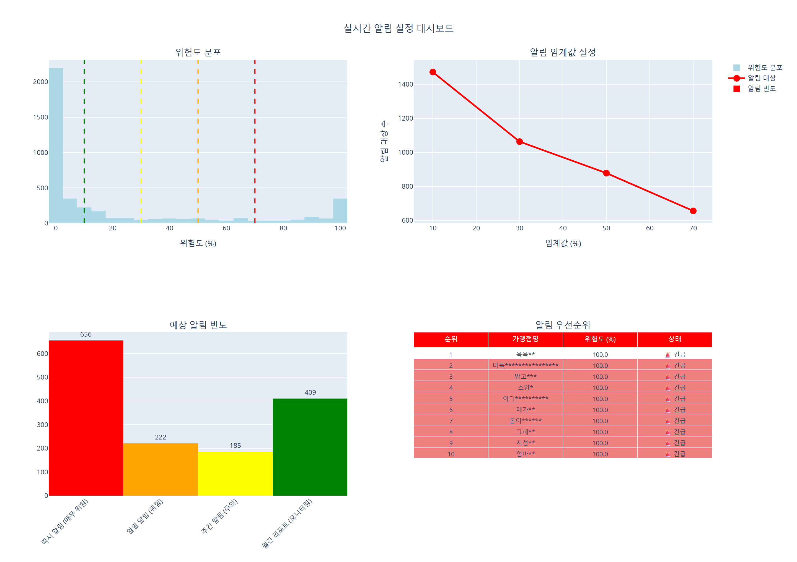
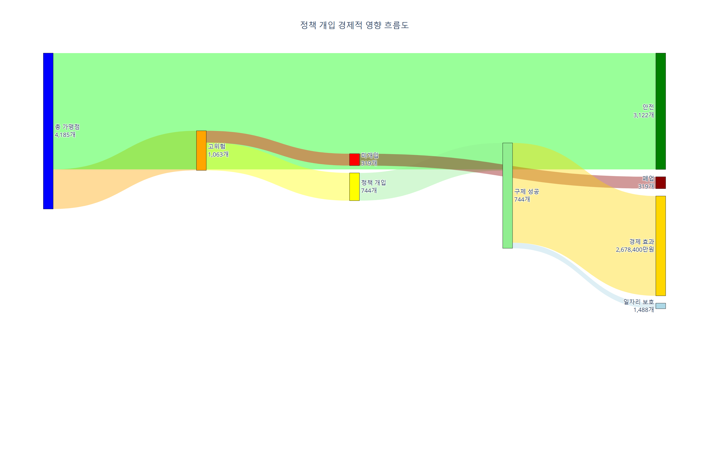
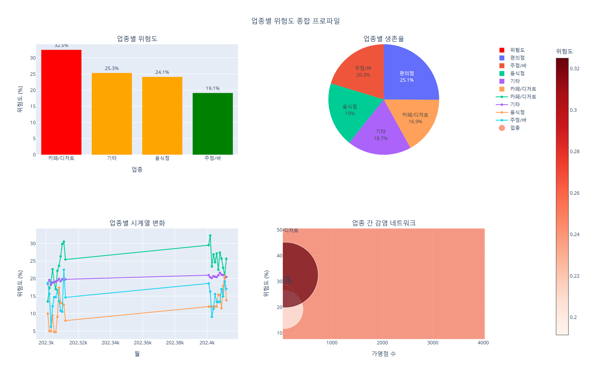
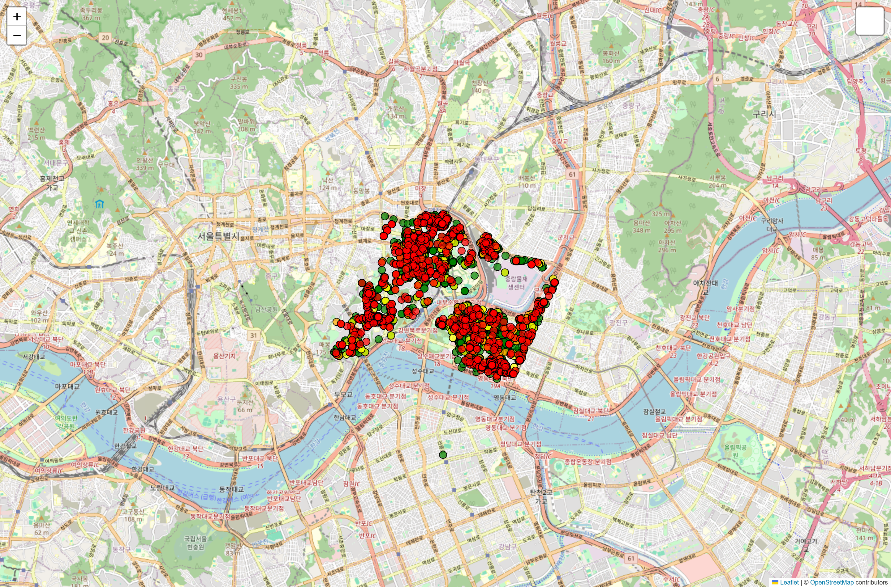
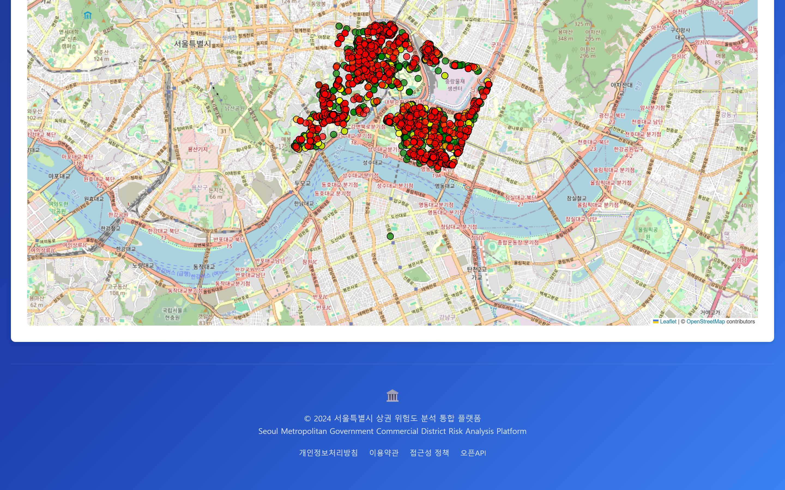

# 분석 결과를 '정책 도구'로 만들어 봤습니다
## 상권 위험 예측 모델을 담당자가 직접 조작하는 5개 모듈 플랫폼으로

안녕하세요. 예전에 [상권의 붕괴는 전염된다](https://zxsa716.tistory.com/29)라는 글에서 4,185개 가맹점의 네트워크를 분석해 폐업 확산을 예측한 이야기를 올렸습니다. 이 글은 그 후속편입니다.

그때 분석을 끝내고 나서 계속 마음에 걸리는 게 있었습니다.

**"이 결과를 누가 쓸 수 있을까?"**

논문이나 보고서로 정리하면 연구자는 읽습니다. 그런데 실제로 정책을 만드는 담당자는 어떨까요. "슈퍼 스프레더 상위 10개 점포를 지원하면 전체 감염률이 20% 이상 줄어듭니다"라는 문장을 읽어도, 자기 지역에 적용하려면 다시 분석을 요청해야 합니다. 그리고 그 요청은 대개 이뤄지지 않습니다.

그래서 **분석 결과를 담당자가 직접 조작하는 도구로 만들었습니다.** 이 글은 그 과정과, 만들면서 배운 것들의 기록입니다.

---

## 1. 모델과 도구는 다른 물건입니다

먼저 이 구분을 명확히 하고 싶습니다. 제가 이 프로젝트에서 가장 크게 깨달은 지점이기도 합니다.

**모델**은 "예측이 맞는가"를 다룹니다. 정확도, AUC, 교차검증 방법이 중요합니다. 연구자끼리 평가할 때 쓰는 언어입니다.

**도구**는 "쓸 수 있는가"를 다룹니다. 담당자가 원하는 조건을 넣을 수 있는지, 결과를 이해할 수 있는지, 상급자에게 설명할 수 있는지가 중요합니다. 완전히 다른 기준입니다.

좋은 모델이 나쁜 도구가 되는 경우는 아주 흔합니다. 정확도 94.8%인 모델이 주피터 노트북 안에만 존재한다면, 담당자에게는 **존재하지 않는 것과 같습니다.** 코드를 돌릴 수 없으면 결과에 접근할 수 없으니까요.

이건 기술의 문제가 아니라 전달의 문제입니다. 그리고 저는 후자를 자주 소홀히 했다는 걸 이 프로젝트를 하면서 알았습니다.

그래서 이번에는 **다섯 개의 분석 모듈을 하나의 화면에서 조작할 수 있게** 만들었습니다.

- ① 정책 시뮬레이션
- ② 위험도 알림 모니터링
- ③ 경제 파급효과 분석(Sankey)
- ④ 업종별 리스크 프로파일
- ⑤ 지역별 인터랙티브 맵

---

## 2. 가장 중요한 모듈: 정책 시뮬레이션

다섯 모듈 중 하나만 남긴다면 이걸 남기겠습니다. 담당자의 실제 질문에 답하는 유일한 모듈이기 때문입니다.

담당자의 질문은 언제나 이렇습니다.

> **"우리가 이 정책을 쓰면, 결과가 얼마나 달라집니까?"**

그런데 대부분의 분석은 이 질문에 답하지 못합니다. "위험 점포가 320개소입니다"까지는 말해주지만, "그래서 뭘 하면 몇 개로 줄어드나요?"에는 답이 없습니다.

그래서 네 가지 시나리오를 비교할 수 있게 만들었습니다.

- **현재 상황**: 아무것도 하지 않을 때
- **예방 정책**: 위험 징후 단계에서 미리 개입
- **지원 정책**: 이미 어려워진 곳을 지원
- **종합 정책**: 둘을 병행

결과 차이가 상당합니다. 12개월 뒤 위기 가맹점 수가 **현재 상황 약 320개소**에서, 예방 정책 약 210개소, 지원 정책 약 101개소, **종합 정책 약 58개소**까지 줄어듭니다.

여기서 제가 흥미롭게 본 건 숫자보다 **곡선의 모양**입니다.

현재 상황(빨간 선)은 시간이 갈수록 계속 올라갑니다. 그런데 종합 정책(파란 선)은 초반에 살짝 오르고는 **거의 평평해집니다.** 즉 개입이 이르면 확산 자체가 멈춥니다.

이건 우연이 아니라 모델의 구조에서 나오는 특성입니다. 원래 분석에서 전염병 확산 모델(SIR-D)을 기반으로 삼았기 때문입니다. 전염병에서 초기 방역이 결정적인 것과 같은 원리로, 상권 붕괴도 초기 개입의 효과가 압도적으로 큽니다.

비용 대비 효과도 함께 표시했습니다. 종합 정책이 비용은 가장 많이 들지만 효과 역시 가장 높아, 효율 지표가 **98.6**으로 나왔습니다.

이 화면을 만들면서 신경 쓴 원칙이 하나 있습니다. **숫자 하나만 보여주지 않는다**는 것입니다.

"효과 98.6"이라고만 표시하면 담당자는 그 숫자를 신뢰할 근거가 없습니다. 그래서 시간 추이 곡선, 최종 비교 막대, 비용 대비 효과 산점도를 함께 배치했습니다. **판단의 재료를 여러 개 주고, 판단은 사람이 하게 하는 방식**입니다.

AI가 "이 정책을 쓰세요"라고 결론을 내려주는 것보다, 사람이 근거를 보고 스스로 결론에 도달하게 하는 게 실제로는 더 잘 작동한다고 생각합니다. 그래야 그 결정을 다른 사람에게 설명할 수 있으니까요.

---

## 3. 나머지 모듈들

### 위험도 알림 모니터링

정책 시뮬레이션이 "무엇을 할까"를 다룬다면, 이 모듈은 **"지금 어디가 급한가"**를 다룹니다. 위험 등급별로 상권을 분류해 우선순위를 보여줍니다.

성격이 다른 화면입니다. 시뮬레이션은 기획 단계에서 한 번 쓰는 화면이고, 모니터링은 **매일 열어보는 운영 화면**입니다. 그래서 정보 밀도를 높이고, 변화가 있는 항목이 눈에 먼저 들어오도록 구성했습니다.

### 경제 파급효과 (Sankey 다이어그램)

이건 제가 개인적으로 가장 만족스러운 시각화입니다. **한 업종이나 지역의 충격이 어디로 번지는지**를 흐름으로 보여줍니다.

Sankey 다이어그램은 흐름의 굵기로 양을 표현하는 그림입니다. 강물이 갈라지고 합쳐지는 모양이라고 생각하시면 됩니다.

왜 이 시각화를 골랐을까요. 원래 분석의 핵심 주장이 **"상권 붕괴는 개별 점포의 실패가 아니라 연결망을 통해 전파되는 구조적 현상"**이었기 때문입니다.

그런데 이 주장을 숫자표로 전달하는 건 거의 불가능합니다. "A업종의 폐업이 B업종에 0.34의 영향을 준다"는 표를 보고 '연쇄'를 떠올릴 사람은 없습니다. 반면 흐름 그림을 보면 **설명 없이도 개념이 전달됩니다.**

시각화의 목적이 예쁘게 만드는 게 아니라 **개념을 전달하는 것**이라는 걸 이 화면에서 배웠습니다.

### 업종별 리스크 프로파일

업종마다 위험의 성격이 다릅니다. 어떤 업종은 계절에 민감하고, 어떤 업종은 유동인구에 민감하며, 어떤 업종은 임대료 변동에 취약합니다.

이 모듈은 업종별 특성을 비교해 **업종 맞춤형 대응**의 근거를 제공합니다. 같은 지원금을 줘도 업종에 따라 효과가 다른 이유를 설명하는 화면이기도 합니다.

### 지역별 인터랙티브 맵

마지막은 지도입니다. 자치구별 위험도를 색상 단계로 표현하고, 개별 점포는 점으로 찍어 클릭하면 상세 정보가 나오게 했습니다.

지도가 왜 필요할까요. 표로 된 순위표보다 지도가 강력한 이유는, **공간적 인접성이 한눈에 보이기 때문**입니다.

위험한 상권이 서로 붙어 있으면 개별 지원이 아니라 **권역 단위 대응**이 필요합니다. 반대로 위험 상권이 흩어져 있으면 개별 접근이 맞습니다. 순위표만 보면 1위부터 10위까지 목록은 알 수 있지만, 그 10곳이 붙어 있는지 흩어져 있는지는 알 수 없습니다.

같은 데이터라도 표현 방식에 따라 **다른 결정이 나옵니다.**

---

## 4. 만들면서 배운 것 세 가지

기술적으로는 HTML·CSS·JavaScript에 Leaflet(지도)과 Plotly(차트)를 조합했고 Netlify로 배포했습니다. 특별히 어려운 기술을 쓴 건 아닙니다. 오히려 어려웠던 건 다른 지점이었습니다.

### 첫째, 무엇을 보여주지 않을지 정하는 게 더 어려웠습니다

분석 결과는 많습니다. SIR-D 모델의 파라미터, 네트워크 중심성, 섀넌 엔트로피 지표, 앙상블 모델별 성능까지 다 보여줄 수 있습니다. 그리고 처음에는 다 보여주고 싶었습니다. 열심히 만든 것들이니까요.

그런데 담당자가 그걸 다 볼까요? 안 봅니다. 화면에 정보가 20개 있으면 사람은 아무것도 보지 않습니다.

그래서 **의사결정에 직접 쓰이는 것만 앞에 두고, 나머지는 뒤로 뺐습니다.** 분석의 완성도를 보여주는 화면과, 결정을 돕는 화면은 다르게 설계해야 한다는 걸 배웠습니다.

### 둘째, 담당자는 '정확도'보다 '왜'를 궁금해합니다

모델 정확도가 94.8%라고 하면 "그렇군요" 정도의 반응이 돌아옵니다. 좋은 숫자인지 나쁜 숫자인지 판단할 기준이 없으니 당연합니다.

그런데 **"이 점포가 위험한 이유는 주변 3개 점포가 최근 6개월 안에 폐업했기 때문"**이라고 하면 즉시 이해합니다. 그리고 "그럼 그 주변을 먼저 봐야 하네요"라는 다음 말이 나옵니다.

설명이 정확도보다 설득력 있습니다. 이건 제가 다른 연구에서도 계속 확인하는 패턴인데, 그래서 저는 설명가능 AI(XAI)에 관심을 갖게 되었습니다.

### 셋째, 웹으로 만들면 대화 자체가 달라집니다

이게 가장 큰 발견이었습니다.

PDF 보고서를 주면 상대가 읽고 끝입니다. 피드백은 "잘 봤습니다" 정도입니다. 그런데 **링크를 주면 상대가 직접 조건을 바꿔보고, 질문을 가지고 옵니다.**

"예산을 절반으로 줄이면요?"
"우리 구만 따로 볼 수 있나요?"
"이 업종은 왜 이렇게 위험하게 나오죠?"

이런 질문이 나오는 순간부터 **실제 논의가 시작됩니다.** 보고서는 결과의 전달이고, 도구는 대화의 시작입니다.

이게 제가 연구를 항상 웹으로 만들어 보는 이유입니다. 분석은 끝이 아니라, **누군가 쓰기 시작할 때 의미가 생긴다**고 생각합니다.

---

## 5. 남은 과제

물론 한계도 있습니다. 솔직하게 적겠습니다.

**첫째, 데이터 갱신이 자동화되어 있지 않습니다.** 현재는 특정 시점의 분석 결과를 담고 있어서, 새 데이터로 갱신하려면 다시 파이프라인을 돌려야 합니다. 실제 운영 도구가 되려면 자동 갱신이 필요합니다.

**둘째, 정책 시나리오가 미리 정의된 네 가지로 제한됩니다.** 담당자가 완전히 새로운 정책 조합을 설계하려면 지금 구조로는 부족합니다.

**셋째, 예측의 불확실성 표시가 약합니다.** "위기 가맹점 58개소"라고만 표시되는데, 실제로는 구간으로 제시하는 게 정직합니다. 이건 제가 다른 프로젝트에서 예측구간을 함께 제시하는 방식으로 개선하고 있는 부분입니다.

그래도 "분석 결과가 노트북 안에서 잠자는 문제"는 확실히 해결했다고 생각합니다. 링크만 있으면 누구든 열어볼 수 있으니까요.

라이브 데모를 공개했으니 직접 다섯 모듈을 조작해 보셔도 좋습니다. 특히 정책 시뮬레이션에서 조건을 바꿔가며 곡선이 어떻게 변하는지 보시면 재미있을 것입니다.

긴 글 읽어주셔서 감사합니다.

---

**링크**
데모 https://seoul-commercial-district-risk.netlify.app
관련 글 [상권의 붕괴는 전염된다 — 빅콘테스트 2025](https://zxsa716.tistory.com/29)
포트폴리오 https://portfolio-eight-ruddy-87.vercel.app
