# 개인에게 '기후 생존 점수'를 매기자는 제안
## 지역 평균 대신 개인을 보는 기후적응 지수 PCAR 설계기 (기후변화대응 비즈니스 아이디어 공모전 장려상)

안녕하세요. 이번 글은 제가 쓴 다른 글들과 결이 조금 다릅니다. 위성으로 무엇을 관측하거나 모델로 무엇을 예측한 이야기가 아니라, **제도를 하나 새로 만들자고 제안한 이야기**입니다.

2025년 국민대학교 기후변화대응 비즈니스 아이디어 공모전에 **ClimateGuard**라는 팀 이름으로 나갔습니다. 김민석, 이윤빈, 하수범 학생과 함께였고 장려상을 받았습니다. 제안한 것은 이렇습니다.

**"개인마다 기후 재해에 얼마나 버틸 수 있는지를 0에서 1000점 사이의 점수로 매기고, 그 점수를 정책·서비스·금융이 함께 쓰는 공통 좌표로 만들자."**

이름은 **PCAR(Personal Climate Adaptation Rating)**, 개인 기후적응역량 지수입니다.

먼저 솔직하게 말씀드릴 것이 두 가지 있습니다.

**첫째, 이 글에 나오는 그림은 대부분 개념도입니다.** 분석 결과 그래프가 아닙니다. 아이디어 공모전이었기 때문에 실제로 데이터를 결합해 모델을 돌린 것이 아니라, "이런 구조로 만들면 된다"는 설계를 제시한 단계입니다. 그래서 그림으로 보여줄 수 있는 것이 적고, 대신 **왜 그렇게 설계했는지를 글로 자세히 풀어** 쓰겠습니다.

**둘째, 이 제안에는 제가 지금도 마음이 편하지 않은 지점들이 있습니다.** 개인에게 점수를 매기는 일에는 위험이 따릅니다. 그 위험을 글 뒷부분에서 하나도 빼지 않고 적겠습니다. 발표 당시에는 충분히 다루지 못했던 부분이고, 시간이 지나 다시 보니 오히려 그쪽이 더 중요한 이야기라고 생각하게 됐습니다.

---

## 1. 출발점: 이것은 날씨가 아니라 재난입니다

2024년 여름 이야기부터 시작하겠습니다.

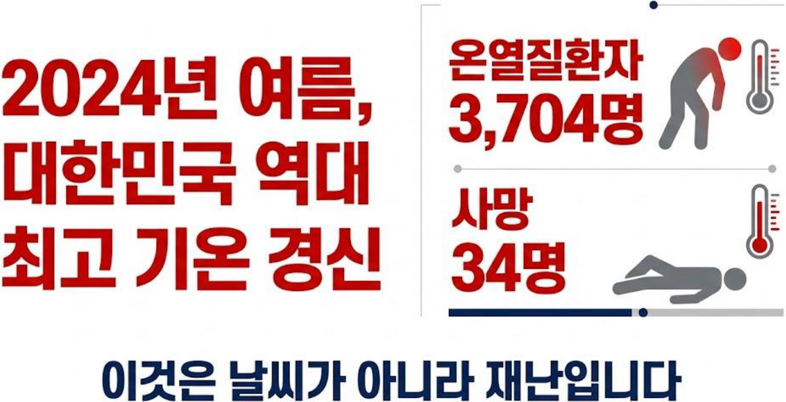

폭염을 '더운 날씨'로 부르는 습관에는 함정이 있습니다. 날씨는 참으면 지나가는 것이지만 재난은 대비해야 하는 것입니다. 34명이라는 숫자는 지진이나 태풍이었다면 즉시 재난 대응 체계가 가동될 규모입니다. 그런데 폭염에서는 그렇게 되지 않습니다.

그리고 이 피해는 고르게 퍼지지 않습니다.

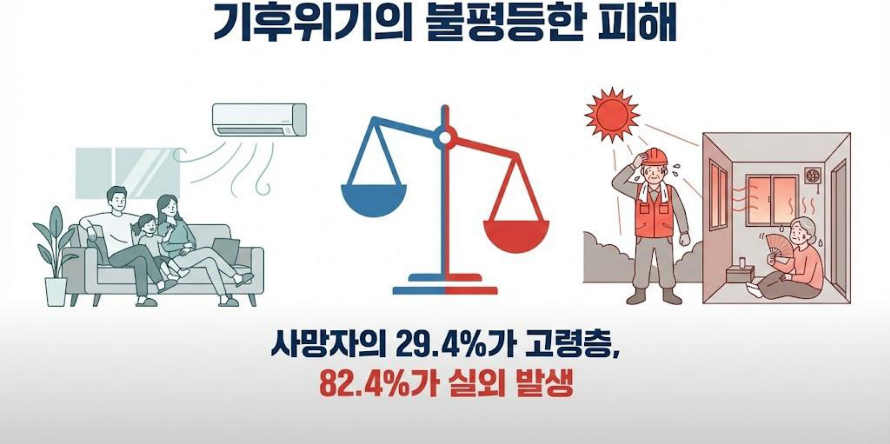

**사망자의 82.4%가 실외에서 발생했다**는 숫자를 저는 오래 들여다봤습니다. 이건 단순히 "밖이 더 덥다"는 이야기가 아닙니다. **낮 시간에 실외에 있어야 하는 사람과 실내에 있을 수 있는 사람이 애초에 나뉘어 있다**는 이야기입니다. 건설 현장, 배달, 농업, 환경미화처럼 실외에서 일해야 하는 직군이 있고, 그 직군에 누가 종사하는지는 무작위가 아닙니다.

고령층이 29.4%라는 숫자도 같은 구조입니다. 나이가 들면 체온 조절 능력이 떨어지고 만성질환을 함께 갖는 경우가 많아 생리적으로 더 취약합니다. 그런데 여기에 **냉방비를 감당할 수 있는지, 사는 집의 단열이 어떤지, 도움을 청할 사람이 있는지**가 겹치면 위험은 훨씬 커집니다.

즉 폭염 피해는 기상 현상과 사회 구조가 곱해진 결과입니다. 그렇다면 대응도 그 구조를 보고 해야 합니다.

---

## 2. 그런데 현재 정책은 '평균'을 봅니다

여기서 이 제안의 문제의식이 나옵니다.

우리나라에는 기후변화 취약성을 평가하는 공식 도구가 있습니다. 대표적인 것이 **VESTAP**입니다. 한국환경연구원 계열에서 지자체가 기후변화 적응대책을 세울 때 쓰도록 제공하는 평가 도구인데, 기초자치단체 단위로 취약성 지표를 산출합니다. 지자체 적응대책이 이 결과를 근거로 만들어집니다.

이 도구가 잘못된 것은 아닙니다. 지자체 단위 계획을 세우려면 지자체 단위 지표가 필요합니다. 문제는 **그 지표를 개인에 대한 판단에 쓸 때** 생깁니다.

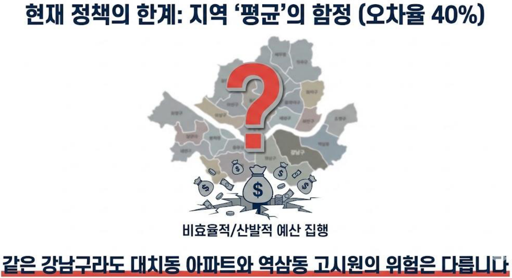

이 문장을 발표에서 가장 힘주어 말했습니다. **같은 강남구라도 대치동 아파트와 역삼동 고시원의 위험은 다릅니다.**

자치구 하나의 평균 취약성 점수가 낮게 나왔다고 해봅시다. 그러면 그 구에는 예산이 덜 배정됩니다. 그런데 그 구 안에는 고시원, 쪽방, 반지하가 있고 실외 노동자가 있습니다. **평균이 낮다는 이유로 그 안의 고위험 개인이 가려지는 것**입니다. 반대로 평균이 높은 구에서는 이미 충분히 대비된 가구에도 자원이 흘러갑니다.

발표 자료에는 이 오차를 **약 40%**로 적었습니다. 지역 평균 기반 모델로 개인의 실제 위험을 추정할 때 발생하는 오차 수준입니다. 이 숫자는 제안의 근거로 제시한 값이고, 정밀한 실측이라기보다 **문제의 규모를 보여주기 위한 추정치**로 읽으시는 것이 정확합니다.

### 그리고 결정적인 공백이 있습니다

문제를 더 근본적으로 짚으면 이렇습니다.

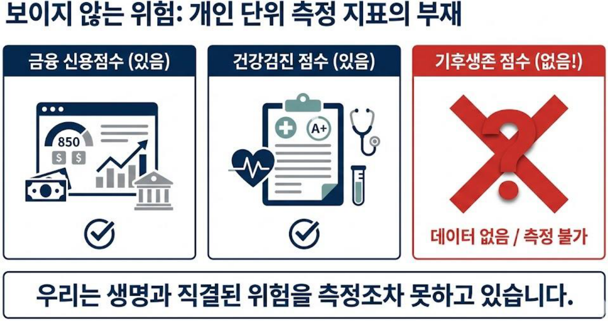

이 대비가 저는 꽤 날카롭다고 생각했습니다.

우리는 **개인의 금융 신용도**를 점수로 갖고 있습니다. 대출 심사, 카드 발급, 금리 결정이 이 점수로 이루어집니다. **개인의 건강 상태**도 점수로 갖고 있습니다. 건강검진 결과가 수치로 나오고 그에 따라 관리가 이루어집니다.

그런데 **개인이 기후 재해를 얼마나 버틸 수 있는지**는 어디에도 없습니다. 돈을 빌려줄지 판단하는 지표는 있는데, 여름에 죽을 위험이 있는지 판단하는 지표는 없습니다.

측정되지 않는 것은 관리되지 않습니다. 이건 관리학의 오래된 명제인데, 기후적응 영역에서 정확히 그 일이 벌어지고 있었습니다.

---

## 3. 해법: 0점에서 1000점 사이의 좌표를 만들자

그래서 제안한 것이 PCAR입니다.

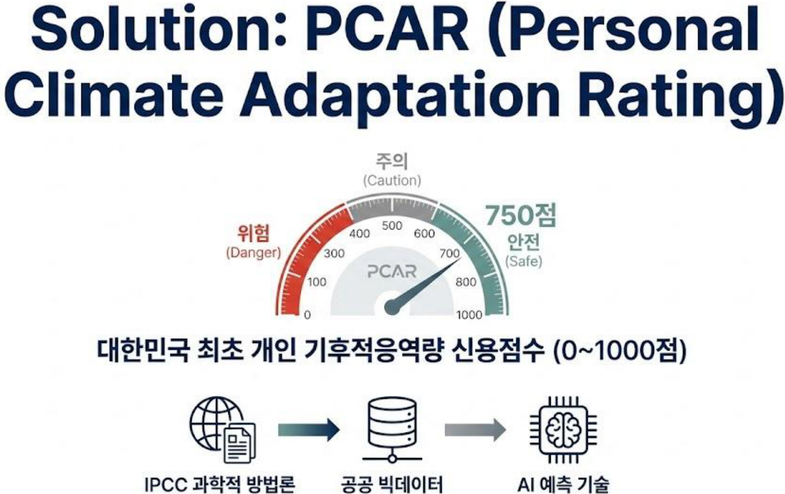

설계에서 의도적으로 고른 선택이 세 가지 있습니다.

**첫째, 신용점수와 같은 0~1000점 척도를 썼습니다.** 새 척도를 발명하는 대신 이미 모두가 아는 형식을 빌린 것입니다. "제 신용점수가 750점"이라고 하면 그것이 좋은 상태라는 걸 누구나 압니다. 같은 감각을 기후 위험에 옮기면 별도 교육 없이 이해됩니다. 지수를 만들 때 **해석 비용을 낮추는 것**은 실제 채택 여부를 좌우하는 문제입니다.

**둘째, 점수가 높을수록 안전하도록 방향을 잡았습니다.** 취약성 지수는 보통 높을수록 위험합니다. 그런데 개인에게 제시할 때 "당신의 위험 점수는 720점입니다"는 좋은 소식인지 나쁜 소식인지 헷갈립니다. 신용점수의 관습을 따라 **높으면 좋은 것**으로 통일했습니다.

**셋째, 세 개의 등급 구간(위험·주의·안전)을 두었습니다.** 연속적인 점수만 주면 사람은 판단하지 못합니다. 등급을 붙이면 그 자체가 행동 지침이 됩니다. 기상청 특보 체계가 주의보와 경보를 나누는 것과 같은 이유입니다.

---

## 4. 이론적 기반: IPCC 프레임워크를 개인 단위로 재설계하기

여기서부터 방법론입니다. 점수를 만들려면 무엇을 어떻게 합성할지 정해야 합니다.

저희는 새 이론을 만들지 않고 **IPCC의 취약성 프레임워크**를 가져와 개인 단위로 재구성했습니다. 국제적으로 검증된 구조를 쓰는 것이 지수의 정당성 확보에 유리하고, 나중에 다른 연구나 다른 나라 사례와 비교할 수 있기 때문입니다.

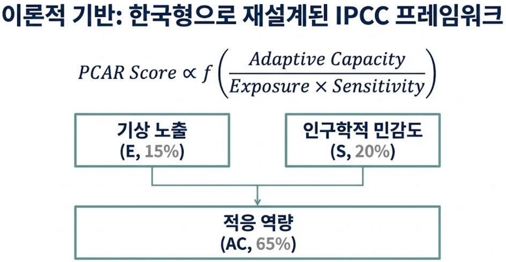

수식은 이렇게 세웠습니다.

**PCAR Score ∝ f( Adaptive Capacity / (Exposure × Sensitivity) )**

각 항이 무엇인지 풀어보겠습니다.

- **노출(Exposure, E)** — 그 사람이 실제로 마주하는 기상 조건입니다. 사는 곳과 일하는 곳의 기온, 열대야 일수, 지표면 온도 같은 것입니다.
- **민감도(Sensitivity, S)** — 같은 열을 받았을 때 더 크게 다치는 정도입니다. 연령, 기저질환 유무 같은 생리적·인구학적 조건입니다.
- **적응 역량(Adaptive Capacity, AC)** — 위험을 줄일 수 있는 능력입니다. 냉방을 감당할 경제력, 집의 단열 성능, 도움을 청할 사회적 연결, 의료 접근성, 그리고 실제로 대비 행동을 하는지까지 포함합니다. 발표에서는 이를 **경제·주거·사회·보건·행동**의 다섯 축으로 나눴습니다.

### 왜 곱하고 나누는가

이 구조에서 중요한 것은 **더하지 않고 곱하고 나눴다**는 점입니다.

노출과 민감도를 곱한 이유는, 둘 중 하나가 0에 가까우면 위험도 0에 가까워야 하기 때문입니다. 아무리 취약한 체질이라도 열에 노출되지 않으면 온열질환이 생기지 않고, 아무리 뜨거워도 그 열을 받는 사람이 없으면 피해가 없습니다. 더하기로 합성하면 이 성질이 사라집니다. 한쪽이 0이어도 다른 쪽 점수가 남아 위험이 있는 것처럼 나옵니다.

적응 역량으로 나눈 이유는, 적응 역량이 **위험을 상쇄하는 방향으로 작동**하기 때문입니다. 분모에 두면 역량이 커질수록 점수가 좋아지고, 역량이 작아질수록 위험이 급격히 커집니다. 실제로 냉방 없이 폭염을 맞는 상황이 그렇습니다. 위험이 완만하게 늘지 않고 급격히 늘어납니다.

### 왜 적응 역량에 65%를 줬는가

가중치 배분이 이 설계에서 가장 논쟁적인 부분이고, 저희가 가장 오래 토론한 지점입니다. 노출 15%, 민감도 20%, 적응 역량 65%로 정했습니다. 적응 역량에 압도적으로 큰 비중을 준 것입니다.

근거는 두 가지였습니다.

**첫째, 정책이 바꿀 수 있는 것이 적응 역량뿐입니다.** 기온은 정책으로 내릴 수 없습니다. 나이도 바꿀 수 없습니다. 그런데 냉방비 지원, 그린리모델링, 쉼터 접근성, 돌봄 연결은 정책으로 바꿀 수 있습니다. 지수를 정책 도구로 쓰려면 **개입 가능한 변수에 민감하게 반응해야** 합니다. 노출에 큰 가중치를 주면 점수는 정확해질지 몰라도, 정책을 집행한 뒤에 점수가 움직이지 않습니다. 그러면 그 지수로는 정책 효과를 확인할 수 없습니다.

**둘째, 개인 간 격차가 가장 크게 벌어지는 곳이 적응 역량입니다.** 같은 도시에 사는 사람들의 기상 노출 차이는 크지 않습니다. 서울 안에서 기온 차이는 몇 도 수준입니다. 나이 분포도 정해진 범위 안에 있습니다. 반면 냉방을 켤 수 있는지, 단열이 되는 집에 사는지, 아플 때 연락할 사람이 있는지는 **사람에 따라 사실상 0과 1처럼 갈립니다.** 변별력이 가장 큰 곳에 가중치를 주는 것이 지수 설계의 일반 원칙입니다.

다만 이 가중치는 **전문가 판단으로 정한 값이고 데이터로 최적화한 값이 아닙니다.** 이 점은 뒤에서 한계로 다시 다루겠습니다.

---

## 5. 데이터 방법론: 여섯 기관의 자료를 개인 단위로 붙이기

이론 구조를 정했으니 데이터가 필요합니다. 그리고 여기가 이 제안의 가장 야심찬 부분이면서, 동시에 가장 어려운 부분입니다.

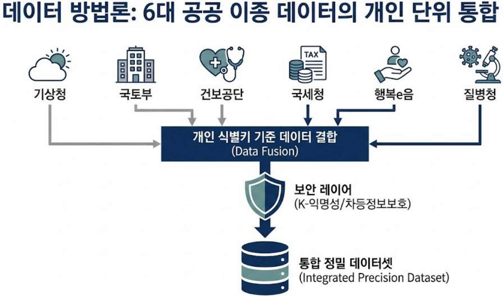

여섯 개 출처를 이렇게 배정했습니다.

| 기관 | 자료 | PCAR에서 담당하는 축 |
|---|---|---|
| 기상청 | 격자 기상자료 | 노출(E) — 실제 마주하는 기온·열대야 |
| 국토교통부 | 건축물대장 | 적응 역량 — 주거(준공연도·구조·단열 등급) |
| 국민건강보험공단 | 건강정보 | 민감도(S)·적응 역량 — 기저질환, 의료 이용 |
| 국세청 | 소득자료 | 적응 역량 — 경제력(냉방비 부담 능력) |
| 행복e음 | 복지정보 | 적응 역량 — 사회, 돌봄 연결 |
| 질병관리청 | 온열질환 감시 DB | 정답 라벨 — 실제 발생 여부 |

이 조합을 고른 논리는 명확합니다. **적응 역량의 다섯 축을 각각 다른 기관이 이미 갖고 있습니다.** 경제력은 국세청에, 주거 성능은 국토부 건축물대장에, 보건은 건보공단에, 사회 연결은 행복e음에 있습니다. 문제는 이 자료들이 **서로 만나지 않는다**는 것입니다.

기존 취약성 평가가 지역 평균에 머물렀던 이유도 여기 있습니다. 지역 단위로는 통계를 합쳐서 쓸 수 있지만, **개인 단위로 붙이려면 같은 사람을 같은 사람으로 식별해야** 합니다. 그 결합을 하겠다는 것이 이 제안의 핵심 기술 주장이었습니다.

### 보안 레이어를 반드시 넣어야 했던 이유

개인 소득과 질병 이력을 한 테이블에 붙인다는 말이 얼마나 위험하게 들리는지 저희도 알고 있었습니다. 그래서 설계에 **보안 레이어**를 명시적으로 하나의 단계로 넣었습니다. 두 가지 기법을 적었습니다.

**k-익명성(k-anonymity)** 은 Sweeney(2002)가 정식화한 개념입니다. 이름을 지운다고 익명이 되는 것이 아니라는 문제에서 출발합니다. 나이, 성별, 우편번호만 있어도 상당수의 개인이 특정됩니다. k-익명성은 **어떤 레코드를 골라도 준식별자 조합이 동일한 레코드가 최소 k−1개 더 존재하도록** 자료를 일반화하거나 묶습니다. k가 5라면 나와 구별되지 않는 사람이 최소 4명 더 있는 상태입니다.

**차분 프라이버시(Differential Privacy)** 는 Dwork(2006)가 제시한 더 강한 보장입니다. 접근을 통제하는 방식이 아니라, **한 개인의 데이터가 포함되었는지 여부가 분석 결과에 미치는 영향을 수학적으로 제한**합니다. 질의 결과에 통제된 잡음을 섞어서, 결과만 보고는 특정인의 포함 여부를 알아낼 수 없게 만듭니다. 그 한계를 ε(엡실론)이라는 값으로 정량화한다는 점이 중요합니다. "안전하다"가 아니라 "이만큼 안전하다"고 말할 수 있게 됩니다.

이 두 기법을 넣은 이유는 기술적 완결성 때문만이 아닙니다. **개인정보를 다루는 제안은 그 위험을 스스로 계량해 보이지 않으면 심사에서도, 현실에서도 통과할 수 없다**고 판단했기 때문입니다.

---

## 6. 알고리즘: XGBoost로 3일 앞을 보기

데이터를 모았다면 예측 모델이 필요합니다.

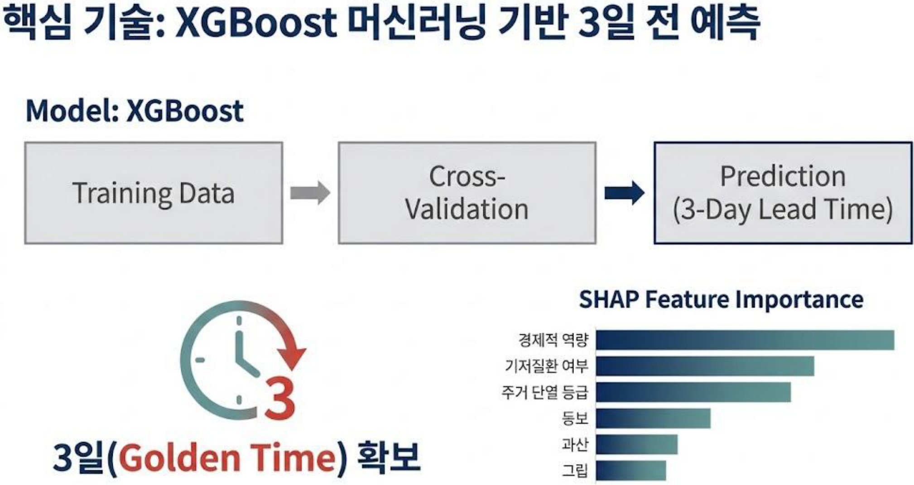

### 왜 XGBoost였는가

모델로 **XGBoost**(Chen & Guestrin, 2016)를 골랐습니다. 딥러닝이 아니라 경사부스팅 결정트리 계열을 고른 데는 이유가 있습니다.

**첫째, 표 형태의 이종 데이터에서 강합니다.** PCAR의 입력은 이미지나 문장이 아니라 소득 구간, 준공연도, 질병 코드, 기온처럼 **성격이 전혀 다른 열들이 섞인 표**입니다. 이런 자료에서는 부스팅 트리 계열이 신경망과 견주어 대등하거나 더 낫다는 것이 반복적으로 보고돼 있습니다.

**둘째, 결측을 다루는 방식이 내장돼 있습니다.** 여섯 기관 자료를 붙이면 결측이 필연적으로 생깁니다. 어떤 사람은 복지 정보가 없고, 어떤 건물은 단열 등급 기록이 없습니다. XGBoost는 각 분기에서 결측값을 어느 쪽으로 보낼지 학습으로 정합니다. 결측을 평균으로 메우는 임의적 처리를 줄일 수 있습니다.

**셋째, 설명이 잘 붙습니다.** 뒤에 나올 SHAP과의 궁합이 좋습니다. 트리 구조에 대해서는 SHAP 값을 정확하게 계산하는 알고리즘이 있어서, 근사에 의존하지 않고 기여도를 분해할 수 있습니다.

학습 자료는 **2011년부터 2023년까지** 13년을 잡았고, 교차검증으로 성능을 확인하는 구조로 설계했습니다.

### 왜 하필 3일인가

예측 시점을 **3일 전**으로 잡은 것도 임의의 선택이 아니었습니다.

너무 짧으면 소용이 없습니다. 폭염 당일 아침에 "오늘 위험합니다"라고 알려도 할 수 있는 일이 거의 없습니다. 반대로 너무 길면 예보 자체가 불확실해집니다. 기상 예보의 신뢰도는 시간이 멀어질수록 급격히 떨어집니다.

3일은 그 사이에서 두 조건을 동시에 만족하는 구간이었습니다. **기상 예보의 신뢰도가 아직 쓸 만하고, 사람이 실제로 대비 행동을 할 수 있는 시간이 확보되는** 지점입니다. 3일이면 냉방기를 점검하고, 약을 미리 받고, 근무 일정을 조정하고, 돌봄이 필요한 어르신에게 연락할 수 있습니다. 발표에서 이를 **골든타임**이라고 불렀습니다.

### SHAP이 알려준 것

**SHAP**(Lundberg & Lee, 2017)은 협조적 게임이론의 섀플리 값을 예측 모델에 적용한 기법입니다. 여러 사람이 협력해 만든 성과를 각자의 기여도에 따라 공정하게 나누는 방법이 있는데, 그것을 "여러 변수가 협력해 만든 예측값을 각 변수의 기여로 나눈다"는 문제에 옮긴 것입니다.

이 방법을 쓰면 두 가지를 할 수 있습니다. 전체적으로 **어떤 변수가 중요한지**(전역 설명), 그리고 특정 개인에게 **왜 그 점수가 나왔는지**(국소 설명)를 말할 수 있습니다. 두 번째가 PCAR에 특히 중요했습니다. 개인에게 점수를 통보하면서 이유를 설명할 수 없다면 그 점수는 받아들여지지 않습니다.

전역 설명의 결과 순서는 이랬습니다.

1. **경제적 역량**
2. **기저질환 여부**
3. **주거 단열 등급**

이 순서를 저는 의미 있게 봤습니다. 1위와 3위가 모두 **경제적·물리적 조건**입니다. 기후 취약성이 체질보다 처지에서 더 크게 결정된다는 뜻이고, 앞서 적응 역량에 65%를 배정한 판단과 방향이 맞습니다.

---

## 7. 기대 효과: 40%에서 13%로

성능 목표는 이렇게 제시했습니다.

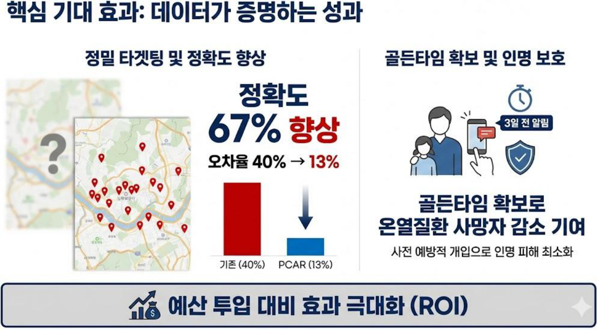

**지역 평균 모델의 오차율 약 40%를 개인화 모델로 약 13%까지 낮춘다**, 즉 정확도를 약 67% 개선한다는 목표였습니다.

여기서 정확하게 짚고 넘어가야 할 것이 있습니다. **이 수치는 실제로 여섯 기관 자료를 결합해 측정한 결과가 아닙니다.** 앞서 말씀드린 대로 이 제안은 데이터 결합 자체가 제도적으로 막혀 있는 단계였습니다. 따라서 이 숫자는 **설계 목표치이자 기대 효과 추정**으로 읽어야 정확합니다.

발표 자료에는 이것이 검증 결과처럼 표현되어 있는데, 지금 다시 보면 그 표현이 과했다고 생각합니다. 공모전 발표 자료가 흔히 갖는 문제이기도 하고, 제가 당시에 더 신중해야 했던 부분입니다. **아이디어 단계의 목표치와 검증된 실측치를 같은 시각적 형식으로 제시하면 읽는 사람이 구분할 수 없습니다.**

---

## 8. 그래서 사용자는 무엇을 경험하는가

지수를 만드는 것과 그 지수가 사람의 행동을 바꾸는 것은 다른 문제입니다. 그래서 사용자 화면까지 설계했습니다.

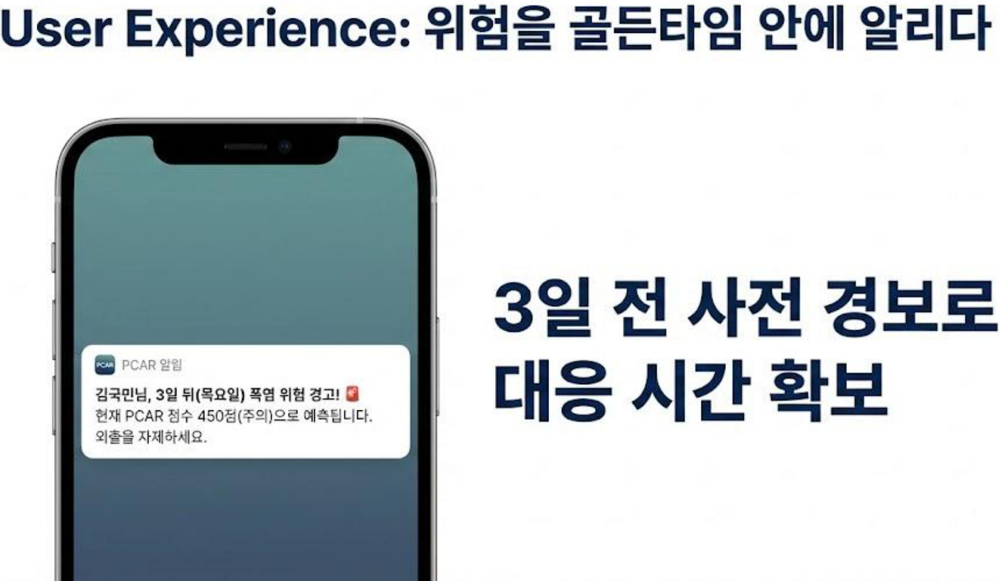

알림 문구를 설계할 때 신경 쓴 것이 있습니다. **점수만 던지지 않는다**는 것입니다.

"당신의 PCAR 점수는 450점입니다"만 보내면 사용자는 무엇을 해야 할지 모릅니다. 그래서 세 가지를 함께 담았습니다. **언제**(3일 뒤 목요일), **어느 정도**(450점, 주의 등급), **무엇을**(외출을 자제하세요). 위험 커뮤니케이션 연구에서 반복적으로 확인되는 것이 이 부분입니다. 위험 정보만 주면 불안만 커지고, **구체적인 행동 지침이 함께 있을 때 실제 행동이 바뀝니다.**

그리고 한 걸음 더 나갔습니다.

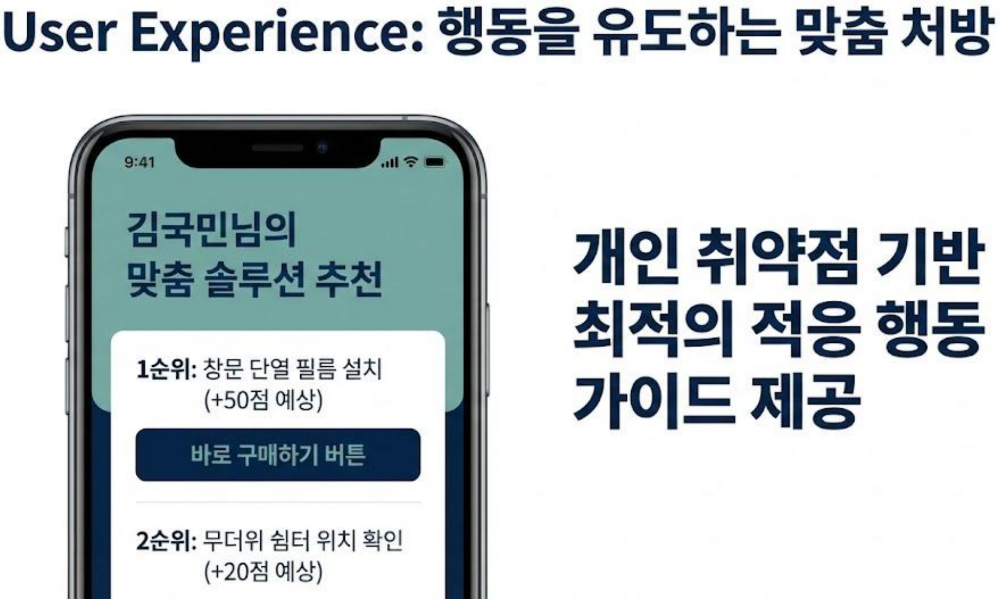

이 화면이 PCAR 설계에서 제가 가장 공을 들인 부분입니다. **점수를 진단으로 끝내지 않고 처방으로 연결**했습니다.

여기서 SHAP이 다시 등장합니다. 어떤 사람의 점수가 낮은 이유가 주거 단열이라면 창문 단열 필름을, 사회적 연결이라면 쉼터 안내와 돌봄 연계를 우선 제시해야 합니다. **개인별로 어느 변수가 점수를 끌어내렸는지 알아야 처방이 개인화됩니다.** 설명가능 AI가 있어야 이 화면이 성립하는 구조입니다.

그리고 **예상 점수 상승폭(+50점, +20점)** 을 붙였습니다. 행동의 효과를 점수로 환산해 보여주면 "이걸 하면 정말 나아지는가"에 답할 수 있습니다. 신용점수 관리 서비스가 "카드 사용액을 줄이면 몇 점 오릅니다"를 보여주는 것과 같은 방식입니다.

---

## 9. 비즈니스 모델: 공공성과 지속가능성을 함께 두기

비즈니스 아이디어 공모전이었으므로 수익 구조도 설계해야 했습니다. 그리고 여기서 딜레마가 있었습니다. **취약계층을 보호하는 서비스인데 취약계층에게 돈을 받을 수는 없습니다.**

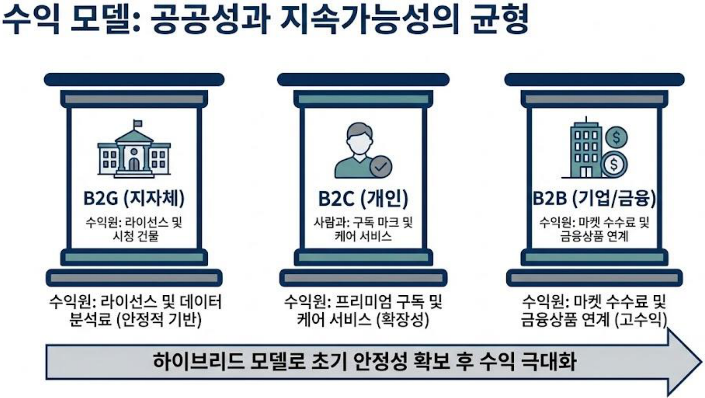

그래서 세 갈래를 두고 순서를 정했습니다.

**B2G(지자체)** 가 기반입니다. 지자체는 이미 기후적응 예산을 집행하고 있고, 그 예산을 더 정확하게 쓰게 해주는 데이터에 값을 지불할 이유가 있습니다. 수요가 안정적이고 공공성과 충돌하지 않습니다. 그래서 초기 단계를 여기서 시작합니다.

**B2C(개인)** 는 확장 경로입니다. 기본 점수와 경보는 무료로 두고, 심화 분석이나 돌봄 케어를 유료로 두는 구조입니다. **생명과 직결된 기본 기능에 돈을 받으면 안 된다**는 것이 전제였습니다.

**B2B(기업·금융)** 는 수익성이 가장 높은 갈래입니다. 적응 솔루션 마켓의 수수료, 그리고 보험·대출 같은 금융상품 연계입니다. 그런데 **여기가 가장 위험한 갈래**이기도 합니다. 이 부분은 한계에서 다시 다루겠습니다.

### 선순환 구조로 설명한 이유

이 세 갈래가 서로를 먹여 살리는 구조로 그렸습니다. 정밀한 정책 개입(B2G)이 이루어지면 적응 수요가 생겨 신시장이 열리고(B2B), 그 시장의 서비스가 국민 삶의 질을 높이고(B2C), 건물 에너지 효율이 올라가 탄소 감축에도 기여하며(환경), 그 과정에서 쌓인 데이터가 다시 정책의 정확도를 올립니다.

**적응(adaptation)과 감축(mitigation)이 한 구조 안에서 함께 움직인다**는 점을 특히 강조했습니다. 기후 정책에서 이 둘은 흔히 별개 예산, 별개 부서로 다뤄집니다. 그런데 건물 단열을 개선하면 여름에 시원해지고(적응) 냉방 전력이 줄어듭니다(감축). 같은 돈으로 두 목표를 함께 달성할 수 있는 지점이 분명히 있고, 그것을 찾아내는 것이 데이터의 역할이라고 봤습니다.

---

## 10. 로드맵과 파트너십

지수는 혼자 만들 수 없습니다. 데이터를 가진 기관, 실증할 지자체, 시장을 만들 금융이 함께 있어야 합니다. 그래서 단계별 계획을 세웠습니다.

단계 설계의 논리는 **검증 범위를 좁게 시작해 넓힌다**는 것이었습니다.

**Phase 1(서울 1개 구)** 에서 가장 중요한 것은 규모가 아니라 **기술적 타당성과 초기 수용성**입니다. 여섯 기관 데이터를 실제로 붙일 수 있는지, 붙였을 때 성능이 나오는지, 그리고 사람들이 자기 기후 점수를 받아들이는지를 확인해야 합니다. 마지막 항목이 특히 중요한데, 기술이 되더라도 사람이 거부하면 서비스는 성립하지 않습니다.

**Phase 2(서울 전역)** 에서 적응 솔루션 마켓을 엽니다. 점수를 올리는 행동에 실제 상품과 서비스를 연결해, 진단이 처방으로 이어지는 고리를 완성하는 단계입니다.

**Phase 3(전국 17개 시도)** 에서 국가 통계화와 금융 연계를 추진합니다. 국가 통계로 승인되면 지수의 공신력이 달라지고, 정부 계획에 공식 지표로 들어갈 수 있습니다.

**Phase 4(글로벌)** 에서는 동남아 기후 취약국에 ODA와 연계해 기술을 이전하고, UN SDGs 지표 체계에 등재를 추진하는 그림을 그렸습니다. 야심찬 목표이고, 공모전 발표라는 성격을 고려해 읽으시면 좋겠습니다.

파트너십은 네 축으로 정리했습니다. **정책·데이터**(환경부·기상청·건보공단 등 자료 보유 기관), **연구·국제**(한국환경연구원, UN), **지자체 실증**(서울시, 전국시장군수구청장협의회), **금융·시장**(주요 보험사와 은행)입니다.

---

## 11. 여기서부터가 제가 더 중요하다고 생각하는 이야기입니다

지금까지가 발표한 내용입니다. 이제 발표에서 충분히 말하지 못했던 것을 적겠습니다. 시간이 지나 다시 보니 이쪽이 더 중요한 이야기였습니다.

### 첫째, 데이터 결합이 현행 제도에서 사실상 불가능합니다

이 제안의 기술적 전제는 "여섯 기관 자료를 개인 식별키로 결합한다"입니다. 그런데 이건 기술 문제가 아니라 **법·제도 문제**이고, 난이도가 대단히 높습니다.

우리나라에서 서로 다른 기관의 개인정보를 결합하려면 **가명정보 결합** 절차를 거쳐야 합니다. 기관이 직접 붙일 수 없고, 지정된 결합전문기관을 통해야 하며, 결합키 관리기관을 거치는 별도 절차가 필요합니다. 특정 연구 목적으로 한 번 결합하는 것도 상당한 시간과 심의를 요구합니다. 그런데 PCAR는 **상시로, 전 국민에 대해, 실시간에 가깝게** 결합된 데이터셋을 유지해야 하는 구조입니다.

여기에 개별 자료마다 추가 제약이 붙습니다. 건강정보는 개인정보보호법상 **민감정보**로 더 엄격히 다뤄지고, 국세청 소득자료는 국세기본법상 **과세정보 비밀유지** 대상이라 목적 외 제공이 원칙적으로 금지됩니다. 복지정보 역시 별도 법률의 통제를 받습니다.

즉 **이 제안이 아이디어 단계에 머문 것은 아이디어가 부족했기 때문이 아니라, 실행 경로가 제도적으로 막혀 있기 때문**입니다. 저희는 보안 레이어(k-익명성, 차분 프라이버시)를 넣어 대응하려 했지만, 이 기법들은 **결합된 뒤의 자료를 안전하게 쓰는 방법**이지 **결합 자체를 허용해주는 근거**가 아닙니다. 그 구분을 발표 당시에는 명확히 하지 못했습니다.

### 둘째, 점수를 매기는 일 자체가 위험을 만듭니다

이게 제가 가장 오래 마음에 걸렸던 부분입니다.

개인에게 위험 점수를 부여하고 그것을 금융과 연결하면, **점수가 낮은 사람이 불리해지는 구조**가 만들어질 수 있습니다. 보험사가 PCAR 점수를 보험료 산정에 쓴다면 어떻게 될까요. 점수가 낮은 사람, 즉 **가장 취약한 사람이 가장 비싼 보험료를 물게 됩니다.** 보호 대상을 식별하려고 만든 지표가 배제의 근거로 뒤집히는 것입니다.

신용점수가 이미 그 길을 지났습니다. 신용점수는 금융 접근성을 넓히려는 도구로 시작했지만, 점수가 낮은 사람이 더 높은 금리를 물면서 격차가 재생산되는 구조도 함께 만들었습니다. PCAR의 B2B·금융 연계 갈래는 정확히 같은 위험을 안고 있습니다.

발표 자료에서 저희는 이 갈래를 **고수익 경로**로 제시했습니다. 지금 보면 그 위험을 함께 적었어야 했습니다. 만약 이 제안을 다시 쓴다면, **PCAR 점수를 개인에게 불리한 가격 결정에 쓰는 것을 금지하는 조항**을 설계에 명시적으로 넣겠습니다. 지수를 만드는 일에는 그 지수의 오용을 막는 설계까지 포함되어야 합니다.

### 셋째, 구조적 문제를 개인 점수로 환원할 위험이 있습니다

사회정책 연구에는 **책임의 개인화(responsibilization)** 라는 개념이 있습니다. 구조적 원인으로 생긴 문제를 개인의 관리 실패로 재해석하는 경향을 가리킵니다.

PCAR에는 이 위험이 내장돼 있습니다. "당신의 기후 점수가 낮습니다. 이런 행동을 하세요"라는 메시지가 반복되면, 점수가 낮은 상태가 **개인이 관리하지 못한 결과**처럼 보이기 시작합니다. 그런데 점수를 끌어내리는 1위 요인이 무엇이었습니까. **경제적 역량**입니다. 소득이 낮은 것은 개인이 노력해서 다음 주에 바꿀 수 있는 변수가 아닙니다.

즉 SHAP 분석 결과가 이미 이 문제를 가리키고 있었습니다. 점수를 결정하는 가장 큰 요인이 개인이 단기간에 통제할 수 없는 조건이라면, 그 점수를 개인에게 통보하고 행동을 요구하는 설계는 방향이 맞지 않습니다. **같은 점수를 개인이 아니라 정책 담당자에게 먼저 보여주는 것**이 더 타당합니다.

### 넷째, 처방을 실행할 수 없는 사람이 가장 취약한 사람입니다

이건 앞의 UX 화면을 다시 보면 바로 드러납니다.

1순위 처방이 **창문 단열 필름 설치**였습니다. 그런데 이 처방을 실행할 수 있는 사람은 누구입니까. **자기 집을 소유하거나, 최소한 창을 손댈 수 있는 주거 형태에 사는 사람**입니다. 고시원 거주자는 창을 손댈 수 없습니다. 쪽방에는 손댈 창이 없는 경우도 있습니다. 단기 임차인은 집주인 허락이 필요합니다.

그리고 이 제안이 보호하겠다고 한 대상이 바로 그런 주거에 사는 사람들이었습니다. **가장 위험한 사람이 처방을 실행할 수 없는** 구조입니다.

여기서 얻은 결론은 이렇습니다. 개인 맞춤 처방은 **개인이 실행할 수 있는 처방과 정책이 실행해야 하는 처방을 구분해야** 합니다. 단열 개선이 필요하다는 진단이 나왔을 때, 그것을 개인의 구매 버튼으로 연결할 것인지 그린리모델링 사업 대상자 명단으로 연결할 것인지는 전혀 다른 설계입니다. 취약계층에게는 후자여야 합니다.

### 다섯째, 가중치가 데이터로 정해지지 않았습니다

앞서 노출 15%, 민감도 20%, 적응 역량 65%라는 가중치를 설명하면서 근거를 두 가지 들었습니다. 논리는 성립하지만, 이건 결국 **전문가 판단으로 정한 값**입니다.

그런데 저는 다른 글에서 기존 폭염취약성지수(HVI)를 비판할 때 **"가중치를 누가 정하느냐"** 를 첫 번째 문제로 지적했습니다. PCAR의 가중치도 정확히 같은 비판을 받습니다. 제안 단계라 데이터로 최적화할 수 없었다는 사정은 있지만, 사정이 비판을 면제해 주지는 않습니다.

정직하게 적으면, **PCAR는 기존 취약성 지수의 공간 해상도 문제는 겨냥했지만 가중치 임의성 문제는 해결하지 못했습니다.**

---

## 12. 그래도 이 작업이 남긴 것

한계를 길게 적었지만, 이 제안을 후회하지는 않습니다. 오히려 제 연구 방향에서 중요한 분기점이었습니다.

**첫째, "평균이 개인을 가린다"는 문제의식이 여기서 생겼습니다.** 같은 강남구라도 대치동 아파트와 역삼동 고시원의 위험이 다르다는 문장이, 나중에 서울을 500m 격자 2,634칸으로 쪼개 분석한 연구로 이어졌습니다. 개인 단위는 제도적으로 막혀 있었지만 **공간을 잘게 쪼개는 것은 가능했습니다.** 개인화가 막힌 자리에서 공간 해상도를 높이는 것이 현실적 대안이라는 판단이 그 연구의 출발점이었습니다.

**둘째, 설명가능성이 왜 필요한지를 몸으로 알게 됐습니다.** PCAR의 처방 화면은 SHAP 없이는 설계할 수 없었습니다. "점수가 낮다"에서 멈추지 않고 "무엇 때문에 낮다"까지 가야 다음 행동이 나옵니다. 이 경험이 이후 제가 설명가능 AI에 집중하게 된 계기입니다.

**셋째, 좋은 제안에는 오용을 막는 설계가 포함되어야 한다는 것을 배웠습니다.** 이건 시간이 지나서야 정리된 생각입니다. 지수를 만드는 사람은 그 지수가 어떻게 쓰일지도 함께 설계해야 합니다. 만들어 놓고 "쓰는 사람이 잘 쓰면 된다"고 하는 것은 책임을 넘기는 일입니다.

**넷째, 정책 제안은 실행 경로까지 확인해야 한다는 것을 배웠습니다.** 아이디어의 논리가 아무리 정합해도 법과 제도가 막고 있으면 실행되지 않습니다. 그리고 그 장벽은 대개 아이디어를 다듬어서 넘을 수 있는 게 아니라, 애초에 다른 경로를 찾아야 하는 종류입니다.

---

이 글은 수상 자랑을 하려고 쓴 것이 아닙니다. **제안을 하고, 시간이 지나 그 제안의 문제를 스스로 짚어보는 기록**으로 남기고 싶었습니다. 연구자가 자기 결과에 대해 할 수 있는 가장 유용한 일 중 하나가 그것이라고 생각합니다.

긴 글 읽어주셔서 감사합니다.

---

**발표** ClimateGuard 팀(김민석·이윤빈·최희도·하수범), 「PCAR: 개인 기후적응역량 지수화 및 적응 생태계 플랫폼」, 2025학년도 국민대학교 기후변화대응 비즈니스 아이디어 공모전 (장려상)
**참고** Sweeney(2002) k-anonymity · Dwork(2006) Differential Privacy · Chen & Guestrin(2016) XGBoost · Lundberg & Lee(2017) SHAP
**관련 글** 폭염은 왜 누구에게 더 잔인한가 — 서울을 2,634칸으로 쪼개 AI에게 물어본 결과
**포트폴리오** https://portfolio-eight-ruddy-87.vercel.app
